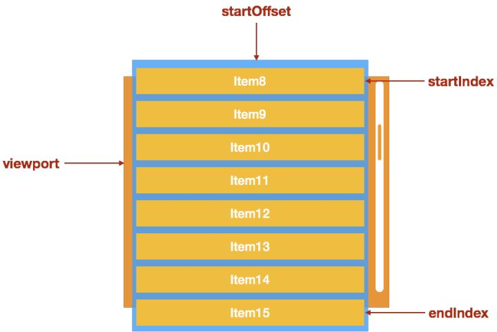

# 大数据量的渲染优化

基本策略：

- 延迟（执行、加载）
- 按需（加载）
- 缓存（资源）
- 预备（提前执行、加载）

## 分页

<!-- 大多数分页的问题。 -->

- 实例
- 使用超图/Arcgis 服务，前端进行请求分页
- 在做一张图的条件组合查询功能中，将查询出来的结果放入表格中，由于当数据集的结果很多的时候，请求就特别耗时，表格就要 loading 很久才出来。后面可以使用懒加载进行优化，不要一次性把全部数据请求回来。
  由于 maxFeatures 默认是 1000，所以请求默认最多只会 1000 条数据，但有些数据集可能会超过 1000 条数据。
  目前的解决方法是，当 totalCount 大于 1000 时，把 totalCount 扔 maxFeatures 再次请求。但这样的问题是，加载速度特别慢。

分页的情况下，再 + 上懒加载？

支实施系统-合规审查

## 长列表

无法使用分页的情况下，采用长列表，例如移动端的滚动方案。

<!-- 关于滚动尺寸等，可以看xxx -->

```html
<!DOCTYPE html>
<html lang="en">
  <head>
    <meta charset="UTF-8" />
    <meta name="viewport" content="width=device-width, initial-scale=1.0" />
    <title>长列表</title>
  </head>
  <body>
    <h1>长列表</h1>
    <button id="btn">createElement</button>
    <script src="./demo01.js"></script>
  </body>
</html>
```

```js
/**
 * @description: 创建带文本元素
 * @param {type}
 * @return:
 */

var createElements = function(count) {
  var start = new Date();
  for (var i = 0; i < count; i++) {
    var element = document.createElement("div");
    element.appendChild(document.createTextNode("" + i));
    document.body.appendChild(element);
  }
  setTimeout(() => {
    alert(new Date() - start);
  }, 0);
};

document
  .querySelector("#btn")
  .addEventListener("click", createElements.bind(this, 10000), false);
```

### 懒渲染

在滚动到页面底部的时候，再去加载剩余的数据。这是一种前后端共同优化的方式，跟分页很像。

实现思路：监听父元素的 `scroll` 事件（一般是 window），通过父元素的 scrollTop 判断是否到了页面底部，如果到了页面底部，就加载更多的数据。

```html
<!DOCTYPE html>
<html lang="en">
  <head>
    <meta charset="UTF-8" />
    <meta name="viewport" content="width=device-width, initial-scale=1.0" />
    <title>懒渲染</title>
    <style>
      .lazy-render-list {
        border: 1px solid #666;
        overflow: auto;
        width: 500px;
        height: 500px;
      }

      .lazy-render-list-item {
        box-sizing: border-box;
        height: 30px;
        line-height: 30px;
        padding-left: 5px;
        border-bottom: 1px solid #666;
        color: #666;
      }
    </style>
  </head>
  <body>
    <div class="lazy-render-list"></div>
    <script src="./demo03.js"></script>
  </body>
</html>
```

```js
/**
 * @description: 解决底部一定距离，如提前加载数据
 * @param {type}
 * @return:
 */
let isCloseToBottom = (el, distance) => {
  const maxScrollTop = el.scrollHeight - el.clientHeight;
  const currentScrollTop = el.scrollTop + distance;
  if (maxScrollTop <= currentScrollTop) {
    return true;
  }
  return false;
};

let createElements = function(el, count, delta) {
  for (let i = count; i < count + delta; i++) {
    const templateString = `<div class="lazy-render-list-item">${i}</div>`;
    const div = document.createElement("div");
    div.innerHTML = templateString;
    const liDom = div.childNodes[0];
    el.appendChild(liDom);
  }
};

let count = 0;
let loadData = (el) => {
  let tempCount = count;
  let delta = 100000; // 增量，一次加载 40 条
  createElements(el, tempCount, delta);
  count += delta;
};

let updated = (e) => {
  const target = e.target || e.srcElement;
  if (isCloseToBottom(target, 0)) {
    setTimeout(loadData.bind(null, target), 500);
  }
};

let init = () => {
  let outerDom = document.querySelector(".lazy-render-list");
  loadData(outerDom);
  outerDom.addEventListener("scroll", updated, false);
};

init();
```

### 可视区域渲染（虚拟列表）

通过懒渲染可以解决初始渲染的性能问题，但是在不断加载过后，整个列表会变得非常长，每次滚动都要改变所有的节点的位置，引发`回流`导致`重绘`，导致响应缓慢，并且过多的节点对象占用了大量的堆、栈内存。

[通过 performance 获得的 10000 个节点每次滚动的时间花费](placeholder)

因此，为了解决这个问题，我们需要可视区域渲染（业界内通常称为`虚拟列表`）。

`可视区域`指的是只渲染可视区域的列表项，非可见区域的完全不渲染，在滚动条滚动时动态更新列表项（跟`断点续传`的套路很像，进行分片切割，网络缓冲区）。可视区域渲染适合下面这种场景：

1. 每个数据的展现形式的高度需要一致（非必须）。

2. 产品设计上，一次需要加载的数据量比较大「1000 条以上」。

3. 产品设计上，滚动条需要挂载在一个固定高度的区域（在 window 上也可以，但是需要整个区域都只显示这个列表）。

<!-- TODO 动画演示思路，ppt 或编码 -->

虚拟列表指的就是【可视区域渲染】的列表，重要的基本就是两个概念：

- `可滚动区域`：假设有 1000 条数据，每个列表项的高度是 30，那么可滚动的区域的高度就是 1000\*30。当用户改变列表的滚动条的当前滚动值的时候，会造成可见区域的内容的变更。
- `可见区域`：比如列表的高度是 300，右侧纵向滚动条可以滚动，那么视觉可见的区域就是可见区域。

思路：

1. 计算当前可见区域起始数据的 `startIndex`
2. 计算当前可见区域结束数据的 `endIndex`
3. 计算当前`可见区域的数据`，并渲染到页面中
4. 计算 startIndex 对应的数据在整个列表中的偏移位置 `startOffset`，并设置到列表上。
   

思路详解：

- HTML 结构上使用 phantom 作为幽灵元素，占位高度 contentHeight（由所有列表项的高度总和），使得容器可以滚动。
- 根据可视区域的高度以及每条数据的固定高度，计算出可以显示的条数 visibleCount，对整个的数据 data 切割出初始化显示的数据 visibleData。
- 然后触发滚动事件，根据 `this.start = Math.floor(scrollTop / this.itemHeight)` 计算出起点位置，以及 start + visibleCount 计算终点位置，切割出当前要显示的数据。
- 由于滚动了列表内容元素，因此需要使用 transform 把列表容器移回可视区域，移动 Y 为`fixedScrollTop = scrollTop - scrollTop % this.itemHeight;`

1. HTML 结构

```html
<div class="list-view">
  <div class="list-view-phantom"></div>
  <div class="list-view-content">
    <!-- <div class="list-view-item"></div> -->
  </div>
</div>
```

2. CSS

- 列表元素 `.list-view` 使用相对定位
- 使用一个不可见元素 `.list-view-phantom`撑起这个列表，让列表的滚动条出现
- 列表的可见元素 `.list-view-content` 使用绝对定位，left、right、top 设置为 0

```css
.list-view {
  overflow: auto;
  position: relative;
  height: 400px;
  border: 1px solid #666;
}
.list-view-phantom {
  position: absolute;
  left: 0;
  right: 0;
  top: 0;
  z-index: -1;
}
.list-view-content {
  position: absolute;
  left: 0;
  right: 0;
  top: 0;
}
.list-view-item {
  height: 30px;
  line-height: 30px;
  padding-left: 5px;
  box-sizing: border-box;
  border-bottom: 1px solid #666;
  color: #666;
}
```

1. JS

```js
handleScroll(e) {
    const target = e.target || e.srcElement;
    const scrollTop = target.scrollTop;
    // 减去整除 itemHeigt 多出来的距离，得到整倍数，并进行 transformY 移动，使listViewContentDom容器的位置回到可见区域（因为滚动导致）
    const fixedScrollTop = scrollTop - scrollTop % this.itemHeight; // 跟下面的 start 求值做对应处理，因此只需要移动整倍数。
    // const fixedScrollTop = scrollTop; // 直接采用这个的话，拖到底部后会出现页面抖动现象。
    this.listViewContentDom.style.webkitTransform = `translate3d(0, ${fixedScrollTop}px, 0)`;

    // 改变要渲染的数据
    this.start = Math.floor(scrollTop / this.itemHeight); // 起点数据不会计算上余数，因此不会多请求额外的数据，保证整个容器高度容纳了所有显示的数据。
    this.visibleData = this.getVisibleData(target, this.start);
    this.renderListViewContentDom();
  },
    /**
   * @description: 获得渲染的数据
   * @param {type}
   * @return:
   */
  getVisibleData(el, start = 0) {
    this.start = start;
    this.visibleCount = Math.ceil(el.clientHeight / this.itemHeight); // 向上取整
    this.end = this.start + this.visibleCount;
    const visibleData = this.data.slice(this.start, this.end);
    return visibleData;
  },
init() {
    this.data = this.mockData(100);
    this.listViewDom = document.querySelector(".list-view");
    const phantomDom = document.querySelector(".list-view-phantom"); // 幽灵元素，用于占位高度，使容器可以一直滚动
    phantomDom.style.height = this.data.length * this.itemHeight + "px";
    this.listViewContentDom = document.querySelector(".list-view-content");

    this.visibleData = this.getVisibleData(this.listViewDom);
    this.renderListViewContentDom().bindEvent(this.listViewDom);
  },
```

优化结果

- 大大减少渲染的节点，渲染和 DOM 回收，不会渲染全部数据。
- 如果把每个 listItem 抽离为一个组件的，也能大大减少实例化的组件。
- 需要考虑滚动导致的性能问题
  <!-- - （添加防抖动等），可以考虑链接到 code 层面 -->

更进一步封装，可以把 ListView 抽离为一个适配器组件，把需要渲染的组件丢进去即可实现可视区域渲染。

- 可参考 https://github.com/Saberteeth/ListView/blob/master/src/index.js
- 以及 react-component/list-view

#### 可视区域渲染 + 懒渲染

只需要把在 handleScroll 添加滚动至底部的时候，进行数据的增加，并重新渲染即可。

```js
handleScroll(e) {
    const target = e.target || e.srcElement;
    // 加载更多的数据
    if (this.isCloseToBottom(target, 0)) {
      setTimeout(() => {
        this.data.push(...this.mockData(this.delta, this.data.length));
        console.log("loadmore =>", this.data);
        this.start = Math.floor(scrollTop / this.itemHeight); // 改变起始位置
        this.render();
      }, 500);
    }
  // .....
}
```

### 虚拟列表优化版

<!-- TODO -->

- 去掉高度限制
- 缓存计算结果
- 优化搜索性能

#### 去掉高度限制

实际上是通过动态传递高度来实现，这样就不需要提前通过 css 高度设置好了，但是不代表可以自动计算高度而不传递。

```js
props: itemSizeGetter: {
  type: Function;
}
const app = {
  itemSizeGetter(item) {
    return 30 + (item.value % 10); // 最小高度为 30，这里增加高度看每个列表项的设置 { value: 330 vlaue:}，新增 0～9，实际上可以随意设置规则。
  },
};
```

<!-- vue 版本demo见 -->

## 树的优化

性能原因：节点过多导致内存问题，其他是需要计算样式过多 padding-left。

- 初始展开的节点少，向 dom 中插入节点就会少，速度更快。
- treeNodes 总数据量尽量少变化，缓存并复用计算出的 treeNodes

分两步：

1. 将 tree 数据和 DOM 结构的扁平化
2. 然后采用虚拟列表方案
3. 需要处理好隐藏的节点的问题，也就是展开、收缩导致的节点差距，这是跟列表的另一区别，同步好展开、收缩的张图。

虚拟长列表控制 DOM 渲染数量。

### 在可视区域的情况下，如何同时支持搜索

把搜索的数据，支持赋予给 this.data 即可，然后 this.visibleData 根据滚动来对 this.data 进行截取。

对于 chrome 的 ctrl + F 搜索的，可以对这个操作进行劫持，参考 GitHub 的编辑功能，这样就不会限制于已经渲染的内容了。

## 虚拟 DOM 方案优化

## vue 树组件

<!-- （这块考虑可以放到 vue 项目，或者作为一个延伸到 vue 项目的优化，DOM） -->

除了虚拟化组件外，只能说改变递归等性能了。
跟普通使用 JS 实现的树，vue 树组件主要多了响应式的监听性能，也就是`收集依赖`和`派发更新`。

响应式的设计，更适合对节点进行增删改查的操作，所以才有 vue 树的需求，不仅仅是原生的树节点。但是当整个列表节点非常多的时候，就不建议移动了，但是修改还是有必要的。

tree 的性能缓慢原因，树以及它为什么能够解决初始大数据渲染的原因（重绘），然后应用到自己写的 tree 中。

关于这个性能问题，是因为那边有个目录树有 2000+子节点，用 iview 自带的 tree 组件加载非常卡顿，根本无法使用。iview 的 tree 组件我之前优化过源码，但是 2000+的子节点一样会存在性能问题，这和 vue 和作者设计有关，引起卡顿原因：

1、折叠节点一次就要重新递归一次
2、数据改变，vue 就要触发收集依赖相关函数，和 computed 的回调函数，1 个子节点 1 个函数，1 个函数耗时 6ms，1000\*6ms = 6000ms === 6s，所以加载很慢

<!-- ## 虚拟 DOM，考虑放到 Vue 框架内 -->

<!-- 后续完善。
为什么会卡？ 计算属性本质是一个 Watcher，只有里面的响应式数据变了(触发 setter)，才会执行这个函数，就是达到了所谓的缓存效果

            上述图中，Tree.flatState是响应式数据，所以当这个数据变了，每个子节点在渲染前就会执行这个回调

            然后， -->

### 原因分析

### 改写 iview 树组件

<!-- 后续更改组件源码 -->

一些疑问：

1. 异步加载树节点，没必要一口气全都递归渲染出来
2. 用一个 list 把 id 和 value 对应起来，没问题。但是用一个 key 来的数值来表示 tree 的层级，并且 dom 显示的时候都以这个 key 来作为依据，这样的代码以后谁看的懂。tree 结构本身是有它的好处的。
3. 最后，如果真的存在单个节点下有几万条数据，那应该是想着改变交互，提供搜索，而不是渲染出来。

回答：

1. 异步加载树节点很多场景不适用，比如需要搜索某个节点。
2. vue 节点创建过多，vue 创建实例花费时间。
3. 我们都知道代码是给人看的递归写法当然简单明了，但是当递归写法已经限制了我们的需求我们也应当寻找新的模式来实现。
4. 最后更改交互方式是业务产品以及用户体验需要考虑的，作为开发人员能做的是通过需求提高技术能力以有所成长，当然产品如果能够接受更改交互，技术人员好办得多，<u>只是我们不应该逃避问题，而应该直面问题并解决问题，这样我们才会有所提升。</u>

## 总结

对大数据渲染可以采用延迟和按需加载的方案，具体实现的例子就是向下滚动加载更多和可视区渲染。

而可视区渲染方案采用了大量的数据进行测试，并且在实际中加载 上万甚至十万条数据事实上是不常规可拒绝的，但是如果你一条复杂 item 里面有 10 个 div 呢？结果就是 2000 条就会出现性能问题，如果有复杂图片呢？再加上部分富文本展示呢？也许几十条数据就发生了性能问题。

<!-- 过去 web 版百度新闻的就会发现这个问题在大厂中也曾发生过，百度新闻当时的设计是下拉加载更多，然后当你加载30来条新闻的时候就会发现卡得不能动了。因为每条新闻 item 所包含的复杂度足以把这个2万的量级降到几十条内发生。待考究 -->
