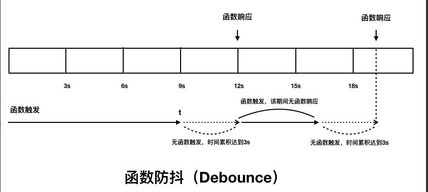

# 代码层面的优化

- 延迟（执行、加载）
- 按需（加载）
- 缓存（资源）
- 预备（提前执行、加载）

## 单例模式

- 弹框

## 节流与防抖

### 前言

从执行触发效果来说：

- 函数防抖和函数节流都是防止某一时间频繁触发，但是这两兄弟之间的原理却不一样。
- 函数防抖是**某一段时间内只执行一次**，而函数节流是**间隔时间执行**。

### 函数防抖

先说函数防抖，debounce。其概念其实是从机械开关和继电器的“去弹跳”（debounce） 衍生出来的，基本思路就是**把多个信号合并为一个信号**。

单反也有相似的概念，在拍照的时候手如果拿不稳晃动的时候拍照一般是拍不出好照片的，因此智能单反是在你按一下时连续拍许多张，能通过合成手段，生成一张。翻译成 JS 就是，<u>事件内的 N 个动作会被忽略，只有事件后`由程序触发`的动作有效。</u>

实现思路如下，<u>将目标方法（动作）包装在 setTimeout 里面，然后这个方法是一个事件的回调函数，如果这个回调一直执行，那么这些动作就一直不执行。</u>为什么不执行呢，我们搞了一个 `clearTimeout`，这样 `setTimeout` 里的方法就不会执行！为什么要 clearTimeout 呢，我们需要将事件内的连续动作删掉嘛！待到用户不触发这事件了。那么 `setTimeout` 就自然会执行这个方法。

那么这个方法用在什么地方呢，可以用于 input 输入框的格式验证，假如只是验证都是字母也罢，太简单了，不怎么耗性能，如果是验证是否为身份证，这性能消耗大，你可以隔 170ms 才验证一次。这时就需要这个东西。或者你这个是进行输入搜索的，这需要将已有的输入数据往后端拉一个列表，频繁的交互，后端也耗不起，这时也需要它，如隔 350ms。

```js
function deboundce(func, delay) {
  let timeout;
  return function() {
    // 防抖函数的代码使用这两行代码来获取 this 和 参数，是为了让 debounce 函数最终返回的函数 this 指向不变以及依旧能接受到 e 参数。
    const context = this;
    const args = arguments;

    console.log("清除", timeout, args[0].target.value);
    if (timeout) {
      clearTimeout(timeout); // 清除旧的
    }
    console.log("新的", timeout, args[0].target.value);

    timeout = setTimeout(() => {
      console.log("----");
      func.apply(context, args);
    }, delay);
  };
}
const validate = deboundce((e) => {
  console.log("change", e.target.value, new Date() - 0);
}, 380);

// 绑定监听
document.querySelector("input").addEventListener("input", validate);
```

函数防抖（Debounce）对事件触发的响应时机：



具体运行 demo，可以看 examples/code/debounce_throttle/debounce/index.html。

这样就保证了正常的用户每输入 1，2 个字符就能触发一次。如果用户是输入法狂魔，也可以限制每输入 3 ～ 6 个字符触发一次。

这个方法的重点是，**它在用户不触发事件的时，才触发动作，并且抑制本来在事件中要执行的动作。**

除了输入验证、搜索外，其他的应用场合还有提交按钮的点击事件。

#### 应用：dme 项目，向左拉动不断触发响应，导致页面崩溃问题


首先 Performance Monitor 以及 render 帧率分析，发现触发移动侧边栏的时候，CPU 急速上升和帧率明显低于 60 fps，导致页面卡顿。

然后通过 Performance 进一步分析得出


handleStrectchMove 用时，相反，vue.runtime.esm.js 的微任务（猜测是 nextick 做的时间长），因此采用的解决方案是：

使用 Object.freeze 冻结树的数据，然后使用节流函数来控制函数的触发，通过测试后大大降低了 CPU 的使用率以及帧率的提升。还有就需要进一步看看 nextTick 的函数做了哪些事情。(这个 vue 的渲染例子，也可以放到渲染篇)

更进一步就是使用虚拟化树列表来处理了。


### 函数节流

函数节流，throttle。节流的概念可以想象一个水坝，你建了水坝在河道中，不能让水流动不了，你只能让水流慢写。换言之，你不能让用户的方法都不执行。如果这样干，就是 debounce 了。<u>为了让用户的方法在某个时间段内只执行一次，我们需要保存上次执行的时间点与定时器。</u>

```html
<div id="panel"></div>
<script>
  function throttle(fn, threshold = 160) {
    let timeout = null;
    let start = new Date();
    return function() {
      const context = this;
      const args = arguments;
      let curr = new Date() - 0;

      clearTimeout(timeout); // 总是干掉事件回调
      if (curr - start >= threshold) {
        console.log("now", curr, curr - start); // 注意这里差不多都是160左右
        fn.apply(context, args); //
        start = curr;
      } else {
        // 让方法脱离事件后也能执行一次
        timeout = setTimeout(() => {
          fn.apply(context, args);
        }, threshold);
      }
    };
  }
  // 固定时间信号采样

  const mousemove = throttle((e) => {
    console.log(e.pageX, e.pageY);
  }, 1000);

  // 绑定监听
  document.querySelector("#panel").addEventListener("mousemove", mousemove);
</script>
```

查看对应函数节流（Throttle）的触发与响应时机：


具体运行 demo，可以看 examples/code/debounce_throttle/debounce/index.html。

函数节流会用在比 `input`、`keyup` 更频繁触发的事件中，如 `resize`、`touchmove`、`mousemove`、`scroll`，throttle 会强制函数以固定的速率执行。因此这个方法适合应用于动画相关的场景。

### 直观图

如果还是不能完全替换 `debounce` 和 `throttle` 的差异，可以到 examples/code/debounce_throttle/intuitive/ 运行 demo，直观地对比。


### 小结

在用户与网站的交互中，节流与防抖可以：

- 优化用户体验（适时反馈，避免 UI 渲染阻塞，浏览器卡顿）
- 提升页面性能（避免页面渲染卡断，减少服务器压力，防范恶意触发）

具体应用在：

- debounce
  - search 搜索联想、验证，用户在不断输入值，用防抖来节约请求资源。
  - window 触发 resize 的时候，不断的调整浏览器大小会不断的触发这个事件，用防抖来让其只触发一次。
- throttle
  - `resize`、`touchmove`、`mousemove`、`scroll`，throttle 会强制函数以固定的速率执行。因此这个方法适合应用于动画相关的场景。

<!-- 另外函数防抖和函数节流还可以分为：

- 函数防抖
  - 非立即执行版
  - 立即执行版
- 函数节流
  - 时间戳版
  - 定时器版 -->

<!-- 为保证文章的篇幅，感兴趣的同学可以进一步看参考资料。 -->

<!-- ### 分析 lodash 的处理 -->

<!-- ## js

## css

## html

## vue

vue key 的优化，是如何实现的，如何通过性能指标进行实现

## node -->

## 如何比较 Object 对象

- [精读《如何比较 Object 对象》](https://github.com/dt-fe/weekly/blob/v2/157.%20%E7%B2%BE%E8%AF%BB%E3%80%8A%E5%A6%82%E4%BD%95%E6%AF%94%E8%BE%83%20Object%20%E5%AF%B9%E8%B1%A1%E3%80%8B.md)

## 深拷贝与浅拷贝

## 参考资料

- [【性能优化】0202 年了，函数节流与防抖还不用起来？](https://juejin.im/post/5de8bc73e51d45580e58e5b8)
- [函数防抖与函数节流
  ](https://zhuanlan.zhihu.com/p/38313717)
- [7 分钟理解 JS 的节流、防抖及使用场景](https://juejin.im/post/5b8de829f265da43623c4261#heading-7)
- [函数防抖和节流](https://juejin.im/post/5b651dc15188251aa30c8669#heading-1)
