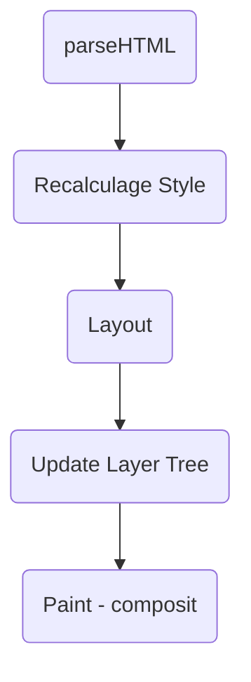

# 浏览器渲染原理

## 前言

如何渲染？渲染出来就是一张图片。

## 首次渲染解析

拿到一份 HTML 文档。


### 渲染内核组成

HTML/CSS/JS 资源  -----> 浏览器内核 ------> 图像

从这个流程来看，浏览器呈现网页这个过程，宛如一个黑盒。在这个神秘的黑盒中，有许多功能模块，内核内部的实现正是这些功能模块相互配合协同工作进行的。其中，我们最需要关注的，就是 `HTML 解释器`、`CSS 解释器`、`图层布局计算模块`、`视图绘制模块`与 `JavaScript 引擎`这几大模块：

- HTML 解释器：将 HTML 文档经过词法分析输出 DOM 树。
- CSS 解释器：解析 CSS 文档，生成样式规则。
- 图层布局计算模块：布局计算每个对象的精确位置和大小。
- 视图绘制模块：进行具体节点的图像绘制，将像素渲染到屏幕上。
- JavaScript 引擎：编译执行 JavaScript 代码。

### 过程解析




- 解析 HTML
  - 加载解析逻辑，在解析 HTML 的过程中发出了页面渲染所需的各种外部资源
- 计算样式
  - 浏览器识别并加载所有的 CSS 样式信息与 DOM 树合并，最终生成页面 `render` 树。
- 计算图层布局
  - 页面中所有的元素的`相对位置`信息，`大小`等信息均在这一步得到计算
- 绘制图层
  - 在这一步浏览器会根据我们的 DOM 代码结果，把每一个页面图层转换为`像素`，并对所有的媒体文件进行`解码`。
- 整合图层，得到页面
  - 最后一步浏览器合并各个图层，将<u>数据由 CPU 输出 GPU </u>最终绘制在屏幕上。
  <!-- - （复杂的视图层会给这个阶段的 GPU 计算带来一些压力，在实际 中为了优化动画性能，我们有时会手动区分不同的图层-->

### 几种树

- DOM 树
- CSSOM 树
- 渲染树：DOM + CSSOM
- 布局渲染树：Layout
- 绘制渲染树

### 例子

```js
var createElements = function(count) {
  var start = new Date();
  for (var i = 0; i < count; i++) {
    var element = document.createElement("div");
    element.appendChild(document.createTextNode("" + i));
    document.body.appendChild(element);
  }
  setTimeout(() => {
    alert(new Date() - start);
  }, 0);
};

document.querySelector("#btn").addEventListener(
  "click",
  createElements.bind(this, 1000),
  false
);
```

## 操作产生回流和重绘

### 回流

当我们对 DOM 的修改引发了 DOM 几何尺寸的变换（比如修改元素的宽、高或隐藏元素（包括overflow、display、visiblity）等）时，浏览器需要重新计算元素的几何属性（其他元素的几何属性和位置也会因此受到影响），然后再将计算的结果绘制出来。这个过程就是回流（也叫重排）。

### 重绘

当我们对 DOM 的修改导致了样式的变化、却并未影响其几何属性（比如修改了颜色或背景色）时，浏览器不需要重新计算元素的几何属性、直接为该元素绘制新的样式（跳过上图中的回流环节）。这个过程叫做重绘。

**网页生成的时候，至少会渲染一次。用户访问的过程中，还会不断重新渲染。**

以下三种情况，会导致网页重新渲染。
- 修改 DOM
- 修改样式表
- 用户事件（比如鼠标悬停、页面滚动、输入框输入文字、改变窗口大小等等）

**重新渲染，就需要重新生成布局和重新绘制。前者叫做“重排”（reflow），后者叫做“重绘”（repaint）。**

需要注意的是，**“重绘”不一定需要“重排”**，比如改变某个网页元素的颜色，就只会触发“重绘”，不会触发“重排”，因为布局没有改变。但是，**“重排”必然导致“重绘”**，比如改变一个网页元素的位置，就会同时触发“重排”和“重绘”，因为布局改变了。


## 小结

