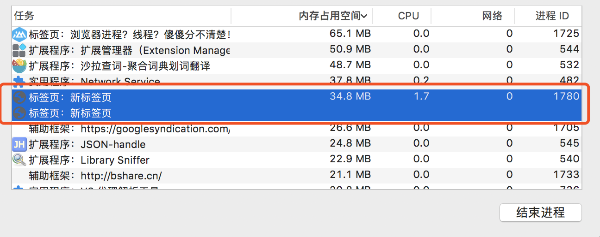
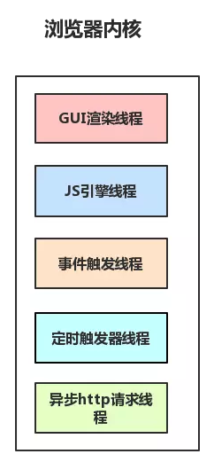
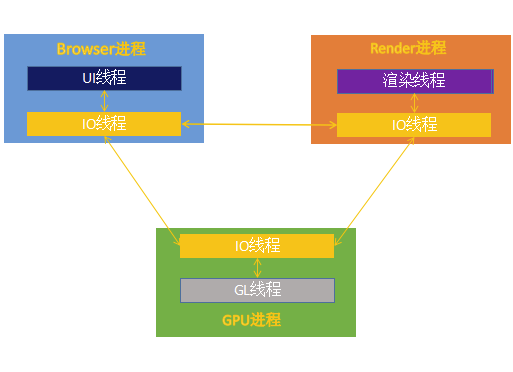

# 浏览器是多进程的

- 浏览器是多进程的。
- 浏览器之所以能够运行，是因为系统给它的进程分配了资源（cpu，内存）。
- 简单点，每打开一个 tab 页，就相当于创建了一个独立的浏览器进程。

关于以上的几点的验证，如下图：

图中打开了 `Chrome` 浏览器的多个标签页，然后可以在 `Chrome 的任务管理器`中可以看到有多个进程（分别是每一个 Tab 页面有一个独立的进程，以及一个主进程浏览器）。感兴趣可以自行尝试下，如果再多打开一个 Tab 页，进程正常会 +1 以上。

**注意：**在这里浏览器应该也有自己的优化机制，有时候打开多个 tab 页后，可以在 Chrome 任务管理器中看到，有些进程被合并了，如图中的 onetab（所以每一个Tab 标签对应一个进程并不一定是绝对的）

## 浏览器都包含了哪些进程

知道了浏览器是多进程后，再来看看它到底包含哪些进程：（为了简化理解，以下列举主要进程）

- **Browser进程：浏览器的主进程（负责协调、主控），只有一个。作用有：**
  - 负责浏览器界面显示，与用户交互。如前进，后退等。
  - 负责各个页面的管理，创建和销毁其他进程。
  - 将 Renderer 进程得到的内存中 Bitmap，绘制到用户界面上
  - 网络资源的管理，下载等。
- **第三方插件进程：每种类型的插件对应一个进程，仅当使用该插件时才创建。**
- **GPU 进程：最多一个，用于 3D 绘制等。**
- **浏览器渲染进程（浏览器内核）（Renderer 进程，内部是多线程）：默认每个 Tab 页面创建一个进程，互不影响。主要作用为：**
  - **页面渲染，脚本执行，事件处理等。**
- 在浏览器中打开一个网页相当于新起了一个进程（进程内有自己的多线程）。
当然，浏览器有时会将多个进程合并（例如打开多个空白标签页后，会发现多个空白标签页被合并成了一个进程），如图：

## 浏览器多进程的优势

相比于单进程浏览器，多进程有如下有点难：

- 避免单个 page crash 影响整个浏览器
- 避免第三方插件 crash 影响整个浏览器
- 多进程充分利用多核优势
- 方便使用沙盒模型呢隔壁插件等进程，提供浏览器稳定性。

简单点理解：如果浏览器是单进程，那么某个 Tab 页崩溃了，就影响了整个浏览器，体验很差；同理如果是单进程，插件崩溃了也会影响整个浏览器；多进程还有其他的诸多优势。与之带来的是，内存等资源消耗也会更大，有点空间换时间的意思。

## 重点：浏览器内核（渲染进程）

对于普通的前端操作来说，最终要的是渲染进程。可以这样理解，页面的渲染、JS 的执行、事件的循环，都在这个进程内进行。

请牢记，浏览器的`渲染进程`是`多线程`的。那么接下来看看它都包含了哪些线程（列举一些主要常驻线程）：
- **GUI 渲染线程**
  - 负责渲染浏览器界面，解析 HTML，CSS，构建 DOM 树和 RenderObject 树，布局和绘制等。
  - 档节目需要重绘（Repaint）或由于某种操作引发回流（reflow）时，该线程就会执行。
  - 注意，**GUI 渲染流程与JS引擎线程是互斥的**，共享了临界资源。当JS引擎执行时 GUI 线程回被挂起（相当于被冻结了），GUI 更新会被保存到一个队列中等到 **JS 引擎空闲时**立即被执行。
- **JS 引擎线程**
  - 也称为JS内核，负责处理 JavaScript 脚本程序。（例如 V8 引擎）
  - JS 引擎线程负责解析 JavaScript 脚本，运行代码。
  - JS 引擎一直等待着<strong>任务队列</strong>中任务的到来，然后加以处理，一个 Tab 页（renderer进程）中无论什么时候都只有一个 JS 线程在运行 JS 程序。
  - 同样注意，GUI 渲染线程 与 JS 引擎是互斥的，所以如果 JS 执行的时间过长，这样就会造成页面的渲染不连贯，导致页面渲染加载阻塞。
- **事件触发线程**
  - 归属于浏览器而不是 JS 引擎，用来控制事件循环（可以理解，JS 引擎自己都忙不过来，需要浏览器另开线程协助）。
  - 当 JS 引擎执行代码块如 setTimeout 时（也可以来自浏览器内核的其他线程，如鼠标点击、AJAX 异步请求等），会将对应任务添加到<strong>事件线程中</strong>。
  - 当对应的事件符合触发条件被触发时，该线程会把事件添加到待处理<strong>任务队列</strong>的队尾，等待 JS 引擎的处理。
  - 注意，由于 JS 的单线程关系（在某一时间点执行的处理只有一个），所以这些待处理队列中的事件都得排队等待 JS 引擎处理（当 JS 引擎空闲时才会去执行）。
- **定时触发器线程**
  - 传说中的 `setInterval` 与 `setTimeout` 所在线程。
  - 浏览器定时计数器并不是由 JavaScript 引擎计数的，（因为 JavaScript 引擎是单线程的，如果处于阻塞线程状态就会影响计时的准确）
  - 因此通过单线程来计时并触发定时（计时完毕后，执行事件触发线程，把任务添加到事件队列中，等待 JS 引擎空闲后执行。）
  - 注意，W3C 在 HTML 标准中规定，规定要求 setTimeout 中低于4ms的时间间隔算为4ms。
- **异步 http 请求线程**
  - 在 `XMLHttpRequest` 在连接后是通过浏览器新开一个线程请求
  - 将检测到状态变更时，如果设置有回调函数，异步线程就<strong>产生状态变更事件</strong>，事件触发线程将这个回调放入事件任务队列中，然后由 JS 引擎执行。

补充：为什么 JS 引擎是单线程的？这个可能仅仅是因为由于多线程的复杂性，譬如多线程操作一般要加锁，因此最初设计时选择了单线程。

## Browser 进程和浏览器内核（Renderer 进程）的通信过程

- Browser 进程收到用户请求，首先需要获取页面内容（譬如通过网络下载资源），随后将该任务通过 RendererHost 接口传递给 Render 进程。
- Renderer 进程的 Renderer 收到消息，简单解释后，交给渲染线程，然后开始渲染。
  - 渲染线程接收请求，加载网页并渲染网页，这其中可能需要 Browser 进程获取资源和需要 <strong>GPU </strong>进程来帮助渲染。
  - 当然可能会有 JS 线程操作 DOM（这样可能会造成回流并重绘）。
  - 最后 Renderer 进程将结果传递给 Browser 进程。
- Browser 进程接收到结果并将结果绘制出来。

