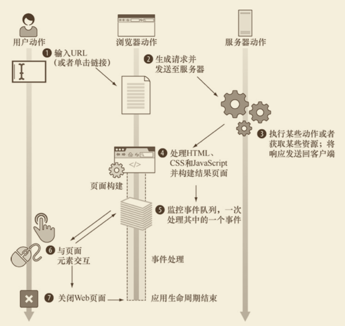
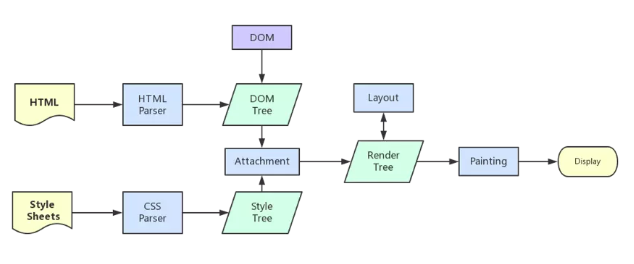

# 浏览器渲染流程


为了简化理解，前期工作直接省略成：
```
- 浏览器输入 url，浏览器主进程接管，开一个下载线程，
然后进行 http 请求（略去 DNS 查询，IP 寻址等待响应，获取内容），
随后将内容通过 RendererHost 接口转交给 Renderer 进程

- 浏览器渲染流程开始
```



客户端 Web 引用的周期从用户指定某个网站地址（或单击某个链接）开始，由两个步骤组成：

- **页面构建（首次渲染）**
  - 步骤1： 解析 HTML 代码并够构建文档对象模型（DOM）；
  - 步骤2：执行 JavaScript 代码。（在 HTML 解析到一种特殊节点——脚本节点（包含或引用 JavaScript 代码的节点）时执行）
  - 页面构建阶段，这两个步骤会交替执行多次。
- **事件处理（用户交互）**

浏览器内核拿到内容后，渲染大概可以划分成以下几个步骤：（页面构建部分）

下面通过一个例子来说明：`/browser/render-process/01-render-process/`
```html
<!DOCTYPE html>
<html lang="en">
<head>
  <meta charset="UTF-8">
  <meta name="viewport" content="width=device-width, initial-scale=1.0">
  <meta http-equiv="X-UA-Compatible" content="ie=edge">
  <title>Web app lifecycle</title>
</head>
<style>
  #first {
    color: green;
  }
  #second {
    color: red;
  }
</style>
<body>
  <ul id="first"></ul>
  <script>
    /**
     * @description 定义一个函数用于向一个元素增加一条信息
     */
    function addMessage(element, message) {
      const messageElement = document.createElement('li');
      messageElement.textContent = message;
      element.appendChild(messageElement);
    }
    console.log(document.getElementById('second')); // 这个时候 脚本阻塞了 dom 的构建
    const first = document.getElementById('first');
    addMessage(first, "Page loading");
    window.addEventListener('DOMContentLoaded', (event) => {
        console.log('DOM fully loaded and parsed');
    });
    window.addEventListener('load', (event) => {
      console.log('page is fully loaded');
    });
  </script>
  <ul id="second"></ul>
  <script>
    document.body.addEventListener('mousemove', function() {
      const second = document.getElementById('second');
      addMessage(second, "Event: mousemove");
    })

    document.body.addEventListener('click', function() {
      const second = document.getElementById('second');
      addMessage(second, 'Event: click');
    })
  </script>
</body>
</html>
```

1. **解析HTML：在解析 HTML 的过程中发出了页面渲染所需的各种外部资源请求。**
   - 解析 html 建立 dom 树。
2. **计算样式：**
   - 解析 css 构建 render 树（将 css 代码解析成树形的数据结构，然后结合 DOM 合并成 render 树）。
3. **计算图层布局：**
   - 布局 render 树（Layout/reflow），负责各元素尺寸、位置的计算。
4. **绘制图层：**
   - 绘制 render 树（paint），绘制页面像素信息。
5. **整合图层，得到页面：**
   - 浏览器会将各层的信息发送给 GPU，GPU将各层合成（composite），显示在屏幕上。（复杂的视图层会给这个阶段的 GPU 计算带来一些压力，在实际应用中为了优化动画性能，我们有时会手动区分不同的图层）。
  
之后每当一个新元素加入到这个 DOM 树当中，浏览器便会通过 CSS 引擎查遍 CSS 样式表，找到符合该元素的样式规则应用到这个元素上，然后再重新去绘制它。


**注意：当浏览器在页面构建阶段遇到了脚本节点，它会停止 HTML 和 DOM 的构建，转而开始执行 JavaScript 代码，也就是执行包含在脚本元素的全局 JavaScript 代码（以及由全局代码执行中调用的函数代码）。**直到 JavaScript 引擎执行到了脚本元素中 JavaScript 代码的最后一行，浏览器就退出了 JavaScript 执行模式，并继续余下的 HTML 构建为 DOM 节点。在这期间，如果浏览器再遇到脚本元素，那么从 HTML 到 DOM 的构建再次暂停，JavaScript 引擎运行环境开始执行余下的 JavaScript 代码。

需要重点注意：JavaScript 应用在此时依然会保持着全局状态。所有在某个 JavaScript 代码执行期间用户创建的全局变量都能正常被其他脚本元素中的 JavaScript 代码所访问到。其原因在于全局 Window 对象会存在于整个页面的生存期之间，在它上面存储着所有的 JavaScript 变量。只要还有没处理完的 HTML 元素和没执行完的 JavaScript，下面两个步骤就会一直交替执行。

所有详细步骤都已经略去，渲染完毕后就是 load 事件了。



## load 事件与 DOMContentLoaded 事件的先后

- 当 `DOMContentLoaded` 事件触发时，仅当 DOM 加载完成，不包括样式表，图片（譬如如果有 async 加载的脚本就不一定完成）
- 当 `onload` 事件触发时，页面上所有的 DOM，样式表，脚本，图片都已经加载完成了。（渲染完毕了）

所以，顺序是：`DOMContentloaded` -> `load`。
```js
window.addEventListener('DOMContentLoaded', (event) => {
    console.log('DOM fully loaded and parsed');
});
window.addEventListener('load', (event) => {
  console.log('page is fully loaded');
});
```

## 告别阻塞：CSS 与 JS 的加载顺序优化

HTML、CSS 和 JS，都具有阻塞渲染的特性。

HTML 阻塞，天经地义————没有 HTML，何来 DOM？没有 DOM，渲染和优化，都是空谈。

### css 加载是否会阻塞 dom 树渲染？

这里说的是头部引入 css 的情况。

首先，我们都知道：**css 是由单独的下载线程异步下载的。**

然后再说以下几个现象：
- css 加载不会阻塞 `DOM 树`解析（异步加载时 DOM 照常构建）。
- 但会阻塞 `render 树`（由 CSSOM 树与 DOM树结合）渲染（渲染时需等 css 加载完毕，因为 render 树需要 css 信息）。

这可能也是浏览器的一种优化机制。

因为当你加载 css 的时候，可能会修改下面 DOM 节点的样式，如果 css 加载不阻塞 `render 树`的渲染，那么当 css 加载完之后，render 树可能又得重新`重绘或者回流`了，这就造成了一些没有必要的损耗。所以干脆就先把 DOM 树的结构先解析完，把可以做的工作做完，然后等 css 加载完之后，再根据最终的样式来渲染 `render 树`，这种做法性能方面确实会比较好一点。

在刚刚的过程中，我们提到 DOM 和 CSSOM 合力才能构建渲染。这一点会给性能造成严重影响：默认情况下，CSS 是阻塞的资源。浏览器在构建 CSSOM 的过程中，不会渲染任何已经处理的内容。即便 DOM 已经解析完毕了，只要 CSSOM 不 OK，那么渲染这个事情就不 OK（这主要是为了避免没有 CSS 的 HTML 页面丑陋地“裸奔”在用户眼前）。

我们知道，只有当我们开始解析 HTML 后、解析到 link 标签或者 style 标签时，CSS 才登场，CSSOM 的构建才开始。很多时候，DOM 不得不等待 CSSOM。因此我们可以这样总结：
> CSS 是阻塞渲染的资源，需要将它尽早、尽快地下载到客户端，以便缩短首次渲染的时间。

事实上，现在很多团队已经做到了尽早（将 CSS 放在 head 标签里）和尽快（启用 CDN 实现静态资源加载速度的优化。）这个“把 CSS 往前放”的动作它是由 CSS 的特性决定的。

### JS 的阻塞

在首次渲染过程，JS 并不是一个非登场不可的角色——没有 JS，CSSOM 和 DOM 照样可以组成渲染树，页面依然会呈现——即使它毫无交互。

JS 的作用在于修改，它帮助我们修改网页的方方面面：内容、样式以及它如何响应用户交互。这“方方面面”的修改，本质上都是对 DOM 和 CSSDOM 进行修改。因此 JS 的执行会阻止 CSSOM，在我们不作显式声明的情况下，它也会阻塞 DOM。

我们通过一个例子来理解一下这个机制：
```html
<!DOCTYPE html>
<html lang="en">
<head>
  <meta charset="UTF-8">
  <meta name="viewport" content="width=device-width, initial-scale=1.0">
  <meta http-equiv="X-UA-Compatible" content="ie=edge">
  <title>JS 阻塞测试</title>
  <style>
    #container {
      background-color: yellow;
      width: 100px;
      height: 100px;
    }
  </style>
  <!-- <script src="../examples/JS阻塞.js"></script> -->
   <script>
    // 尝试获取 container 元素
    var container = document.getElementById('container');
    console.log('container :', container);
  </script>
</head>
<body>
  <div id="container"></div>
  <!-- <script src="../examples/JS阻塞.js"></script> -->
  <script>
    // 尝试获取 container 元素
    var container = document.getElementById('container');
    console.log('container :', container);
    // 输出 container 元素此刻的背景色
    console.log('container bgColor', getComputedStyle(container).backgroundColor);
  </script>
  <style>
    #container {
      background-color: blue;
    }
  </style>
</body>
</html>
```
三个 console 的结果分别是：
```
container : null
container : <div id=​"container">​</div>​
container bgColor rgb(255, 255, 0)
```
本例仅使用了内联 JS 做测试，感兴趣的同学可以把这部分 JS 当作外部文件引入看看效果——它们的表现一致。

第一次尝试获取 id 为 container 的 DOM 失败，这说明 JS 执行时阻塞了 DOM，后续的 DOM 无法构建；第二次才成功，这说明脚本块只能找到它前面构建好的元素。这两者结合起来，“阻塞 DOM”得到了验证。再看第三个 console，尝试获取 CSS 样式，获取的是 JS 代码执行前的背景色（yellow），而非后续设定的新样式（blue），说明 CSSOM 也被阻塞了。那么在阻塞的背后，到底发生了什么呢？

这就是前面说的 JS 引擎与渲染引擎是互斥的。我们的 JS 代码在文档的何处插入，就在何处执行（script 标签没有设置 defer，async等属性）。当 HTML解析器遇到一个 script 标签时，它会暂停渲染过程，将控制权交给 JS 引擎。JS 引擎对内联的 JS 代码会直接执行，对外部 JS 文件还要先获取脚本、再进行执行。等 JS 引擎运行完毕，浏览器又会把控制权还给渲染引擎，继续 CSSOM 和 DOM 的构建。因此与其说 JS 把 CSS 和HTML 阻塞了，不如说是 JS 引擎抢走了渲染引擎的控制权。

浏览器之所以可以让 JS 阻塞其他的活动，是因为它不知道 JS 会做说明改变，担心如果不阻止后续的操作，会造成混乱（DOM渲染混乱）。但是写 JS 的人知道 JS 会做什么改变。假如我们可以确认一个 JS 文件的执行时机并不一定非要是此时此刻，我们就可以通过对它使用 `defer` 和`async` 来避免不必要的阻塞，这里我们就引出了外部 JS的三种加载方式。

- 正常模式
    ```html
    <script src="index.js"></script>
    ```
  这种情况下 JS 会阻塞浏览器，浏览器必须等待 `index.js` 加载和执行完毕才能去做其他事情。
- async 模式
    ```html
    <script async src="index.js"></script>
    ```
  async 模式下，JS 不会阻塞浏览器做任何其他的事情，它的加载是异步的（异步 http 请求线程），当它加载结束，**JS 脚本会立即执行。**（浏览器渲染引擎线程空闲时）
- defer 模式：
    ```html
    <script defer src="index.js"></script>
    ```
  defer 模式下，JS 的加载是异步的，**执行是被推迟的。**等整个文档解析完成、`DOMContentLoaded` 事件即将被触发时，被标记了 defer 的 JS 文件才会开始依次执行。

从应用的角度来说，一般当我们的脚本与 DOM 元素和其他脚本之间的依赖关系不强时（这个其实通过 webpack + es6 规范基本可以解决模块依赖问题），我们会选用 `async`；当脚本依赖于 DOM 元素和其他脚本的执行结果时，我们会选用 `defer`。

通过审时度势地向 script 标签添加 `async/defer`，我们就可以告诉浏览器在等待脚本可用期间不阻止其他的工作，这样可以显著提升性能。


经过 webpack 打包后的代码，最终也是通过 script 标签被引入 html 文件中。

补充：除了一个 JS 文件外，针对 JS 文件里面的代码层级，可以是通过异步编程（promise）来解决同步阻塞的问题。


