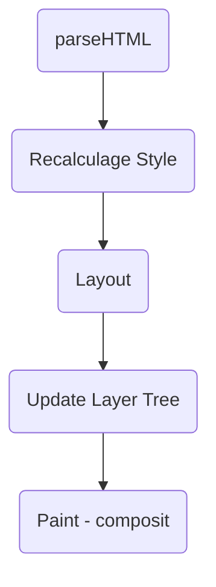

# 浏览器渲染原理（流程）

## 前言

如何渲染？渲染出来就是一张图片。

## 首次渲染解析

拿到一份 HTML 文档。


### 渲染内核组成

HTML/CSS/JS 资源  -----> 浏览器内核 ------> 图像

从这个流程来看，浏览器呈现网页这个过程，宛如一个黑盒。在这个神秘的黑盒中，有许多功能模块，内核内部的实现正是这些功能模块相互配合协同工作进行的。其中，我们最需要关注的，就是 `HTML 解释器`、`CSS 解释器`、`图层布局计算模块`、`视图绘制模块`与 `JavaScript 引擎`这几大模块：

- HTML 解释器：将 HTML 文档经过词法分析输出 DOM 树。
- CSS 解释器：解析 CSS 文档，生成样式规则。
- 图层布局计算模块：布局计算每个对象的精确位置和大小。
- 视图绘制模块：进行具体节点的图像绘制，将像素渲染到屏幕上。
- JavaScript 引擎：编译执行 JavaScript 代码。

### 过程解析




- 解析 HTML
  - 加载解析逻辑，在解析 HTML 的过程中发出了页面渲染所需的各种外部资源
- 计算样式
  - 浏览器识别并加载所有的 CSS 样式信息与 DOM 树合并，最终生成页面 `render` 树。
- 计算图层布局
  - 页面中所有的元素的`相对位置`信息，`大小`等信息均在这一步得到计算
- 绘制图层
  - 在这一步浏览器会根据我们的 DOM 代码结果，把每一个页面图层转换为`像素`，并对所有的媒体文件进行`解码`。
- 整合图层，得到页面
  - 最后一步浏览器合并各个图层，将<u>数据由 CPU 输出 GPU </u>最终绘制在屏幕上。
  <!-- - （复杂的视图层会给这个阶段的 GPU 计算带来一些压力，在实际 中为了优化动画性能，我们有时会手动区分不同的图层-->

在每个阶段的过程中，你应该重点关注以下三点内容：
- 开始每个子阶段都有其输入的内容；
- 然后每个子阶段有其处理过程；
- 最终每个子阶段会生成输出内容。

理解了这三部分内容，能让你更加清晰地理解每个子阶段。

### 几种树

- DOM 树
- CSSOM 树
- 渲染树：DOM + CSSOM
- 布局渲染树：Layout
- 绘制渲染树

#### 构建 DOM 树

构建 DOM 树的输入内容是一个非常简单的 HTML 文件，然后经由 HTML 解析器解析，最终输出树状结构的 DOM。

可以通过 Console 输入 document 回车，这样你就能看到一个完整的 DOM 结构。

你可以看到 DOM 和 HTML 的内容几乎是一样的，但是和 HTML 不同的是，DOM 是保存在内存中树状结构，可以通过 JavaScript 来查询或修改其内容。

#### 样式计算

样式计算的目的是为了计算出DOM节点中每个元素的具体样式，这个阶段大体可分为三步来完成。

1. 把 CSS 转化为浏览器能够理解的结构。

和 HTML 文件一样，浏览器也是无法直接理解这些纯文本的 CSS 样式，所以当渲染引擎接收到 CSS 文本时，会执行一个转换操作，将 CSS 文本转换为浏览器可以理解的结构—— styleSheets。

为了加深理解，可以在 chrome 控制台输入 document.styleSheets

2. 转换样式表中的属性值，使其标准化。

2em 被解析成了32px，red 被解析成了 rgb(255,0,0)，bold被解析成了 700

3. 计算出 DOM 树中每个节点的具体样式。

如果你想了解每个DOM元素最终的计算样式，可以打开Chrome的“开发者工具”，选择第一个“element”标签，然后再选择“Computed”子标签

### 布局阶段

### 例子

```js
var createElements = function(count) {
  var start = new Date();
  for (var i = 0; i < count; i++) {
    var element = document.createElement("div");
    element.appendChild(document.createTextNode("" + i));
    document.body.appendChild(element);
  }
  setTimeout(() => {
    alert(new Date() - start);
  }, 0);
};

document.querySelector("#btn").addEventListener(
  "click",
  createElements.bind(this, 1000),
  false
);
```

## 操作产生回流和重绘

### 回流

当我们对 DOM 的修改引发了 DOM 几何尺寸的变换（比如修改元素的宽、高或隐藏元素（包括overflow、display、visiblity）等）时，浏览器需要重新计算元素的几何属性（其他元素的几何属性和位置也会因此受到影响），然后再将计算的结果绘制出来。这个过程就是回流（也叫重排）。

### 重绘

当我们对 DOM 的修改导致了样式的变化、却并未影响其几何属性（比如修改了颜色或背景色）时，浏览器不需要重新计算元素的几何属性、直接为该元素绘制新的样式（跳过上图中的回流环节）。这个过程叫做重绘。

**网页生成的时候，至少会渲染一次。用户访问的过程中，还会不断重新渲染。**

以下三种情况，会导致网页重新渲染。
- 修改 DOM
- 修改样式表
- 用户事件（比如鼠标悬停、页面滚动、输入框输入文字、改变窗口大小等等）

**重新渲染，就需要重新生成布局和重新绘制。前者叫做“重排”（reflow），后者叫做“重绘”（repaint）。**

需要注意的是，**“重绘”不一定需要“重排”**，比如改变某个网页元素的颜色，就只会触发“重绘”，不会触发“重排”，因为布局没有改变。但是，**“重排”必然导致“重绘”**，比如改变一个网页元素的位置，就会同时触发“重排”和“重绘”，因为布局改变了。

### 虚拟 DOM 的实现

解决直接操作 DOM 导致的重绘和重排的问题。

关于虚拟 DOM：
为什么要有虚拟 DOM 的出现，因为操作频繁真正 dom 会导致页面重排和重绘这两个性能问题，间接导致卡顿。


那么虚拟 DOM 做了哪些事情
将页面的改变的内容应用到虚拟 DOM 上，而不是直接应用到 DOM 上。
变化被应用到 虚拟 DOM 上时，虚拟 DOM 并不着急去渲染页面，仅仅是调整虚拟 DOM 的内部状态，这样就不会频繁触发重绘和重排，操作 DOM 的代价也变低。这也是为什么我们提倡在 Vue 中尽量通过改变数据触发 Vue 的虚拟DOM更新逻辑，不要直接自己去操作 DOM。
在虚拟 DOM 手机到足够的改变时，再把这些变化应用到真实的 DOM 上。


具体实现主要通过三个函数：element（构建虚拟 DOM）、diff（对比新旧虚拟 DOM）、patch（在真正的 DOM 元素应用变更）

原理差不多这样，进一步阅读：深度剖析：如何实现一个 Virtual DOM 算法  https://github.com/livoras/blog/issues/13 以及看看  33 行代码实现的简版 react https://github.com/leontrolski/leontrolski.github.io/blob/master/33-line-react-with-comments.js。

## JS 单线程

#### GUI渲染线程与JS引擎线程互斥

因为 JS 引擎可以修改 DOM 树，那么如果 JS 引擎在执行修改了 DOM 结构的同时，GUI 线程也在渲染页面，那么这样就会导致渲染线程获取的DOM的元素信息可能与JS 引擎操作 DOM 后的结果不一致。为了防止这种现象，GUI 线程与 JS 线程需要设计为互斥关系，当 JS 引擎执行的时候，GUI 线程需要被冻结，但是 GUI 的渲染会被保存在一个队列当中，等待 JS 引擎空闲的时候执行渲染。
由此也可以推出，如果 JS 引擎正在进行CPU密集型计算，那么 JS 引擎将会阻塞，长时间不空闲，导致渲染进程一直不能执行渲染，页面就会看起来卡顿卡顿的，渲染不连贯，所以，要尽量避免JS执行时间过长。

#### JS 引擎线程与事件触发线程、定时触发器线程、异步 HTTP 请求线程

JS 执行任务也是在主线程，那其他线程在干嘛？ JS 单线程用来做什么的？

事件触发线程、定时触发器线程、异步 HTTP 请求线程三个线程有一个共同点，那就是使用回调函数的形式，当满足了特定的条件，这些回调函数会被执行。这些回调函数被浏览器内核理解成事件，发送消息给主线程，添加进去`任务队列`，遇到需要执行的 JS 任务，则等待 JS 引擎空闲执行。（JS 引擎线程本身也维护了自己的任务队列。

主线程这里相当于是一个调度的作用，执行 JavaScript 时，会让 JS 线程来做这个工作。只不过它相当于一个入口，就像 Java 中的 `main()` 线程一样。例如事件触发线程会在异步网络请求完成后，会把这个新任务提交到主线程，主线程执行后就会调用 JS 线程来执行回调函数，如果这个执行 JS 任务过久的话，就会阻塞页面的渲染，chrome 锁定了 DOM。GUI 更新会被保存在一个队列中等到 JS 引擎空闲时立即被执行。 可以用 worker 申请子线程，但是无法操作 DOM，这也是为什么 JS 没有设计成多线程的原因，避免多个线程同时操作 UI （DOM）界面，导致出问题。

### 消息队列和事件循环：页面是怎么活起来的

每个渲染进程都有一个主线程，并且主线非常繁忙，既要处理 DOM ，又要计算样式，还要处理布局，同时还需要处理 JavaScript 任务以及各种输入事件。要让这么多不同类型的任务在主线程中有条不紊地执行，这就需要一个系统来统筹调度这些任务，这个统筹调度系统就是`消息队列`和`事件循环机制`。

要想在线程运行过程中，能接收并执行新的任务，就需要采用事件循环机制。

消息队列和事件循环如何判断执行的 JS 栈任务后，进入渲染线程呢？

能否通过 Performance 看出。真的是主线程执行完成一个 JS 宏任务后，就会让渲染线程进行画面渲染？

- https://blog.poetries.top/browser-working-principle/guide/part1/lesson05.html#%E6%9E%84%E5%BB%BAdom%E6%A0%91 这里对于渲染流程写的挺好、挺清楚。之后就通过例子说明。

### web worker 新线程解决 main 线程执行任务


main.js
```js
let myWorker = new Worker("worker.js");
myWorker.postMessage("hello, world"); // 发送
myWorker.onmessage = function received(event) { // 接收
  console.log('Received message ' + event.data);
  myWorker.terminate() // 关闭
}
```

work.js

```js
self.addEventListener('message', function workerWork(e) {
  postMessage("You said " + e.data)
  Say()
  self.close() // 关闭
}, false)

function Say() {
  console.log("I am a worker thread!");
}
```

performance 查看


#### 使用场景

- 弹幕
- web audio
- 轮询

## 小结

