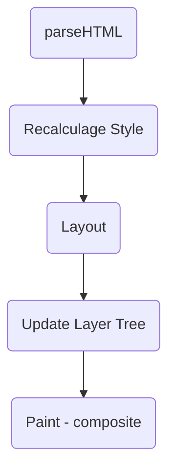
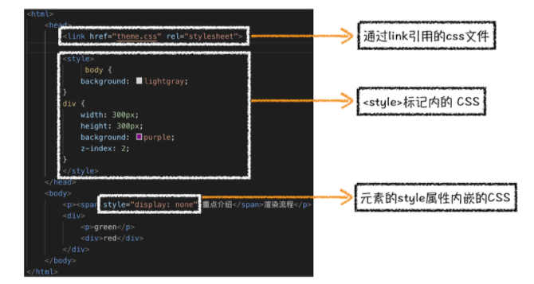
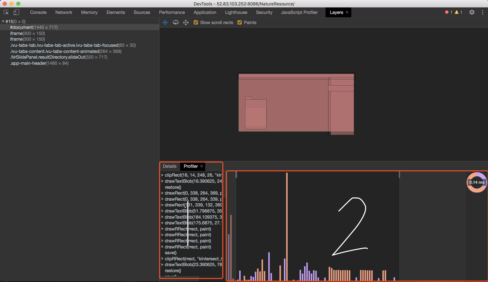
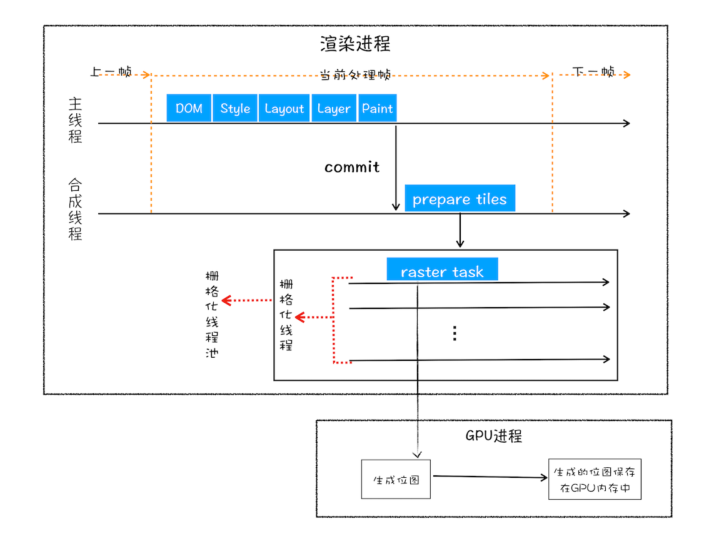
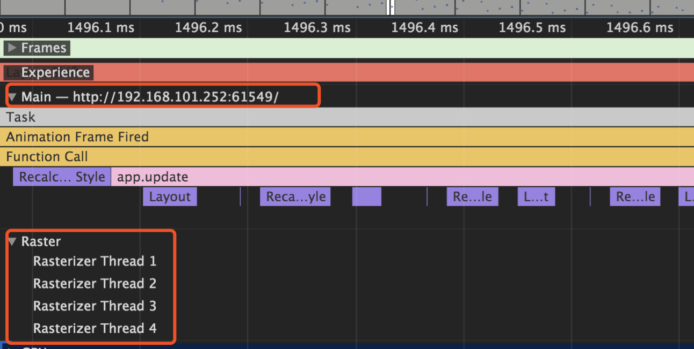
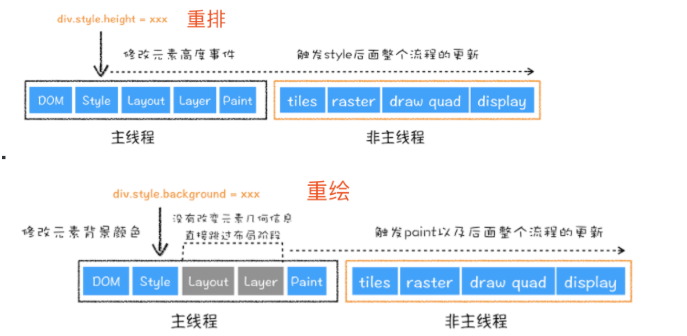
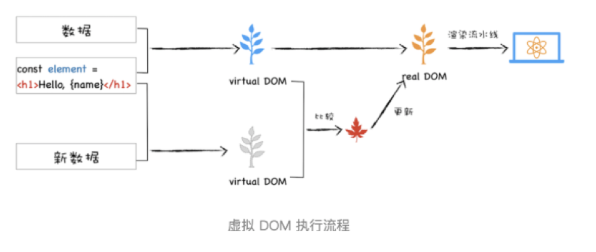
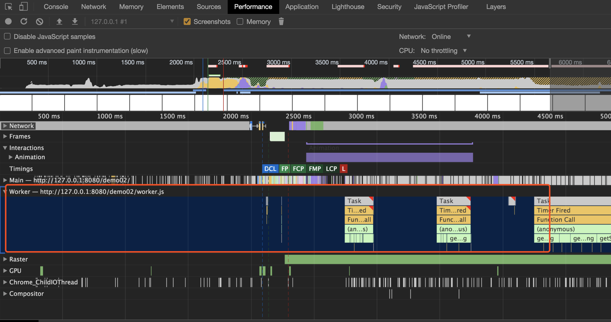

# 浏览器渲染过程

## 前言

渲染性能

渲染出来就是一张图片。

## 首次渲染解析

拿到一份 HTML 文档。


按照渲染的时间顺序：流水线可以分为如下：几个子阶段：构建 DOM 树、样式计算、布局阶段、分层、绘制、分块、光栅化和合成。

在每个阶段的过程中，你应该重点关注以下三点内容：
- 开始每个子阶段都有其输入的内容；
- 然后每个子阶段有其处理过程；
- 最终每个子阶段会生成输出内容。

理解了这三部分内容，能让你更加清晰地理解每个子阶段。

### 渲染内核组成

HTML/CSS/JS 资源  -----> 浏览器内核 ------> 图像

从这个流程来看，浏览器呈现网页这个过程，宛如一个黑盒。在这个神秘的黑盒中，有许多功能模块，内核内部的实现正是这些功能模块相互配合协同工作进行的。其中，我们最需要关注的，就是 `HTML 解释器`、`CSS 解释器`、`图层布局计算模块`、`视图绘制模块`与 `JavaScript 引擎`这几大模块：

- HTML 解释器：将 HTML 文档经过词法分析输出 DOM 树。
- CSS 解释器：解析 CSS 文档，生成样式规则。
- 图层布局计算模块：布局计算每个对象的精确位置和大小。
- 视图绘制模块：进行具体节点的图像绘制，将像素渲染到屏幕上。
- JavaScript 引擎：编译执行 JavaScript 代码。

### 过程解析




- 解析 HTML
  - 加载解析逻辑，在解析 HTML 的过程中发出了页面渲染所需的各种外部资源
- 计算样式
  - 浏览器识别并加载所有的 CSS 样式信息与 DOM 树合并，最终生成页面 `render` 树。
- 计算图层布局
  - 页面中所有的元素的`相对位置`信息，`大小`等信息均在这一步得到计算
- 绘制图层
  - 在这一步浏览器会根据我们的 DOM 代码结果，把每一个页面图层转换为`像素`，并对所有的媒体文件进行`解码`。
- 整合图层，得到页面
  - 最后一步浏览器合并各个图层，将<u>数据由 CPU 输出 GPU </u>最终绘制在屏幕上。
  <!-- - （复杂的视图层会给这个阶段的 GPU 计算带来一些压力，在实际 中为了优化动画性能，我们有时会手动区分不同的图层-->

### 几种树

- DOM 树
- CSSOM 树
- 渲染树：DOM + CSSOM
- 布局渲染树：Layout
- 绘制渲染树

## 渲染流程（上）：HTML、CSS 和 JavaScript 是如何变成页面的

### 构建 DOM 树


构建 DOM 树的输入内容是一个非常简单的 HTML 文件，然后经由 HTML 解析器解析，最终输出树状结构的 DOM。

可以通过 Console 输入 document 回车，这样你就能看到一个完整的 DOM 结构。

你可以看到 DOM 和 HTML 的内容几乎是一样的，但是和 HTML 不同的是，DOM 是保存在内存中树状结构，可以通过 JavaScript 来查询或修改其内容。

### 样式计算

样式计算的目的是为了计算出DOM节点中每个元素的具体样式，这个阶段大体可分为三步来完成。



1. 把 CSS 转化为浏览器能够理解的结构。

和 HTML 文件一样，浏览器也是无法直接理解这些纯文本的 CSS 样式，所以当渲染引擎接收到 CSS 文本时，会执行一个转换操作，将 CSS 文本转换为浏览器可以理解的结构—— `styleSheets`。

为了加深理解，可以在 chrome 控制台输入 document.styleSheets

2. 转换样式表中的属性值，使其标准化。

2em 被解析成了 32px，red 被解析成了 rgb(255,0,0)，bold 被解析成了 700

3. 计算出 DOM 树中每个节点的具体样式。

通过 CSS 的`继承`规则和`层叠`规则，计算出 DOM 树中每个节点的样式属性。

这个阶段最终输出的内容是每个 DOM 节点的样式，并被保存在 ComputedStyle 的结构内。

如果你想了解每个 DOM 元素最终的计算样式，可以打开 Chrome 的“开发者工具”，选择第一个 “element” 标签，然后再选择 “Computed” 子标签

### 布局阶段

现在，我们有 DOM 树和 DOM 树中元素的样式，但这还不足以显示页面，因为我们还不知道 DOM 元素的几何位置信息。那么接下来就需要计算出 DOM 树中可见元素的几何位置，我们能把这个计算过程叫做布局。

Chrome 在布局阶段需要完成两个任务：创建布局树和布局计算。

#### 创建布局树

DOM 树可能含有很多不可见的元素，比如 head 标签，还有使用了 `display: none` 属性的元素。所以在显示之前，我们还要额外地构建一颗只包含`可见元素`布局树。


- 遍历 DOM 树中大的所有可见节点，并把这些节点加到布局中。
- 而不可见的节点会被布局树忽略掉。

#### 布局计算

现在我们有了一颗完整的布局树后，就要计算布局树节点的坐标位置了。

## 渲染流程（下）：HTML、CSS 和 JavaScript 是如何变成页面的

### 分层

现在我们有了布局树，而且每个元素的`具体位置信`息都计算出来了，那么接下来是不是就要开始着手绘制页面了？

答案依然是否定的。

因为页面中有很多复杂的效果，如一些复杂的 3D 效果、页面滚动，或者使用 z-index 做 z 轴排序等，为了更加方便地实现这些效果，渲染引擎还需要为特定的节点生成专用的图层，并生成一颗对应的图层树（LayerTree）。


通常情况下，并不是布局树的每个节点都包含一个图层，如果一个节点没有对应的层，那么这个节点就从属于父节点的图层。如上图中的 span 表情没有专属图层，那么它们就从属于它们的父节点图层。但不管怎样，最终每一个节点都会直接或间接地从属于一个层。

那么需要满足什么样的条件，渲染引擎才会为特定的节点创建新的层呢？通常满足下面两点中任意一点的元素就可以被提升为单独的一个图层。

#### 第一点：拥有层叠上下文属性的元素会被提升为单独的层

页面是个二维平面，但是层叠上下文能够让 HTML 元素具有三维概念，这些 HTML 元素按照自身属性的优先级分布在垂直于这个二维平面的 z 轴上。


从图中看出，明确定位属性的元素、定义透明属性的元素、使用 CSS 滤镜的元素等，都拥有层叠上下文属性。

#### 第二点：需要剪裁（clip）的地方也会被创建为图层

overflow。

### 图层绘制



在该图中，区域1 就是 document 的绘制列表，拖动区域 2 中的进度条可以重现列表的绘制过程。

### 栅格化（raster）操作

绘制列表只是用来记录绘制顺序和绘制指令的列表，而实际上绘制操作是由渲染引擎中的`合成线程`来完成的。



通常一个页面可能很大，但是用户只能看到其中的一部分，我们把用户可以看到的这个部分叫做`视口（viewport）`。

在有些情况下，有的图层可以很大，比如有的页面你使用滚动条要滚动好久才能滚动到底部，但是通过视口，用户只能看到页面的很小一部分，所以在这种情况下，要绘制所有图层内容的话，就会产生太大的开销，而且也没必要。（对于很大的图层，如果不做虚拟列表优化的情况下，DOM 树还是整个存在很大的，这里的优化只不过是对绘制图层的优化）

基于这个原因，合成线程会将图层划分为`图块（tile）`，这些图块的大小通常是 256 x 256 或者 512 x 512。

然后合成线程会根据视口附近的图块来优先生成为徒，实际生成位图的操作是由`栅格化`来执行。所谓栅格化，<u>是指将图块转换为位图。</u>
而图块是栅格化执行的最小单位。渲染进程维护了一个栅格化的线程池，所有的图块栅格化都是在线程池内执行的。

通常，栅格化过程都会使用 GPU 来快速生成，使用 GPU 生成位图的过程叫做`快速栅格化`，或者 GPU 栅格化，生成的位图被保存在 GPU 内存中。



### 合成和显示

一旦所有图块都被光栅化，合成线程就会生成一个绘制图块的命令——“DrawQuad”，然后将该命令提交给浏览器进程。

浏览器进程里面有一个 viz 的组件，用来接收合成线程发过来的 Dra
wQuad 命令，然后跟酒 DrawQuad 命令，将其页面内容绘制到内存中，最后再将内存显示在屏幕上。

### 渲染流水线大总结


- 渲染进程将 HTML 内容转换为能够读懂的 DOM 树结构。
- 渲染引擎将 CSS 样式表转化为浏览器可以理解的 styleSheets，计算出 DOM 节点的样式。
- 创建`布局树`，并计算元素的布局信息。
- 对布局树进行分层，并生成`分层树`。
- 为每个图层生成绘制列表，并将其提交到合成线程。
- 合成线程将`图层分成图块`，并在光栅化线程池中将`图块换成位图`。
- 合成线程发送绘制图块命令 DrawQuad 给浏览器进程。
- 浏览器进程根据 DrawQuad 消息生成页面，并显示到显示器上

主线程记录的事件

|事件|说明|
|--|--|
|Parse HTML| Chrome 执行其 HTML 解析算法|
|Event| JavaScript 事件| 
|Layout | 页面布局已执行|
|Recalculate style| Chrome 重新计算了元素样式|
|Paint|合成的图层被绘制到显示画面的一个区域|
|Composite| Chrome 的渲染引擎合成了图像层|

## 操作产生回流和重绘

### 回流

当我们对 DOM 的修改引发了 DOM 几何尺寸的变换（比如修改元素的宽、高或隐藏元素（包括overflow、display、visiblity）等）时，浏览器需要重新计算元素的几何属性（其他元素的几何属性和位置也会因此受到影响），然后再将计算的结果绘制出来。这个过程就是回流（也叫重排）。

### 重绘

当我们对 DOM 的修改导致了样式的变化、却并未影响其几何属性（比如修改了颜色或背景色）时，浏览器不需要重新计算元素的几何属性、直接为该元素绘制新的样式（跳过上图中的回流环节）。这个过程叫做重绘。

**网页生成的时候，至少会渲染一次。用户访问的过程中，还会不断重新渲染。**

以下三种情况，会导致网页重新渲染。
- 修改 DOM
- 修改样式表
- 用户事件（比如鼠标悬停、页面滚动、输入框输入文字、改变窗口大小等等）

**重新渲染，就需要重新生成布局和重新绘制。前者叫做“重排”（reflow），后者叫做“重绘”（repaint）。**

需要注意的是，**“重绘”不一定需要“重排”**，比如改变某个网页元素的颜色，就只会触发“重绘”，不会触发“重排”，因为布局没有改变。但是，**“重排”必然导致“重绘”**，比如改变一个网页元素的位置，就会同时触发“重排”和“重绘”，因为布局改变了。

|重新渲染方式|可能造成的原因|
|--|--|
|重排（reflow）|添加、删除、更新 DOM|
||添加、删除、更新 DOM|
||display:[block, flex, inline] <=> none|
||添加样式表，调整样式属性|
||改变窗口大小、字号、滚动页面|
|重绘（repaint）|重排|
||visibility: visible <=> hidden|
||颜色改变|
||其他几何变化...|

由于计算布局需要大量时间，重排的开销远大于重绘，在达到相同效果的情况下，我们需要尽量避免重排。举个例子，如果 display:none 和 visibility: hidden；都能满足需求，那么后者更优。

### 例子分析

#### 浏览器是怎么绘制一帧动画的

#### 分析

分析 Chrome 动画。

- 避免大型、复杂的布局和布局抖动

### 优化思路

#### 避免强制同步布局

- 首先 JavaScript 运行，然后计算样式，到布局。但是，可以使用 JavaScript 强制浏览器提前执行布局。这被称为`强制同步布局`。
- 在 JavaScript，来自上一帧的所有旧布局值是已知的，并且可供你查询。因此，如果你要在帧的开头写出一个元素的高度，可能编写一些以下的代码：

```js
requestAnimationFrame(logBoxHeight);
function logBoxHeight() {
  // Gets the height of the box in pixels and logs it out.
  console.log(box.offsetHeight);
}
```

- 如果在请求此框的高度之前，已更改其样式，就会出现问题，浏览器需要重新计算样式。

```js
function logBoxHeight() {
  box.classList.add("super-big");
  // Gets the height of the box in pixels and logs it out.
  console.log(box.offsetHeight);
}
```

- 正确完成时

```js
function logBoxHeight() {
  // Gets the height of the box in pixels
  // and logs it out.
  console.log(box.offsetHeight);

  box.classList.add('super-big');
}
```

大部分情况下，并不需要应用样式然后查询值；使用上一帧的值就足够了。

针对这个问题，把 offsetTop 替换成 style.top。后者取的是上一帧动画的元素位置。

#### 避免布局抖动

有一种方式会使强制布局甚至更糟：接二连三执行大量这种布局。

```js
function resizeAllParagraphsToMatchBlockWidth() {
  // Puts the browser into a read-write-read-write-cycle
  for (var i = 0; i < paragraphs.length; i++) {
    paragraphs[i].style.width = box.offsetWidth + 'px';
  }
}
```

此代码循环处理一组段落，并设置每个宽度以匹配一个称为“box” 的元素的宽度。这看起来没有害处，但问题是循环的每次迭代读取一个样式值（box.offsetWidth），然后立即使用此值来更新段落的宽度（paragraphs[i].style.width）。在循环的下次迭代时，浏览器必须考虑样式已修改这一事实，因为 offsetWidth 是上次请求的（在上一次迭代中），因此它必须应用样式更改。每次迭代都会出现这个问题。

正确写法，先读取值，后写入值：
```js
// Read.
var width = box.offsetWidth;

function resizeAllParagraphsToMatchBlockWidth() {
  for (var i = 0; i < paragraphs.length; i++) {
    // Now write.
    paragraphs[i].style.width = width + 'px';
  }
}
```

#### 虚拟 DOM 的实现

> 以下文章转载自 xxxx

解决直接操作 DOM 导致的重绘和重排的问题。

关于虚拟 DOM：
为什么要有虚拟 DOM 的出现，因为操作频繁真正 dom 会导致页面重排和重绘这两个性能问题，间接导致卡顿。



那么虚拟 DOM 做了哪些事情?

将页面的改变的内容应用到虚拟 DOM 上，而不是直接应用到 DOM 上。
变化被应用到 虚拟 DOM 上时，虚拟 DOM 并不着急去渲染页面，仅仅是调整虚拟 DOM 的内部状态，这样就不会频繁触发重绘和重排，操作 DOM 的代价也变低。这也是为什么我们提倡在 Vue 中尽量通过改变数据触发 Vue 的虚拟 DOM 更新逻辑，不要直接自己去操作 DOM。
在虚拟 DOM 手机到足够的改变时，再把这些变化应用到真实的 DOM 上。



具体实现主要通过三个函数：
- element（构建虚拟 DOM）
- diff（对比新旧虚拟 DOM）
- patch（在真正的 DOM 元素应用变更）

原理差不多这样，进一步阅读：
- 深度剖析：如何实现一个 Virtual DOM 算法  https://github.com/livoras/blog/issues/13 
- 以及看看[33 行代码实现的简版](https://github.com/leontrolski/leontrolski.github.io/blob/master/33-line-react-with-comments.js。)

包括几个步骤：

<!-- 1. 用 JavaScript 对象结构表示 DOM  -->

<!-- 如果没有key的情况下，无法判断，所以如果两个节点tagName不一样会整棵子树替换掉；如果有key的话，关键点就是怎么用list-diff使得对比的时候两个节点是同一个节点 -->

## JS 单线程

#### GUI渲染线程与JS引擎线程互斥

因为 JS 引擎可以修改 DOM 树，那么如果 JS 引擎在执行修改了 DOM 结构的同时，GUI 线程也在渲染页面，那么这样就会导致渲染线程获取的DOM的元素信息可能与JS 引擎操作 DOM 后的结果不一致。为了防止这种现象，GUI 线程与 JS 线程需要设计为互斥关系，当 JS 引擎执行的时候，GUI 线程需要被冻结，但是 GUI 的渲染会被保存在一个队列当中，等待 JS 引擎空闲的时候执行渲染。
由此也可以推出，如果 JS 引擎正在进行CPU密集型计算，那么 JS 引擎将会阻塞，长时间不空闲，导致渲染进程一直不能执行渲染，页面就会看起来卡顿卡顿的，渲染不连贯，所以，要尽量避免JS执行时间过长。

#### JS 引擎线程与事件触发线程、定时触发器线程、异步 HTTP 请求线程

JS 执行任务也是在主线程，那其他线程在干嘛？ JS 单线程用来做什么的？

事件触发线程、定时触发器线程、异步 HTTP 请求线程三个线程有一个共同点，那就是使用回调函数的形式，当满足了特定的条件，这些回调函数会被执行。这些回调函数被浏览器内核理解成事件，发送消息给主线程，添加进去`任务队列`，遇到需要执行的 JS 任务，则等待 JS 引擎空闲执行。（JS 引擎线程本身也维护了自己的任务队列。

主线程这里相当于是一个调度的作用，执行 JavaScript 时，会让 JS 线程来做这个工作。只不过它相当于一个入口，就像 Java 中的 `main()` 线程一样。例如事件触发线程会在异步网络请求完成后，会把这个新任务提交到主线程，主线程执行后就会调用 JS 线程来执行回调函数，如果这个执行 JS 任务过久的话，就会阻塞页面的渲染，chrome 锁定了 DOM。GUI 更新会被保存在一个队列中等到 JS 引擎空闲时立即被执行。 可以用 worker 申请子线程，但是无法操作 DOM，这也是为什么 JS 没有设计成多线程的原因，避免多个线程同时操作 UI （DOM）界面，导致出问题。

### 消息队列和事件循环：页面是怎么活起来的

每个渲染进程都有一个主线程，并且主线非常繁忙，既要处理 DOM ，又要计算样式，还要处理布局，同时还需要处理 JavaScript 任务以及各种输入事件。要让这么多不同类型的任务在主线程中有条不紊地执行，这就需要一个系统来统筹调度这些任务，这个统筹调度系统就是`消息队列`和`事件循环机制`。

要想在线程运行过程中，能接收并执行新的任务，就需要采用事件循环机制。

消息队列和事件循环如何判断执行的 JS 栈任务后，进入渲染线程呢？

能否通过 Performance 看出。真的是主线程执行完成一个 JS 宏任务后，就会让渲染线程进行画面渲染？

- https://blog.poetries.top/browser-working-principle/guide/part1/lesson05.html#%E6%9E%84%E5%BB%BAdom%E6%A0%91 这里对于渲染流程写的挺好、挺清楚。之后就通过例子说明。

### web worker 新线程解决 main 线程执行任务

main.js
```js
let myWorker = new Worker("worker.js");
myWorker.postMessage("hello, world"); // 发送
myWorker.onmessage = function received(event) { // 接收
  console.log('Received message ' + event.data);
  myWorker.terminate() // 关闭
}
```

work.js

```js
self.addEventListener('message', function workerWork(e) {
  postMessage("You said " + e.data)
  Say()
  self.close() // 关闭
}, false)

function Say() {
  console.log("I am a worker thread!");
}
```

这里有个在线的 图片处理 demo，可以查看 [demo](https://alloyteam.github.io/alloy-worker/image.html)
performance 查看



生产环境可以考虑使用 [alloy-worker](https://github.com/AlloyTeam/alloy-worker)。

Arcgis 地图服务便使用了 Worker 来处理地图的显示。


```js
/* eslint-env worker */

var globalId = 0;
var outgoing = new Map();
var configured = false;

// to handshake with worker the main thread
var HANDSHAKE = 0;
// to configure the worker
var CONFIGURE = 1;
// for worker to indicated it's configured
var CONFIGURED = 2;
// to open a connection
var OPEN = 3;
// response a connection
var OPENED = 4;
// to send a response to a call
var RESPONSE = 5;
// to invoke a method on the other side
var INVOKE = 6;
// to cancel a call
var CANCEL = 7;

function mapDelete(map, key) {
  /*eslint-disable */
  map["delete"](key);
  /*eslint-enable */
}

function receiveMessage(event) {
  if (!event || !event.data) {
    return null;
  }
  if (typeof event.data === "string") {
    return JSON.parse(event.data);
  }
  return event.data;
}

/*eslint-disable */
function invokeStaticMessage(methodName, data) {
  // Deferred has already been loaded at this point
  var Deferred = require("dojo/Deferred");
  var jobId = globalId++;

  var deferred = new Deferred(function(reason) {
    // post a cancel message in order to cancel on the main thread
    self.postMessage({
      type: CANCEL,
      methodName: methodName,
      jobId: jobId
    });

    mapDelete(outgoing, jobId);
  });

  outgoing.set(jobId, deferred);

  // post to main thread
  self.postMessage({
    type: INVOKE,
    methodName: methodName,
    jobId: jobId,
    data: data
  });

  return deferred.promise;
}
/*eslint-enable */

function messageHandler(event /* FmkMessageEvent */) {
  var message = receiveMessage(event);

  if (!message) {
    return;
  }

  var jobId = message.jobId;

  switch (message.type) {

    // Configure the AMD loader
    case CONFIGURE:
      var configuration = message.configure;

      if (configured) {
        return;
      }

      self.dojoConfig = configuration.loaderConfig;
      self.importScripts(configuration.loaderUrl);

      if (typeof require.config === "function") {
        require.config(configuration.loaderConfig);
      }

      require([
        "esri/config"
      ], function(esriConfig) {
        for (var name in configuration.esriConfig) {
          if (Object.prototype.hasOwnProperty.call(configuration.esriConfig, name)) {
            esriConfig[name] = configuration.esriConfig[name];
          }
        }
        self.postMessage({
          type: CONFIGURED
        });
      });
      break;

  // Loads a module
  case OPEN:
    var modulePath = message.modulePath;

    require([
      "esri/core/workers/RemoteClient",
      modulePath
    ],
    function(RemoteClient, Module) {
      var port = RemoteClient.connect(Module);

      self.postMessage({
        type: OPENED,
        jobId: jobId,
        data: port
      }, [port]);
    });
    break;

  // response to a static message
  case RESPONSE:
    if (outgoing.has(jobId)) {
      var deferred = outgoing.get(jobId);

      mapDelete(outgoing, jobId);

      if (message.error) {
        deferred.reject(JSON.parse(message.error));
      }
      else {
        deferred.resolve(message.data);
      }
    }

    break;
  }
}

self.addEventListener("message", messageHandler);

// Handshake with the main thread
self.postMessage({ type: HANDSHAKE });

```

#### 使用场景

- 弹幕
- web audio
- 轮询
- 在线图片处理、输出

## 小结


[iframe异步加载技术及性能](https://www.open-open.com/solution/view/1319458447249)