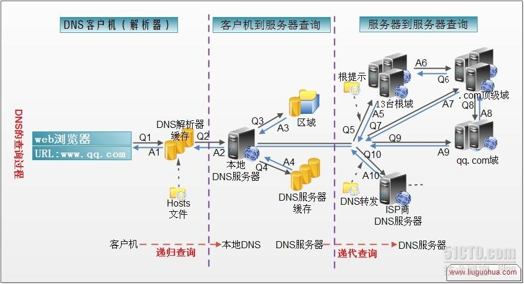

# 介绍

<!-- ## 前言 -->

- 在 HTTP 请求流程中，为什么很多站点第二次打开速度会很快？
- 平时清除缓存，到底清除了哪些东西？包括 DNS 吗？为什么服务器部署资源的 hash 值更改了，刷新前端页面还是读取旧的资源，而不是最新服务器资源呢？为什么一定要手动清除缓存，才能使改变生效？

如果有人问你，你能够明确回答上面的问题吗？如果不能，你可以从缓存篇中对缓存的分析获得启发。

显然，在客户端发起资源请求时，最终一个资源经过资源生成器 -> 数据库（数据库缓存） -> 服务器（服务器缓存） -> 客户端缓存（内存或磁盘），最终展示给用户。当客户端再次发起相同资源的请求时，这个时候为了提升客户端的响应速度，节省用户带宽，获取的资源很可能是从缓存中获取，至于缓存是从数据库还是服务器、内存、磁盘就看具体情况而说。

总的来说，Web 缓存的类型包括以下四种类型：

- 数据库数据缓存
- 服务器端缓存
  - 代理服务器缓存
  - CDN 缓存
- 浏览器端缓存
- Web 应用层面缓存
  - 应用层缓存指的是从代码层面上，通过代码逻辑和缓存策略，实现对数据，页面，图片等资源的缓存，可以根据实际情况选择将数据存在文件系统或者内存中，减少数据库查询或者读写瓶颈，提高响应效率。

上图为（私有）浏览器缓存和（共享）代理缓存。作为前端开发者，我们主要关注**浏览器缓存**以及 **Web 前端应用层面的缓存**。

Chrome 官方的解释：
> 通过网络获取内容既速度缓慢又开销巨大。较大的响应需要在客户端与服务器之间进行多次往返通信，这会延迟浏览器获得和处理内容的时间，还会增加访问者的流量费用。因此，缓存并重复利用之前获取的资源的能力成为性能优化的一个关键方面。

<!-- 整体路线：提出一个问题，为什么资源的 hash 值更改了，还是读取缓存，而不是最新的资源？分析问题，需要了解哪些知识，最后解决问题，如何让它符合预期行为。

- web 缓存包括哪些，重点关注哪些？
- 浏览器方面的缓存机制
- 应用层的缓存

## 一个资源的生命周期

资源生成 -> 存入数据库 -> 服务器 -> 客户端缓存（内存或磁盘） -> 再次请求

是否缓存？（浏览器根据响应头进行决定）

资源失效，就从缓存中清除，类似一个哈希表。 -->

<!-- 永远不要加载相同的资源两次

- 离线指南
- 缓存

- 是否一定要刷新，才能拿取资源
- 能否在资源更新后，服务器自动通知浏览器拿取最新资源，或者提醒用户进行刷新。 -->

<!-- 。

DNS解析的过程是什么，求详细的？ - wuxinliulei的回答 - 知乎
https://www.zhihu.com/question/23042131/answer/66571369

可以通过 在浏览器中地址栏输入：chrome://net-internals，删除 DNS 缓存。再次使用 lookup。

如何删除主机上的缓存

ArcGIS 地图 API 是否请求地图 URL 时，做了缓存的处理？

## 前言

那么，哪些数据会被缓存呢？从上面介绍的核心请求路径可以发现，DNS缓存和页面资源缓存这两块数据是会被浏览器缓存的。其中，DNS缓存比较简单，它主要就是在浏览器本地把对应的IP和域名关联起来，这里就不做过多分析了。

- 缓存与缓冲
- WEB 开发者们为缩短用户等待时间做出了一系列方案，以期「短益求短」。比如用 PWA 缓存更多可用的离线资源，让网页应用打开更快；借助 WebAssembly 规范缩小资源体积，提高执行效率。
- 用户硬件

## 缓存策略

如何有效利用浏览器缓存

内存 - 浏览器沙箱 - 磁盘（chrome 83）

哪些资源适合（不适合）缓存

<!-- webStorage、cookie、indexDB、主机内存 是开发者可以设置 的缓存，其他则是浏览器设置的缓存。怎么使用css、js、base64-->
