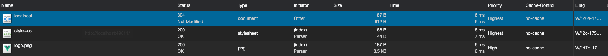

# 图文解读浏览器缓存机制

## 前言

> 缓存是一种保存资源副本并在下次请求时直接使用该副本的技术。

你知道浏览器缓存是怎么回事吗？它可以带来哪些性能收益？缓存可以减少网络 IO 消耗，提高访问速度。`浏览器缓存`是一种操作简单、效果显著的前端性能优化手段。

打开 chrome network 面板，并取消禁用勾选 「Disable cache」，然后输入 www.taobao.com，进行资源请求，资源下载完成后浏览器会对资源进行缓存，以便第二次请求资源时提升响应的速度。

之后刷新页面，对首页进行第二次资源 HTTP 请求。


从截图中可以看到，可以看到形如 “200 from xxx” 这样的描述——对应的资源，这些资源就是我们通过缓存获取到的。浏览器会根据资源的 HTTP 请求头和响应头等一些信息，对资源进行下载后，会把资源以缓存到下面两种位置：

- **内存缓存（Memory Cache）**
  内存缓存具有两个特点，分别是快速读取和时效性。浏览器自行判断什么进行写入，不受开发者控制。
  - 快速读取：内存缓存会将编译解析后的文件，直接存入该进程的内存中，占据该进程一定的内存资源，以方便下次运行使用时的快速读取。
  - 时效性：一旦该进程关闭，则该进程的内存则会清空。关闭 tab 页面后则失效，或者页面占用内存过多，排在前面的缓存先失效
- **磁盘缓存（Disk Cache）**
  硬盘缓存则是直接将缓存写入硬盘文件中，读取缓存需要对该缓存存放的硬盘文件进行 I/O 操作，然后重新解析该缓存内容，读取复杂，速度比内存缓存慢。硬盘中的缓存，持久存储，允许跨会话或跨站点。

在浏览器中，大部分情况下浏览器会在 js 和图片等文件解析执行后直接存入内存缓存中，那么当刷新页面时只需直接从内存缓存中读取(from memory cache)；而 css 文件则会存入硬盘文件中，所以每次渲染页面都需要从硬盘读取缓存(from disk cache)

其他缓存位置：

- **Service Worker Cache（https）**
  - 开发者进行人为存储的永久性存储，用于离线缓存的处理，可以在 Application -> Cache Storage 查看。
- **Push Cache（http2）**
  - Push Cache 是 HTTP2 在 sever push 阶段存在的缓存。

<!-- 浏览器获取缓存的顺序为 Memory Cache、Disk Cache、Service Worker Cache、Push Cache。 -->

本文主要讲述常用的 HTTP 的缓存机制也就是服务器与浏览器端的缓存通信协议，来决定是否存入 Disk Cache。

另外，除了以上的缓存机制外，浏览器还提供一些本地存储方案，包括 **Cookie**、**IndexDB** 和 **LocalStorage** 等，这些将在另外一篇文章讲述。

<!-- TODO 只有都尝试了，才知道哪个才是真正的问题，解决资源缓存导致的问题。才能比较好写，因为这块几乎没什么实践。
Server Worker 对协议是有要求的，必须以 https 协议为前提。
Memory Cache 跟 HTTP Cache 不是包含关系？

HTTP Cache 之后，from Memory Cache（或 dish cache），至于
Service Worker Cache、Push Cache 其他情况再考虑。 -->

<!-- - disk cache（http 缓存）
- prefetch cache
- memory cache -->

<!-- 工具结合 chrome network + wireshark -->
<!-- 从资源生成到资源缓存，再次请求从缓存中获取 -->

<!-- - DNS Cache -->

**目标读者**：希望了解浏览器加载的资源什么时候缓存，什么时候资源缓存失效。

使用缓存的目的：既能使用客户端缓存提升性能，又能在需要时实现快速更新。

**文章大纲**：

- HTTP 缓存机制探秘
- 用户行为对浏览器的缓存策略的影响
- 强缓存
- 协商缓存
- 缓存最佳实践

**阅读时长**：25 min

**浏览器版本**：Google Chrome 版本 85.0.4183.121（正式版本）（64 位），使用“隐身模式”不会再计算机上留下您访问网站的任何痕迹，包括缓存文件、Cookie、历史记录、下载记录等等，以及不受插件的影响。对于保存的缓存而言，意味着退出隐身模式即自动清除缓存。

<!-- 头脑风暴
- 如何辨别
- hash 在资源更新的作用
- （为什么有时候 hash 改变，资源却没有更新）这是有关系的。
- F5 刷新、Crtl+F5 刷新、清除浏览器缓存（清除了哪些内容）、关闭页面/重新打开页面、关闭浏览器/重新打开浏览器
- 负载均衡和反向代理是否会影响策略
- 什么样的资源适合缓存
  - 确定哪些资源可以缓存，并确保其返回正确的 Cache-Control 和 ETag 标头。
- 废弃和更新缓存的响应
  - 在资源“过期”之前，将一直使用本地缓存的响应
  - 你可以通过在网址中嵌入文件内容指纹，强制客户端更新到新版本的影响。
  - 为获得最佳性能，每个应用都需要定义自己的缓存层次结构
- webpack 的 hash 值是真正对应文件内容吗？ -->

## HTTP 缓存机制探秘

<!-- 30min -->

在具体了解 HTTP 缓存之前先来明确几个术语：

- **缓存命中率**：从缓存中得到数据的请求数与所有请求数的比率。理想状态是越高越好。
- **过期内容**：超过设置的有效时间，被标记为“陈旧”的内容。通常过期内容不能用于回复客户端的请求，必须重新向源服务器请求新的内容或者验证缓存的内容是否仍然有效。
- **验证**：验证缓存中的过期内容是否仍然有效，验证通过的话刷新过期时间。
- **失效**：失效就是把内容从缓存中移除。当内容发生改变时就必须移除失效的内容。

接下来，我们将提出几个问题，希望你看完本部分后，能够找到答案：

- 浏览器什么时候写缓存？
- 浏览器什么时候读缓存？从哪里开始读？
- 浏览器的缓存什么时候会失效，如何更新缓存？

### HTTP 头信息指示浏览器缓存机制

每个浏览器都自带了 HTTP 缓存实现功能。你只需要确保每个服务器响应都提供正确的 HTTP 标头指令、以指示浏览器何时可以缓存响应以及可以缓存多久。


当服务器返回响应时，还会发出一组 HTTP 标头，用于描述响应的内容类型、长度、缓存指令、验证令牌等。例如，在上图的交互中，服务器返回一个 1024 字节的响应，指示客户端将其缓存最多 120 秒，并提供一个验证令牌（“x234dff”），可在响应过期后用来检查资源是否被修改。

当 Web 缓存发现请求的资源已经被存储，它会拦截请求，返回该资源的拷贝，而不会去源服务器重新下载。接下来以一个简单的例子来说明 HTTP 缓存策略的出现：


把 index.html 页面和它的样式文件 a.css 放到服务器上，然后进行访问，查看网络请求 200 ok。


如果每次都要请求 a.css，将很影响加载性能，我们希望能这样：


利用 304 条件请求，让浏览器拦截请求使用本地缓存，这个也叫做**协商缓存**，在使用本地缓存前会先跟服务器确认，如果没变化就使用本地缓存，服务器返回一个空的响应体，从而减少了响应体积来提升性能。

能不能不请求服务器，强制浏览器使用本地缓存呢，可以通过（Cache-Control/Expires）实现，这也叫做**强缓存**，从减少请求次数层面来提升性能。


HTTP 头信息控制缓存分为两种：强缓存和协商缓存。强缓存如果命中缓存不需要和服务器端发生交互，而协商缓存不管是否命中都要和服务器发生交互，强制缓存的优先级高于协商缓存。

匹配流程（已有缓存的情况下）：


上图是强缓存和协商缓存的机制流程图，接下来我们详细了解协商缓存和强缓存。

### 用户行为对浏览器的缓存策略的影响

常见情况下，资源的缓存策略就是按照上图匹配流程的顺序，强缓存 -> 协商缓存 -> 重新获取。但是，缓存策略是与用户的操作相关的，平时不可避免会用到刷新，因此有必要提前了解刷新做了哪些操作，后面讲述强缓存和协商缓存例子时会用到刷新操作。


1. F5 刷新，会在请求头 `Cache-Control: max-age=0` 即显示不使用缓存。
2. 在同一个 tag 页面下，通过地址栏回车（再次访问），跟直接在 F5 刷新一样。
3. 强制刷新（F5/command + shift + r），会在请求头添加 `Cache-Control: no-cache`

### 强缓存


强缓存可以理解为无须验证的缓存策略，不会再与服务端发生通信。可以造成强制缓存的字段是 **Expires/Cache-Control**，这些指令控制浏览器和其他中间缓存如何缓存各个响应以及缓存多久。

在没有禁用缓存并且没有超过有效时间的情况下，再次访问这个资源就命中了缓存，不会向服务器请求资源而是直接从浏览器缓存中取，返回的 HTTP 状态码为 200（如下图）。


#### Expires

Expires 指缓存过期的时间，超过了这个时间点就代表资源过期。


**测试例子**：example/cache/http/demo01

1. 在没有设置服务器强制缓存的情况下，关闭 Tab 页面，然后重新进入每次都从服务器中请求获得资源（注意这里对于重复的资源，浏览器不会重复请求）

   

2. 给服务器响应头添加 Expires 设置，关闭 tab 标签页重新打开，显示从 disk cache 获取。

   

3. 在设置了 Expires 的情况下，按 F5 刷新页面，请求头自动携带了 `max-age: 0` 会先跟服务器通信验证，由于不存在协商缓存头，network 显示 css、图片资源从 memory cache 获取。
   

   

我们给 expires 一个特写：

```bash
Expires: Tue, 20 Oct 2020 14:35:29 GMT
```

可以看到 expires 是一个时间戳，接下来如果我们试图再次向服务器请求资源，浏览器就会先对比本地时间和 expires 的时间戳，如果本地时间小雨 expires 设定的过期时间，那么就直接去缓存中取这个资源。由于时间戳是服务器来定义的，而本地时间的取值却来自客户端，因此 expires 的工作机制对客户端时间与服务器时间之间的一致性提出了极高的要求。如果服务器与客户端存在误差（时差、用户修改），将返回意外的结果，那么 expires 将无法达到我们的预期。

#### Cache-Control

expires 允许我们通过**绝对的时间戳**来控制缓存的过期时间。相应地，`Cache-Control` 中的 `max-age` 字段也允许我们通过设定**相对的时间长度**来达到同样的目的。这是 HTTP 1.1 新增的 `Cache-Control` 字段来完成 expires 的任务。


**测试例子**：examples/cache/http/demo02

1. 在没有设置服务器强制缓存的情况下，关闭 Tab 页面，然后重新进入每次都从服务器中请求获得资源。
2. 服务器开启 `Cache-Control` 缓存设置，进入页面后，关闭 tag 页面，重新打开，可以看到资源从 disk cache 获取。
3. 前面的行为跟单独设置 `Expire` 是一致的，现在给 `Expire` 设置一个较短的过期时间 10 秒。
   
4. 然后同时开启 `Cache-Control` 的 `max-age`（设置稍长点的时间段比如 2min），经过 10 秒后，关闭 tag 页面，重新打开，还是可以看到资源从 disk cache 获取，证明 Cache-Control 的优先级更高。

   

我们给 Cache-Control 一个特写：

```bash
Cache-Control: max-age=120
```

在 Cache-Control 中，我们通过 `max-age` 来控制资源的有效期。`max-age` 不是一个时间戳，而是一个`时间段`。`max-age=120` 意味着该资源在 120 秒以内都是有效的，完美地规避了时间戳带来的潜在问题。

<u>Cache-Control 相对于 expires 更加准确，它的优先级也更高。当 Cache-Control 与 expires 同时出现时，我们以 Cache-Control 为准。</u>

Cache-Control 除了 max-age，还有以下用法：

```sh
Cache-Control: max-age=120, s-maxage=3156000
```

标准中规定 max-age 的值最大不超过一年，所以设成 max-age=31536000。至于过期内容，缓存区会将一段时间没有使用的文件删除掉。

s-maxage 优先级高于 max-age，两者同时出现时，优先考虑 s-maxage。如果 s-maxage 未过期，则向代理服务器请求其缓存内容。

s-maxage 仅在代理服务器中生效，并只对 public 缓存有效，客户端我们只考虑 max-age。


##### must-revalidate

如果超过了 max-age 的时间，浏览器必须向服务器发送请求，验证资源是否还有效。

对于验证资源是否还有效，还需要设置协商缓存来辅助。

##### public 与 private

public 与 private 是针对资源是否能够被代理服务器缓存而存在的一组对立概念。

如果我们为资源设置了 public，那么它既可以被浏览器缓存，也可以被代理服务器缓存；如果我们设置了 private，则该资源只能被浏览器缓存。private 为**默认值**。

大多数情况下，“public”不是必须的，因为明确的缓存信息（例如“max-age”）已表示响应是可以缓存的，这样即使只设置 s-maxage，CDN 也可以缓存这个资源。

##### no-store 和 no-cache

“no-store” 直接禁止浏览器以及所有中间缓存存储任何版本的返回响应。例如，包含个人隐私数据或银行数据的响应。每次用户请求该资产时，都会向服务器发送请求，并下载完整的响应。

“no-cache” 表示必须先与服务器确认返回的响应是否发生了变化，然后才能使用该响应来满足后续同一网址的请求。因此，<u>如果存在合适的验证令牌（ETag），no-cache 会发起往返通信来验证缓存的响应，但如果资源未发生变化，则可避免下载。</u>

**测试例子**：examples/cache/http/demo03

1. 分别单独给服务器响应头设置 no-store/no-cache，初次访问页面时，对于后续相同的图片、css 资源，只请求一次资源，而不是两次。


证明对于同一页面后续的重复资源，浏览器会忽略这两个响应头。

2. 在单独设置 no-cache 的情况下，刷新页面会携带 max-age=0 请求头，寻找协商缓存，无果，继续请求服务器。

3. 在添加 no-cache 的情况下（如果设置 max-age，会等 max-age 时间过期后，再去请求服务器验证），添加 Last-Modified/ETag 的验证情况下，关闭页面，重新进入，no-cache 会获得如下的判断：



只有 html 文档是 304 响应（304 Not Modified 是浏览器和服务器多确认了一次缓存有效性，再用的缓存)，而 css 资源、图片还是直接从服务器获取（这个应该是浏览器的处理，后续补充研究，这里可以先忽略）。

而 no-store 不会请求缓存，无论验证是否成功，都重新请求服务器。

<!-- 这里测试只有 html 为 304 响应，待处理 -->
<!-- - vary 响应头，用于服务器缓存处理。这个生产环境有看到。
 -->
 <!-- 一般是 Get 请求被缓存 -->

<!-- 如何识别资源是否来自缓存
- 通过状态码
  - 200 OK（from cache）是浏览器没有跟服务器确认，直接用了浏览器缓存。
  - 304 Not Modified 是浏览器和服务器多确认了一次缓存有效性，再用的缓存。
- 通过传输总大小 transferred 以及 size 列

可能触发 memory cache 的动作
  - prefecth
  - 一个页面中如果有两个相同的请求 (例如两个 src 相同的 ``，两个 href 相同的 `<link>`)都实际只会被请求最多一次，避免浪费。 -->

### 协商缓存

协商缓存依赖于服务端与浏览端之间的通信。

<!-- 绘制协商缓存/强缓存的时序 UML 图 -->

协商缓存机制下，<u>浏览器需要向服务器去询问缓存的相关信息，</u>进而判断是`重新发起请求下载完整的响应`，还是从`本地获取缓存的资源`。

如果服务端提示缓存资源未改动（Not Modified），资源会被重定向到浏览器缓存，**这种情况下网络请求对应的状态码是 304。**


服务器生成并返回的随机令牌通常是文件内容的哈希值或某个其他指纹。客户端不需要了解指纹是如何生成的，只需在下一次请求时将其发送至服务器。

**注意**：如果响应头中有 Last-modified 而没有 Expire 或 Cache-Control 时，浏览器会有自己的算法来推算出一个时间缓存该文件多久，不同浏览器得出的时间不一样。

#### Last-Modified/If-Modified-Since

`Last-Modified` 是一个时间戳，如果我们启用了协商缓存，它会在首次请求时随着 Response Headers 返回：

```bash
Last-Modified: Fri, 27 Oct 2017 06:35:57 GMT
```

随后我们每次请求时，会带上一个叫 `If-Modified-Since` 的时间戳字段，它的值正是上一次 response 返回给它的 last-modified 值：

```bash
If-Modified-Since: Fri, 27 Oct 2017 06:35:57 GMT
```

服务器接收到这个时间戳后，会比对该时间戳和资源在服务器上的最后修改时间是否一致，并在 Response Headers 中添加新的 `Last-Modified` 值；否则，Response Headers 不会再添加 Last-Modified 字段。

**测试例子**：cache/http/demo03

**测试步骤**：

1. 服务器设置关闭 Cache-Control，只开启协商缓存 Last-Modified。访问页面后，进行 F5 刷新。可以看到 index.html 响应代码为 304，而其样式和图片资源则直接通过 memory cache 中获取。也可以从 node 打印查看。（为什么不都是 304 呢？<u>猜测是因为 chrome 判断 index.html 的外链文件路径没变化，于是直接从缓冲中获取。</u> ，这个时候即使改变 css 文件也于事无补。这是个问题，后面会说到如何处理。）

<!-- 通过查询参数以及 hash -->

    

2. 然后更改 index.html 文件，重新刷新，可以发现 index.html 状态为 200。

   

#### Etag/If-Modified-Since

使用 Last-Modified 存在一些弊端，这其中最常见的就是这样两个场景：

- 当我们编辑了文件，但文件的内容没有变。<u>服务端并不清楚我们是否真正改变了文件，它仍然通过最后编辑时间进行判断。</u>因此在这个资源在再次被请求时，会被当作新资源，进而引发一次完整的响应——不该重新请求的时候，也会重新请求。
- 当我们修改文件的速度过快时（比如花了 100ms 完成了改动），由于 `If-Modified-Since` 只能检查到以`秒`为最小计量单位的时间差，所以它是感知不到这个改动的——该重新请求的时候，反而没有重新请求了。

这两个场景其实指向了同一个 bug —— <u>服务器并没有正确感知文件的变化。</u>为了解决这样的问题，`Etag` 作为 Last-Modified 的补充出现了。

Etag 是由服务器为每个资源生产的唯一的`标识字符串`，这个标识字符串是基于文件内容编码的，只要文件内容不同，它们对应的 Etag 就是不同的，反之亦然。因此 Etag 能够精准地感知文件的变化。

```bash
ETag: W/"2237-1566200378000"
```

那么下一次请求，请求头里就会带上一个值相同的、名为 `if-None-Match` 的字符串供服务端比对了：

```bash
If-None-Match: W/"2237-1566200378000"
```


<u>Etag 的生成过程需要服务器额外开销，</u>会影响服务端的性能，这是它的弊端。因此启用 Etag 需要我们审时度势。正如我们刚刚所提到的——Etag 并不能替代 Last-Modified，它只能作为 Last-Modified 的补充和强化存在。Etag 在感知文件变化上比 Last-Modified 更加准确，优先级也更高。**当 Etag 和 Last-Modified 同时存在时，以 Etag 为准**。

**测试例子**：cache/http/demo03
**测试步骤**：

1. ETag 的测试效果跟 Last-Modified 相似，除了一点，就是无论是 index.html、还是样式和图片资源，再次刷新后都响应了 304，chrome 对 ETag 的处理有区别，因此建议都是用 ETag。
   
   <!-- 待确认的状态处理 -->
2. 这时对 css 进行更改，刷新页面，会获取最新的资源。
   

<!-- 哪些文件进行设置？

- 没有缓存的情况

- 已有缓存的情况下。

资源没有更新。

比如引入的一些第三方文件、打包出来的带有 hash 后缀 css、js 文件。一般来说文件内容改变了，会更新版本号、hash 值，相当于请求另一个文件。（文件名不一样了。） -->

### 最佳实践

在面对一个具体的缓存需求时，我们到底该怎么决策呢？


我们现在一起解读一下这张流程图：

当我们的资源内容不可复用时，直接为 `Cache-Control` 设置 `no-store`，拒绝一切形式的缓存；否则考虑是否每次都需要向服务器进行缓存有效确认，如果需要，那么设 `Cache-Control` 的值为 `no-cache`；否则考虑该资源是否可以被`代理服务器`缓存，根据其结果决定为 `private` 还是 `public`；然后考虑资源的过期时间，设置对应的 `max-age` 和 `s-maxage` 值；最后，配置协商缓存需要用到 `Etag`、`Last-Modified` 等参数。

给一个资源设置强缓存和协商缓存后，再次请求该资源时，会先判断 max-age 是否过期，如果不过期就从缓存拿，过期后就直接向服务器请求。这个时候会携带 Last-Modified 和 Etag 给服务器对比，如果文件改变了就重新发送，否则就返回 304，让浏览器继续从本地缓存中取。

1. 对于不常变化的资源，设置一年的 max-age 过期时间。

`Cache-Control: max-age=31536000`，比如请求在线提供的类库 (如 jquery-3.3.1.min.js, lodash.min.js 等) 均采用这个模式。如果配置中还增加 public 的话，CDN 也可以缓存起来，效果拔群。

2. 对于经常变化的资源，可以设置 no-cache 进行验证：

`Cache-Control: no-cache`

这里的资源不单单指静态资源，也可能是网页资源，例如博客文章。这类资源的特点是：URL 不能变化，但内容可以(且经常)变化。我们可以设置 Cache-Control: no-cache 来迫使浏览器每次请求都必须找服务器验证资源是否有效。

既然提到了验证，就必须 ETag 或者 Last-Modified 出场。这些字段都会由专门处理静态资源的常用类库(例如 koa-static、Express)自动添加，无需开发者过多关心。

**测试例子**：cache/http/demo04

#### 废弃和更新缓存的响应，刷新 web 应用

强缓存的作用是为了让浏览器不发送资源请求，协商缓存可以让浏览器先跟服务器验证。假如有一个 index.html（no-cache），它的外链 css 样式文件没有超过失效时间，如何处理这种情况呢？

```html
<link rel="stylesheet" href="a.css" />
```

一种方案是，我们可以通过更新页面中引用的资源路径，让浏览器主动放弃缓存，加载新资源。类似这样：


下次上线，把链接地址改成新的版本，就更新资源了。但是这样问题解决了么？


页面引用了 3 个 css，而某次上线只改了其中的 a.css，如果所有链接都更新版本，就会导致 b.css，c.css 也失效。

因此，要解决这个问题，必须让 url 的修改与文件内容关联，摘要信息与文件内容一一对应，就有了一种可以精确到单个文件粒度的缓存控制依据了。


此时，再用文件修改，就只更新那个文件对应的 url 即可。而现今企业，为了进一步提升网址性能，会把静态资源和动态网页分集群部署，静态资源会被部署到 CDN 解读上，网页上引用的资源也会变成对应的部署路径。


这次发布，同时改了页面结构和样式，也更新了静态资源对应的 url 地址，现在要发布代码上线，亲爱的前端研发同学，你来告诉我，咱们是先上线页面，还是先上线静态资源？

1. **先部署页面，再部署资源**：在二者部署的时间间隔内，如果有用户访问页面，就会在新的页面结构中加载旧的资源，并且把这个旧版本的资源当做新版本缓存起来，其结果就是：用户访问到了一个样式错乱的页面，除非手动刷新，否则在资源缓存过期之前，页面会一直执行错误。
2. **先部署资源，再部署页面**：在部署时间间隔之内，有旧版本资源本地缓存的用户访问网站，由于请求的页面是旧版本的，资源引用没有改变，浏览器将直接使用本地缓存，这种情况下页面展现正常；但没有本地缓存或者缓存过期的用户访问网站，就会出现旧版本页面加载新版本资源的情况，导致页面执行错误，但当页面完成部署，这部分用户再次访问页面又会恢复正常了。


单独部署下，同时更新静态资源与动态资源不会有问题。如果是使用 CDN 先后发布资源和页面，则会存在**覆盖式发布**的问题，用 待发布资源 覆盖 已发布资源，就有这种问题。解决它也好办，就是实现**非覆盖式发布**。

- 覆盖式发布（用待发布资源覆盖已发布资源）
- 非覆盖式发布（采用 hash）

看上图，用文件的摘要信息来对资源文件进行重命名，把摘要信息放到资源文件发布路径中，这样，内容有修改的资源就变成了一个新的文件发布到线上，不会覆盖已有的资源文件。上线过程中，先全量部署静态资源，再灰度部署页面，整个问题就比较完美的解决了。

这种情况下，如果是 hash 的话，则不会出现这个问题，请求了新的文件。

<!-- 但是使用查询字符串的话，查询字符串不同，就会重新请求服务器相同的资源名称文件。 -->

<!-- 这块后面，重新过一遍的时候，看看如何精简，或者通过外链引入。精简就大概说一下 ？ 到 hash。 -->

<!-- 后续更改图片 vuecli -->

#### 浏览器存读缓存流程

让我们整理一下浏览器的存取缓存流程，以便你更好找到前面提出的几个问题的答案。（如何写缓存、如何读缓存、缓存失效）

首次请求：


再次请求：


#### 进行资源更新时，为什么一定要手动清除缓存

例子：项目例子

为什么一定要清除缓存，有可能是以下的情况：

一是设置了协商缓存，但是 index.html 文档内容没变化。

二是同时设置了强缓存，也设置了协商缓存，但是强缓存时间没过期，这样在资源文件没做 hash 处理的情况下，（比如 public 文件夹，只是做简单的复制输出到 static 而已）就会出现这种问题。

（如何处理呢，一是实施手动设置文件 ? 版本，是否有改动文件后，自动工具出 hash。三是，使用服务端设置该文件路径一律 no-store。）关闭强缓存，设置 no-cache + 条件协商内容。

三是系统有用到 service cache，没有具体处理好，优先命中这个。


<!-- - [vue 项目部署的最佳实践](https://juejin.im/post/6844904149633466376)  -->

<!-- 引用的资源没有变化，只单独使用了 ? 这个标记 -->

<!-- 注意的是，即使资源时间 max-age 过期了，设置了协商缓存去验证，会去验证效果才决定请求。

有时候可以，有时候不可以，这个情况？

首先判断是否设置了缓存头，假如只设置了协商缓存，每次都去验证。

这样的结果是导致刷新，没重新请求资源，有可能：
一是 html 文档本身没变化，二是 html 引用的资源文件没变化。

如果设置了强缓存，则会先命中强缓存，比如 max-age 的时间，则有可能是因为 max-age 还没过期。这样如果是相同的 hash 文件也不会重新请求。（构建工具没重新处理的话）

后面是在项目上进行重现试下，是否可以。拿运维的作为测试。打包快一点。且文件不多。
<!-- #### 检查清单 && 落地方案 Tomcat & nginx -->
<!--
设置了 max-age，不同版本的问题，除了 CDN 先后顺序外，还有就是同样的缓存时间，先请求的资源与后请求的请求不匹配问题。 -->

<!-- 回答前面的问题，总关于浏览器什么时候写缓存 -->
<!-- #### 浏览器什么时候写缓存？


#### 浏览器什么时候读缓存？

#### 浏览器缓存什么失效？包含在浏览器首次请求和再次请求中。 -->

<!-- Cache-Control: public, max-age=0 与 Cache-Control: no-cache 的区别 -->

<!-- 不需要每次都验证的话

Cache-Control 需要做验证，根据 Etag

问题：测试 Chrome 85 在满足协商缓存条件下，为什么会出现 再次请求资源时，index.html 的响应是 304，而它引用的 css 文件则是 200 （from memory cache）m 呢？

这是因为浏览器 Chrome 根据情况做的优化，**设置了协商缓存响应头后（比如 Last-Modified）**，这个时候就会根据情况会把 css 文件放进 memory cache，第二次就会从缓存中获取，但状态码还是 200。为什么没有跟服务器确认？只要 index.html 引用的 css 文件路径不变，就不会重新请求服务器？即使设置了协商缓存。？

这是因为 Last-Modified 有时候不管用，需要把协商缓存响应头设置为 Etag 才起作用。因为 Last-Modified 会受到客户端日期的影响。(可以用 demo02 只开启 ETag 进行测试)。为什么呢，正常来说只要发起 Last-Modified 头，后续肯定会跟服务器验证的才对。但是这个值在 Chrome 85 上失效了。而开启 ETag 的话，则正常操作，进行检查。Last-Modified 就能不用则不用，使用 ETag/If-None-Mathcs 来处理即可。

设置了强缓存的，会直接从 from memory cache 获取，但是协商缓存 Last-Modified 就不应该直接 from momery，应该先进行询问。

memory cache 缓存会在页面关闭后释放掉；（status=200）
disk cache 不会随着页面关闭而释放 （status=200）。

Last-Modified & If-Modified-Since
如果资源更新的速度是秒以下单位，那么该缓存是不能被使用的，因为它的时间单位最低是秒。
如果文件是通过服务器动态生成的，那么该方法的更新时间永远是生成的时间，尽管文件可能没有变化，所以起不到缓存的作用。 -->

<!-- ### 总结

强缓存 + 协商缓存 + max-age

一些常见的结合 -->

<!-- 是否可以只设置一种 -->

<!-- #### 单纯设置协商缓存

是 Etag/If-None-Match：

If-Modified-Since: Thu, 15 Oct 2020 06:24:07 GMT
If-None-Match: W/"bac-1752aee16d1"

只要改变文件内容，Last-Modified 和 Etag 都会进行改变。换言之，只要你改变 index.html 的内容，浏览器就会重新请求该文件。

包括 index.html 里面引用的文件，比如 xxx.hash.js、xxx.hash.css，因为 index.html 改变了。
 -->

<!-- #### 结合两者 -->

<!-- 现在的浏览器 tomcat 默认开启协商缓存。为什么只有 html 文件才会返回 304？标识。而 js、css 则是 200 from memory cache  -->

<!-- 可以尝试更新下内容，排查下 tomcat 的处理。（重新打包，这样需要分包下加速打包的时间才行。）

是否使用了 HTML 的 meta 标签来指定缓存行为
使用查询字符串来避免缓存。因为缓存有一些已知的问题，使用查询字符串会导致有些代理服务器不缓存资源。 -->
<!--
没返回资源内容，但是响应头下载也需要需要，因此 timing 的 content-download 有一定的占用时间。 -->

<!-- #### HTTP 头信息失效的情况 -->

<!-- 不要缓存 HTML，避免缓存后用户无法及时获取到更新内容。使用 Cache-Control 和 ETag 来控制 HTML 中所使用的静态资源的缓存。一般是将 Cache-Control 的 max-age 设成一个比较大的值，然后用 ETag 进行验证。使用签名或者版本来区分静态资源。这样静态资源会生成不同的资源访问链接，不会产生修改之后无法感知的情况。

进行打包，分包进行验证。后续的是其他的缓存了。

作者：歪马
链接：https://juejin.im/post/6844904052820557837
来源：掘金
著作权归作者所有。商业转载请联系作者获得授权，非商业转载请注明出处。

用户的操作，手动缓存与自动缓存。

普通刷新与强制刷新（Ctrl + F5）。

强缓存，

当 f5 刷新网页时，跳过强缓存（设置 Cache-Control: no-cache 会忽略），但是会检查协商缓存；（这样服务器必须设置协商缓存 Etag，并 html 资源有修改。因此，不要给 html 设置 协商缓存，只需要 Cache-Control: no-cache；避免协商缓存误导 html 文件缓存，但正常来说只要 html 改变了就会重新生成 etag 识别。）

经过验证运维即是更新 html 文件即会自动更新。

针对首页，不要设置协商缓存，设置 html 即可，这样就算不刷新。

设置强缓存 Cache-Control： no cache这样每次都会去页面进行，当前的设置协商缓存也是每次都去服务器请求。

只要设置协商缓存，hash 没改变，资源改变的情况下也会重新进行请求的。

因此不会说出现资源没更新的情况。除非资源没改变，或者引用的资源 hash 值没改变。hash 没改变。

如果什么都不设置，浏览器是不会缓存的。 -->

<!--

```bash
Cache-control: public, max-age=31536000
Last-Modified: Wed, 04 Mar 2020 18:31:22 GMT
ETag: W/"2237-1566200378000"
``` -->

<!-- ## Memory Cache

Memory Cache，是指存在内存中的缓存。从优先级上来说，它是浏览器最先尝试命中的一种缓存。从效率上来说，它是响应速度最快的一种缓存。

内存缓存是快的，也是“短命”的。它和`渲染`进程“生死相依”，当进程结束后，也就是 tab 关闭以后，内存里的数据也将不复存在。

那么哪些文件会被放入内存呢？

事实上，这个划分规则，一直以来没有定论。内存是有限的，很多时候需要先考虑即时呈现的内存余量，再根据具体的情况决定分配给内存和磁盘的资源量的比重——资源存放的位置具有一定的随机性。


我们可以总结这样的规律：资源存不存内存，`浏览器`秉承的是“节约原则”。我们发现，Base
64 格式的图片，几乎永远可以被塞进 memory cache，这可以视作浏览器节省渲染开销的“自保行为”；此外，体积不大的 JS、CSS 文件，也有较大地被写入内存的几率——相比之下，较大的 JS、CSS 文件就没有这个待遇了，内存资源是有限的，它们往往被直接甩进磁盘。

## Service Cache

Service Worker 是一种独立于主线程之外的 JavaScript 线程。它脱离于浏览器窗体，因此无法直接访问 DOM。这样独立的个性使得 Service Worker 的 “个人行为” 无法干扰页面的性能，这个“幕后工作者” 可以帮我们实现`离线缓存`、`消息推送`和 `网络代理` 等功能。我们借助 Server worker 实现的离线缓存就称为 Service Worker Cache。

Service Worker 的生命周期包括 install、active、working 三个阶段。一旦 Service Worker 被 install，它将始终存在，只会在 active 与 working 之间切换，除非我们主动终止它。这是它可以用来实现离线缓存的重要先决条件。

Server Worker 对协议是有要求的，必须以 https 协议为前提。

## Push Cache

PUsh Cache 是指 HTTP2 在 server push 阶段存在的缓存。 -->

<!-- 缓存需要合理配置，因为并不是所有资源都是永久不变的：重要的是对一个资源的缓存应截止到其下一次改变（即不能缓存过期的资源） -->

<!-- 应用：arcgis 发布的服务资源，设置了 no-caches -->

## 总结

本文从浏览器缓存的位置（memory cache、disk cache）以及浏览器策略（强缓存、协商缓存）两个方面来说明浏览器的缓存策略，希望看到这里你能够知道 web 应用静态资源什么时候被写入缓存、什么时候进行读取、又如何进行设置失效更新。

对于静态资源的优化方案来说：

- 配置超长时间的本地缓存——节省带宽，提高性能。
- 采用内容摘要作为缓存更新依据 —— 精确的缓存控制
- 静态资源 CDN 部署 —— 优化网络请求
- 更新资源发布路径实现非覆盖式发布 —— 平滑升级

## 参考资料

- [Web 性能优化资源合集（持续更新）](../reference/README.md#网络)