# 浏览器之 HTTP 缓存机制解读

## 前言

> 缓存是一种保存资源副本并在下次请求时直接使用该副本的技术。

你知道浏览器缓存是怎么回事吗？它可以带来哪些性能的收益？在 HTTP 请求流程中，为什么很多站点第二次打开速度会很快？缓存可以减少网络 IO 消耗，提高访问的速度。`浏览器缓存`是一种操作简单、效果显著的前端性能优化手段。

打开 chrome network 面板，并取消禁用勾选 「Disable cache」，然后输入 www.taobao.com，首次进行资源请求并下载完成后，浏览器会对该资源进行缓存，以便第二次请求相同资源时提升响应的速度。

现在我们刷新页面，发起第二次首页请求。

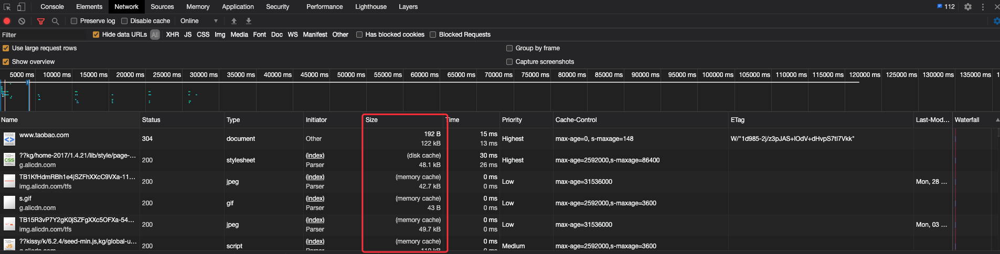

从截图中可以看到，可以看到形如 “200 from xxx” 这样的描述——对应的资源，这些资源就是我们通过缓存获取到的。浏览器会根据资源的 HTTP 请求头和响应头等一些信息，对资源进行下载后，会把资源缓存到以下 4 种位置：

- **内存缓存（Memory Cache）**
  内存缓存具有两个特点，分别是快速读取和时效性。浏览器自行判断什么进行写入，不受开发者控制。
  - 快速读取：内存缓存会将编译解析后的文件，直接存入该进程的内存中，占据该进程一定的内存资源，以方便下次运行使用时的快速读取。
  - 时效性：一旦该进程关闭，则该进程的内存则会清空。关闭 tab 页面后则失效，或者页面占用内存过多，排在前面的缓存先失效
- **磁盘缓存（Disk Cache）**
  硬盘缓存则是直接将缓存写入硬盘文件中，读取缓存需要对该缓存存放的硬盘文件进行 I/O 操作，然后重新解析该缓存内容，读取复杂，速度比内存缓存慢。硬盘中的缓存，持久存储，允许跨会话或跨站点。
- **Service Worker Cache（https）**
  - 开发者进行人为存储的永久性存储，用于离线缓存的处理，可以在 Application -> Cache Storage 查看。
- **Push Cache（http2）**
  - Push Cache 是 HTTP2 在 sever push 阶段存在的缓存。

在浏览器中，大部分情况下浏览器会在 js 和图片等文件解析执行后直接存入内存缓存中，那么当刷新页面时只需直接从内存缓存中读取(from memory cache)；而 css 文件则会存入硬盘文件中，所以每次渲染页面都需要从硬盘读取缓存(from disk cache)

浏览器获取缓存的顺序为 Service Worker Cache、Memory Cache、Disk Cache、（至于 Push Cache 属于 HTTP2 待验证）。

除了以上的缓存位置外，浏览器还提供一些本地存储方案，包括 **Cookie**、**IndexedDB** 和 **LocalStorage** 等，这些将在另外一篇文章中：[浏览器之本地存储—Cookie、Web Storage、IndexedDB](./browser-localStorage.md) 讲述 。

本章主要讲述常用的 HTTP 的缓存机制，主要讲解如何通过 **HTTP 请求头与响应头**来控制资源的缓存与读取。

**目标读者**：希望了解浏览器加载的资源什么时候被缓存，什么时候资源缓存又失效。

**文章大纲**：

- HTTP 缓存机制探秘
- 强缓存详解
- 协商缓存详解
- 如何废弃和更新缓存的资源
- 项目实战：进行资源更新时，为什么一定要手动清除缓存

**阅读时长**：25 min

**浏览器版本**：Google Chrome 版本 85.0.4183.121（正式版本）（64 位），使用“隐身模式”不会让计算机上留下您访问网站的任何痕迹，包括缓存文件、Cookie、历史记录、下载记录等等，以及不受插件的影响。对于缓存而言。

<!-- - disk cache（http 缓存）
- prefetch cache
- memory cache -->
<!-- 工具结合 chrome network + wireshark -->
<!-- - DNS Cache -->
<!-- 头脑风暴
- 如何辨别
  - hash 在资源更新的作用
  - （为什么有时候 hash 改变，资源却没有更新）这是有关系的。
  - F5 刷新、Crtl+F5 刷新、清除浏览器缓存（清除了哪些内容）、关闭页面/重新打开页面、关闭浏览器/重新打开浏览器
- 负载均衡和反向代理是否会影响策略
- 什么样的资源适合缓存
  - 确定哪些资源可以缓存，并确保其返回正确的 Cache-Control 和 ETag 标头。
- 废弃和更新缓存的响应
  - 在资源“过期”之前，将一直使用本地缓存的响应
  - 你可以通过在网址中嵌入文件内容指纹，强制客户端更新到新版本的影响。
  - 为获得最佳性能，每个应用都需要定义自己的缓存层次结构
- webpack 的 hash 值是真正对应文件内容吗？ -->

## HTTP 缓存机制探秘

在具体了解 HTTP 缓存之前，先来明确几个术语：

- **缓存命中率**：从缓存中得到数据的请求数与所有请求数的比率。理想状态是越高越好。
- **过期内容**：超过设置的有效时间，被标记为“陈旧”的内容。通常过期内容不能用于回复客户端的请求，必须重新向**源服务器**请求新的内容或者验证缓存的内容是否仍然有效。
- **验证**：验证缓存中的过期内容是否仍然有效，验证通过的话刷新过期时间。
- **失效**：失效就是把内容从缓存中移除。当内容发生改变时就必须移除失效的内容。

接下来，我们将提出几个问题，希望你看完本部分后，能够找到答案：

1. 浏览器什么时候写缓存？
2. 浏览器什么时候读缓存？从哪里开始读？
3. 浏览器的缓存什么时候会失效，如何更新缓存？

### HTTP 标头信息如何指示浏览器进行资源缓存

每个浏览器都自带了 HTTP 缓存实现功能。你只需要确保每个服务器响应都提供正确的 HTTP 标头指令、以指示浏览器**何时缓存**响应以及**缓存多久**。

当服务器返回响应时，还会发出一组 HTTP 标头，用于描述响应的内容类型、长度、缓存指令、验证令牌等。比如，在下图的交互中，服务器返回一个 1024 字节的响应，指示客户端将其缓存最多 120 秒，并提供一个验证令牌（“x234dff”），可在响应过期后用来检查资源是否被修改。


当 Web 缓存发现请求的资源已经被存储，它就会**拦截请求**，返回该资源的副本，而不会去**源服务器**重新下载。接下来以一个简单的例子来说明 HTTP 缓存策略的出现：

比如开发一个简单的页面，这个页面只有 index.html 页面和它的样式文件 a.css。


开发完成后放到服务器上，并进行访问，查看网络请求如下。


如果每次都要请求 a.css，将会很影响加载性能，每次首屏加载时间都很长，我们希望能如下图这样：


可以看到 a.css 是**304 条件请求**，让浏览器拦截请求并使用本地缓存，这个也叫做**协商缓存**，告诉浏览器使用本地缓存前会先跟服务器确认，如果没变化就使用本地缓存，服务器只返回一个空的响应体，从而**减少了响应体积**来提升性能。

能不能不再请求服务器，强制浏览器使用本地缓存呢，可以通过「Cache-Control/Expires」实现，这也叫做**强缓存**，从**减少请求次数**层面提升性能。


HTTP 头信息控制缓存分为两种：**强制缓存和协商缓存**。强缓存如果命中，就不需要和服务器端发生交互，而协商缓存不管是否命中都要和服务器发生交互，**强制缓存的优先级高于协商缓存**。

在浏览器已有缓存的情况下，让我们看看具体的匹配流程：


以上就是浏览器的强缓存和协商缓存两种机制流程图，接下来我们看看用户行为对浏览器的缓存策略的影响。

### 用户行为对浏览器的缓存策略的影响

常见情况下，资源的缓存策略就是按照上一个小节的匹配流程顺序，强缓存 -> 协商缓存 -> 重新获取。但是，缓存策略是与用户的操作相关的，平时在浏览网页时我们常常会用到刷新，因此有必要提前了解刷新做了哪些操作，这样在了解强缓存和协商缓存时知道刷新的影响。

具体用户操作如下图所示：


在没有禁用 「Disable Cache」的情况下：

1. F5（command + r） 刷新，则在请求头添加 `Cache-Control: max-age=0`（html 资源符合，其他资源看具体情况），过期时间为 0，不会走强缓存。
2. 在同一个 tag 页面下，通过地址栏回车（再次访问），效果跟直接用 F5 刷新一样。
3. 强制刷新（crtl + f5 或 command + shift + r），会在请求头添加 `Cache-Control: no-cache`，每次都需要服务器评估是否有效。


以上的东西你不必背下来，忘记的时候回到这里看看就行。好了，相信你已经迫不及待想要具体了解强缓存和协商缓存。

## 强缓存

强缓存可以理解为无须验证的缓存策略，不会再与服务端发生通信。可以造成强制缓存的字段是 **Expires/Cache-Control**，这些指令控制浏览器和其他中间缓存如何缓存各个响应以及缓存多久。


在**没有禁用缓存**并且**没有超过有效时间**的情况下，再次访问这个资源就命中了缓存，不会向服务器请求资源而是直接从浏览器缓存中取，返回的 HTTP 状态码为 200（如下图）。


### Expires

Expires 指缓存过期的时间，超过了这个时间点就代表资源过期。


假如服务器中有一个简单的网页，包括以下资源文件：

- index.html
- logo.png
- style.css

```html
<!DOCTYPE html>
<html lang="en">
  <head>
    <meta charset="UTF-8" />
    <meta name="viewport" content="width=device-width, initial-scale=1.0" />
    <title>Document</title>
    <link rel="stylesheet" href="style.css" />
    <link rel="stylesheet" href="style.css" />
  </head>
  <body>
    <h1 class="foo">Hello, Jecyu.</h1>
    
    
  </body>
</html>
```

1. 不设置设置服务器强制缓存头的情况下，首次访问网站首页，netwokr 表格图如下：（注意：对于同一页面同时请求重复的资源，浏览器不会再发起该请求）
   

   

2. 由于上一次请求没有任何响应缓存头设置，这个时候关闭 Tab 页面，然后再次访问页面，可以看到资源仍然从源服务器中获取。
   
 
3. 现在给服务器响应头添加 Expires 设置，并重复 1、2 两个步骤。再次访问时，可以看到资源从 disk cache 获取。
   
   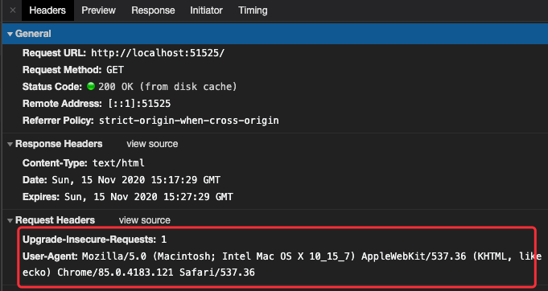

4. 如果你在第 2 个步骤不是关闭当前 tab 页面，而是按 F5（Command + R） 刷新页面，请求 html 资源的请求头自动携带了 `max-age: 0`， 会先跟服务器通信验证，由于不存在协商缓存头。而其他资源 css、图片资源仍然从 memory cache 中获取。
   

   

   如果你按 Crtl + F5 (或 Command + Shift + R)刷新的话，则所有的资源都会添加 `Cache-Control: no-cache` 请求头，因为没有设置协商缓存，因此所有资源都重新从源服务器获取。

   

**完整测试例子**：[example/cache/http/demo01](https://github.com/Jecyu/Web-Performance-Optimization/tree/master/examples/cache/http/demo01/server.js)

现在我们给 Expires 一个特写：

```bash
Expires: Fri, 13 Nov 2020 02:25:55 GMT
```

`Expires` 其实是一个时间戳，这里只不过是格式化的显示。在我们再次向服务器请求相同的资源时，浏览器就会先对比本地时间和 `Expires` 的时间戳，如果本地时间小于 `Expires` 设定的过期时间，那么就直接去缓存中取这个资源。

由于时间戳是服务器来定义的，而本地时间的取值却来自客户端，因此 `Expires` 的工作机制对客户端时间与服务器时间之间的一致性提出了极高的要求。如果服务器与客户端存在误差（时差、用户修改），将会导致意外的结果，那么 `Expires` 将无法达到我们的预期。

### Cache-Control

Expires 允许我们通过**绝对的时间戳**来控制缓存的过期时间，这个设置不准确，因此 HTTP 1.1 新增了 `Cache-Control` 字段来解决 Expires 的问题。

在 `Cache-Control` 中的 `max-age` 字段允许我们设定**相对的时间长度**来达到同样的目的。

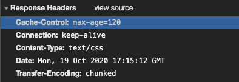

这里仍然使用 Expire 里提到的例子，主要证明 Cache-Control 的优先级更高：

1. 不设置设置服务器强制缓存头的情况下，首次访问网站首页，Network 表格图如下：（注意：对于同一页面同时请求重复的资源，浏览器不会再发起该请求）
   

2. 服务器开启 `Cache-Control` 缓存设置，进入页面后，关闭 tag 页面，重新打开，可以看到资源从 disk cache 获取。
   

3. 前面的行为跟单独设置 `Expire` 是一致的，现在给 `Expire` 设置一个较短的过期时间 10 秒。
   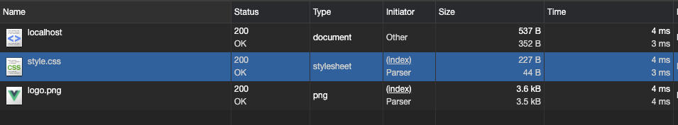

4. 然后同时开启 `Cache-Control` 的 `max-age`（设置稍长点的时间段比如 2min），经过 10 秒后，关闭 tag 页面，重新打开，还是可以看到资源从 disk cache 获取，证明 Cache-Control 的优先级更高。
   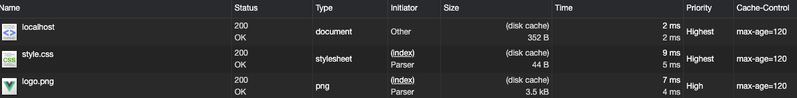

**完整测试例子**：[examples/cache/http/demo02](https://github.com/Jecyu/Web-Performance-Optimization/tree/master/examples/http/demo02/server.js)

我们给 Cache-Control 一个特写：

```bash
Cache-Control: max-age=120
```

在 Cache-Control 中，我们通过 `max-age` 来控制资源的有效期。`max-age` 不是一个时间戳，而是一个`时间段`。`max-age=120` 意味着该资源在 120 秒以内都是有效的，完美地规避了时间戳带来的潜在问题。

<u>Cache-Control 相对于 expires 更加准确，它的优先级也更高。当 Cache-Control 与 expires 同时出现时，我们以 Cache-Control 为准。</u>

Cache-Control 除了 max-age，还有以下用法：

```sh
Cache-Control: max-age=120, s-maxage=31536000
```

Web 标准中规定 max-age 的值最大不超过一年，所以设成 max-age=31536000。对于过期的内容，缓存区会将一段时间没有使用的文件删除掉。

`s-maxage` 优先级高于 max-age，两者同时出现时，优先考虑 s-maxage。如果 s-maxage 未过期，则向**代理服务器**请求其缓存内容。

`s-maxage` 仅在**代理服务器**中生效，并只对 `public` 缓存有效，客户端我们只考虑 max-age。


#### public 与 private

`public` 与 `private` 是针对资源**是否能够被代理服务器缓存**而存在的一组对立概念。

如果我们为资源设置了 public，那么它既可以被浏览器缓存，也可以被代理服务器缓存；如果我们设置了 private，则该资源只能被浏览器缓存。**private 为默认值**。

大多数情况下，“public”不是必须的，因为明确的缓存信息（例如“max-age”）已表示响应是可以缓存的，这样即使只设置 s-maxage，CDN 也可以缓存这个资源。

#### must-revalidate

如果你配置了 max-age 信息，当缓存资源仍然新鲜（小于 max-age）时使用缓存，否则需要对资源进行验证。所以 must-revalidate 可以和 max-age 组合使用 `Cache-Control: must-revalidate, max-age=60`

对于验证资源是否还有效，还需要设置协商缓存来辅助。

#### no-store 和 no-cache

`no-store` 直接禁止浏览器以及所有中间缓存存储任何版本的返回响应。例如，包含个人隐私数据或银行数据的响应。每次用户请求该资产时，都会向服务器发送请求，并下载完整的响应。

`no-cache` 表示必须先与服务器确认返回的响应是否发生了变化，然后才能使用该响应来满足后续同一网址的请求。因此，<u>如果存在合适的验证令牌（ETag），no-cache 会发起往返通信来验证缓存的响应，但如果资源未发生变化，则可避免下载。</u>

这里使用 Expire 里提到的例子，只是服务端配置不同，来说明 Cache-Control 的一些特性：

```js
// server.js
app.use(
  express.static("public", {
    etag: false, // 关闭 Etag 协商缓存
    lastModified: false, // 关闭 lastModifed 协商缓存
    cacheControl: false, // 关闭默认设置，在下面默认处理
    setHeaders: (res, path) => {
      res.setHeader("Cache-Control", "no-cahce, max-age=60");
      // res.setHeader("Cache-Control", "no-store, max-age=60");
    },
  })
);
```

1. 设置响应头 no-cache 和 max-age 的情况下，初次访问页面时：
   

2. 关闭页面或另打开一个 tag 页面，再次访问，no-cache 会获得如下的判断：
   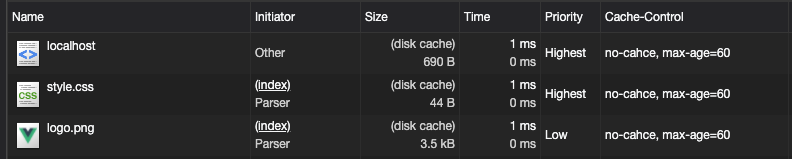

3. 现在设置 no-store 和 max-age ，并重复步骤 1 和步骤 2，发现再次请求相同的资源，无论 max-age 是否过期，都会重新请求服务器。

**完整测试例子**：[examples/cache/http/demo03](https://github.com/Jecyu/Web-Performance-Optimization/tree/master/examples/cache/http/demo03/server.js)

<!-- - vary 响应头，用于服务器缓存处理。这个生产环境有看到。
 -->
 <!-- 一般是 Get 请求被缓存 -->
<!-- 如何识别资源是否来自缓存
- 通过传输总大小 transferred 以及 size 列
可能触发 memory cache 的动作
  - prefecth
  - 一个页面中如果有两个相同的请求 (例如两个 src 相同的 ``，两个 href 相同的 `<link>`)都实际只会被请求最多一次，避免浪费。 -->

### 其他补充：Pragma 与 Vary
#### Pragma 头

`Pragma` 是 HTTP/1.0 标准中定义的一个 header 属性，请求中包含 `Pragma` 的效果跟在头信息中定义 `Cache-Control: no-cache` 相同，但是 HTTP 的响应头没有明确定义这个属性，所以它不能拿来完全替代 HTTP/1.1 中定义的 `Cache-control` 头。通常定义 `Pragma` 以向后兼容基于 HTTP/1.0 的客户端。
#### Vary 响应

HTTP 响应头决定了对于后续的请求头，如何判断是请求一个新的资源还是使用缓存的文件。

当缓存服务器收到一个请求，只有当前的请求和原始（缓存）的请求头跟缓存的响应头里的 `Vary` 都匹配，才能使用缓存的响应。


## 协商缓存

协商缓存依赖于服务端与浏览端之间的通信。

<!-- 绘制协商缓存/强缓存的时序 UML 图 -->

协商缓存机制下，<u>浏览器需要向服务器去询问缓存的相关信息，</u>进而判断是`重新发起请求下载完整的响应`，还是从`本地获取缓存的资源`。

如果服务端提示缓存资源未改动（Not Modified），请求会被浏览器缓存处理，**这种情况下网络请求对应的状态码是 304。**，而「200 OK（from cache）」是浏览器没有跟服务器确认，直接用了浏览器缓存。

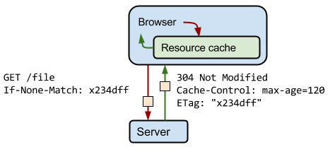

可以看到上图中的 `ETag` 的值是服务器生成并返回的随机令牌，通常是文件内容的哈希值或某个其他指纹。客户端不需要了解指纹是如何生成的，只需在下一次请求时将其 `If-None-Match` 的值，发送给服务器进行验证。

协商缓存有两对值，分别是

- `Etag/If-Modified-Since`
- `Last-Modified/If-Modified-Since`
### Last-Modified/If-Modified-Since

`Last-Modified` 是一个时间戳，如果我们启用了协商缓存，它会在首次请求时随着 Response Headers 返回：

```bash
Last-Modified: Fri, 27 Oct 2017 06:35:57 GMT
```

随后我们每次请求时，会带上一个叫 `If-Modified-Since` 的时间戳字段，它的值正是上一次 response 返回给它的 `Last-modified` 值：

```bash
If-Modified-Since: Fri, 27 Oct 2017 06:35:57 GMT
```

服务器接收到这个时间戳后，会比对该时间戳和资源在服务器上的最后修改时间是否一致，并在 Response Headers 中添加新的 `Last-Modified` 值；否则，Response Headers 不会再添加 `Last-Modified` 字段。

**注意**：如果响应头中有 `Last-modified` 而没有 `Expire` 或 `Cache-Control` 时，浏览器会有自己的算法来推算出一个时间缓存该文件多久，不同浏览器得出的时间不一样。

还是前面的例子，index.html 和 style.css、logo 图片。为了说明 Last—Modified 的操作，这里的 server.js 使用原生的 node 实现：

```js
// ...
const app = http.createServer(function(request, response) {
  const ifModifiedSince = request.headers["if-modified-since"];

  fs.exists(filePath, function(exists) {
    if (exists) {
      fs.readFile(filePath, function(error, content) {
        if (error) {
          response.writeHead(500);
          response.end();
        } else {
          const raw = fs.createReadStream(filePath);
          // 获取实际文件的修改时间，进行对比
          const stat = fs.statSync(filePath);
          const lastModified = stat.mtime.toUTCString();
          // 写响应头 Last-Modified
          response.setHeader("Last-Modified", lastModified);
          // 进行时间对比
          if (ifModifiedSince && lastModified === ifModifiedSince) {
            response.writeHead(304, "Not Modified");
            response.end();
          } else {
            // 正常写文件
            response.writeHead(200, {
              "Content-Type": mime.getType(extname),
            });
            raw.pipe(response);
          }
        }
      });
    } else {
      response.writeHead(404);
      response.end();
    }
  });
});
// ...
```

1. 服务器只设置协商缓存 Last-Modified。访问页面后，进行 F5 刷新页面访问。
   

   可以看到 index.html 响应代码为 304，而其样式和图片资源则直接通过 memory cache 中获取。

   查看 Node 日志，只看到 index 资源的请求发给服务器：

   - request url: /

   为什么是这样子的呢？这是因为 `<link rel="stylesheet" href="style.css" />` 和`` 的请求路径均没有变化，Chrome 处理都不会发出请求。这里大家可以想想，假如只有样式变化了，那么不就更新不了文件吗？这个问题后面解答。）

2. 然后更改 index.html 文件部分内容，重新访问页面，可以发现 index.html 响应状态码为 200，这是因为文件最后修改的时间改变了，协商缓存经过验证文件更新了，因此从服务器中获取。
   

**完整测试例子**：[cache/http/demo04](https://github.com/Jecyu/Web-Performance-Optimization/tree/master/examples/cache/http/demo04/server.js)

### Etag/If-Modified-Since

使用 `Last-Modified` 会存在一些弊端，这其中最常见的就有两个场景：

- 当我们编辑了文件，但文件的内容没有变。<u>服务端并不清楚我们是否真正改变了文件，它仍然通过最后编辑时间进行判断。</u>因此在这个资源在再次被请求时，会被当作新资源，进而引发一次完整的响应——不该重新请求的时候，也会重新请求。
- 当我们修改文件的速度过快时（比如花了 100ms 完成了改动），由于 `If-Modified-Since` 只能检查到以`秒`为最小计量单位的时间差，所以它是感知不到这个改动的——该重新请求的时候，反而没有重新请求了。

这两个场景其实指向了同一个 bug —— <u>服务器并没有正确感知文件的变化。</u>为了解决这样的问题，`Etag` 作为 `Last-Modified` 的补充出现了。

`Etag` 是由服务器为每个资源生产的唯一的`标识字符串`，这个标识字符串是基于文件内容编码的，只要文件内容不同，它们对应的 Etag 就是不同的，反之亦然。因此 **Etag 能够精准地感知文件的变化**。

```bash
ETag: W/"2237-1566200378000"
```

那么下一次请求，请求头里就会带上一个值相同的、名为 `if-None-Match` 的值供服务端比对：

```bash
If-None-Match: W/"2237-1566200378000"
```


<u>Etag 的生成过程需要服务器额外开销，</u>会影响服务端的性能，这是它的弊端。<!--如何设置呢？因此启用 Etag 需要我们审时度势。Etag 并不能替代 Last-Modified，它只能作为 Last-Modified 的补充和强化存在。-->Etag 在感知文件变化上比 Last-Modified 更加准确，优先级也更高。**当 Etag 和 Last-Modified 同时存在时，以 Etag 为准**。 

以前面的例子说明，服务端配置如下：

```js
const express = require("express");
const app = express();
// 打印请求地址
app.use(function(req, res, next) {
  console.log(`request url: ${req.url}`);
  next();
});

app.use(
  express.static("public", {
    etag: true,
    lastModified: false,
    cacheControl: false,
  })
);

const listener = app.listen(process.env.PORT, function() {
  console.log("Serving files on http://localhost:" + listener.address().port);
});
```

1. ETag 的测试效果跟 Last-Modified 相似，除了一点，就是无论是 index.html、还是样式和图片资源，再次刷新后都响应了 304。
   

   查看 Node 日志，可以看到三个资源的请求都发给服务器了：

   - request url: /
   - request url: /style.css
   - request url: /logo.png
     chrome 对 ETag 和 Last—Modified 的处理有区别，为了保证设置了协商缓存并起作用的情况下，每个资源向服务器进行验证。因此建议一定要设置 ETag。

2. 这个时候对 css 进行更改，并刷新页面，会获取到最新的资源。
   

**完整测试例子**：[cache/http/demo05](https://github.com/Jecyu/Web-Performance-Optimization/tree/master/examples/cache/http/demo05/server.js)

## 如何废弃和更新缓存的资源

协商缓存可以让浏览器先跟服务器验证，强缓存的作用是为了让浏览器不发送资源请求。如果都不让浏览器发资源请求了，这缓存怎么更新呢？


如上图，index.html 整个文件都没有更改，但是它引用的 a.css 样式文件更新了，如何让浏览器获取最新的样式资源呢？

一种方案是，我们可以通过**更新页面中引用的资源路径**，让浏览器主动放弃缓存，加载新资源。类似这样，每次更改版本号：


下次上线，把链接地址改成新的版本，就更新资源了。但是这样问题解决了么？


页面引用了 3 个 css，而某次上线只改了其中的 a.css，如果所有链接都更新版本，就会导致 b.css，c.css 也失效。

因此，要解决这个问题，**必须让 url 的修改与文件内容关联，摘要信息与文件内容一一对应**，就需要有一种可以精确到单个文件粒度的缓存控制依据。

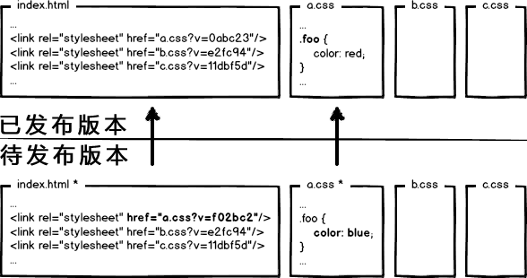

此时，再用文件修改，就只更新那个文件对应的 url 即可。而现代企业，为了进一步提升网址性能，会把静态资源和动态网页分集群部署，静态资源会被部署到 CDN 解读上，网页上引用的资源也会变成对应的部署路径。


这次发布，**同时改了页面结构和样式，也更新了静态资源对应的 url 地址**，现在要发布代码上线，我们是先上线页面，还是先上线静态资源？

原版本：

- index.html
- a.css?v=1234

1. **先部署页面，再部署资源**：在二者部署的时间间隔内，如果有用户访问页面，就会在新的页面结构中加载旧的资源，并且把这个旧版本的资源当做新版本缓存起来，其结果就是：用户访问到了一个样式错乱的页面，除非手动刷新，否则在资源缓存过期之前，页面会一直执行错误。

   - 新的页面：index.html
   - 加载旧的资源：a.css?v=5678（因为新的资源还没部署）

2. **先部署资源，再部署页面**：在部署时间间隔之内，有旧版本资源本地缓存的用户访问网站，由于请求的页面是旧版本的，资源引用没有改变，浏览器将直接使用本地缓存，这种情况下页面展现正常；但没有本地缓存或者缓存过期的用户访问网站，就会出现旧版本页面加载新版本资源的情况，导致页面执行错误，但当页面完成部署，这部分用户再次访问页面又会恢复正常了。

   - 加载旧的页面：index.html（因为新的资源还没部署）
   - 加载新的资源：a.css?v=5678

单独部署下，同时更新静态资源与动态资源不会有问题。如果是使用 CDN 先后发布资源和页面，则会存在上面的**覆盖式发布**的问题，用待发布资源 覆盖 已发布资源，就有这种问题。解决它的方案，就是实现**非覆盖式发布**。

- 覆盖式发布（用待发布资源覆盖已发布资源）
- 非覆盖式发布（采用 hash）

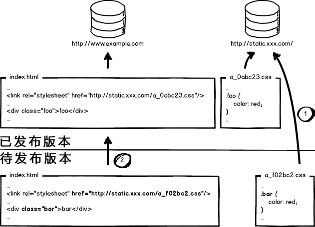

看上图，用文件的摘要信息来对资源文件进行重命名，把摘要信息放到资源文件发布路径中，这样，内容有修改的资源就变成了一个新的文件发布到线上，不会覆盖已有的资源文件。上线过程中，**先全量部署静态资源，再灰度部署页面**，整个问题就比较完美的解决了。

- a_5678.css 新资源
- a_1234.css 旧资源

这种情况下，则不会出现这个问题，旧版本的页面依然请求了旧的资源，新版本的页面请求新的资源。在生产环境下，如何进行 hash 处理，可以看 [基于 webpack 的持久化缓存方案](https://github.com/pigcan/blog/issues/9) 这篇文章、[webpack 官方文档 Caching](https://webpack.js.org/guides/caching/#output-filenames)、以及 Vue CLI 官方文档的设置。

<!--
比如引入的一些第三方文件、打包出来的带有 hash 后缀 css、js 文件。一般来说文件内容改变了，会更新版本号、hash 值，相当于请求另一个文件。（文件名不一样了。）

但是使用查询字符串的话，查询字符串不同，就会重新请求服务器相同的资源名称文件。 -->

## 项目实战：进行资源更新时，为什么一定要手动清除缓存

项目例子：南宁实施监督一张图项目

### 分析现有的缓存策略，进行资源的更新与验证。

#### 先回顾浏览器存读缓存完整流程

首次请求：


再次请求：


#### 整理现有策略

**首次访问时**（记得先禁用 「Disable cache」，避免之前的缓存影响）：

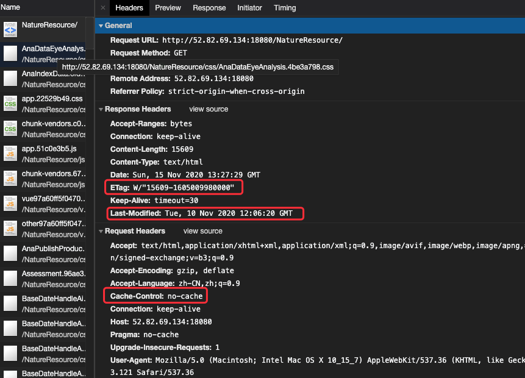

HTTP 请求头：

- `Cache-Control：no-cache`（前端编码设置，意味着每次缓存前都需要进行验证，借助 `Etag` 和 `Last-Modified`）
  - index.html
  - css
  - js
  - 图片
- `"Cache-Control": "no-cache, no-store, must-revalidate"`（前端编码设置）
  - json 文件

HTTP 响应头：

- 协商缓存（所有文件）
  - Last-Mdified
  - Etag

**再次访问时**：

- 新建 tag，打开页面访问，几乎所有资源都是从 disk cache 获取，除了 json 文件被设置了不使用缓存（请求头设置）。
  
- 直接刷新访问，请求头携带 `Cache-Control: max-age=0`，跳过强缓存，使用协商缓存。
  
  首页 index.html 响应为 304，证明协商缓存起作用。

**更新资源，验证现有策略**：分别更新不同类型的静态文件，包括 html、css、js 以及图片、字体文件等。

- 验证正常的行为，资源更新时，重新访问页面还是旧的资源。
- 验证不正常的行为，资源刷新不会更新。

1. 更新 index.html 内容，在 head 标签，添加样式设置

```css
html body {
  /* 可以开启或关闭进行反复测试 */
  padding: 2rem; 
}
```
关闭旧的页面：
- 更新资源，重新访问该页面，还是加载旧的 index.html。
  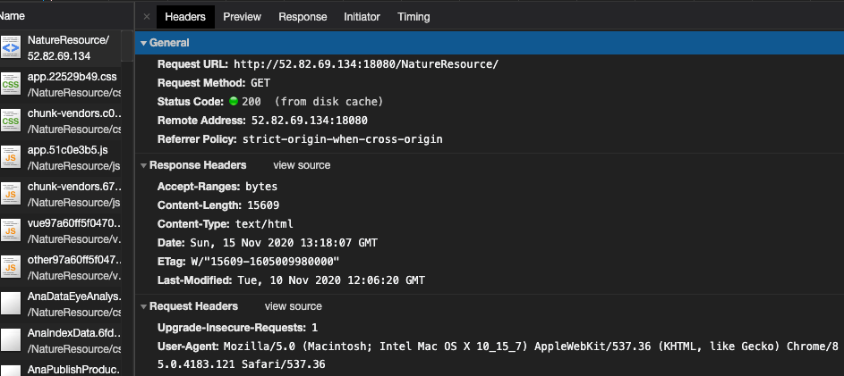
- 然后进行刷新（Cache-Control: max-age=0），则会加载最新的资源。

2. 更新 js、css 文件

给 task-manager.vue 组件，添加边框样式：
```html
<!-- ... -->
<style lang="scss" scoped>
.manager-container {
  border: 1rem orange solid;
  /* padding: 1rem;
  width: 100%;
  height: 100%; */
}
</style>
```

重新打包，主要关注打包后的 hash 文件名是否变化了，index.html 的外链是否也跟着变了。

- Before ：
  - task-manager.aeb1966b.js.gz
  - task-manager.aeb1966b.js
  - `<link href=js/task-manager.aeb1966b.js rel=prefetch>`
- After:  
  - task-manager.c2553364.js
  - task-manager.c2553364.js.gz
  - `<link href=js/task-manager.c2553364.js rel=prefetch>`

部署到服务器上，再次访问当前页面，出现与更新 index.html 的效果。

<!-- 3. 更新 json、图片 -->

<!--
设置了 max-age，不同版本的问题，除了 CDN 先后顺序外，还有就是同样的缓存时间，先请求的资源与后请求的请求不匹配问题。 -->

### 缓存失效复现解决排查

#### 1. 为什么首次设置的响应头为 no-cache，在 index.html 更新后，再次访问的页面却是旧的？


**猜想**：no-cache 在之后的资源请求里，都没有发起验证。

可以看到请求头没有携带协商内容需要的信息。因为首次访问时，请求头携带了 no-cache 设置有作用，再次请求时就直接从浏览器缓存中获取，不需要访问服务端，请求头也没有携带。

**验证猜想：**经过测试，给前端请求头设置 "Cache-control: no-cache" 是有缺陷的，再次请求时，浏览器并不会去跟服务器验证，但会从缓存中获取。

<!-- TODO 明天设置？给 Tomcat 设置响应头，cache-control: no-cache即可正常运行 -->

**解决方案**：不要在请求头设置`Cache-control: no-cache`，应该由服务端在响应头中进行设置。

<!-- 为什么缓存不会失效？测试人员什么时候才需要手动清除缓存呢？ -->
<!-- 暂时就测试了这个，其他的后续测试后再进行补充。 -->

#### 2. 更新 css 文件、js 等外链文件

<!-- #### 3. 更新 json
#### 4. 更新图片 -->

因为 index.html 文件被存储了，里面的外链请求的都是旧的文件。因此即使更新了 css、js 资源，而 index.html 请求的还是旧的资源。

只需要解决 index.html 这个问题，就可以解决。

除了 html、js 等，其他的 json、图片等资源待测试，后续补充到文章里。更多的项目案例问题，大家有遇到的话可以一起研究、探讨。

<!-- 发现打包生产环境的代码，没有自动添加 -->

<!-- tomorror 有时间再补充，先继续往下弄。 -->

<!-- 查看静态资源文件的打包策略： vuecli 打包策略（hash、webpack）
初步猜想：为什么一定要清除缓存，有可能是以下的情况：

- 设置了协商缓存，但是 index.html 文档内容没变化。
- 同时设置了强缓存，也设置了协商缓存，但是强缓存时间没过期，这样在资源文件没做 hash 处理的情况下，（比如 public 文件夹，只是做简单的复制输出到 static 而已）就会出现这种问题。
- 系统有用到 service cache，没有处理好更新策略，浏览器优先命中它。
- webpack 打包本身的设置 hash 问题，hash、contenthash、chunkhash。（webpack 4x）

`vue inspect --vue2webpack.test.js` -->
### 服务器如何进行配置以符合最佳实践原则
#### 最佳实践

在我们面对一个具体的缓存需求时，到底该怎么决策呢？如何运用好强制缓存和协商缓存武器？

让我们现在一起解读一下这张流程图（来源：Chrome 官网）


当我们的资源内容不可复用时，直接为 `Cache-Control` 设置 `no-store`，拒绝一切形式的缓存；否则考虑是否每次都需要向服务器进行缓存有效确认，如果需要，那么设 `Cache-Control` 的值为 `no-cache`；否则考虑该资源是否可以被`代理服务器`缓存，根据其结果决定为 `private` 还是 `public`；然后考虑资源的过期时间，设置对应的 `max-age` 和 `s-maxage` 值；最后，配置协商缓存需要用到 `Etag`、`Last-Modified` 等参数。

给一个资源设置强缓存和协商缓存后，再次请求该资源时，会先判断 max-age 是否过期，如果不过期就从缓存拿，过期后就直接向服务器请求。这个时候会携带 Last-Modified 和 Etag 给服务器对比，如果文件改变了就重新发送，否则就返回 304，让浏览器继续从本地缓存中取。

1. 对于不常变化的资源，设置一年的 max-age 过期时间。

`Cache-Control: max-age=31536000`，比如请求在线提供的类库 (如 jquery-3.3.1.min.js, lodash.min.js 等) 均采用这个模式。如果配置中还增加 public 的话，CDN 也可以缓存起来，效果拔群。

2. 对于经常变化的资源，可以设置 no-cache 进行验证：

`Cache-Control: no-cache`

这里的资源不单单指静态资源，也可能是网页资源，例如博客文章。这类资源的特点是：URL 不能变化，但内容可以(且经常)变化。我们可以设置 `Cache-Control: no-cache` 响应头来迫使浏览器每次请求都必须找服务器验证资源是否有效。

```js
app.use(
  express.static("public", {
    etag: true,
    lastModified: true,
    cacheControl: true,
    setHeaders: (res, path) => {
      const hashRegExp = new RegExp("\\.[0-9a-f]{8}\\.");
      if (path.endsWith(".html")) {
        res.setHeader("Cache-Control", "no-cache");
      } else if (hashRegExp.test(path)) {
        res.setHeader("Cache-Control", "max-age=10");
      }
    },
  })
);
```

既然提到了验证，就必须 ETag 或者 Last-Modified 出场。这些字段都会由专门处理静态资源的常用类库(例如 koa-static、Express)自动添加，无需开发者过多关心。

3. 所有的资源配置，都添加 hash 根据内容去处理。

#### 以 Tomcat 9.0 设置为例：

Tomcat 9.0 默认对所有资源都配置了协商缓存。

我们可以通过以下配置，对 css、js、image 资源设置强缓存，过期时间为5分钟：

而 index.html 还是走的协商缓存，这样的话，只要前端资源打包更新后，用户访问 index.html 都是最新的，如果引用的资源有变化，则会引用最新的资源比如 js，不受缓存影响。

如果没有变化，则会重用之前的缓存。

```xml
<filter>
 <filter-name>ExpiresFilter</filter-name>
 <filter-class>org.apache.catalina.filters.ExpiresFilter</filter-class>
 <init-param>
    <param-name>ExpiresByType image</param-name>
    <param-value>access plus 5 minutes</param-value>
 </init-param>
 <!-- <init-param>
    <param-name>ExpiresByType html</param-name>
    <param-value>access plus 0 minutes</param-value>
 </init-param> -->
 <init-param>
    <param-name>ExpiresByType text/css</param-name>
    <param-value>access plus 5 minutes</param-value>
 </init-param>
 <init-param>
    <param-name>ExpiresByType application/javascript</param-name>
    <param-value>access plus 5 minutes</param-value>
 </init-param>
</filter>


  <!-- ==================== Built In Filter Mappings ====================== -->

<filter-mapping>
 <filter-name>ExpiresFilter</filter-name>
 <url-pattern>/*</url-pattern>
 <dispatcher>REQUEST</dispatcher>
</filter-mapping>
```


再次访问，从 dist cache 中获取：

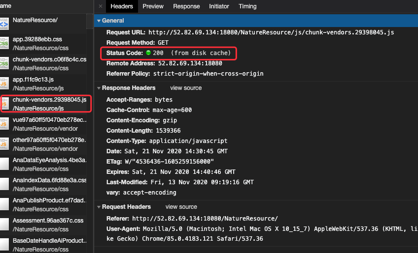
<!-- **完整测试例子**：cache/http/demo04 -->

<!-- #### 实施方案

按照最佳实践即可，这部分后续补充。也为了更好的展示与讨论。

以 Tomcat 为例子：

（如何处理呢，一是实施手动设置文件 ? 版本，是否有改动文件后，自动工具出 hash。三是，使用服务端设置该文件路径一律 no-store。）关闭强缓存，设置 no-cache + 条件协商内容。 -->

<!-- - [vue 项目部署的最佳实践](https://juejin.im/post/6844904149633466376)  -->

<!-- 回答前面的问题，总关于浏览器什么时候写缓存 -->
<!-- Cache-Control: public, max-age=0 与 Cache-Control: no-cache 的区别 -->

<!-- 不需要每次都验证的话

Cache-Control 需要做验证，根据 Etag

问题：测试 Chrome 85 在满足协商缓存条件下，为什么会出现 再次请求资源时，index.html 的响应是 304，而它引用的 css 文件则是 200 （from memory cache）m 呢？

这是因为浏览器 Chrome 根据情况做的优化，**设置了协商缓存响应头后（比如 Last-Modified）**，这个时候就会根据情况会把 css 文件放进 memory cache，第二次就会从缓存中获取，但状态码还是 200。为什么没有跟服务器确认？只要 index.html 引用的 css 文件路径不变，就不会重新请求服务器？即使设置了协商缓存。？

这是因为 Last-Modified 有时候不管用，需要把协商缓存响应头设置为 Etag 才起作用。因为 Last-Modified 会受到客户端日期的影响。(可以用 demo02 只开启 ETag 进行测试)。为什么呢，正常来说只要发起 Last-Modified 头，后续肯定会跟服务器验证的才对。但是这个值在 Chrome 85 上失效了。而开启 ETag 的话，则正常操作，进行检查。Last-Modified 就能不用则不用，使用 ETag/If-None-Mathcs 来处理即可。

设置了强缓存的，会直接从 from memory cache 获取，但是协商缓存 Last-Modified 就不应该直接 from momery，应该先进行询问。

memory cache 缓存会在页面关闭后释放掉；（status=200）
disk cache 不会随着页面关闭而释放 （status=200）。

Last-Modified & If-Modified-Since
如果资源更新的速度是秒以下单位，那么该缓存是不能被使用的，因为它的时间单位最低是秒。
如果文件是通过服务器动态生成的，那么该方法的更新时间永远是生成的时间，尽管文件可能没有变化，所以起不到缓存的作用。 -->

<!-- ### 总结

强缓存 + 协商缓存 + max-age

一些常见的结合 -->

<!-- 是否可以只设置一种 -->

<!-- #### 单纯设置协商缓存

是 Etag/If-None-Match：

If-Modified-Since: Thu, 15 Oct 2020 06:24:07 GMT
If-None-Match: W/"bac-1752aee16d1"

只要改变文件内容，Last-Modified 和 Etag 都会进行改变。换言之，只要你改变 index.html 的内容，浏览器就会重新请求该文件。

包括 index.html 里面引用的文件，比如 xxx.hash.js、xxx.hash.css，因为 index.html 改变了。
 -->

<!-- #### 结合两者 -->

<!-- 现在的浏览器 tomcat 默认开启协商缓存。为什么只有 html 文件才会返回 304？标识。而 js、css 则是 200 from memory cache  -->

<!-- 可以尝试更新下内容，排查下 tomcat 的处理。（重新打包，这样需要分包下加速打包的时间才行。）

是否使用了 HTML 的 meta 标签来指定缓存行为
使用查询字符串来避免缓存。因为缓存有一些已知的问题，使用查询字符串会导致有些代理服务器不缓存资源。 -->
<!--
没返回资源内容，但是响应头下载也需要需要，因此 timing 的 content-download 有一定的占用时间。 -->

<!-- #### HTTP 头信息失效的情况 -->

<!-- 不要缓存 HTML，避免缓存后用户无法及时获取到更新内容。使用 Cache-Control 和 ETag 来控制 HTML 中所使用的静态资源的缓存。一般是将 Cache-Control 的 max-age 设成一个比较大的值，然后用 ETag 进行验证。使用签名或者版本来区分静态资源。这样静态资源会生成不同的资源访问链接，不会产生修改之后无法感知的情况。

进行打包，分包进行验证。后续的是其他的缓存了。

作者：歪马
链接：https://juejin.im/post/6844904052820557837
来源：掘金
著作权归作者所有。商业转载请联系作者获得授权，非商业转载请注明出处。

用户的操作，手动缓存与自动缓存。

普通刷新与强制刷新（Ctrl + F5）。

强缓存，

当 f5 刷新网页时，跳过强缓存（设置 Cache-Control: no-cache 会忽略），但是会检查协商缓存；（这样服务器必须设置协商缓存 Etag，并 html 资源有修改。因此，不要给 html 设置 协商缓存，只需要 Cache-Control: no-cache；避免协商缓存误导 html 文件缓存，但正常来说只要 html 改变了就会重新生成 etag 识别。）

经过验证运维即是更新 html 文件即会自动更新。

针对首页，不要设置协商缓存，设置 html 即可，这样就算不刷新。

设置强缓存 Cache-Control： no cache这样每次都会去页面进行，当前的设置协商缓存也是每次都去服务器请求。

只要设置协商缓存，hash 没改变，资源改变的情况下也会重新进行请求的。

因此不会说出现资源没更新的情况。除非资源没改变，或者引用的资源 hash 值没改变。hash 没改变。

如果什么都不设置，浏览器是不会缓存的。 -->

<!--

```bash
Cache-control: public, max-age=31536000
Last-Modified: Wed, 04 Mar 2020 18:31:22 GMT
ETag: W/"2237-1566200378000"
``` -->

<!-- ## Memory Cache

Memory Cache，是指存在内存中的缓存。从优先级上来说，它是浏览器最先尝试命中的一种缓存。从效率上来说，它是响应速度最快的一种缓存。

内存缓存是快的，也是“短命”的。它和`渲染`进程“生死相依”，当进程结束后，也就是 tab 关闭以后，内存里的数据也将不复存在。

那么哪些文件会被放入内存呢？

事实上，这个划分规则，一直以来没有定论。内存是有限的，很多时候需要先考虑即时呈现的内存余量，再根据具体的情况决定分配给内存和磁盘的资源量的比重——资源存放的位置具有一定的随机性。


我们可以总结这样的规律：资源存不存内存，`浏览器`秉承的是“节约原则”。我们发现，Base
64 格式的图片，几乎永远可以被塞进 memory cache，这可以视作浏览器节省渲染开销的“自保行为”；此外，体积不大的 JS、CSS 文件，也有较大地被写入内存的几率——相比之下，较大的 JS、CSS 文件就没有这个待遇了，内存资源是有限的，它们往往被直接甩进磁盘。

<!-- 缓存需要合理配置，因为并不是所有资源都是永久不变的：重要的是对一个资源的缓存应截止到其下一次改变（即不能缓存过期的资源） -->

<!-- 应用：arcgis 发布的服务资源，设置了 no-caches -->

<!-- ## 问题解答

-
- 平时清除缓存，到底清除了哪些东西？包括 DNS 吗？为什么服务器部署资源的 hash 值更改了，刷新前端页面还是读取旧的资源，而不是最新服务器资源呢？为什么一定要手动清除缓存，才能使改变生效？ -->

## 总结

本文从浏览器缓存的位置（memory cache、disk cache）以及浏览器策略（强缓存、协商缓存）两个方面来说明浏览器的缓存策略，希望看到这里你能够知道 web 应用静态资源什么时候被写入缓存、什么时候进行读取、又如何进行设置失效更新。

对于静态资源的优化方案来说：

- 配置超长时间的本地缓存——节省带宽，提高性能。
- 采用内容摘要作为缓存更新依据 —— 精确的缓存控制
- 静态资源 CDN 部署 —— 优化网络请求
- 更新资源发布路径实现非覆盖式发布 —— 平滑升级

<!-- 静态资源，动态资源 tomcat 是如何处理的？比如接口 json 数据，这些肯定不能根据浏览器设置缓存 -->

## 参考资料

- [Web 性能优化资源合集（持续更新）](../reference/README.md#网络)
