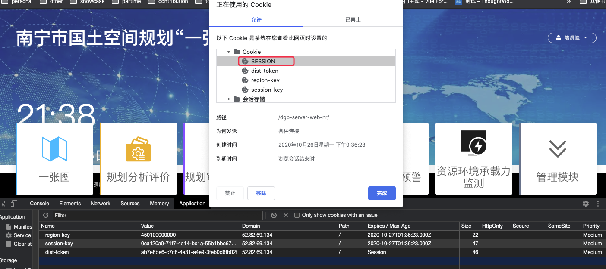

# 浏览器本地存储，给你的网页加个马达

头脑风暴

- 在单页面应用，切换不同的路由时。或多页面应用切换路由时，对于过大的资源可以在首次访问临时缓存下，其他页面就可以直接使用了。
- 资源除了打开关闭后，另外切换页面的使用，也可以存储起来，只要是持久化的作用。
- 浏览器设置的内存跟使用 webStorage、cookie、indexDB
  的区别在哪里？
- Vue 应用中，哪些东西应该存到本地存储技术上。
- 跟 chrome 官方文档的区别，实战场景结合？
- 抓重点说，剩下才是其他的处理。
- 比如实现单点登录把东西放到持久化的缓存。

## 前言

除了浏览器的 HTTP 缓存外，利用浏览器的本地存储技术（比如 LocalStorage、IndexDB）也能大大提升 web 应用的性能。通过把数据存储在浏览器中，用户不必每次都想向服务器请求获取同一个消息。在你离线时，使用本地存储的数据而不是向远端服务器上请求数据就显得非常有用，甚至在线用户也可以从中获益。

<!-- 通过对静态资源如 HTML、CSS、JavaScript、图形等和数据（用户数据、新闻文章等）进行缓存，让它向 Native 应用更进一步。 -->

**目标读者**：对浏览器提供本地存储的技术没有一个全局了解<!--（广度）-->，不知道在 Web 应用哪里使用它们去提升性能，也不清楚如何提升这些 API 的读取性能<!--（jsperf）（深度，说清楚细节）-->。

<!-- 实用方面
  - 主要是针对持久化，介绍是什么，如何 CRUD，用在哪？
  - 统一介绍特性，再分别说明。重点讲
除了实用性能优化方面，如何提升性能 -->

<!-- IndexDB
- 是什么（配合 devtool）
- 如何 CRUD
- 可以用在 Web 应用哪里提升性能，如何跟服务端保持同步更新
- 如何提升这些 API 的读取性能 -->
<!--  -->
<!-- 既有广度，又有深度。 -->

<!-- 流程是：IndexDB 是什么，如何用，已有的应用场景在哪？目前系统可以使用的地方，比如填报系统，留言状态关闭 -->

<!-- 本地存储需要考虑两个问题：
- 实用问题（存取及时，容易更新，过期策略需要开发者处理）
  - 时效性
  - 维护性
- 安全问题
  - 是否容易被攻击 -->

<!-- localStorage 可以用于反馈管理系统，比如 Disqus，是一个非常流行的反馈管理系统 -->

<!-- 说清楚 IndexDB、Cookie、LocalStorage 的作用与实践的例子。结合南宁的实践。 -->

**文章大纲**：先全局了解存储分类，然后再具体介绍如何使用以及怎样利用它们提升 web 应用的性能。

- 网页存储概览
- Cookie
- Web Storage
  - LocalStorage
  - SessionStorage
- IndexDB
- CacheAPI

**阅读时长**：20 min

**浏览器版本**：Google Chrome 版本 85.0.4183.121（正式版本）（64 位），使用“隐身模式”不会再计算机上留下您访问网站的任何痕迹，包括缓存文件、Cookie、历史记录、下载记录等等，以及不受插件的影响。对于保存的缓存而言，意味着退出隐身模式即自动清除所有缓存。

<!-- 手动清除浏览器，会把 Cookie、持久化的缓存统统清理掉，包括 LocalStorage 的东西 -->

## 网页存储概览

打开浏览器 Chrome 调试工具，进入 Application 面板，可以看到红色框则为浏览器本地存储技术模块。


对于以上的存储模块，可以通过数据模型、持久化、浏览器支持、事务处理、同步/异步等指标进行分类。

### 网站哪些地方可以使用本地存储技术提升体验/性能的

- 只保存重要页面的重要数据（提升性能）
  - 典型的，首页首屏
  - 对业务庞大的站点，这点尤其重要
- 极大提高用户体验的数据
  - 比如表单的状态，可以提交之前保存，当用户刷新页面时可以还原
  - 静态资源，比如 js 和 css
- 一个请求一个 key（一个 cgi 一个 key 值）
  - 避免请求链接加参数的 key （http://request-ajax.cgi[params]），这样必然让 key 值趋于冗余从而撑爆空间。
- pwa 离线应用

那么我应该使用哪些存储技术，如何优化上述的方面呢？

### 存储分类

#### 数据模型

用于存储数据单元的模型可确定在内部组织数据的方式，这会影响存储的易用性、成本和性能以及检索请求。

- **结构化**：在具有预定义字段的表格中存储数据，与典型的基于 SQL 的数据库管理系统一样，非常适用于灵活的动态查询。
- **键/值**：键/值数据储存储区和相关的 NoSQL 数据库让你可以存储和检索唯一键值索引的非结构化的数据。
- **字节流**：这个简单模型以可变长度、不透明的字节字符串形式存储数据，将任意形式的内部组织置于应用层。此模型特别适合文件系统和其他按层次结构组织的数据块。

#### 持久化（Persistence）

网络应用的存储方法，可根据使数据持久化的作用域进行分析：

<!-- 这里的会话指的是 http 的 tcp 通信下 ？-->

- **会话持久化（Session Persistence）**：仅在一个网页会话或浏览器标签处于活动状态时保留此类别的数据。
- **设备持久化（Device Persistence）**：在特定设备中中跨会话和浏览器标签/窗口保留此类别中的数据。
- **全局持久化 （Global Persistence）**：跨会话和设备保留此类别中的数据，它是最可靠的数据持久形式，比如 Google 的云端存储。

#### 浏览器支持

基于项目开发问题选择最合适的 API，并且要考虑到 API 的规范标准化，也就是该 API 的使用寿命、支持是否广泛，生态系统比如第三方库是否丰富。

#### 事务处理

所谓的事务就是一系列的操作必须全部执行，而不能仅执行一部分。例如一个转账工作。

```sql
-- 从 id=1 的账户给 id=2 的账户转账 100 元
-- 第一步：将 id = 1 的 A 账户余额减去 100
UPDATE accounts SET balance = balance - 100 WHERE id = 1;
-- 第二步：将 id=2 的 B 账户余额加上 100
UPDATE accounts SET balance = balance + 100 WHERE id = 2;
```

通常，它对于是否能以原子方式成功手机相关存储操作非常重要。

#### 同步/异步

由于存储或检索请求会阻止当前活动的线程（网页主线程）直到请求已完成，因此，某些存储 API 是同步的。这在网页浏览器中是特别沉重的负担，其中存储请求会与 UI 共享主线程。出于效率和性能的考虑，将异步存储 API 作为首选。

### 一张图表格对比

| API                                                                                     | 数据模型 | 持久化 | 浏览器支持                                        | 事务处理 | 同步/异步 |
| --------------------------------------------------------------------------------------- | -------- | ------ | ------------------------------------------------- | -------- | --------- |
| [File system](https://developer.mozilla.org/en-US/docs/Web/API/FileSystem)              | 字节流   | 设备   | [52%](https://cloud.google.com/storage/?hl=zh-cn) | 不支持   | 异步      |
| [Local Storage](https://developer.mozilla.org/en-US/docs/Web/API/Window/localStorage)   | 键/值    | 设备   | [93%](https://caniuse.com/namevalue-storage)      | 不支持   | 同步      |
| [Session Storage](https://developer.mozilla.org/en-US/docs/Web/API/Window/localStorage) | 键/值    | 会话   | [93%](https://caniuse.com/namevalue-storage)      | 不支持   | 同步      |
| [Cookie](https://developer.mozilla.org/en-US/docs/Web/HTTP/Cookies)                     | 结构化   | 设备   | 100%                                              | 不支持   | 同步      |
| [WebSQL](https://www.w3.org/TR/webdatabase/)                                            | 结构化   | 设备   | [77%](http://caniuse.com/#feat=sql-storage)       | 支持     | 异步      |
| [Cache](https://developer.mozilla.org/en-US/docs/Web/API/CacheStorage)                  | 键/值    | 设备   | [60%](http://caniuse.com/#feat=serviceworkers)    | 不支持   | 异步      |
| [IndexedDB](https://developer.mozilla.org/en-US/docs/Web/API/IndexedDB_API)             | 混合     | 设备   | [83%](http://caniuse.com/#feat=indexeddb)         | 支持     | 异步      |
| [cloud storage](https://cloud.google.com/storage/?hl=zh-cn)                             | 字节流   | 全局   | 100%                                              | 不支持   | 两者皆有  |

<!-- 这里的百分比如何得出来的，后续需要验证。 -->

最好选择在尽可能多的浏览器上受广泛支持的 API，其可提供异步调用模型，以最大程度提高与 UI 的互操作性。

- 对于设备本地键/值存储：使用 Cache API。
- 对于设备本地结构化存储：使用 IndexDB
- 对于全局字节流存储：使用云端存储服务。

实验性功能：

- File system

W3C 舍弃的功能：

- WebSQL
  <!-- 有没有官方规范文档说一下 -->

1. W3C 舍弃 Web SQL database 草案,而且是在 2010 年年底，规范不支持了，浏览器厂商已经支持的就支持了，没有支持的也不打算支持了，比如 IE 和 Firefox。(https://www.w3.org/TR/webdatabase/)
2. 为什么要舍弃？因为 Web SQL database 本质上是一个`关系型数据库`，后端可能熟悉，但是前端就有很多不熟悉了，虽然 SQL 的简单操作不难，但是也得需要学习。
3. SQL 熟悉后，真实操作中还得把你要存储的东西，比如对象，转成 SQL 语句，也挺麻烦的。 -->

如上所述，除去 File System 和 WebSQL，以及云端存储，接下来会详细讲解与前端息息相关的本地存储 API ，Cookie、Web Storage、IndexDB 以及 Cache API。

**对比例子**：https://storage-quota.glitch.me/

## Cookie

打开 Chrome 浏览器，我们可以 Application 面板中展开 Cookie 查看。


Cookie 的本职工作并非本地存储，而是“维持状态”，HTTP 协议是一个无状态协议，服务器接收客户端的请求，返回一个响应，故事到此就结束了，服务器并没有记录关于客户端的任何信息。那么下次请求的时候，如何让服务器知道“我是谁”呢？

在这样的背景下，Cookie 应运而生。

Cookie 说白了就是一个存储在浏览器里的一个小小的文本文件，它附着在 HTTP 请求上，在浏览器和服务器之间“飞来飞去”。它可以携带用户信息，当服务器检查 Cookie 的时候，便可以获取客户端的状态。相当于一种人为的记录 Cookie，解决 HTTP 协议无状态记录的问题。

总的来说，Cookie 主要有三个作用：

- 会话管理
  - 登录、购物车等
- 用户个性化
  - 用户偏好设置、主题等
- 用户跟踪
  - 记录和分析用户行为

### 如何工作

服务器首先通过 `Set-Cookie` HTTP 响应头告诉客户端存储 Cookie 键值对。

```sh
HTTP/2.0 200 OK
Content-Type: text/html
Set-Cookie: yummy_cookie=choco
Set-Cookie: tasty_cookie=strawberry

[page content]
```

后续每一次当网页发起 http 请求时，浏览器都会先检查是否有相应的 cookie，有则自动添加在 request header 中的 cookie 字段中。

```sh
GET /sample_page.html HTTP/2.0
Host: www.example.org
Cookie: yummy_cookie=choco; tasty_cookie=strawberry
```

测试例子：cache/local/cookie/demo01

测试步骤：

1. 查看 Application 无 cookie
2. 初次 login 后，服务端进行 Set-Cookie，302 重定向到首页
   ```sh
   Set-Cookie: name=Jecyu;Expires=Thu, 22 Oct 2020 03:58:48 GMT;HttpOnly;Path=/
   ```
3. 首页发起请求会自动携带 Cookie，供服务端认证。

#### 如何进行读写操作 CRUD

##### 创建

**服务器设置**

不管你是请求一个资源文件（如 html/js/css/图片），还是发送一个 ajax 请求，服务端都会返回 response。而 response header 中有一项 set-cookie，是服务端专门用来设置 cookie 的。

格式：

```sh
# Set-Cookie 消息头是一个字符串，其格式如下（中括号中的部分是可选的）
Set-Cookie: value[; expires=date]
```

示例：

```sh
Set-Cookie: name=Jecyu;Expires=Thu, 22 Oct 2020 04:44:50 GMT;HttpOnly;Path=/
Set-Cookie: job=web development
```

【注意】：一个 Set-Cookie 字段只能设置一个 cookie，当你想要设置多个 cookie，需要添加同样多的 Set-Cookie。服务端可以设置 cookie 的所有选项：expires、domain、path、secure、HttpOnly、SameSite。通过 Set-Cookie 指定的这些可选项只会在浏览器端使用，而不会被发送到服务器。

**客户端设置**

```sh
# document.cookie = 'key=value'
document.cookie = 'username=Jecyu;'
```

【注意】：客户端可以设置 cookie 的下列选项：expires、domain、path、secure（有条件：只在 https 协议的网页中，客户端设置 secure 类型的 cookie 才能成功），但无法设置 HttpOnly 选项。

**测试例子**：cache/local/cookie/demo02


<!--


不限制域，其他网址也可以发送？？ -->

| 字段值类型     | 字段名称                  | 字段描述                                                                                                           |
| -------------- | ------------------------- | ------------------------------------------------------------------------------------------------------------------ |
| string         | name                      | Cookie 的名称                                                                                                      |
| string         | value                     | Cookie 的值                                                                                                        |
| string         | domain                    | The domain of the cookie (e.g. "www.google.com", "example.com").                                                   |
| boolean        | hostOnly                  | True if the cookie is a host-only cookie (i.e. a request's host must exactly match the domain of the cookie).      |
| string         | path                      | The path of the cookie.                                                                                            |
| boolean        | secure                    | True if the cookie is marked as Secure (i.e. its scope is limited to secure channels, typically HTTPS).            |
| boolean        | httpOnly                  | True if the cookie is marked as HttpOnly (i.e. the cookie is inaccessible to client-side scripts).                 |
| SameSiteStatus | sameSite                  | Since Chrome 51.The cookie's same-site status (i.e. whether the cookie is sent with cross-site requests).          |
| double         | (optional) expirationDate | The expiration date of the cookie as the number of seconds since the UNIX epoch. Not provided for session cookies. |

**【Expire/Max-Age】**

如果我们想长时间存放一个 cookie。需要在设置这个 cookie 的时候同时给它设置一个过期的时间。如果不设置，cookie 默认是临时存储的，当浏览器关闭进程的时候自动销毁。

```sh
注意：document.cookie = '名称=值;expires=' + UTC 格式的日期型字符串;
```

一个设置 cookie 时效性的例子：

```js
const expires = new Date();
expires.setMinutes(expires.getMinutes() + 1); // we set the cookie that expires in 1 minute
res.writeHead(302, {
  Location: "/",
  "Set-Cookie": `name=${encodeURIComponent(
    name
  )};Expires=${expires.toUTCString()}`,
});
```

expires 是 http/1.0 协议中的选项，在新的 http/1.1 协议中 expires 已经由 max-age 选项代替。expires 的值是一个时间点（cookie 失效时刻= expires），而 max-age 的值是一个以秒为单位的时间段（cookie 失效时刻= 创建时刻 + max-age）。

另外，max-age 的默认值是 -1 （即有效期为 session）；max-age 有三种可能值：负数、0、正数。

- 负数：有效期 session（即关闭 tab 页面，则过期）
- 0：删除 cookie
- 正数：有效期为创建时刻 + max-age

**【domain】**

domain 指定了 cookie 将要被发送到哪个或哪些域中。默认情况下，domain 会被设置为创建该 cookie 的页面所在的域名，所以当给相同域名发送请求时该 cookie 会被发送至服务器。

浏览器会把 domain 的值与请求的域名做一个尾部比较（即从字符串的尾部开始比较），并将匹配的 cookie 发送至服务器。

`客户端设置`

document.cookie = "username=Jecyu;path=/;domain=qq.com"

如上：“www.qq.com” 与 “sports.qq.com” 公用一个关联的域名 “qq.com”，我们如果想让 “sports.qq.com” 下的 cookie 被 “www.qq.com” 访问，我们就需要用到 “cookie” 的 domain 属性，并且需要把 path 属性设置为 “/”。

<!-- 设置两个域名，这个如何测试呢？没有域名，只有 ip 的情况是如何处理的？domain 就是 ip 名称 -->

**`服务端设置`**

```sh
Set-Cookie: username=Jecyu;path=/;domain=qq.com
```

注意：一定是同域之间的访问，不能把 domain 的值设置成非主域的域名。（客户端 JS 脚本 document.cookie 也不能）


<!-- 补充一个 demo：带有两个以上 iframe 的，客户端如何 CRUD、iframe 页面如何设置等 -->

**【path】**

Cookie 一般都是由于用户访问页面而创建的，可是并不是只有在创建 cookie 的页面才可以访问这个 cookie。

因为安全方面的考虑，默认情况下，只有与创建 cookie 的页面在同一个目录或子目录下的网页才可以访问。

即 path 属性可以为服务器特定文档指定 cookie，这个属性设置的 url 且带有这个前缀的 url 路径都是有效的。

<!-- 测试例子 -->

**`客户端设置`**

最常用的例子就是让 cookie 在根目录下，这样不管是哪个子页面创建的 cookie，所有的页面都可以访问到了。

```sh
document.cookie = "username=Jecyu;path=/"
```

**`服务端设置`**

`Set-Cookie: name=Jecyu;path=/blog`

如上设置：path 选项值会与 /blog，/blogrool 等等相匹配；任何以 /blog 开头的选项都是合法的。需要注意的是，只有在 domain 选项核实完毕之后才会对 path 属性进行比较。path 属性的默认值是发送 Set-Cookie 消息头所对应的 URL 中的 path 部分。

**domain 和 path 总结：**

domain 是域名，path 是路径，两者加起来就构成了 URL，domain 和 path 一起来限制 cookie 能被哪些 URL 访问。

所以 domain 和 path 2 个 选项共同决定了 cookie 何时被浏览器自动添加到请求头部中发送出去（以及能否被客户端脚本获取）。如果没有设置这两个选项，则会使用默认值。 domain 的默认值为设置该 cookie 的网页所在的域名，path 默认值为设置该 cookie 的网页所在的目录。



上图中，名为 SSESSION 的 cookie 只会发送匹配域名并 path 前缀为 /dgp-server-web-nr 的值，其他请求的不会发送，比如 前端配置 mapInit.json。

**【secure】**

通常 cookie 的信息都是使用 HTTP 连接传递数据，这种传递方式很容易被查看，所以 cookie 存储的信息容易被窃取。假如 cookie 中传递的内容比较重要，那么就要求使用加密的数据传输。

secure 选项用来设置 cookie 只在确保安全的请求中才会发送。当请求是 HTTPS 或者其他安全协议时，包含 secure 选项的 cookie 才能被发送至服务器。

```sh
document.cookie = "username=Jecyu; secure"
```

把 cookie 设置为 secure，并不代表保存在本地的 cookie 文件加密，也不代表他人不能看到你机器本地保存的 cookie 信息。机密且敏感的信息不应该在 cookie 中存储或传输，因为 cookie 整个机制原本就不安全。

**注意**：在 http 协议的网页中是无法设置 secure 类型 cookie 的，无论是使用客户端还是服务端方式。

**【HttpOnly】**

这个选项用来设置 cookie 是否能通过 js 去访问。默认情况下，cookie 不会带 httpOnly 选项（即为空），所以默认情况下，客户端是可以通过 js 代码去访问（包括读取、修改、删除等）这个 cookie 的。当 cookie 带有 httpOnly 选项时，客户端则无法通过 js 代码去访问这个 cookie。

在客户端不能通过 js 代码去设置一个 httpOnly 类型的 cookie 的
，这种类型的 cookie 只能通过服务端来设置。

<!-- 【总结】 -->

##### 读取

我们通过 document.cookie 来获取当前网址下的 cookie 的时候，得到的字符串形式的值，它包含了当前网址下所有的 cookie。（为避免跨域脚本 xss）攻击，这个方法只能获取非 httpOnly 类型的 cookie）。它会把所有的 cookie 通过一个分号 + 空格的形式串联恰里，例如`username=Jecyu; job=web development;`

<!-- 以下这些虽然不在性能篇关注，但需要解决，关注到性能的存储。 -->
<!-- 补充一个 demo：带有两个以上 iframe 的，客户端如何 CRUD、iframe 页面如何读取和设置等。sso 单独登录，同一个域并且没有 httpOnly 选项就可以访问。-->

<!-- （这样来说，就不仅仅是获取 httpOnly 的访问。）如何读取，如何访问，性能方面的问题。 -->

cookie 是同步写的, 无论是 iframe, 还是不同的 window 或者 tab, 任何一个页面修改了 cookie, 其它页面就可以通过 document.cookie 拿到, 但是没法监听 cookie 的改变. 需要注意两点: 一是如果指定了 path, 则不同 path 的页面拿不到, 二是如果设置了 httpOnly, 则 js 无法读取。

客户端脚本 document.cookie 只能读取当前 tag 下的 设置的 cookie，除非且 HttpOnly 为 false。

如果页面作为 iframe 嵌入到父页面的话，只要 src 的 域 IP 地址一样（不需要考虑端口号）就可以通过 document.cookie 获取。（通常在实现单点登录的时候会经常用到这个属性，通过在父级域设置 Cookie，然后在各个子级域拿到存在父级域中的 Cookie 值。）

测试例子：同时打开 demo02 和 demo03，然后改变其中一个 cookie，看看另一个是否会读取。（注意要刷新，因为 cookie 是同步写的，没法进行监听。）

##### 更新

要想修改一个 cookie，只需要重新赋值就行，旧的值会被新的值覆盖。但要注意一点，在设置新 cookie 时，path/domain 这几个选项一定要跟旧 cookie 保存一样。否则不会修改旧值，而是添加了一个新的 cookie。

##### 删除

把要删除的 cookie 的过期时间设置成已过去的时间，path/domain 这几个选项一定要通旧 cookie 保存一样。

对于浏览器是如果管理 cookie，可以看 chrome 官方代码模拟实现：https://developer.chrome.com/extensions/examples/api/cookies/manager.js

### Cookie 可以用在 Web 应用哪里提升性能

#### Cookie 不够大


Size，Cookie 的大小，以字节为单位。

Cookie 是有体积上限的，一般来说它最大只能有 4KB。当 Cookie 存储图片超过 4KB 时，它将面临被裁切的命运。这样看来，Cookie 只能用来存取少量的信息。

#### 过量的 Cookie 会带来巨大的性能浪费

Cookie 是紧跟域名的。我们通过响应头里的 Set-Cookie 指定要存储的 Cookie 值。默认情况，domain 被设置为设置 Cookie 页面的主机名，我们也可以手动设置 domain 的值：

```bash
Set-Cookie: name=jecyu; domain=jecyu.com
```

只要在同一个域名下并符合 path 前缀要求下的所有请求，都会携带 Cookie。如果此刻仅仅是请求一张图片或者一个 CSS 文件，我们也要携带一个 Cookie 跑来跑去（关键是 Cookie 里存储的信息我现在并不需要）。Cookie 虽然小，请求却可以很多，随着请求的叠加，这样的不必要的 Cookie 带来的开销是无法想象的。

随着前端应用复杂度的提供，Cookie 也渐渐演化为了一个“存储多面手”——它不仅仅被用于维持状态，还被塞入了一些乱七八糟的其他信息。（例如行政区划 regionKey）

### 如何解决 Cookie 带来的性能问题

浏览器最初使用 Cookie 的目的就是为了解决 HTTP 无状态的问题，因此存储在 cookie 的数据，每次都会被浏览器自动放在 http 请求中，如果这些数据是每个请求都需要发给服务端的数据（比如身份证信息），浏览器的自动处理就大大免去重复添加操作。如果这些数据不是必须的，就会增加了网络开销。

因此可以通过以下几个方式减少 Cookie 带来的性能问题：

- 去除不必要的 Cookie，只放置必要的数据（身份认证）。
- 使 Cookie 体积尽量小以减少用户响应的影响。
- 注意在适应级别的域名上设置 Cookie 以便使子域名不受影响。
- 设置合理的过期时间。较早地 Expire 时间和不要过早去清除 Cookie，都会改善用户的响应时间。

<!-- 测试例子：cache/local/cookie/demo03 -->

#### 南宁项目实践

<!-- 目前不算大，后续让汉文排查这些 cookie 是否都用到了以及排查子系统是否有用到。 -->

<!-- 这块 -->


<!-- 南宁项目有没有实践这些例子了，如何实现在项目中实践。js-cookies 。sso 的使用，localStorage-->

<!-- 不使用 cookie，使用 JWT 方案来提升性能，这个可以扩展说一下。这个是解决服务端的性能问题，可以放链接。这里就不展开说了。 -->

<!-- 为什么这里的 session 没有出现在 application 里 -->

## Web Storage

对浏览器提供本地存储的技术没有一个全局了解<!--（广度）-->，不知道在 Web 应用哪里使用它们去提升性能，也不清楚如何提升这些 API 的读取性能<!--（jsperf）（深度，说清楚细节）-->

<!--
- 是什么，
- 如何 CRUD 工作、CRUD
- 可以用在 Web 应用哪里提升性能，如何跟服务端保持同步更新
- 如何提升这些 API 的读取性能（深度）
- - 实用问题（存取及时，容易更新，过期策略需要开发者处理）
  - 时效性
  - 维护性
- 安全问题（只作为提一下，不重点讲解。）
  - 是否容易被攻击
- -->

为了弥补 Cookie 的局限性，让“专业的人做专业的事情”，Web Storage 出现了。Web Storage 是 HTML5 专门为浏览器存储而提供的数据存储机制。它又分为 `Local Storage` 与 `Session Storage`。

### 特性

- 存储容量大：Web Storage 根据浏览器的不同，存储容器可以达到 5-10 M 之间。
- 仅位于浏览器端，不与服务器发生通信。这样就不会把不必要的信息传送给服务端。
- 只能存储字符串信息。

#### Local Storage 与 Session Storage 的区别

两者的区别在于`生命周期`与`作用域` 的不同。


- **生命周期**：Local Storage 是持久化的本地存储，存储在其中的数据是永远不会过期的，使其消失的唯一办法是手动删除。
- **作用域**：<u>Local Storage、Session Storage 和 Cookie 都遵循**同源策略**（所谓同源是指：域名、协议、端口相同），但是 cookie 可以忽略端口。</u>但 Session Storage 特别的一点在于，即便是相同域名的两个页面，只要他们不在同一个浏览器标签页内打开，那么他们的 Session Storage 内容便无法共享。**并且它跟 Cookie 不同的是它无法让子域名继承父域名的 localstorage 数据**。不过可以结合 iframe 的 `postmessage` 进行传递处理，详情见[使用 localstorage 代替 cookie 实现跨域共享数据](https://zhuanlan.zhihu.com/p/35738376)

注意的是，LocalStorage 和 SessionStorage 都是同步的，会阻塞主线程，特别是在读写大量数据的情况下。都不能被 web worker 或 service worker 访问。

### 如何工作

#### Local Storage

Local Storage 在存储方面没有什么特别的限制，理论上 Cookie 无法胜任的、可以用简单的键值对来存取的数据存储任务，都可以交给 Local Storage 来做。

举个例子，考虑到 Local Storage 的特点之一是`持久`，有时我们更倾向于用它来存储一些内容稳定的资源。比如图片内容丰富的电商网站会用它来存储 Base64 格式的图片字符串：


<!-- 有的网站还会用它来存储一些不经常更新的 CSS、JS 等静态资源。（例如 normalize.css） -->

<!-- 这就是为什么访问较多的网站后，chrome 浏览器占用的内存越来越多 -->

测试例子：https://storage-quota.glitch.me/

#### Session Storage

Session Storage 更适合用来存储生命周期和它同步的`会话级别`的信息。这些信息只存在当前会话，当你开启新的会话时，它也需要相应的更新或释放。比如微博的 Session Storage 就主要是存储你本次会话的浏览足迹：


lastUrl 对应的就是你上一次访问的 URL 地址，这个地址是即时的。当你切换 URL 时，它随之更新，当你关闭页面时，留着它也没有什么意义，就释放它。

#### Web Storage 核心 API 使用

Web Storage 保存的数据内容和 Cookie 一样，是文本内容，以键值对的形式存在。Local Storage 与 Session Storage 在 API 方面无异，这里我们以 localStorage 为例：

- 存储数据：setItem()

```bash
localStorage.setItem('user_name', 'xiuyan')
```

- 读取数据： getItem()

```bash
localStorage.getItem('user_name')
```

- 删除某一键名对应的数据： removeItem()

```bash
localStorage.removeItem('user_name')
```

- 清空数据记录：clear()

```bash
localStorage.clear()
```

**测试例子**：https://jecyu.github.io/mini-questionnaire-platform/dist/view/index.html

#### Storage 事件

请记住，如果你的网页应用使用了客户端存储技术，用户可以随意访问并修改这些存储的数据。因此，有必要监听 Storage 的事件，以便进行友好的提醒用户。

<!-- 规划分析评价，用户清除了浏览器缓存并重新刷新，出现白屏。因此获取存储时需要确保是否有，没有进行跳转。或者进行事件通知，将会跳转到固定的地方。store.js 的事件 API 提醒 -->

### Web Storage 的应用场景

localStorage 为标准的键值对数据类型，只要以某种编码方式把想要存储的 localStorage 的对象给转化为字符串，就能轻松支持。举些例子：把对象序列化为 json 字符串，就能存储对象了；把图片转化成 DataUrl（base64），就可以存储图片了。

#### 表单状态恢复

比如一些博客网站，在文章编写没有提交时就进行了页面的刷新，这个时候可以恢复已经写好的文字。

什么时候会让用户会做刷新或做跳转页面的操作，最常见的就是登录过期以及页面卡顿的时候。（比单纯提醒用户丢失数据的体验要更好）

- 页面加载时只执行 onload 事件。
- 页面关闭时，先 `onbeforeunload` 事件，再 `onunload` 事件。
- 页面刷新时先执行 `onbeforeunload` 事件，然后 `onunload` 事件，最后 onload 事件。

##### 版本一：未封装版本

- 灵活性较强
- 代码侵入程度高

```js
mounted() {
    this.getFormPersist(); // 同步读取
    window.addEventListener("beforeunload", e => this.handleBeforeunload(e));
  },
  beforeDestroy() {
    window.removeEventListener("beforeunload", e => this.handleBeforeunload(e));
  },
  // 跳转页面，离开当前路由
  beforeRouteLeave(to, from, next) {
    this.saveFormPersist();
    next();
  },

  methods: {
    handleBeforeunload() {
      this.saveFormPersist();
    },

    /**
     * @description:
     * @param {*}
     * @return {*}
     */
    getFormPersist() {
      const key = this.$route.path;
      const store = localStorage.get(key);

      if (store && typeOf(store) === "object") {
        const { data, expire } = store;
        // 存储是否过期
        if (new Date().getTime() > expire) {
          localStorage.remove(key);
          return;
        }
        const { description } = data;
        this.formData.description = description;
      }
    },
    /**
     * @description: 保存表单持久化的版本
     * @param {*}
     * @return {*}
     */
    saveFormPersist() {
      const { description } = this.formData;
      if (isEmpty(description)) return;
      const data = {
        description
      };
      const store = {
        data,
        expire: new Date().getTime() + 5000 //  5s
      };
      const key = this.$route.path;
      localStorage.save(key, store);
    },
    /**
     * @description: 删除持久化的表单
     * @param {*}
     * @return {*}
     */
    removeFormPersist() {
      const key = this.$route.path;
      localStorage.remove(key);
    },
    // 刷新页面、关闭页面
    handleBeforeUpload(file) {
      this.formData.fileName = file.name;
      this.formData.file = file;
      return false;
    },
    async handlePublish() {
      this.$refs.taskForm.validate(async valid => {
        if (!valid) return;
        const { description, file } = this.formData;
        const timeStamp = new Date().getTime();
        const formData = new FormData();
        formData.append("file", file);
        formData.append("createTime", timeStamp);
        formData.append("content", description);
        formData.append("parentOpinionCode", this.taskId);
        formData.append("type", 1);
        try {
          this.loadingStatus = true;
          await putNewOpinion(formData);
          this.$Message.success("发布意见成功！");
          this.loadingStatus = false;
          this.$refs.taskForm.resetFields();
          this.n++;
          this.file = null;
          // 清除持久化表单
          this.removeFormPersist();
        } catch {
          this.loadingStatus = false;
          this.$Message.error("发布意见失败");
        }
      });
    },
```

<!-- ##### 版本二：思考如何是否需要抽离为 Vue-plugin（后续，先把 index-db 的应用场景研究了，再回顾处理。至于 cacheAPI再说。） -->

<!-- 可以先封装一个 vue-localStorage 作为学习模仿，像 rao 的 svg 或 eventbus-->

<!-- 如果是表单类型的数据，能否直接传入根节点即可自动获取？对于页面刷新、跳转、关闭能否做封装、不用每个组件都要写，高阶组件进行处理 -->

<!-- 更方便的处理表单状态恢复、用户数据 -->

#### 用户偏好设置：用户地图范围、地图服务代理、产品数据等

点击模型计算成功的产品，从产品列表 NatureResource/#/FZBZ/BaseDateHandle/ProductsView 进入产品详情：


```js
  // 获得模型计算成功的数据
    async fetchDataByCode(code) {
      let originRes = localStorage.get(code);
      if (!originRes) {
        originRes = await getModelComputedData(code);
        localStorage.save(code, originRes, true);
      }
      // 防止后面的处理对源数据的修改造成影响
      const res = JSON.parse(JSON.stringify(originRes));
      this.dataFunction(res);
    },
```

同样是刷新页面的应用场景，如果用户对存储数据删除时，要获取事件通知，提醒用户必要数据被删除，将跳转到产品页，避免用户刷新时出现空白问题。

<!-- 刷新时进行恢复，不包括附件 -->

#### 静态资源存储


从淘宝首页中可以看到一些 logo 图片静态资源被以 base64 形式被存储起来了。

<!-- 如何设置过期时间，可以手动存储多一个时间字段，在下次加载相同的资源时，先对比时间（或者参考 last-modifed 这个字段也存储进去，这个跟原来的区别？）。 -->

<!-- 可以存储第三方 vue 库，这样都不用下载？ IndexDB？ -->

<!-- 如何清理过期的缓存？

- 运用惰性删除和定时删除实现可过期的 localStorage 缓存 https://blog.csdn.net/heihaozi/article/details/106421658
- 更进一步，增量更新，https://mtjs.github.io/ -->
  <!-- - 静态资源
  一般都可以通过 web Storage，不过它有大小控制。超过就有问题。 -->
<!-- 提升前与提升后的对比，比如性能指标 -->

**测试例子**：https://storage-quota.glitch.me/

运行上面的例子，可以查看你的浏览器支持的 Web Storage 内存有多大。在 Chrome 85 版本中内存上限均为 5 MB。超过 5MB，是否有降级处理，避免错误。对于更大的静态资源，更适合交给 IndexDB，做 pwa 应用。

### 如何提升 Web Storage 的读取性能

除了升级浏览器以获得更好的官方优化性能外，也可以换个方面思考，哪些操作会引起性能问题，就避免去做就好。

- 不总是有用
- key 过多
- 序列化
- 频繁 set/get
- 阻塞 UI

localStorage 本质上是对字符串的读取，如果存储内容多的话会消耗空间，会导致页面变卡。Web Storage 是否能 hold 住所有的存储场景呢？

答案是否定的。Web Storage 是一个从定义到使用都非常简单的东西，它使用键值对的形式进行存储，这种模式有点类似对象，**但它只能存储字符串，要想存储对象，我们还需要对对象进行序列化**。

总的来说，Local Storage 适合存储你希望进行持久化的较小数据集，比如用户偏好设置或表单数据。更大规模和更复杂的数据则适合存储在 IndexDB 中。

## IndexDB

IndexDB 是一个<u>运行在浏览器上的非关系型数据库。</u>既然是数据库了，就不是 5M、10M 这样小打小闹的级别了。理论上来说，IndexDB 是没有存储上限的（一般来说不会小于 250 M）。它不仅可以存储`字符串`，还可以存储`二进制数据`。


### IndexDB 的基本使用流程

```js
// 1. 打开/创建一个 IndexDB 数据库
// 后面的回调中，我们可以通过event.target.result拿到数据库实例
const databaseName = "project";
// 第一个参数：数据库名，param2：版本号
// 参数1位数据库名，参数2为版本号
const DBRequestLink = window.indexedDB.open(databaseName, 1);
// 使用IndexedDB失败时的监听函数
DBRequestLink.onerror = function(event) {
  console.log("无法使用IndexedDB");
};
// 成功
DBRequestLink.onsuccess = function(event) {
  console.log("你打开了IndexedDB");
};

// 2. 创建一个 object store （object store 对标到数据库中的 “表” 单位）
// onupgradeneeded事件会在初始化数据库/版本发生更新时被调用。如果存储
DBRequestLink.onupgradeneeded = function(event) {
  const db = event.target.result;
  let objectStore;
  // 创建一个数据库存储对象，并指定主键
  // if (!db.objectStoreNames.contains("person")) {
  objectStore = db.createObjectStore("person", {
    keyPath: "id",
    autoIncrement: true,
  });
  // }
  /* 定义存储对象的数据项
   * 第一个参数是创建的索引名称，可以为空
   * 第二个参数是索引使用的关键名称，可以为空
   * 第三个参数是可选配置参数，可以不传，常用参数之一就是 unique ，表示该字段是否唯一，不能重复
   */

  objectStore.createIndex("id", "id", {
    unique: true,
  });
  objectStore.createIndex("name", "name");
  objectStore.createIndex("age", "age");
  objectStore.createIndex("sex", "sex");

  // 3. 向数据库中添加数据
  // 构建一个事务来执行一些数据库操作，像增加或提取数据等
  // 创建事务，指定表格名称和读写权限
  // 这里的 dbInstance 就是第二步中的 dbInstance 对象，
  // transaction api 的第一个参数是数据库名称，第二个参数是操作类型
  // 使用事务的 oncomplete 事件确保在插入数据前对象仓库已经创建完毕
  objectStore.transaction.oncomplete = function(event) {
    // 将数据保存到新创建的仓库
    let transaction = db.transaction(["person"], "readwrite");
    const personObjectStore = transaction.objectStore("person");
    let newItem1 = {
      id: 1,
      name: "Jecyu",
      age: 3,
      sex: "male",
    };
    let newItem2 = {
      id: 2,
      name: "Linjy",
      age: 3,
      sex: "male",
    };
    // 添加到数据对象中, 传入javascript对象
    personObjectStore.add(newItem1);
    personObjectStore.add(newItem2);

    // 4. 通过监听正确类型的事件以等待操作完成
    // 操作成功时的监听函数
    transaction.oncomplete = function(event) {
      console.log("操作成功");
    };
    // 操作失败时的监听函数
    transaction.onerror = function(event) {
      console.log("这里有一个Error");
    };
  };
};
```


- 在线 Demo https://codepen.io/gwx-code/pen/KKKqejN?editors=1111

### IndexDB 的应用场景

- 一些博客类网站，进行对文章草稿的存储。
- 可视化搭建系统的撤销前进。

## Cache API 

<!-- 略说 -->
<!-- ### Cache 的应用场景 -->

<!-- ## Web 应用案例实战，总结分析 -->
<!-- 因为在前面讲解各个 API 的时候，肯定会说到性能的应用场景以及例子的，因此这里可以是总结，或者一个综合的例子，先不考虑。先把前面晚上。这里可以是 Vue 项目应用的缓存策略，再说了。 -->
<!-- 从 xxx 应用/开源项目学到了哪些存储技术 -->
<!-- 打开 Gmail 可以看到哪些东西-->
<!-- 微前端 -->
<!-- 综合应用 -->
<!-- Vue 应用

- Cookie
- LocalStorage

针对哪些应用，可以使用哪些东西提升性能？

Vue 应用中如何提升性能。 -->
<!-- 拿到所有图层服务的信息 -->

## 总结

虽然浏览器永远不会取代服务器的持久化系统，但是通过多种方法在本地缓存数据可以让你的应用的性能得到大幅度的提升，而与 Vue.js 相结合则会让它更为强大。

<!-- 最佳实践，何时实时更新、服务器资源过期提醒 -->
<!-- 最佳实践使用哪些 IndexDB、Cache API、性能优化总结 -->

## 参考资料

- [Web 性能优化资源合集（持续更新）](../reference/README.md#网络)
