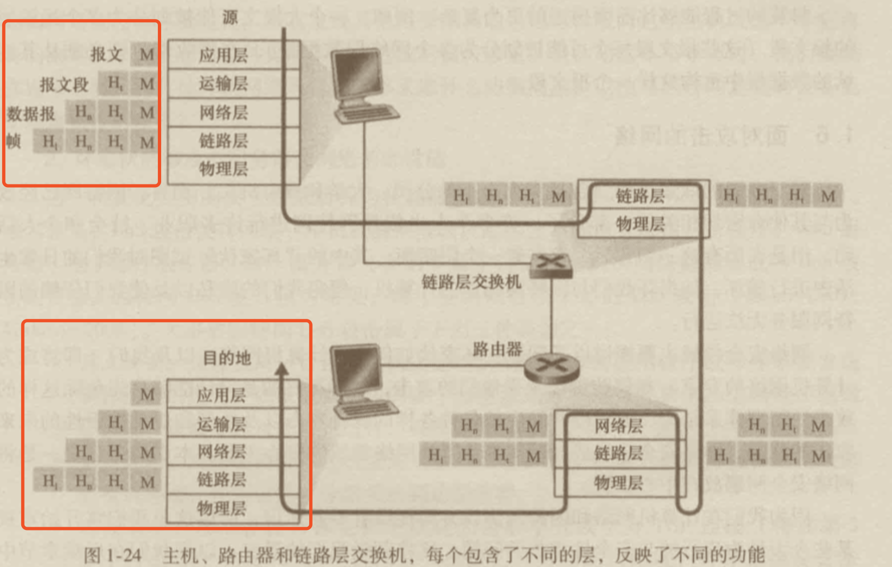
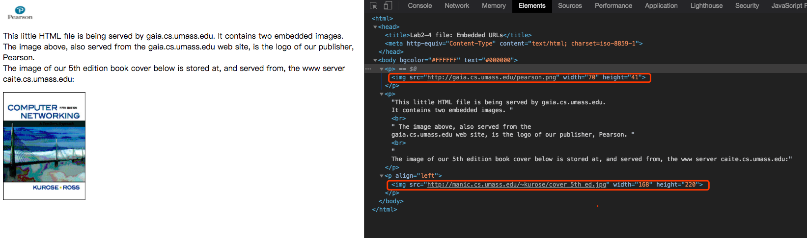
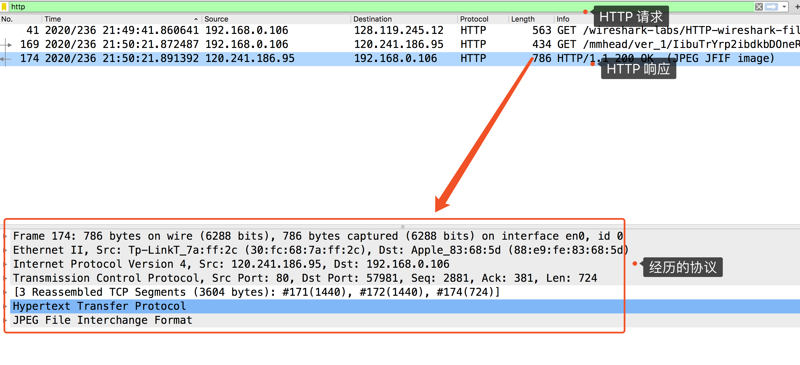
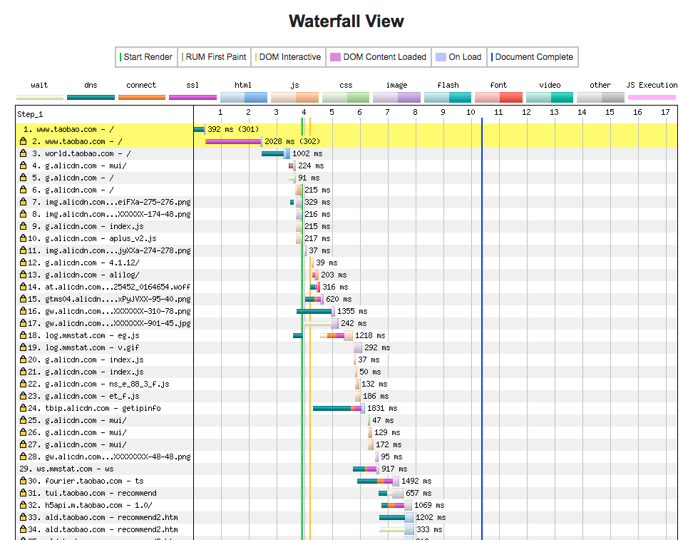

# Web 性能优化基础认知

## 前言

web 性能优化是什么？相信不少开发过 web 应用的小伙伴可能在项目上或多或少做过一些性能优化，例如前端界面的渲染优化，使用代码实现以用户的操作触发懒加载某些资源，从而提升初始页面的渲染速度。

本文通过《从浏览器地址栏输入 URL 到页面渲染出来经历的过程》涉及到的性能知识这样的路线做一个概述，以此来提升读者对 web 性能优化的基础认知，给读者提供一个框架，之后读者能够就可以在这个框架上引入各种性能元素。

**目标读者**

- who：对 web 应用做过一些性能优化但没有建立对 web 性能优化的全局了解。
- when：当他读完本文后，能够对 web 网站性能优化有基础的认知，从大体上能够知道什么是性能优化、为什么要做性能优化、怎么做性能优化。

**文章大纲**
- 访问页面
- 文档加载完成
- 导致页面响应缓慢的原因
- 如何优化

## 访问页面

在说网络传输之前，先简单回顾下因特网（internet）。什么是因特网，举个例子，程序员金木同学，今天工作时运行一个比较大的项目导致电脑卡死了，无可奈何只能重启大法。想了想，从大学到现在这个电脑已经跟随他五年了。今天刚好发工资，攒够钱的小 A 于是打开了某知名品牌电脑网站，从看中到下单不用 5 分钟搞掂，第二天电脑就到了手上了。这个拿货的速度得益于今天强大的快递网络，大大小小的网点、仓库，遍布在整个城市、国家，连接着全世界，它就像一个巨大的蜘蛛网一样。


为了让保证快递的速度，装有电脑的包裹会从离金木同学最近的仓库发出。

同样的，因特网也是由许许多多的部件构建一个强大的信息网络，它是连接全世界的计算机设备的网络。

<!--  -->

图上的路径则是显示：金木同学利用他的电脑作为客户机去访问该品牌电脑商的服务器，请求下载以访问它的官方网站。


### 回顾网络传输

在复杂交错的网络中，快递包裹想要顺利发送到金木同学手上，是需要约定好接收方与发送方以及途径一些中间方的规定。




对于网络传输来说，则是网络分层模型以及它们依赖的网络协议。就拿浏览器访问 Web 网站来说，它的应用层协议是 HTTP 协议，HTTP 定义了 Web 客户端向服务器请求 Web 页面的方式，它们之间发送的包（packet）会沿着图中的路线进行传输。

如果我们在 Linux 下使用命令`$ traceroute targetIp` 或者在 Windows 下使用批处理 `> tracert targetIp`，都可以定位用户与目标计算机之间经过的所有路由器，不言而喻，用户和服务器之间距离越远，经过的路由器越多，延迟也就越高。使用 CDN 的目的之一便是解决这个问题。

例如，假如我要访问淘宝的网站，可以先通过 ping 获取具体的 ip 地址，再使用上面的命令进行路由器查询。

```sql
huasenyumideMacBook-Pro:Web-Performance-Optimization linjy$ ping www.taobao.com
PING www.taobao.com.danuoyi.tbcache.com (116.253.26.214): 56 data bytes
64 bytes from 116.253.26.214: icmp_seq=0 ttl=52 time=2.875 ms
64 bytes from 116.253.26.214: icmp_seq=1 ttl=52 time=3.874 ms
64 bytes from 116.253.26.214: icmp_seq=2 ttl=52 time=2.211 ms
64 bytes from 116.253.26.214: icmp_seq=3 ttl=52 time=2.190 ms
64 bytes from 116.253.26.214: icmp_seq=4 ttl=52 time=2.224 ms
64 bytes from 116.253.26.214: icmp_seq=5 ttl=52 time=3.409 ms
^C
--- www.taobao.com.danuoyi.tbcache.com ping statistics ---
6 packets transmitted, 6 packets received, 0.0% packet loss
round-trip min/avg/max/stddev = 2.190/2.797/3.874/0.656 ms 
```

可以看到当前是这个 ip (116.253.26.214) 接受了我们的请求，因为淘宝做了集群处理，因此每次 ping 的时候，服务器的 ip 是不同的。例如，在 mac 中可以用 Host 命令（更多命令可以看 [How to determine the IP address of a computer or website](https://www.computerhope.com/issues/ch000962.htm#:~:text=Host-,Ping,displayed%20in%20the%20command%20output.)）：

```sh
huasenyumideMacBook-Pro:Web-Performance-Optimization linjy$ host www.taobao.com
www.taobao.com is an alias for www.taobao.com.danuoyi.tbcache.com.
www.taobao.com.danuoyi.tbcache.com has address 113.16.206.233
www.taobao.com.danuoyi.tbcache.com has address 116.253.26.214
www.taobao.com.danuoyi.tbcache.com has address 116.253.26.213
www.taobao.com.danuoyi.tbcache.com has IPv6 address 240e:950:1:0:3::3f2
www.taobao.com.danuoyi.tbcache.com has IPv6 address 240e:49:5b00:100:2::e3
```

这是因为淘宝了集群的处理。现在我们可以挑选 `113.16.206.233` ip 地址，进行 `traceroute` 命令处理。其实 `traceroute` 是可以直接使用 host 作为参数的，上面通过 ip 只不过是为了展示下集群也是一种提升 Web 性能优化的途径。

```js
huasenyumideMacBook-Pro:~ linjy$ traceroute www.taobao.com
traceroute: Warning: www.taobao.com has multiple addresses; using 113.16.206.233
traceroute to www.taobao.com.danuoyi.tbcache.com (113.16.206.233), 64 hops max, 52 byte packets
 1  10.0.2.254 (10.0.2.254)  2.367 ms  2.540 ms  3.050 ms
 2  219.159.71.1 (219.159.71.1)  3.423 ms  4.325 ms  4.752 ms
...
```


其中 64 hops max 代表最多经过的路由节点，52 byte packets 为数据包的大小。更多请看[traceroute 使用与实现原理分析](https://zhuanlan.zhihu.com/p/36811672)。

### 从浏览器地址栏输入 URL，页面构建

现在我们看看，金木同学在电脑的浏览器地址输入：`http(s)://www.aaa.bbb.com/product/xxx.html` 后到整个界面出现可操作的过程，经历了哪些操作呢？

<!-- 这里可以输入淘宝或者京东的网站，用来讲解 -->

一个简单的图是这样的：


再扩展开来是这样的：


根据上图，为了让浏览器与服务器成功进行通信进行 HTTP 请求响应，要经历以下步骤：

#### 1. 首先浏览器解析 URL

浏览器要成功发起一个 HTTP 应用请求，先要进行 TCP 的连接，而要进行 TCP 的连接，则需要知道目标服务器的 IP 地址，而现在浏览器只知道用户输入的 URL 地址：

因此，浏览器要先解析输入的 URL 地址：

A. `http(s): + // + Web 服务器名 + (/ + 目录名 + / ..... + 文件名`)

- URL 开头表示访问数据源的机制，也就是协议
- “//“ 后面的字符串表示服务器的名称
- `()` 里面的则表示数据源（文件）的路径名

B. 以上文中提到的 URL 为例，

`https://www.apple.com.cn/macbook-pro-13/index.html`

C. 按照 A 中的元素对 B 解析的结果是：

`https: + // + www.apple.com.cn + / + macbook-pro-13 + / + index.html`

#### 2. 向 DNS 服务器查询 Web 服务器的 IP 地址

通过浏览器解析后，已经知道 `www.apple.com.cn` 是目标服务器的域名，之后就根据域名查询获得了服务器的 ip 地址。

#### 3. TCP 连接、HTTP 请求抛出

既然金木的电脑获得 ip 地址后，它能够生成 TCP 套接字，与目标服务器进行三次握手成功连接后，便可向 `www.apple.com.cn` 发送 HTTP GET 请求了。

#### 4. 服务端处理请求，HTTP 响应返回（webserver）

在 `www.apple.com.cn` 的服务器上读取到 TCP 的套接字里面的请求报文后，会生成一个 HTTP 响应报文，并且将 `index.html` web 文档放入 HTTP 响应体中，并将报文发送给 TCP 套接字。

#### 5. 浏览器拿到响应数据，解析响应内容，把解析的结果展示给用户

包含 `index.html` 的报文通过多个路由转发后，最终来到了金木同学的 Web 浏览器中，浏览器从 TCP 套接字读取 HTTP 响应报文，如果这个 web 文档是被压缩的（如`gzip`），还得解压下，最后对该 html 文档进行渲染显示。

多数 web 页面含有一个 HTML 基本文件，除此之外还有几个引用的对象（`js`、`image` 等）。因此在解析 `html` 的过程中，web 会依次去请求这些引用的对象（重复上面的过程），最后才完成了首次文档加载（俗称的首屏渲染），最终显示了一个完整的网页给用户金木同学。

<!-- apple 使用地址，可以通过抓包工具进行分析，关闭代理 -->

#### 实战分析

由于 apple 官网使用的 https 协议，无法正常进行抓包。因此，为了更好地说明以上步骤发生的事情，这里使用了一个线上的例子 http://gaia.cs.umass.edu/wireshark-labs/HTTP-wireshark-file4.html， 这个地址响应的是一个具有嵌入对象的 HTML 文档。

1. 启动浏览器
2. 启动 Wireshark 抓包工具
3. 输入地址 http://gaia.cs.umass.edu/wireshark-labs/HTTP-wireshark-file4.html
4. 获得响应的页面如下：



现在我们再来看看 Wireshark 抓包工具分析图：


按时间顺序排序：可以看到基本的顺序为：DNS -> TCP -> HTTP。



上图是输入 HTTP 的请求与过滤图，下半部分则是 某条 HTTP 请求响应 的详情图。

## 文档加载完成，产生用户交互

在首页加载完毕后，金木同学开始操作网页，间接地让 web 程序产生四个方面的行为：


- 用户输入，web 程序响应输出
- 动画运行
- 空闲时间
- 资源加载

<!-- 另外搭一个 Node demo，也可以看搭建的 Node 地址，清远 首屏 demo，进行抓包分析。例子在 nodejs-static-http-with-gzip，后面再看看能否弄一个 demo 级别的性能优化？ -->

## 导致页面响应缓慢的原因

到这里，我们已经了解从金木同学从浏览器地址栏输入 URL，到整个页面被浏览器加载完成，以及之后可能产生的交互的历程。而导致页面响应缓慢的原因，就是产生在每一个节点中，就好像双 11 快递一样，我们的快递可能被卡住某一个节点上了。

### 性能监测分析



这个是利用 [webpagetest](https://www.webpagetest.org/) 工具对淘宝网站进行分析图，可以看到各个资源请求的响应时间。

导致网络页面响应缓慢可能有以下情况：

- 网络层面
  - DNS 寻址
  - TCP 连接
  - 服务器的响应速度
  - ...
- 浏览器的渲染层面
  - 动画
  - 事件运行
  - ...

除了使用 webpageTest 外，我们使用最多的就是 chrome devTool 分析了，详细可以看看[Web 性能工具篇](../tool-monitor/index.md) 这部分。

### 什么时候需要做性能优化

一个应用的发展周期中：**稳定 > 安全 > 性能**，先稳定，才有人用，有人用了，就需要解决安全的问题，人数多了，网络响应慢，就要解决性能的问题。但是并不代表性能方面不需要考虑。在快速制作的 web 应用原型时，稳定优先。在版本迭代稳定后，安全和性能也要跟着考虑了。

不要过早优化不能一概而论，比如某些功能在使用代码实现前就应该考虑性能上的问题，避免后续的更改成本过高。

对于是否需要优化，我们可以参考下延迟与用户反应的参考表格：

| 延迟时间              | 用户反应                                                                                           |
| --------------------- | -------------------------------------------------------------------------------------------------- |
| 0-16ms                | 用户可以感知每秒渲染 60 帧的平滑动画转场。也就是每帧 16 毫秒留给应用大约 10 毫秒的时间来生成一帧。 |
| 0-100ms               | 在此时间窗口内响应用户操作，他们会觉得可以立即获得结果。时间再长，操作与反应的连接就会中断。       |
| 100-300ms             | 轻微可觉察的延迟。                                                                                 |
| 300-1000ms            | 延迟感觉像是任务自然和持续发展的一部分（用户觉得这是正常流，但不会觉得快。）                       |
| 1000+ms               | 用户的注意力将离开他们正在执行的任务。                                                             |
| 10000+ms <br>（>10s） | 用户感到失望，可能会放弃任务；之后他们或许不会再回来。                                             |

## 如何优化

<!-- 这里可以考虑能否通过一个应用引入各种性能优化的技术 -->

决定要做性能优化了，那应该如何优化呢？网络应用本质上是对数据的操作、显示，因此可以从下面的链路：

提升数据生成的效率——服务器部署策略——缓存技术提升效率——客户端渲染效率，例如下面的 webgis 应用：


我们需要从一个 web 应用的请求与响应的过程下手，即是网络层面与浏览器的渲染响应层面。


### 关键指标

我们可以通过一些关键指标来做优化：

- **响应**：在 100ms 内响应用户输入
  - 50 ms 内处理用户输入事件，确保 100 ms 内反馈用户可视化的响应
  - 对于开销大的任务可分隔任务处理，或者放到 worker
- **动画**：动画或滚动时，10ms 产生一帧
  - 动画类型：滚动、视觉动画、拖拽（流程节点、地图缩放和平移）
- **空闲时间**：主线程空闲时间最大化
  - 利用空闲事件完成推迟的工作
- **加载**：在 1000 ms 内呈现交互内容
  - 优化关键渲染路径
  - 渐进式渲染等
  - 网络速度、硬件 CPU、解析器（JS 运行引擎）
- **以用户为中心**

### 优化策略

基于上面的分析，优化策略大体可以这样：（下面的图是否用 svg 更加容易理解呢）

- 多端协作
  - 内核（比如浏览器）
  - 中间件（web 服务器、数据库服务器等等）
  - 外壳（比如[应用外壳](https://developers.google.com/web/updates/2015/11/app-shell)，PWA）
  - 前端（资源压缩、代码执行、首评优化
  内容优化）
  - 后端（负载均衡、架构优化、并行优化、异步优化、算法优化、缓存优化）
- 四种途径
  - 延迟（执行、加载）
  - 按需（加载，例如从一个组件库加载一个组件）
  - 缓存（资源）
  - 预备（提前执行、加载，例如 Chrome 当渲染引擎收到字节流之后，会开启一个预解析线程，用来分析 HTML 文件中包含的 JavaScript、CSS 等相关文件，解析到相关文件之后，预解析线程会提前下载这些文件。）
- 基本路线
  - 缓存
  - 发送请求
  - 服务端响应
  - 页面解析与处理
  - 静态资源优化
  - `运行时`性能
  - 预`加载`
- 两个层面
  - 网络层面
  - 浏览器渲染层面

虽然这样分开很多，实际操作起来它们可能是相互混合的，基本离不开上面说的优化策略。我们直接从两个层面入手：`网络层面`和`浏览器渲染层面`。

#### 网络层面

在网络层面上，比如 DNS 解析花时间，能不能尽量减少解析次数或者把解析前置。能——浏览器 `DNS 缓存`和 `DNS prefetch`。TCP 每次的三次握手都急死人，有没有解决方案？有——`长连接`、`预连接`、接入 `SPDY` 协议。另外，服务端可以做负载均衡、分布式集群，把请求的资源分布到多个服务器上。


上面的过程的优化往往需要前后端协作完成，前端单方面可以做的努力有限，那么 HTTP 请求呢？前端可以减少请求`次数`和减小`体积`方面。再者，服务器越远，一次请求就越慢，那部署时就把静态资源放在离我们更近的 CDN 上是不是就能更快一些。

#### 渲染层面


在渲染层面上，可以考虑以下途径的优化：

- 资源加载优化
- 服务端渲染
- 浏览器缓存机制的利用
- DOM 树的构建
- 网页排版和渲染过程
- 回流与重绘
- DOM 操作的合理规避

#### 一个例子

最后我们再看看一个简单的项目越来复杂时，我们可能需要做哪些东西提升性能。
- [项目是怎么一步一步变复杂的，为什么要学这么多_文字版](https://lookroot.cn/views/article/projectstep.html#%E6%88%91%E7%9A%84%E8%AE%A2%E9%98%85%E5%8F%B7) 
- [项目是怎么一步一步变复杂的，为什么要学这么多_视频版](https://www.bilibili.com/video/BV1dC4y187i8?t=16)

没看过文章和视频，可以先看看。下面是我从例子中摘取的性能优化相关的东西，实际上一个真正的应用要做的优化远远不止这些。

- webpack 进行资源打包和构建优化。
- maven 来构建和打包后端项目
- 原本我们的项目使用 mysql 来持久化存储我们的留言数据，使用 mybatis 和 springdatajpa 来操作数据库，随着访问人数的增多，数据库扛不住，我们使用 redis 来缓存一下数据，并且我们的数据库要实现分库分表和读写分离。
- 在网页中，为了体验的友好和减轻服务器压力，我们可以使用 vuex 和 localstorage 来将数据缓存在浏览器中
- 为了防止有些用户乱点和爬虫脚本的操作，前端开发需要`防抖`和`节流`来控制用户的操作，后端可以通过 redis 来限制用户操作频率，当然我们也通过 nginx 来限制用户 IP 访问
- 我们的用户越来越多，留言越来越多，单机完全不能支撑这个服务了，老板说`分布式`可以解决这个问题，于是我们后端开始考虑是使用 springcloud还是dubbo zookeeper的方案，当然我们也会用nginx的`负载均衡`
- JWT 调优

虽然项目越来越复杂，但是只要我们掌握了套路，总能找到解决的方案。

## 总结

本文以一个简单的例子描述了从浏览器输入 URL 到 web 页面展示的流程，以及如何做性能优化，浅谈了 web 性能优化的基础认知。要想做好 web 性能优化，不仅要理解计算机网络的通信机制，也要清楚浏览器的缓存、渲染原理、运行机制。从全局上了解，理清每个角度的交互关系，可以让我们知道从哪里下手，逐一攻破，并且一开始就从用户使用频率最高的地方入手。
