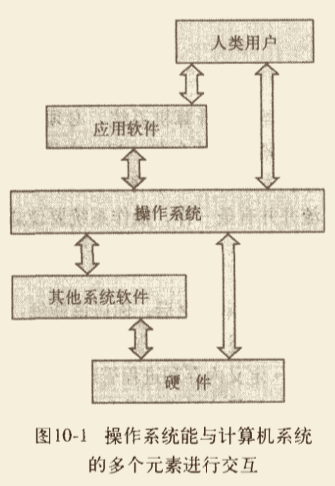

# 一些关键概念

## CPU 与操作系统

操作系统的各种角色都围绕着一个中心思想“良好的共享”。<u>操作系统负责管理计算机的资源，而这些资源通常是由使用它们的程序共享的。多个并发执行的程序将共享主存，依次使用 CPU，竞争使用输入/输出设备的机会。</u>操作系统将担任现场监视器，确保每个程序都能够得到执行的机会。

## 内存、进程和 CPU 管理

正在执行的程序都驻留在主存中，其中的指令以读取-解码-执行这种周期性方式被一个接一个地处理。<strong>多道程序设计</strong>是在主存中同事驻留多个程序的技术；这些程序为了能够执行，将竞争 CPU 资源。所有现代操作系统都采用多道程序设计技术，因此，操作系统必须执行<strong>内存管理</strong>，以明确内存中有哪些程序，以及它们驻留在内存的什么位置。

操作系统的另一个关键观念是进程，可以将它定义为正在执行的程序。<u>程序只是一套静态指令，进程则是动态的实体，表示正在执行的程序。</u>。无论如何，下一条要执行的都是一条明确的指令。中间值将被计算出来。在执行过程中，进程可能会被打断，因此操作系统还要执行<strong>进程管理，</strong>以跟踪进程的进展以及所有中间状态。

内存管理和进程管理都需要<strong>>CPU 调度。</strong> 即确定某个时刻 CPU 要执行内存中的哪个进程。记住，操作系统本身也是必须执行的程序，所以在内存中也要和其他系统软件及应用程序一起管理和维护 OS 进程。执行 OS 的 CPU 就是执行其他程序的 CPU，因此也要把 OS 进程进入竞争 CPU 的队列中。

### CPU 调度

所谓 CPU 调度，就是确定把哪个处于准备就绪状态的进程移入运行状态。也就是说，CPU 调度算法将决定把 CPU 给予哪个进程，以便它能够运行。

- 先到先服务
- 最短作业优先
- 循环调度法

## 进程与线程看这里

### 进程

> 进程（Process）是计算机中的程序关于某数据集合上的一次运行活动，是系统进行资源分配和调度的基本单位，是操作系统结构的基础。进程是程序的基本执行实体，进程是线程的容器。程序是指令、数据及其组织形式的描述，进程是程序的实体。

用一句简单的话来说，你在 Windows 中看到的后缀为 `.exe` 的文件都是程序。不过程序是“死”的，静态的。当你双击这个 `.exe` 的时候，这个 `.exe` 文件中的指令就会被加载，那么你就能得到一个有关这个 `.exe` 程序的进程。进程是“活”的，或者说是正在被执行的。如下图：

CPU 正在执行的程序叫`进程`，它代表 CPU 所能处理的单个任务。
- `进程`之间相互独立，任一时刻，CPU 总是运行一个`进程`，其他`进程`处于非运行状态。
- CPU 使用时间片轮转进度算法来是心安同时运行多个`进程`。
- `进程`是 cpu 资源分配的最小单位。（是能拥有资源和独立运行的最小单位）
- 不同进程间也可以通信，不过代价较大。

**进程管理**

操作系统必须管理的另一个重要资源是每个进程使用的 CPU 事件。要理解操作系统是如何管理进程的，必须了解进程在生存周期中的各个阶段，理解进程在计算机系统中正确运行所要管理的信息。

**进程状态**

在计算机系统的管理下，进程会历经几种状态：即进入系统、准备执行、执行、等待资源以及执行结束。

注意，可能同时有多个进程处于准备就绪或等待状态，但只有一个进程处于运行状态。

### 线程

进程是线程的容器。进程中可以容纳若干个线程。它们并不是看不见、摸不着的，可以使用工具看到它们。
- 线程就是轻量级进程，是 cpu 调度的最小单位（线程是建立在进程的基础上的一次程序运行单位，一个进程中可以有多个线程）。
- 现在，一般通用的叫法：单线程与多线程，都是指在一个进程内的单和多。
- 使用多线程而不是用多进程去进行并发程序的设计，是因为线程间的切换和调度的成本远远小于进程。
  

**单线程与多线程**

在单线程程序中，“在某一时间点执行的处理”只有一个，即“正在执行程序的主体”只有一个。

多线程：由多个线程组成的程序就称为多线程。
- 耗时的 I/O 处理。一般来说，文件与网络的 I/O 处理都非常消耗时间，如果在 I/O 处理期间，程序基本上无法执行其他处理，那么性能将会下降。在这种情况下，就可以使用多线程来解决。如果将执行 I/O 处理的线程和执行其他处理的线程分开，那么在 I/O 处理期间，其他处理也可以同时执行。

### 进程与线程的关系比喻看这里

房子的比喻：

一间漂亮的小别墅，别墅里有卧室、厨房、书房、洗手间等。当然，还有一家三口住在里面。当妈妈带女儿外出游玩时，爸爸一个人在家。这时爸爸一个人在家里爱去哪里去哪里，爱干什么干什么，这时爸爸就像一个线程。（这个进程中只有一个活动线程），小别墅就像一个进程，家里的厨房、书房就像这个进程占有的资源。当三个人住在一起时（相当于三个线程），有时候可能就会有些小冲突，比如，当女儿占着电视机看动画片时，爸爸就不能看体育频道了，这就是线程间的资源竞争。当然，大部分时候，线程之间还是协作关系。比如，妈妈在厨房位爸爸和女儿做饭，爸爸在书房工作赚钱养家糊口，女儿在写作业，各司其职，那么这个家就其乐融融，相应地，这个进程也就在健康地执行。

<!-- 工厂的比喻：

- 工厂的资源 -> 系统分配的内存（独立的一块内存）

- 工厂之间的相互独立 -> 进程之间相互独立

- 多个工人协作完成任务 -> 多个线程在进程中协作完成任务

- 工厂内有一个或多个工人 -> 一个进程由一个或多个线程组成

- 工人之间共享空间 -> 同一进程下的各个线程之间共享程序的内存空间（包括代码段、数据集、堆等） -->

### 进程 vs 线程看这里

进程和线程是包含关系，但是多任务既可以由多进程实现，也可以由单进程内的多线程实现，还可以混合多进程+多线程。
和多线程相比，多进程的缺点在于：
- 创建进程比创建线程开销大，尤其是在 Windows 系统上；
- 进程间通信比线程间通信要慢，因为线程间通信就是读写同一个变量，速度很快。

而多进程的优点在于：
多进程稳定性比多线程高，因为在多进程的情况下，一个进程崩溃不会影响其他进程，而多线程的情况下，任何一个线程崩溃会直接导致整个进程崩溃。

### 多线程

Java 语言内置了多线程：一个 Java 程序实际上是一个 JVM 进程，JVM 进程用一个主线程来执行 `main()`方法，在`main()`方法内部，我们又可以启动多个线程。此外，JVM 还有负责垃圾回收的其他工作线程等。

因此，对于大多数 Java 程序员来说，我们说多任务，实际上是说如何使用多线程实现多任务。

和单线程相比，多线程编程的特点在于：多线程经常需要读写共享数据，并且需要同步。例如，播放电影时，就必须由一个线程播放视频，另一个线程播放音频，两个线程需要协调运行，否则画面和声音就不同步。因此，多线程编程的复杂度高，调试更困难。

Java 多线程编程的特点又在于：
- 多线程模式是Java程序最基本的并发模型；
- 后续读写网络、数据库、Web 开发等都依赖 Java 多线程模型。

### 并发（Concurrency）和并行（Parallelism）、串行

并发和并行都可以表示两个或者多个任务一起执行，但是侧重点有所不同。并发偏重于多个任务<strong>交替执行，</strong>，而多个任务之间可能还是串行的，而并行是真正意义上的“同时执行”。

从严格意义上来说，并行的多个任务是真的同时执行，而对于并发来说，这个过程只是交替的，一会儿执行任务A，一会执行任务B，系统回不停地在两者之间切换。但对于外部观察者来说，及时多个任务之间是串行并发的，也会造成多任务间并行执行的错觉。

并发比喻：“走路不看景，看景不走路”。为了安全起见，就要求游客看景的时候停下脚步，走路的时候能够专心看着地面，管好双脚，这就是“并发”。
并行：坐缆车上山。缆车可以代替步行，你坐在缆车上才能专心欣赏沿途风景。

实际上，<u>如果系统内只有一个 CPU，而使用多进程或者多线程任务，那么真实环境下这些任务不可能是真实执行的，毕竟一个 CPU 一次只能执行一条指令，在这种清空下多进程或多线程就是并发的，而不是并行的（</u>操作系统会不停地切换多个任务）。真实的并行也只可能出现在拥有多个 CPU 的系统中（比如多核 CPU）。

面对复杂业务模型，并行程序会比串行更容易适合业务需求，更容易模拟我们的现实世界。毕竟，我们的世界本质上是并行的。比如，当你开开心心地上学的时候，妈妈可能在家里忙着家务，爸爸在外打工赚钱，一家人其乐融融。如果有一天，你需要使用你的计算机来模拟这个场景，你会怎么做呢？<u>如果你在一个线程里，既做了你你自己，又做了妈妈，又做了爸爸，显然这不是一种好的解决方案。但如果你使用三个线程，分别模拟这三个人，一切看起来那么自然，而且容易被人理解。</u>

并行适用于图像处理和服务端程序（Java 主要占领着服务端市场）。

### 同步（Synchronous）与异步（Asyncronous）

同步和异步通常用来形容一次方法调用。同步方法调用你一旦开始，调用者必须等到方法调用返回后，才能继续后续的行为。异步方法调用更像一个一个消息传递，一旦开始，方法调用就会立即返回，调用者就可以继续后续的操作。而异步方法通常会在另外一个线程中“真实”地执行。整个过程不会阻碍调用者的工作。

对于调用者来说，异步调用似乎是一瞬间就完成的。如果异步调用需要返回结果，那么当这个异步调用真实完成时，则会通知调用者。

打个比方，比如购物，如果你商场买空调，当你到了商场看中了一款空调，你就向售货员下单，售货员去仓库帮你调配物品。这天你热得是实在不行了，你催着商家赶紧给你送货，于是你就在商店里候着他们，直到商家把你和空调一起送回家，一次愉快的购物就结束了。<u>这是同步调用。</u>

不过，如果我们直接在网上订购了一台空调，当你完成网上支付的时候，对你来说购物过程已经结束了。虽然空调还没送到家，但是你的任务已经完成了。商家接到了你的订单后，就会加紧安排送货，当然这一切已经跟你无关了。您已经支付完成，想干什么就干什么，出去溜几圈都不成问题，等送货上面的时候，接到商家的电话，回家一趟签收就完事了。<u>这就是异步调用。</u>

### 临界区

临界区用来表示一种公共资源或者说共享数据，可以被多个线程使用。但是每一次，只能有一个线程使用它，一旦临界区资源被占用，其他线程要想使用这个资源就必须等待。

比如，在一个办公室里又一台打印机，打印机一次只能执行一个任务。如果小王和小明同时需要打印文件，很显然，如果小王先下发了打印任务，打印机就开始打印小王的文件。小明的任务就只能等待小王打印结束后才能打印。

在并行程序中，临界区资源是保护的对象，如果意外出现打印机同时执行两个打印任务的情况，那么最可能的结果就是打印出来的文件是损坏的文件。它既不是小王想要的，也不是小明想要的。

由于临界区的存在，多线程之间的并发必须受到控制。根据控制并发的策略，我们可以把兵法的级别分为阻塞、无饥饿、无障碍、无锁、无等待集中几种。

浏览器 JS 线程与GUI 线程互斥。（JS 阻塞页面）

### 阻塞（Blocking）与非阻塞（Non-Blocking）

<u>阻塞和非阻塞通常用来形容多线程间的相互影响。</u>比如一个线程占用了临界区资源，那么其他所有需要这个资源的线程就必须在这个临界区中等待。等待回导致线程挂起，这种情况就是阻塞。此时，如果占用资源的线程一直不愿意释放资源，那么其他所有阻塞在这个临界区上的线程都不能工作。

非阻塞的意思与之相反，它强调没有个线程可以妨碍其他线程执行，所有的线程都会尝试不断前向执行。

####  同步、异步、阻塞与非阻塞可以有以下4种的排列:

同步和异步关注的是消息通信机制，阻塞和非阻塞关注的是程序在等待调用结果时的状态。

1. 同步阻塞
2. 同步非阻塞
3. 异步阻塞
4. 异步非阻塞

下面通过一个例子来说明：

老张爱喝茶，废话不说，煮开水。出场人物：老张，水壶两把（普通呢水壶，简称水壶；会响的水壶，简称响水壶）。
1. 老张把水壶放到火上，立等水开。<strong>（同步阻塞）</strong>老张觉得自己有点傻。
2. 老张把水壶放到火上，去客厅看电视，时不时去厨房看水开没有。<strong>（同步非阻塞）</strong>老张觉得自己有点傻，于是变高端了，买了把会响笛的那种水壶。水开之后，能大声发出嘀～～～的噪音。
3. 老张把响水壶放到火上，立等水开。（<strong>异步阻塞）</strong>老张觉得这样傻等意义不大。
4. 老张把响水壶放到火上，去客厅看电视，水壶响之前不再去看它了，响了再去拿壶。<strong>（异步非阻塞）</strong>老张觉得自己聪明了。

所谓同步异步，只是对水壶而言。普通水壶，同步；响水壶，异步。虽然都能干活但响水壶可以在自己完工之后，提示老张水开了。这是普通水壶所不能及的。同步只能让调用者去轮询自己（情况2中），造成老张效率的低下。（被调用者，调用者）

所谓阻塞非阻塞，仅仅对于老张而言。立等的老张，阻塞；看电视的老张，非阻塞。情况1和情况3中老张是阻塞的，媳妇喊他都不知道。虽然3中响水壶是异步的，可对于立等的老张没有太大的意义。所以一般异步是配合非阻塞使用的，这样才能发挥异步的效用。

### IO 编程

IO 在计算机中指 Input/Output，也就是输入和输出。由于程序和运行时数据是在内存中驻留，由CPU这个超快的计算核心执行，涉及到数据交换的地方，通常是磁盘、网络等，就需要 IO 接口。

比如你打开浏览器，访问新浪首页，浏览器这个程序就需要通过网络 IO 获取新浪的网页。浏览器首先会发送数据给新浪服务器，告诉它我想要首页的 HTML，这个动作是往外发数据，叫 Output，随后新浪服务器把网页发过来，这个动作是从外面接收数据，叫 Input。所以，通常，程序完成 IO 操作会有 Input 和 Output 两个数据流。当然也有只用一个的情况，比如，从磁盘你读取文件到内存，就只有 Input 操作，反过来，把数据写到磁盘文件里，就只是一个 Output 操作。

IO 编程中，Stream（流）是一个很重要的概念，可以把流想象成一个水管，数据就是水管里的水，但是只能单向流动。**Input Stream** 就是数据从外面（磁盘、网络）流进内存，**Output Stream** 就是数据从内存流到外面去。对于浏览网页来说，浏览器和新浪服务器之间至少需要建立两个水管，才可以既能发数据，又能收数据。

**由于 CPU 和内存的速度远远高于外设的速度**，所以，在 IO 编程中，就存在速度严重不匹配的问题。举个例子来说，比如要把 100M 的数据写入磁盘，CPU 输出 100M 的数据只需要0.01 秒，可是磁盘要接收这100M 数据可能需要10秒，怎么办呢？有两种办法：

第一种是 CPU 等着，也就是程序暂停执行后续代码，等100M的数据在10秒后写入磁盘，再接着往下执行，这种模式成为同步 IO；
第二种是 CPU 不等待，只是告诉磁盘，“您老慢慢写，不着急，我接着干别的事去了”，于是，后续代码可以立刻接着执行难，这种模式称为异步IO。

同步和异步的区别在于是否等待 IO 执行的结果，同步和异步的区别就在于是否等待IO执行的结果。好比你去麦当劳点餐，你说“来个汉堡”，服务员告诉你，对不起，汉堡要现做，需要等5分钟，于是你站在收银台前面等了5分钟，拿到汉堡再去逛商场，这是同步IO。

你说“来个汉堡”，服务员告诉你，汉堡需要等5分钟，你可以先去逛商场，等做好了，我们再通知你，这样你可以立刻去干别的事情（逛商场），这是异步IO。

如上面的老张煮水。很明显，使用异步IO来编写程序性能会远远高于同步IO，但是异步IO的缺点是编程模型复杂。想想看，你得知道什么时候通知你“汉堡做好了”，而通知你的方法也各不相同。如果是服务员跑过来找到你，这是<strong>回调模式，</strong>如果服务员发短信通知你，你就得不停地检查手机，<strong>这是轮询模式</strong>。总之，异步IO的复杂度远远高于同步IO。

计算机系统所有的输入输出操作（也称为 I/O 操作）都要通过操作系统来完成，每一种编程语言都会把操作系统提供的低级 C 接口封装起来方便使用。

小结：
1. 基本概念：input，output，stream
2. 存在问题：输入和接收速度不匹配。
3. 解决方法：同步、异步（回调--好了叫我；轮询--好了没，好了没）。
4. 收获新知：编程语言都会把操作系统的低级 C 接口封装起来方便使用。