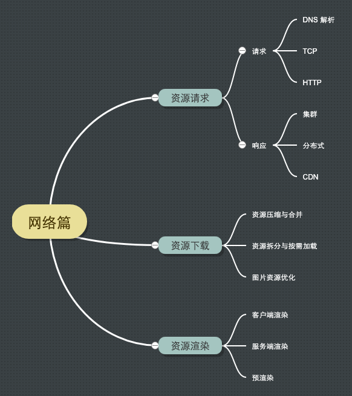

# 介绍

前面已经讲过 [Web 性能优化基础认知](../concept/README.md)，讲解了从浏览器输入 URL 到 web 页面展示的流程。其中网络层面的优化主要包括：
- DNS 解析
- TCP 链接
- HTTP 请求/响应

本次网络篇的讲解路线如下：
1. 从用户通过浏览器发起资源请求。
2. 浏览器下载所需要的资源。
3. 浏览器将资源解析处理，渲染页面视图。

结合 Vue 项目应用，重点讲清楚如何落地网络层面的性能优化方案，具体内容如下图所示：

文章导航：
- [微谈前端性能优化网络篇之资源请求](./request.md)
- [微谈前端性能优化网络篇之资源下载](./download.md)
- [微谈前端性能优化网络篇之资源渲染](./render.md)

<!-- 
- xcli-ui 图片压缩

- 自动化部署（ webpack 构建）
- 一体化的 GIS 集群
- 详细说下网络层面涉及到一些知识点，包括 DNS、HTTP 一些关键字段、TCP 连接（keep-lives）、http2 参考 vite 的实现
- 实战例子
  - 大文件下载优化
  - 在线查看文件优化 -->

<!-- find 查询性能优化，把 css、image 排除。

我们在爬取网站的时候, 一般比较关心网站的加载速度, 而限制加载速度的大多数是静态文件, 包括 css, font, image. 为了优化爬虫性能, 我们需要阻止浏览器加载这些不必要的文件, 这可以通过对请求进行拦截来实现。 -->
  <!-- - 采用脚手架压缩 cli
- 对问题的根源有所了解，了解这些工具到底解决什么问题，怎么解决的。
- 资源的压缩与合并
- vue 应用懒加载的实现 -->