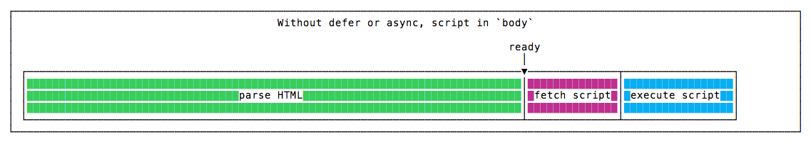
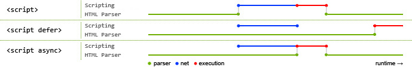
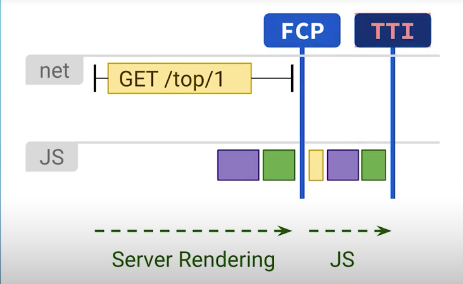

# 资源渲染

## 前言

从**网络层面**上要优化资源渲染，根本的目的就是尽快让用户看到页面内容，对于常见的 SPA 单页面应用来说，经历以下过程：

```html
<!DOCTYPE html>
<html lang="en">
<head>
  <meta charset="utf-8" />
  <meta http-equiv="X-UA-Compatible" content="IE=edge" />
  <meta name="viewport" content="width=device-width,initial-scale=1.0" />
  <link href="xxxx" />
  <title></title>
  <style>
  </style>
</head>

</body>
  <div id="app"></div>
<body>
</html>
```

1. 请求首个 HTML 文档，等待 HTML 文档返回，此时网页处于白屏状态。
2. 依次从上往下解析 HTML 文档，首先解析 head 标签，如果有 css/js 外链资源，将对之后的 HTML 文档造成阻塞。（**资源下载**）
3. 对 HTML 文档的 body 标签进行解析渲染，因为 SPA 项目中 index.html body 一般只有一个空的容器标签，所以页面依然是白屏。（**空标签**）
4. body 中存在外链文件加载、JS 解析等过程，导致界面依然白屏。
5. 当 `new Vue({}}).$mount("#app");` 挂载后，界面显示出大体外框（侧边栏、头部导航、底部菜单栏等信息）。
6. 进入 vue-router，如果使用了代码分割动态加载的话，将发起该路由对应 boundle 文件的请求（如：bill.xxx.chunk.js），该文件下载完成并执行前，页面只有外框。路由文件执行后，页面几百呈现完整内容。（**路由跳转新资源下载**）
7. 调用 API 获取到业务数据后，填充进页面，展示出最终的页面内容。

简单了解整个流程后，就可以找出哪里导致资源渲染的问题并进行性能优化。

**目标读者**：想知道如何在网络层面解决资源渲染的问题。

**阅读时长**：30 min

**文章大纲**：本文会讲解 SSR、CSR、预渲染和同构的区别以及 Vue 项目中如何集成骨架屏、预渲染。

- DOM 渲染阻塞
  - 为什么 JS 会阻塞渲染
  - 如何避免 JS 文件阻塞渲染
- DOM 渲染优化
  - 客户端渲染
  - 服务端渲染
  - 预渲染

## DOM 渲染阻塞

<!-- 5min -->

只要是外链资源包括 css、img、js 都有可能阻塞 DOM 渲染的，这里重点说下 JS 阻塞的问题。

### 为什么 JS 会阻塞渲染

当浏览器构建 DOM 的时候，如果在 HTML 中遇到了一个 `<script>....</script>` 标签，它必须立即执行。如果脚本是来自于外部的，那么它必须首先下载。而下载后，需要等待 JavaScript 引擎执行脚本后，HTML 才会继续解析。


这是有原因的，因为脚本可以改变 HTML 以及它的产物 DOM。比如使用 `document.createElement` 添加节点改变 DOM 结构，或者使用 `document.write()` 方法添加 HTML 标签。以及对 DOM 进行查询，如果 DOM 同时还在构建的话，则很可能会返回意外的结果。

### 如何避免 JS 文件阻塞渲染

<!-- 针对 CSS 的话，可以采取 prefetch、preload 提前渲染 -->

常见的方式是可以把 JS 资源从 head 标签移动到 body 标签的末尾，避免阻塞。如图所示：在 body 内末尾添加 script 标签



或者使用 `defer/async` 这对属性。

- 常规的 script 标签，会阻塞 HTML 的解析。
- defer 会将 JS 先下载下来，但是会等 HTML 解析完成后，才执行。
- async，同时进行 HTML 解析与 JS 下载，但 JS 下载完成后立刻停止 HTML 解析并执行 js 代码。



（PS：你可以编写 demo ，通过 performance 工具记录进行验证）

从图中可以看到，不同情况下的脚本处理机制。（HTML 解析——JS 资源下载——JS 执行），最终得出的优化方案采用以下：

- `<script defer src="xxxx.js"></script>`
- 如果需要兼容 IE9 或更老的浏览器，在 body 内末尾添加 script 标签。vuecli 项目就是这样做的。

一般适用 defer 和末尾 body 添加脚本即可，但是对于 async 来说，也有适用它的场景（更加适用于一些监控类的脚本、百度、Google 统计分析脚本）。比如淘宝的首页，就用到多个带有 async 属性的 script 标签。

```html
<script
  charset="utf-8"
  src="https://g.alicdn.com/kg/??home-2017/1.4.21/lib/monitor-min.js"
  async=""
></script>
<script
  src="https://ecpm.tanx.com/ex?i=mm_12852562_1778064_13672849&amp;cb=jsonp_callback_3549&amp;r=&amp;cg=ac749acdc7c177c22d5f7fecf9fcdb01&amp;pvid=aed49a8d9b04a5d3ded63c03c09d10f0&amp;u=https%3A%2F%2Fwww.taobao.com%2F&amp;psl=1&amp;nk=&amp;sk=&amp;refpid="
  async=""
></script>
<!-- ... -->
```

在实际开发中，`defer` 用于需要整个 DOM 的脚本，和/或脚本的相对
执行顺序很重要的适合。`async` 用于独立脚本，例如计数器、广告或网站监控分析，这些脚本弄的相对执行顺序无关紧要。他们都不会阻塞 DOM 的渲染。

## DOM 渲染优化

HTML 文件下载后，由于要等待文件加载、JS 解析等过程，会导致用户长时间处于不可交互的首屏白屏状态，比如 index.html 的 `<div id="app">...</div>` 的情况，必须等到主 app.js 脚本执行完毕，往容器填充内容。

<!-- 要解决这种白屏情况，有两种方案 -->

<!-- - 传统意义上的第一屏幕
- 子系统的第一屏 -->

要如何解决这种白屏现象呢，这种现场是由于客户端渲染导致的。让我们先回顾下前端渲染与后端渲染的区别。

### 两种渲染技术的区别

<!-- 10min -->

#### 客户端渲染（CSR）

客户端渲染（Client-Side Rendering）模式下，服务端会把渲染需要的静态文件发送给客户端，客户端加载过来之后，自己在浏览器里跑一遍 JS，根据 JS 的运行结果，生成相应的 DOM。


```js
<!doctype html>
<html>
  <head>
    <title>我是客户端渲染的页面</title>
  </head>
  <body>
    <div id='root'></div>
    <script src='index.js'></script>
  </body>
</html>
```

根节点里的东西，只有浏览器把 index.js 跑过一遍才知道。

**页面上呈现的内容，你在 html 源文件里找不到**——这正是它的特点。

#### 服务端渲染（SSR）

服务端渲染（Server-Side Rendering）的模式下，当用户第一次请求页面时，由服务器把需要的组件或页面渲染成 HTML 字符串，然后把它返回给客户端。

使用服务端渲染的网站，可以说是“所见即所得”，**页面上呈现的内容，我们在 html 源文件里也能找到。**


**服务端渲染解决了什么性能问题呢？**

事实上，很多网站是出于效益的考虑才启动服务端渲染的，性能是其次。因为搜索引擎只会爬取得到客户端渲染下的现成东西，虽说如此，能够使用服务端帮忙渲染快速出页面，对网站的首屏加载大大有益。



Vue SSR 指南是如何实现的呢？这里有一个简单的 demo：

```js
const Vue = require("vue");
// 创建一个express应用
const server = require("express")();
// 提取出renderer实例
const renderer = require("vue-server-renderer").createRenderer();

server.get("*", (req, res) => {
  // 编写Vue实例（虚拟DOM节点）
  const app = new Vue({
    data: {
      url: req.url,
    },
    // 编写模板HTML的内容
    template: `<div>访问的 URL 是： {{ url }}</div>`,
  });

  // renderToString 是把Vue实例转化为真实DOM的关键方法
  renderer.renderToString(app, (err, html) => {
    if (err) {
      res.status(500).end("Internal Server Error");
      return;
    }
    // 把渲染出来的真实DOM字符串插入HTML模板中
    res.end(
      `
      <!DOCTYPE html>
      <html lang="en">
        <meta charset="utf-8">
        <head><title>Hello</title></head>
        <body>${html}</body>
      </html>
    `,
      "utf-8"
    );
  });
});

server.listen(8080);
console.log("8080");

```

<!-- 在谈及预渲染之前， -->
<!-- SSR、CSR、预渲染、同构 -->
<!-- 同构、预渲染 -->
<!-- node 作为中间层 -->

服务端渲染本质上是**本该浏览器做的事情，分担给服务器去做**。除了需要同时改造客户端和服务端外，还另外给服务器带来了渲染的压力，不太建议。

<!-- 混合服务端与客户端渲染 -->

<!-- Isomorphism：同构，是指服务端渲染（SSR）或者 Native 渲染时复用浏览器端的 JavaScript 组件。 -->

### 预渲染

<!-- 15 min -->
<!-- 用户体验层面 -->

说完了客户端渲染和服务端渲染，我们再来谈谈预渲染是怎么回事。这里的预渲染是从广义上理解的，在 `index.html` 的 `<div id="app" </div>` 填充自定义的内容，在 JS 资源下载之前展示必要的内容。**让页面看起来很快，实际的加载速度并没有变化。**，这是从用户体验层面上来考虑。

可以通过以下几种方式：

- loading 动画
- 预渲染出静态 DOM
- 骨架屏

<!-- 前端重点关注的，比较符合当前公司的常见，Java 后端，JS 前端。需要考虑用 node 作为中间层。-->
<!-- 这个时候，可以用预渲染提前展示一部分内容，让用户感知到网站在正常加载，而非糟糕的白屏体验。 -->

#### loading 动画

最常见就是在 index.html 页面内联一个 loading 动画。根据需要，loading 动画可以是一个简单的菊花图，也可以很复杂。比如 Google Mail 的加载动画。


#### CSR 渲染静态 DOM

除了使用加载动画外，我们可以狭义上的预渲染。

Prerender：预渲染，也就是说在构建时运行**客户端**应用程序，这样将它的初始状态捕获为静态 HTML。

**要如何实现这个功能呢？**

以 Vue 项目为例，可以通过 [Prerender-spa-plugin](https://github.com/chrisvfritz/prerender-spa-plugin) webpack 插件进行实现。

配置如下：

```js
const PrerenderSPAPlugin = require("prerender-spa-plugin");
const Renderer = PrerenderSPAPlugin.PuppeteerRenderer;
const path = require("path");

module.exports = {
  configureWebpack: {
    plugins:
      process.env.NODE_ENV === "production"
        ? [
            new PrerenderSPAPlugin({
              staticDir: path.resolve(__dirname, "./", "dist"),
              routes: ["/"],
              renderer: new Renderer({
                injectProperty: "__PRERENDER_INJECTED",
                inject: {
                  prerendered: true,
                },
                renderAfterDocumentEvent: "app.rendered",
              }),
            }),
          ]
        : [],
  },
};
```

其原理是：在构建的时候会启动一个 node 服务器，使用无头浏览器 puppeteer，然后进行 dom 爬取，最后生成一个 html 页面，比如 /home 页面，会生成对应 index.html，在服务器配置匹配到 /home 路由时，强行访问这个生成的 html 即可。

<!-- TODO 配置 nginx -->

对旧的 vuecli 项目如果使用的是 hash 路由，预渲染需要改成 history 模式，改动成本挺多，需要仔细衡量。因此引入 prerender 方案，最好在新项目中使用。

<!-- Use history mode for router? (Requires proper server setup for index fallback
in production)  -->
 <!-- prerender实现原理不难，就是在yarn build的时候，(这货可以用来爬虫和搞单元测试)进行访问你指定的页面，
       这样，也就
       解决了seo和首屏渲染慢的问题
<!-- Vue 项目，需要更改路由模式，更改成本可能不少。会导致一些问题。需要设置 vue-router 模式为 history，这对项目有什么影响。

```js
history 在刷新页面时，如果服务器中没有相应的响应或资源，就会出现404。因此，如果 URL 匹配不到任何静态资源，则应该返回同一个 index.html 页面，这个页面就是你 app 依赖的页面hash 模式下，仅 # 之前的内容包含在 http 请求中，对后端来说，即使没有对路由做到全面覆盖，也不会报 404

```

tomcat 需要配置：

这样系统看起来就不是单页面应用了，况且如果之前通过 # 做的 URL 处理会受到一定的影响，因此需要着重考虑，变更成本与性能上带来的速度。后续研究。然后跳到骨架屏。

history 模式对权限路由是否影响

一些影响：静态资源请求也有问题。

需要用 history 模式才能生效 -->

<!-- 支撑项目实战 -->

<!-- 后端渲染的 bigpipe 技术 -->

<!-- ## 分段传输

## BigPipe 技术 -->

<!-- - 模型的首屏达到 15.16s，白屏时间长。 -->

#### 骨架屏

有些内容无法预渲染，需要根据用户操作动态生成，用户产品、用户账单等，则可以采用骨架屏，也就是代替掉菊花图。

实现骨架屏方案：

- 自动生成。
- 手动编写。

##### 手动编写

如何在 Vue 项目中进行处理呢？

```js
const path = require("path");
const SkeletonWebpackPlugin = require("vue-skeleton-webpack-plugin");
module.exports = {
  configureWebpack: {
    plugins: [
      new SkeletonWebpackPlugin({
        webpackConfig: {
          entry: {
            app: path.join(__dirname, "./src/skeleton/index.js"),
          },
        },
        // SPA 下是压缩注入 HTML 的 JS 代码
        minimize: true,
        // 服务端渲染时是否需要输出信息到控制台
        quiet: true,
        // 根据路由显示骨架屏
        router: {
          mode: "history",
          routes: [
            {
              path: "/",
              skeletonId: "skeleton-home",
            },
            {
              path: "/about",
              skeletonId: "skeleton-about",
            },
          ],
        },
      }),
    ],
  },
};

```

可以查看 sketelon/demo02。

##### 自动生成

方案一：可以采用 element 的 [page-skeleton-webpack-plugin](https://github.com/ElemeFE/page-skeleton-webpack-plugin)，但它只支持 vue 项目路由采用 history 模式。这个东西实践 demo 没跑成功，后面实践看看。注意的是，这个仓库已经不维护了，可能存在不少坑。

方案二：半自动方案，采用 cli 命令自动生成脚手架，再嵌入到 vue 页面中。 

```bash
1. 全局安装，npm i draw-page-structure – g

2. dps init 生成配置文件 dps.config.js

3. 修改 dps.config.js 进行相关配置

4. dps start 开始生成骨架屏
```

总结来说，骨架屏目前没有比较稳定的方案。

<!-- 1. 手动方案，高级方案后续处理。配置多且复杂、手动方案。可 -->
<!-- 2. element  page-skeleton-webpack-plugin 只支持 history，使用官方例子即可
1. 脚手架命令，进行生成，再注入到原页面，这种情况比较适合多页面。
模式，也不好弄。-->
<!-- 自动方案，都尝试下 -->
<!-- 先把 demo 实现，后续的方案再考虑 -->
<!-- 实战demo -->
<!-- 骨架屏和预渲染，先完成 demo -->
<!-- 项目上使用，后续 -->

## 总结

本文只要从构建角度说明了 DOM 渲染阻塞以及渲染如何优化，更细粒度的渲染，比如代码层面如何优化，放到渲染篇。

## 参考资料

- [Web 性能优化资源合集（持续更新）](../reference/README.md#网络)
