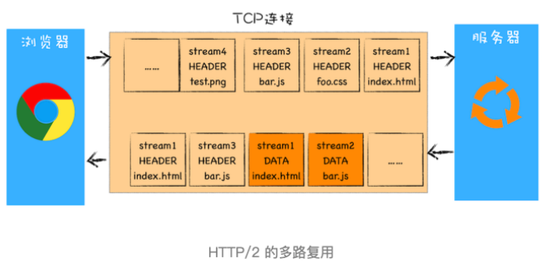
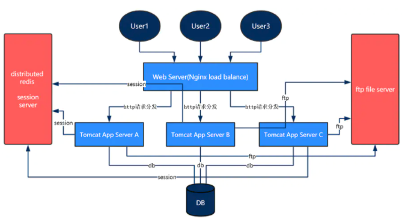
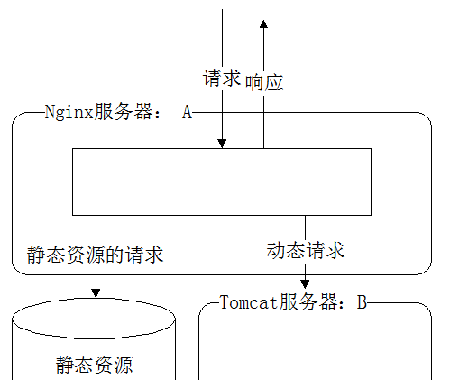

# 资源请求

<!-- 头脑风暴

前提要说明的是：客户端的带宽、CPU，与

多个链接会分割用户的速率，就比如一条水管一样

http/0.9 http/1 http/2

这块可以看浏览器的渲染原理

时长：20 min，因此有些内容可以外链省略。
虚拟机地址
-->

## 前言

本文将通过 network 工具分析结合请求发起、请求响应这两个方面来说明如何减少资源请求的时间。这里的请求响应不包括资源下载的时间。


**目标读者**：希望了解如何减少 Web 资源请求响应时间以及 HTTP2 有什么性能上的提升。

**文章大纲**：

- 发起请求
  - DNS 解析
  - TCP
  - HTTP1
- 请求响应
  - CDN
  - 负载均衡、集群
  - HTTP2 的性能提升

## 请求的发起

以淘宝网为例，在浏览器地址栏输入 [www.taobao.com](https://www.taobao.com/) 首次访问系统，查看 network 面板记录的具体信息：


从上图可知，要成功发起一个 HTTP 请求前，需要等候排队，然后通过 DNS 解析域名获得 IP 地址、其次是 TCP 连接、SSL 验证（若有），最后才能发起一个 HTTP 请求。

因此只要任意一个节点出现问题，都有可能增加请求的发送时间。

### DNS 解析

> DNS 是：1. 一个由分层的 DNS 服务器（DNS Server）实现的分布式数据库。2. 一个使得主机能够实现查询分布式数据库的应用层协议。

浏览器要成功发起一个 HTTP 应用请求，先要进行 TCP 的连接，而要进行 TCP 的连接，则需要知道目标服务器的 IP 地址，而现在浏览器只知道用户输入的 URL 地址，因此需要解析协议以及路径名，然后向 DNS 服务器查询 Web 服务器的 IP 地址，下面我们访问一个新的地址，比如淘宝 www.taobao.com 地址具体的查询过程如下图：


1. 在浏览器中输入 www.taobao.com 域名，浏览器如果有缓存就采用浏览器的映射。否则操作系统会先检查自己本地的 hosts 文件是否有这个网址映射关系，如果有，就先调用这个 IP 地址映射，完成域名解析。
2. 如果 hosts 里没有这个域名的映射，则查找本地 DNS 解析器缓存，是否有这个网址映射关系，如果有，直接返回，完成域名解析。
3. 如果 hosts 与本地 DNS 解析器缓存都没有相应的网址映射关系，首先会找 TCP/ip 参数中设置的首选 DNS 服务器即本地 DNS 服务器，如果要查询的域名包含在本地配置区域资源中，则返回解析结果给客户机，完成域名解析，此解析具有权威性。
4. 如果要查询的域名，不由本地 DNS 服务器区域解析，但该服务器已缓存了此网址映射关系，则调用这个 IP 地址映射，完成域名解析，此解析不具有权威性。
5. 如果本地 DNS 服务器中查找失败，则会继续向根 DNS 服务器、TLD DNS 以及权威 DNS 服务器进行查询。

现在我们借助 nslookup 命令来大概模拟 DNS 查询的过程：

```bash
$ nslookup
> www.taobao.com # 要查询的域名
Server:		8.8.8.8 # 往上连接的 DNS 服务器
Address:	8.8.8.8#53 # DNS 服务器 IP 地址与端口

Non-authoritative answer: # 非权威答案，从上连接 DNS 服务器本地缓存中读取，非实际查询得到
www.taobao.com	canonical name = www.taobao.com.danuoyi.tbcache.com.
Name:	www.taobao.com.danuoyi.tbcache.com
Address: 47.246.24.234 # IP 地址
Name:	www.taobao.com.danuoyi.tbcache.com
Address: 47.246.24.233
>
```

如果想进一步研究，这里有一个交互动画协助理解 [Recursive/Iterative Queries in DNS](https://media.pearsoncmg.com/aw/ecs_kurose_compnetwork_7/cw/content/interactiveanimations/recursive-iterative-queries-in-dns/index.html)

<!-- 再看看 network 的 timing 信息：
How to view DNS cache in OSX? https://stackoverflow.com/questions/38867905/how-to-view-dns-cache-in-osx

https://www.bbsmax.com/A/kjdwX4BEzN/
 -->

可以看出，如果浏览器或本机系统没有 DNS 缓存，这会是一个非常耗时的过程。

#### DNS prefetch

DNS 自动缓存是需要访问过后的，那对于首次访问的地址来说，我们还可以通过 DNS prefetch 提前告知浏览器让它在空闲时间进行域名的预解析为 IP 地址。这样在真正发起请求时，就可以节省这部分时间。

我们可以通过手动或动态添加以下声明，假设我们的资源（比如字体、图片等）存放在不同的域名下：

```html
<!-- 这是淘宝首页的一段代码 -->
<!-- Prefetch DNS for external assets -->
<link rel="dns-prefetch" href="//gw.alicdn.com" />
<link rel="dns-prefetch" href="//g.alicdn.com" />
<link rel="dns-prefetch" href="//img.alicdn.com" />
```

<!-- TODO，添加后续的请求 network 时间线截图，证明后续的请求节省了该时间 -->

或者通过 HTTP Link 头：

```bash
Link: <https://img.alicdn.com>; rel=dns-prefetch
```

<!-- - 使用构建工具添加 -->

<!-- ，prefetch 不会阻止 onload 事件 -->

<!-- 看下我司一个 Vue 项目系统，可 懒加载的资源都自动添加了 prefetch，我们公司的系统都是 IP 地址，客户的有域名，虚拟机域名，可以看看 DIST 官网-->

### TCP

经过 DNS 查询到 IP 后，这个时候可以建立 TCP 连接，如下图：



在三次握手后就判断了对方的发送能力和接收能力都是正常的，从而成功建立连接。


在传输过程中，有可能出现以下两种情况：

- 发送方的发送能力（比如 120）与接收方的接收能力（100）不一致。
- 管道传输能力不够。（比如只有 50）

针对第一种情况：TCP 采用流量控制，设定**接收窗口**，避免发送端过多向接收端发送数据。发送量不能超过接收窗口量。

针对第二种情况：TCP 采取了一种机制叫做“慢启动”：因为不清楚实时的管道能力，于是在刚开始传送数据的时候，从一个很小的单位值做尝试；在之后的传送过程中，逐渐翻倍增大传送数据单位值。遇到失败的情况，就立马减小传输数据单位值。

如果想进一步研究，这里有一个交互动画协助理解 [Recursive/Iterative Queries in DNS](https://media.pearsoncmg.com/aw/ecs_kurose_compnetwork_7/cw/content/interactiveanimations/recursive-iterative-queries-in-dns/index.html)

#### 增大初始拥塞窗口

由于采取了慢启动可能会导致客户端与服务器之间经过几百 ms 才能达到最大速度的问题，对于大型流式下载服务的影响不明显，因为慢启动的时间可以分摊到整个传输周期。

而对于很多 HTTP 连接，特别是一些短暂、突发的连接而言，常常会出现还没有达到。最大窗口请求就被终止的情况（比如传输完）。也就是说，很多 Web 应用的性能经常受到服务器与客户端之间往返时间的制约。因为慢启动限制了可用的吞吐量，而这对于小文件传输非常不利。

这个时候，我们可以考虑增大 TCP 的初始拥塞窗口。


如果想进一步研究，这里有一个交互动画协助理解 [Selective Repeat Protocol.](https://media.pearsoncmg.com/aw/ecs_kurose_compnetwork_7/cw/content/interactiveanimations/selective-repeat-protocol/index.html)

<!-- Tomcat 如何设置后续 -->

<!-- keep-alive 的作用是什么呀？请求完就关闭连接了吗 -->

<!-- 由于双方发送能力与接收能力可能不一致，于是需要 TCP 进行拥塞控制。 -->

<!-- - 拥塞控制
- 慢启动 -->

<!-- 出现的性能原因 -->

<!-- 关于 TCP 这块，要详细说得新开几篇文章来讲。我们只需关注
TCP 连接时间。缓慢可能是由于拥塞造成的，服务器已达到限制，并且在现有连接未决时无法响应新连接。 因此这里不说更多细节。

tomcat 服务器设置：
- 禁用 SSR
- 增大初始堵塞窗口 -->
<!-- - dns-prefetch
- preconnect 预连接
既然建立连接也挺费时，我们也可以使用 preconnect 进行预连接。
- prefetch
- preload
- prerender -->

#### preconnect

除了修改服务端的处理，增大初始拥塞窗口外，我们还可以在客户端提前进行告知浏览器进行 TCP 连接：

```html
<link ref="preconnect" href="//example.com" />
<link ref="preconnect" href="//example.com" crossorigin />
```

相比于 DNS Prefetching，Preconnect 除了提前完成域名的 DNS 解析，还更进一步地完成 http 连接通道的建立，包括 TCP 握手、TLS（Transfer Layer Security） 协商等。

### HTTP

HTTP 是使用 TCP 作为它的支撑运输协议，一旦 TCP 连接建立起来，浏览器与服务端就可以通过套接字接口访问 TCP，并在各自的套接字门口发送 HTTP 请求报文以及接收 HTTP 响应报文。


HTTP 版本目前经历过 HTTP/0.9、HTTP/1.0 以及 HTTP/1.1 的发展，关于 HTTP 发展史，可以参考 https://blog.poetries.top/browser-working-principle/guide/part6/lesson29.html#%E8%B6%85%E6%96%87%E6%9C%AC%E4%BC%A0%E8%BE%93%E5%8D%8F%E8%AE%AE-http-0-9。

HTTP/1.0 每进行一次 HTTP 通信都需要经历 TCP 连接、传输 HTTP 数据和断开 TCP 连接三个阶段。


#### HTTP/1.1

随着浏览器单个页面中的图片文件越来越多，特别是单应用时代，有时候一个页面可能包含了几百个外部引用的资源文件，如果在下载每个文件的时候，都需要经历建立 TCP 连接、传输数据和断开连接这样的步骤，无疑会增大大量无谓的开销。

为了解决这个问题，HTTP/1.1 增加了持久连接的方法，它的特点是在一个 TCP 连接上可以传输多个 HTTP 请求，只要浏览器或者服务器没有明确断开连接，那么该 TCP 连接会一直保持。


从上图可以看出，HTTP 的持久连接可以有效减少 TCP 建立连接和断开连接的次数，这样的好处是减少了服务器额外的负担，并提升整体 HTTP 的请求效率。

持久连接在 HTTP/1.1 中是默认开启[Keep-Alive](https://developer.mozilla.org/zh-CN/docs/Web/HTTP/Headers/Keep-Alive)的（HTTP/1.0 需要在请求头声明`Connection: Keep-Alive`），所以你不需要专门为了持久连接去 HTTP 请求头设置信息，如果你不想要采用持久连接，可以在 HTTP 请求头中加上 Connection: close。也可以在响应头中设置 `Keep-Alive: timeout=30` 的连接时间，以秒为单位。

```bash
HTTP/1.1 200 OK
Connection: Keep-Alive
Content-Encoding: gzip
Content-Type: text/html; charset=utf-8
Date: Thu, 11 Aug 2016 15:23:13 GMT
Keep-Alive: timeout=5, max=1000
Last-Modified: Mon, 25 Jul 2016 04:32:39 GMT
Server: Apache

(body)
```

目前浏览器中对于同一个域名，默认允许同时建立 6 个 TCP 持久连接。

<!-- keep-alives -->

<!-- 通过了解决 HTTP/0.9 到 HTTP 1.1，HTTP 1.1 比较明显的优化是对持久链接做了性能方面上的优化 -->
<!-- - 我们如何最大利用/开启这些特性？，默认已经开启了 -->

#### HTTP/2

HTTP/2 的出现是为了解决 HTTP/1.1 的主要问题：

1. TCP 的慢启动。这个在前面 TCP 已经说过，对于一些关键资源不大的文件，比如 HTML 文本、CSS 文件和 JavaScript 文件，通常这些文件在 TCP 连接建立好之后就要发起请求的，但这个过程是慢启动，所以耗费的时间比正常的时间要多，这样就推迟了首屏渲染。

2. 多个 TCP 连接，会竞争固定的带宽，会影响某些关键资源的优先下载。
3. 最严重的一个问题就是 HTTP/1.1 队列阻塞的问题，虽然可以公用一个 TCP 管道，但是在一个管道中同一时刻只能处理一个请求，在当前的请求没有结束之前，其他的请求只能处于阻塞状态，直到该请求结束或被超时被取消（之前就遇到过测试环境与生产环境的地址不同的请求导致阻塞）。

假如有一个请求被阻塞了 5 秒，那么后续排队的请求都要延迟等待 5 秒，在这个等待的过程中，带宽、CPU 都被浪费了。

在浏览器处理生成页面的过程中，是非常希望能提前接收到数据进行预处理的，比如对图片提前进行编解码等，从而提升后续使用时的速度。

**至于 HTTP/2 是如何解决的呢？**

HTTP/2 的思路就是一个域名只使用一个 TCP 长连接来传输数据，这样整个页面资源的下载过程只需要一次慢启动，同时也避免了多个 TCP 连接竞争带宽所带来的问题。

HTTP/2 支持资源的并行请求，从而解决队列阻塞问题，如下图：



HTTP/2 使用**多路复用机制**（从不同套接字中收集数据块进行拼接），从途中你会发现每个请求都有一个对应的 ID，如 stream1 表示 index.html 的请求，stream2 表示 foo.css 的请求。浏览器可以讲请求发送给服务器，而服务器也可以随意发送请求，因为每份数据都有对应的 ID，浏览器接收后，会筛选出相同 ID 的内容，将其拼接为完整的 HTTP 响应数据。具体实现见[HTTP/2 多路复用的实现](https://blog.poetries.top/browser-working-principle/guide/part6/lesson30.html#%E5%A4%9A%E8%B7%AF%E5%A4%8D%E7%94%A8%E7%9A%84%E5%AE%9E%E7%8E%B0)

**其他的性能优化：**

- 可以设置请求的优先级。
- 服务器推送
  - 服务器可以主动把关联页面的资源一并提前发送，比如请求了 HTML 页面，可以把几个重要的 JS 文件和 CSS 文件一并发送。
- 请求头和响应头进行压缩。
  - 虽然一个 HTTP 的头文件不大，但是积少成多，比如 100 个资源的 HTTP 请求头都压缩为原来的 20%，那么传输效率则大幅提升。

<!-- 先大概了解，后续再拿实践，相关生态实现也还没，需要开发支持 http2 的服务器，也要协商好浏览器的发送 -->
<!-- 值得一提的是，vite 的实现 -->
<!-- 如何查看 HTTP/2 -->

HTTP/2 协议规范于 2015 年 5 月正式发布，我们可以看看淘宝网。


#### prefetch 与 preload

假若我们暂时不能升级到 HTTP/2，但我们还可以通过 pre-机制做些优化的。

**prefetch**：对资源预提取，向浏览器指示即使页面中未检测到它也可以下载给定资源。资源下载优先级低，在浏览器空闲时下载但不进行解析。

```html
<link href="css/AnaDataEyeAnalysis.4be3a798.css" rel="prefetch" />
<link href="css/AnaIndexData.6f0eac4f.css" rel="prefetch" />
<link href="css/BaseDateHandleAiProduct.4d3d1ff4.css" rel="prefetch" />
```

**preload**：对资源预加载，告诉浏览器必须尽快下载具有高优先级的给定资源，把资源下载下来并进行解析，但不会执行。

```html
<!-- 摘取 vue-cli 项目 -->
<link href="css/app.483ea229.css" rel="preload" as="style" />
<link href="css/chunk-vendors.e9de61f9.css" rel="preload" as="style" />
<link href="js/chunk-vendors.1c060fbe.js" rel="preload" as="script" />
<link href="js/app.a748d987.js" rel="preload" as="script" />
```

在 vue-cli3 生成的项目中，进行路由设置懒加载：

```js
export default {
  redirect: {
    name: "AnaIndexData",
  },
  component: () =>
    import(
      /* webpackChunkName: "ToolMap" */ "FZBZ/NatureAnalysisEvaluation/AIAnalysis"
    ),
  // ...
};
```

webpack 插件会自动处理，动态生成 preload 和 prefetch 的 link 标签插入到 html 中。

<!-- 这两个值在 vue-cli 项目中就可以看到 -->
<!-- [prefetch 和 preload 及 webpack 的相关处理](https://juejin.im/post/6844904142402502669#heading-3) -->

## 请求的响应

<!-- 10min，都是科普为主，这一块，更多在后端，后续再添加上 demo 实战 -->

我们知道在发起请求方，做的优化毕竟有限。那我们是否可以从响应方入手，比如使用集群、分布式方案以及把静态资源部署到 CDN 上呢？答案是肯定的。

<!-- 5min -->

### 集群

<!-- 一台服务器 -->
<!-- 部署到外网服务器与阿里云的服务器进行处理，模拟 -->
随着业务的提升，用户量的访问增加，我们需要更多的服务器来提升响应速度，这就是集群。

**集群**主要是指同一个系统，部署在多台服务器上，那请求过来的时候这些服务器如何协同分工呢？这就涉及`负载均衡`的概念了，负载均衡是指将请求分摊到多个操作单元进行执行。



`nginx` 是常用的反向代理服务，可以用来做负载均衡。

<!-- 可以一起了解一下，还可以顺便了解下正向代理。这些放在一起比较好理解，好记。，主系统可以对这些子系统进行调用，子系统之间可以有调用关系也可以没有，看实际业务情况。  -->

### 分布式

除了把同一个系统部署到多台服务器上形成集群，还可以将一个系统拆分成多个业务单元，这就是**分布式**的概念。例如一个门户网站里面可能有登录、视频、图片等，每一个都可以拆分出来独立部署，而且每一个都可以弄成集群，视频服务集群，图片服务集群。

简单的分布式处理可以是把静态资源与动态资源分离：
- 动静分离是将网站静态资源（HTML、JavaScript、CSS、img 等文件）与后台应用分开部署。
- 动静分离的一种做法是将静态资源部署在 nginx 上，后台项目部署到应用服务器上，根据一定规则使对静态资源的请求全部交给 nginx 处理，而将动态请求转发给应用服务器处理，达到动静分离的目标，从而提供网站的并发性能。



### CDN

<!-- 5min -->

<!-- CNN 这块主要是科普，可以把自己博客的七牛云图片说明下 -->
<!-- 小例子，如何把一些资源放到公共 CDN 上。或者自己搭建一个 -->

为了进一步提升服务器的响应速度，我们还可以把静态资源可以部署到 CDN 上。使用 Content Delivery Network） 是为了让我们的请求路径更短，从而提高用户访问网站的响应速度。类似分布各地的物流仓储网络，CDN 网络可以将源站的内容缓存到分布全球的 CDN 节点，根据用户的访问 IP，就近连接 CDN，提高网站响应速度。

普通的用户访问流程和使用 CDN 的网站访问如下图，其中蓝色链路是无 CDN 的链路。


如何为网站部署 CDN，需要向服务商购买 CDN 服务，把我们的源站 ip 以及域名提供即可。

一般的网站只有一台或一组服务器，用户访问站点时请求需要跨越复杂的路由链路，抵达网站服务器，经过 tcp 三次握手建立连接，服务器才会将站点数据传输给用户。

使用 CDN 加速后，CDN 在全球的分布式芥蒂娜将会拷贝一份源站的数据（图片、js、html 等静态资源）作为缓存，用户在访问源站会被 DNS 解析到最近的 CDN 服务器，并且访问缓存资源。

<!-- ## 实战例子分析
看需要
由于我司系统暂时没有上 https，因此上图还缺少 SSL 层的记录（SSL 只是首个连接需要验证，后续只要是相同的域名即不用），
以我司某系统的为例
至于直接通过 network 面板外，也可以使用 lighthouse 生成测试报告，看看有什么可以采取的建议。 -->

## 总结

本文通过请求的发起谈及了 DNS 解析、TCP 以及 HTTP 在前端层面可以做的优化，再反过来从请求的响应讲述了使用集群、分布式和 CDN 的性能需求。下一篇，我们将通过《资源下载》谈谈如何减少 HTTP 请求次数以及减少单次请求所花费的时间。

## 参考资料

- [Web 性能优化资源合集（持续更新）](../reference/README.md#网络)
