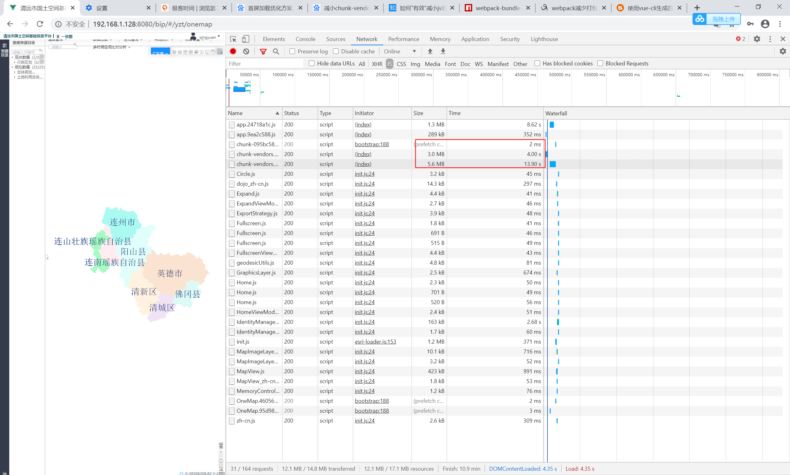
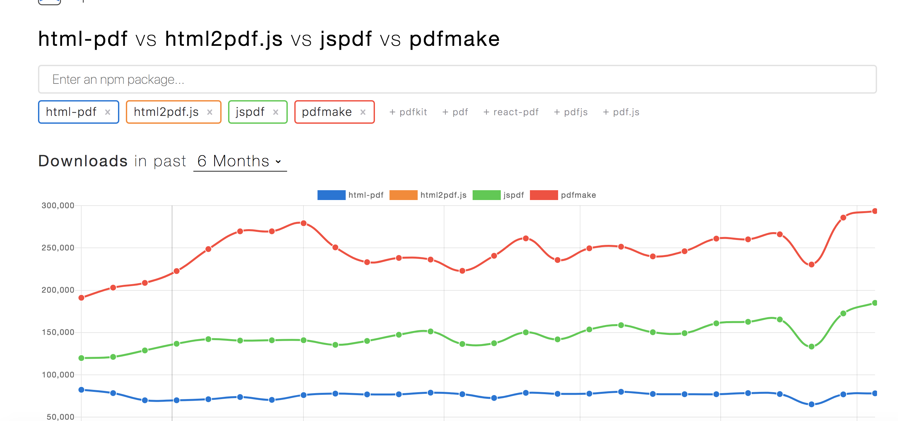
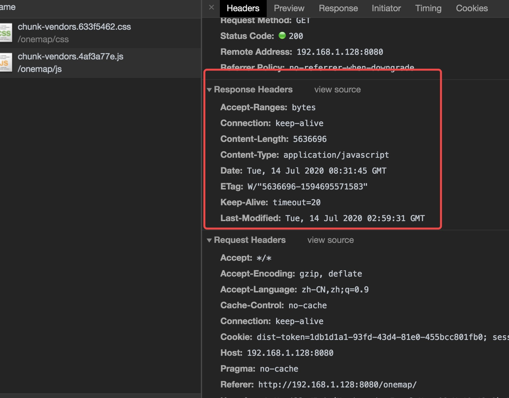

# webpack 优化

头脑风暴

<!-- 通过分析，发现主要存在几个问题

chunk-vendors.js文件过大，差不多500K。
加载图片太多，全部图片并发请求渲染。
dom 节点一次渲染1000条左右。
请求量过多。 -->

- 如何直到浏览器请求的是 gzip 文件而不是 js 文件。

如何分析 chunk-vendors 的文件来源

清远 demo

## 前言

HTTP 优化两个大的方向：

- 减少请求次数
- 减少单次请求所花费的时间

这两个优化点指向了我们日常开发中非常常见的操作——资源的压缩与合并。这是构建工具在做的事情，现今最流行的构建工具是 Webpack。

## Webpack 的性能平静瓶颈

webpack 优化的性能瓶颈

- 构建过程太花时间
- 打包的结果体积太大

## Webpack 的优化方案

- 使用 Tree Shaking
- 分割代码以按需加载
- 输出分析

### 构建过程提速策略

### 构建结果体积压缩

#### 文件结构可视化，找出导致体积过大的原因

#### 拆分资源

#### 删除冗余代码

#### 按需加载

## vueCli 的优化配置

因为 vueCli 本身是对 Webpack 做了一层封装，优化的思路跟 Webpack 一样。

## Gzip 压缩原理

说到压缩，可不只是构建工具的专利。我们日常开发中，还有一个方便的压缩操作：开启 Gzip。

具体做法非常简单，只需要在你的 request headers 添加上这么一句：

```bash
accept-encoding: gzip
```

这是跟 HTTP 压缩有关：

> HTTP 压缩是一种内置到网页服务器和网页客户端中以改进传输速度和带宽利用率的方式。在使用 HTTP 压缩的情况下，HTTP 数据从服务器发送前就已经压缩：兼容的浏览器将在下载所需的格式前宣告支持何种方法给服务器；不支持压缩方法的浏览器将下载未经压缩的数据。最常见的压缩方案包括 Gzip 和 Deflate。

HTTP 压缩就是以缩小体积为目的，对 HTTP 内容进行重新编码的过程。

Gzip 的内核就是 Deflate，目前我们压缩文件用得最多的就是 Gzip。


上图是 webpack 对 JS、CSS 开启了 gzip 的压缩。画框中的 JS 源文件为 1.3MB，压缩后为 343 KB，压缩率达到 70% 以上。

### 该不该用 Gzip

如果你的项目不是极端的迷你超小型文件，都可以试试 Gzip。

有的同学或许存在这样的疑问：压缩 Gzip，服务端要花时间；解压 Gzip，浏览器要花时间。中间节省出来的传输时间，真的那么可观吗？

答案是肯定的。如果你手上的项目是 1k、2k 的小文件，那确实是有点高射炮打蚊子的意思。但更多的时候，我们处理的都是具备一定规模的项目文件。实践证明，这种情况下压缩和解压缩带来的传输过程中节省下的时间开销来说，可以说是微不足道的。

### Gzip 是万能的吗？

首先要承认 Gzip 是高效的，压缩后通常能帮我吗减少响应 70% 左右的大小。

但它并非万能的。Gzip 并不保证针对每一个文件的压缩都会使其变小。（图片则不行）

Gzip 压缩背后的原理，<u>是在一个文本文件中找出一些重复出现的字符串、临时替换它们，从而使整个文件变小。</u>根据这个原理，文件中代码的重复率越高，那么压缩的效率就越高，使用 Gzip 的收益也就越大。反之亦然。

### Webpack 的 Gzip 和服务端的 Gzip

一般来说，Gzip 压缩是服务器的活儿：服务器了解到我们这边有一个 Gzip 压缩的需求，它会启动自己的 CPU 去为我们完成这个任务。而压缩文件这个过程本身是需要耗费时间的，我们可以理解为<u>以服务器压缩的时间开销和 CPU 开销（以及浏览器解析压缩文件的开销）为代价，省去了一些传输过程中的时间开销。</u>

既然存在着这样的交换，那么就要求我们学会权衡。服务器的 CPU 性能不是无限的，如果存在大量的压缩需求，服务器也扛不住的的。服务器一旦因此慢下来了，用户还是要等。Webpack 中 Gzip 压缩操作的存在，事实上就是为了在构建过程中去做一部分服务器的工作，为服务器分压。

因此，这两个地方的 Gzip 压缩，谁也不能替代谁。作为开发者，我们也应该结合业务压力的实际强度情况，去做好其中的权衡。

```js
 plugins:
      process.env.NODE_ENV === "production"
        ? [
            new CompressionPlugin({
              filename: "[path].gz[query]",
              algorithm: "gzip",
              test: new RegExp(
                "\\.(" + productionGzipExtensions.join("|") + ")$"
              ),
              threshold: 10240,
              minRatio: 0.8
            }),
            // webpack 依赖库分析
            process.env.npm_config_report
              ? new BundleAnalyzerPlugin({
                  analyzerMode: "static"
                })
              : function none() {}
          ]
```

### 如何减小 chunk-vendors.js 体积



- gzip
- uglifyOptions
- 按需引入包


vuecli 直接的启用

下图通过由于 Vuecli3 基于 webpack 封装好的脚手架，同样需要安装 webpack-boundle-analyzer，然后在 vue.config.js 配置：

```js
  chainWebpack: config => {
    if (process.env.use_analyzer) {
      config.plugin("webpack-bundle-analyzer")
      .use(require("webpack-bundle-analyzer").BundleAnalyzerPlugin)
    }
```

```json
{
  "scripts": {
    "analysis": "use_analyzer=true yarn build"
  }
}
```


可以看到跟 network 对应起来的 chunk-vendors.dd4bc412 这样更加友好，可以直到由哪些包导致。



可以看到 pdfmake 占用较大，并且项目还安全了 jspdf。


如何查看 gzip 是否正常使用，也就是说前端启动 gzip 后，后端返回的文件是否是前端 gzip 压缩的文件。

重要的是，您的服务器可以返回 gzip 和未压缩的响应，具体取决于该标头的存在和值。如果客户端没有发送 Accept-Encoding 标头，则您不应该压缩它。

```ap
accept-encoding:gzip
```

这个还要服务端开启 gzip 的压缩，看看是否发送的文件大小有问题。

### gzip 的通讯过程

浏览器端发送请求 js 文件，对于有压缩需求的请求，服务端可以自己进行压缩，也可以选用前端用构建工具如 webpack 打包的文件，然后传输给浏览器端。

1. 浏览器发送 Http request 给 Web 服务器,  request 中有 Accept-Encoding: gzip, deflate。 (告诉服务器， 浏览器支持 gzip 压缩)

2. Web 服务器接到 request 后， 生成原始的 Response, 其中有原始的 Content-Type 和 Content-Length。

3. Web 服务器通过 Gzip，来对 Response 进行编码， 编码后 header 中有 Content-Type 和 Content-Length(压缩后的大小)， 并且增加了 `Content-Encoding:gzip.`  然后把 Response 发送给浏览器。

4. 浏览器接到 Response 后，根据 Content-Encoding:gzip 来对 Response 进行解码。 获取到原始 response

### 流式解压

- [ZIP 也能边下载边解压？流式解压技术揭秘](https://mp.weixin.qq.com/s/NB12KQOHjso9wH8Ju1ueSA)

#### 实践

Accept-Encoding 数据以哪种编码方式传输，限制服务端如何进行数据压缩，浏览器会自动加上这些头信息。

```js
var DOCUMENT_ROOT = "./app";
var DIRECTORY_INDEX = "/index.html";

var port = process.env.PORT || 9993;

var zlib = require("zlib");
var http = require("http");
var path = require("path");
var fs = require("fs");

http
  .createServer(function(request, response) {
    // Remove query strings from uri
    if (request.url.indexOf("?") > -1) {
      request.url = request.url.substr(0, request.url.indexOf("?"));
    }

    // Remove query strings from uri
    if (request.url == "/") {
      request.url = DIRECTORY_INDEX;
    }
    var filePath = DOCUMENT_ROOT + request.url;

    var extname = path.extname(filePath);

    var acceptEncoding = request.headers["accept-encoding"];
    if (!acceptEncoding) {
      acceptEncoding = "";
    }

    fs.exists(filePath, function(exists) {
      if (exists) {
        fs.readFile(filePath, function(error, content) {
          if (error) {
            response.writeHead(500);
            response.end();
          } else {
            var raw = fs.createReadStream(filePath);

            if (acceptEncoding.match(/\bdeflate\b/)) {
              response.writeHead(200, { "content-encoding": "deflate" });
              raw.pipe(zlib.createDeflate()).pipe(response);
            } else if (acceptEncoding.match(/\bgzip\b/)) {
              response.writeHead(200, { "content-encoding": "gzip" });
              raw.pipe(zlib.createGzip()).pipe(response);
            } else {
              response.writeHead(200, {});
              raw.pipe(response);
            }
          }
        });
      } else {
        response.writeHead(404);
        response.end();
      }
    });
  })
  .listen(port);

console.log("Serving files on http://localhost:" + port);
```


把 dist 文件，放到写的 gzip demo 中（examples/network/），对 vendor 进行压缩后，从 5M 缩小到 2M：


可以根据宽带的速度来计算合适的大小。（在计算机网络中,其网络传输速率的单位用 b/s(比特每秒)表示 Byte 字节 1B = 8bit1Mb/s = 1024*1024 b/s = 1024 *1024 /8 B/s = 128KB/s 理论上:2M（即 2Mb/s）宽带理论速率是：256KB/s，实际速率大约为 150~240KB/s；（其原因是受用户计算机性能、网络设备质量、资源使用情况、网络高峰期、网站服务能力、线路衰耗，信号衰减等多因素的影响而造成的）。4M（即 4Mb/s）的宽带理论速率是：512KB/s，实际速率大约为 200~440kB，网络传输与比特为单位，而计算机读取是字节为单位）

#### 如何查看

1. 可以通过请求头、响应头

```bash

```

2. 通过 network 传输的大小和实际大小


3. 再看看之前有问题的两个 js 大小：




后续 nodejs，后端需要选择前端压缩好的东西。不用动态压缩。

## 小结

- [首屏加载速度优化](https://zhuanlan.zhihu.com/p/56121620)
- [如何”有效“减小 js 包的体积](https://zhuanlan.zhihu.com/p/44095804)
- [How to use Webpack Bundle Analyzer](https://www.youtube.com/watch?v=ltlxjq4YEKU) video
- [探索 HTTP 传输中 gzip 压缩的秘密](https://segmentfault.com/a/1190000012800222)
- [有没有简单的方法来查看 Chrome 中的压缩量？](https://www.it-swarm.asia/zh/gzip/%e6%9c%89%e6%b2%a1%e6%9c%89%e7%ae%80%e5%8d%95%e7%9a%84%e6%96%b9%e6%b3%95%e6%9d%a5%e6%9f%a5%e7%9c%8bchrome%e4%b8%ad%e7%9a%84%e5%8e%8b%e7%bc%a9%e9%87%8f%ef%bc%9f/957350015/)
- [如何使用 GZIP 来优化你的网站](https://zhuanlan.zhihu.com/p/64973956)
- [你知道 Chrome Network ，Size 和 Time 为什么有两行参数吗？](https://juejin.im/post/5c78aa2ae51d4575e963dc62)
- [HTTP 压缩，浏览器是如何解析的](http://caibaojian.com/http-gzip.html)
- [vue cli 加载速度优化](https://www.jianshu.com/p/0d58dd08f5d1)
- [如何使用 GZIP 来优化你的网站](https://zhuanlan.zhihu.com/p/64973956)
- [探索 HTTP 传输中 gzip 压缩的秘密](https://segmentfault.com/a/1190000012800222)
- [你真的了解 gzip 吗？](https://juejin.im/entry/58709b9a128fe1006b29cd5d)
- [gZip compression with Node Express.js server explained. Enable Text Compression.
  ](https://www.youtube.com/watch?v=vt3jGhy56qI) 视频
- [Tomcat 启用 GZIP 压缩，提升 web 性能](https://www.cnblogs.com/DDgougou/p/8675504.html)
- demo
  - https://github.com/wimagguc/nodejs-static-http-with-gzip/blob/master/http-with-gzip.js
- [http 数据协商](https://zhuanlan.zhihu.com/p/45140046)
- [Comparing jspdf vs. pdfkit vs. pdfmake
  ](https://npmcompare.com/compare/jspdf,pdfkit,pdfmake)
