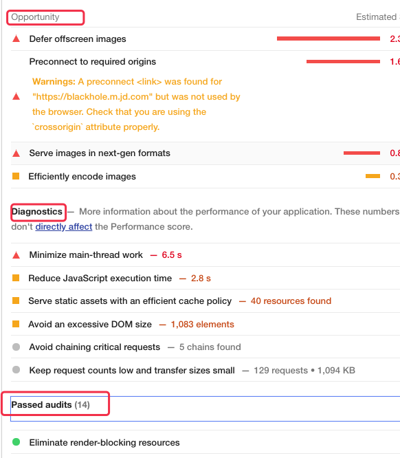
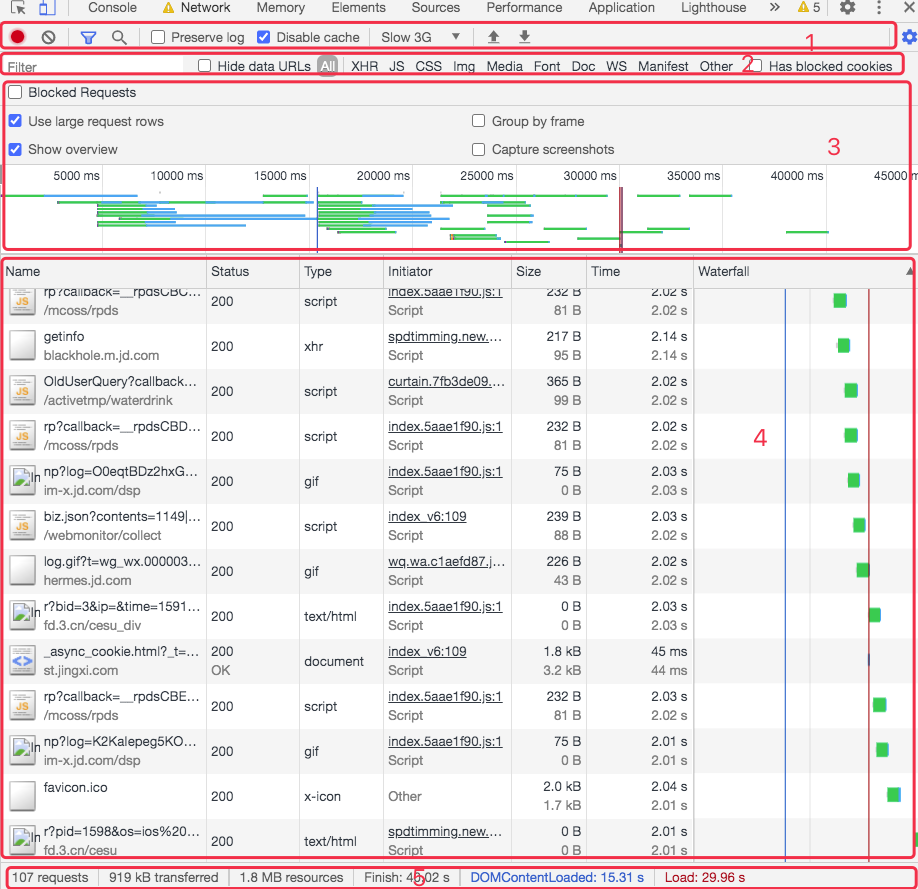

# Chrome 调试工具性能分析

## 前言

- chrome 版本：83

## 面板总览

## 分析面板介绍

- `Network`：页面中各种资源请求的情况，这里能看到资源的名称、状态、使用的协议（http1/http2/quic...）、资源类型、资源大小、资源时间线等情况。
- `Performance`：页面各项性能指标的火焰图，这里能看到白屏时间、FPS、资源加载时间线。
- `Memory`：可以记录某个时刻的页面内存等情况，一般用于分析内存泄漏。
- `JavaScript Profiler`：可以记录函数的耗时情况，方便找出耗时较多的函数。
- `Layers`：展示页面中的分层情况。

## 分析步骤说明

1. 隐身模式，避免插件影响。
2. 禁用缓存：disable cache
3. 调整网络情况为一般设备网络：slow 3G
4. 测试网站：输入https://wq.jd.com/wxportal/index_v6 
5. 从 Lighthouse 查看总览（总览）
6. 网络层面
   1. 从网路面板分析
7. 渲染层面
   1. 从性能面板分析
   2. 内存面板分析（内存泄漏）

一般可以按照上面的流程分析优化，如果预先知道了要分析的问题，即可直接选择对应的面板。（内存泄漏——内存面板）

## Lighthouse

LightHouse（以前版本是 Audits），LightHouse 是Google开源的一个自动化测试工具，它通过一系列的规则来对网页进行评估分析，最终给出一份评估报告。

Lighthouse 主要从 5 个方面给网页打分，在选择了设备、评估方面、网络情况等选项后，点击生成 report。

### 整体情况

性能指标：
- `First Contentful Paint`：首次内容绘制，标记的是浏览器渲染第一帧内容 **DOM** 的时间点，浏览器首次渲染任何文本，图像（包括背景图像），`SVG 或者 `<canvas>` 等元素。`
- `First Meaningful Paint`：首次有效绘制，标记主角元素渲染完成的时间点，主角元素可以是视频网站的视频控件，内容网站的页面框架也可以是资源网站的头图等。
- `Speed Index`：速度指标是一个页面加载性能指标，向你展示明显填充页面内容的速度，此指标的分数越低越好。
- `First CPU Idle`：首次 CPU 空闲时间。
- `Time to Interactive`：可互动时间，页面中的大多数网络资源完成加载并且 CPU 在很长一段时间都很空闲所需的时间。此时可以预期 CPU 非常空闲，可以及时的处理用户的交互操作。
- `Max Potential First Input Delay`：最大的输入延迟时间，输入响应能力对用户如何看待你应用的性能起关键作用。应用有 `100 毫秒`的时间响应用户输入。如果超过此时间，用户就会认为应用反应迟缓。

可以点击蓝色切换按钮，查看详细的信息。

### 性能指标优化建议

可以看到 Performance 方面建议，主要分为三类：Opportunities 可优化项、手动诊断项、通过的审查项。

本次例子如下：

#### 可优化项：

- 延迟视口外的图片加载。

<!-- 这个时候 webpack 的构建优化就派上用场了 -->

#### 手动诊断项：

1. 最小化主线程工作
2. 减少 JavaScript 执行时间
3. 避免 DOM 太大
4. 通过有效的缓存策略缓存一些资源
5. 避免链接关键的请求
6. 保持低请求数量和小的传输大小。

这些项目表示 LightHouse 并不能替你决定当前是好是坏，但是把详情列出来，由你手动排查每个项目的情况。这个时候就需要 `network` 和 `performance` 等面板来进一步进行分析了。

#### 通过的审查项

可以看每个条目的 showmore，从优秀的网站学习技巧，然后迁移到自己的项目上来。

## Network

使用网络面板了解请求和下载的资源文件并优化网页`加载`性能。

### 网络面板基础

1. Controls（控件）：使用这些选项可以控制 Network（网络）面板的外观和性能
2. Filters（过滤器）：使用这些选项可以控制在请求列表中显示哪些资源。
3. 细分过滤：
     - Show overview：记录各个资源请求的时间线（Waiting TTFB 和 Content Download）
     - Capture screenshots 捕获截图，双击屏幕截图放大，可以切换每一张图片。
     - 
4. Requests Table（请求列表）：此列表列出了检索的每个资源。默认情况下，此表按时间顺序排序，也就是最早的资源在顶部。单击资源名称可以获得更多信息。
5. Summary（概要）：告诉你请求的总数，传输的总数据量和加载时间。

默认情况下，请求列表显示以下列。
- `Name（名称）`：资源的名称。
- `Status（状态）`：HTTP 状态码
- `Type（类型）`：请求的资源 的 MIME 类型。
- `Initiator（发起人）`：发起请求的`对象`或`进程`。它可能有以下几种值：
  - `Parser`（解析器）：Chrome 的 HTML 解析器发起了请求。
  - `Redirect`（重定向）：HTTP 重定向启动了请求。
  - `Script`（脚本）：脚本启动了请求。
  - `Other`（其他）：一些其他进程或动作发起请求，例如用户点击链接跳转到页面，或在地址栏中输入网址。
- `Size`（尺寸）：响应头的大小（通常是几百字节）加上响应数据，由服务器提供。
- `Time`（时间）：总持续时间，从请求的开始到接收响应中的最后一个字节。
- `Waterfall（时间轴）`：`Timeline` 列显示所有网络请求的视觉

#### 查看单个资源的详细信息

- Header（标头）：与资源相关的 HTTP 头。
- Preview（预览）：预览 JSON，图片和文字资源。
- Response（响应）：HTTP 响应数据（如果有）。
- Timing（时序）：资源的请求生命周期的明细分类。

#### 查看网络时序

生命周期显示在以下类别中花费的时间：
- `Queuing`（排队）
- `Stalled`（停滞）
- 如果适用：`DNS lookup`（DNS 查找），`initial connection`（初始连接）、`SSL handshake`（SSL 握手）
- `Request sent`（请求发送）
- `Waiting`（等待）（到开始下载第一个字节的时间（TTFB））
- `Content Download`（内容下载）

也可以将鼠标悬停在资源的 Timeline（时间轴）图表上，查看此相同的信息。

### 了解资源加载时序

所有网络请求都被视为资源。当它们通过网络检索时，分为不同的生命周期。`Network （网络）面板`使用的 Resoure Timing API 提供了关于每个单独资源接收时间的详细信息。请求生命周期的主要阶段是：

### 性能分析

通过 timeline 分析

#### 排队或停止阻塞

很多个请求排队或被阻塞。这表示单个客户端检索的资源太多。在 HTTP 1.0/1.1 连接协议中，Chrome 限制每个域名最多执行 6 个 TCP 连接。如果你一次请求十二个资源，前 6 个将开始，后 6个开始排队。一旦其中一个请求完成，队列中的第一个请求项目将开始其请求过程。

要解决传统 HTTP 1 的此问题，你需要实现`分域`。即用多个子域名提供服务资源，将资源拆分到多个`子域`中，均匀分配。（或者 Websocket 协议）

上面说的修复 HTTP 1 连接数问题，不适合 HTTP 2 连接。如果你已部署 HTTP 2，不要对你的资源进行分域，因为它会影响 HTTP 2 的工作原理。在 HTTP 2 中，TCP 连接`多路复用`连接的。这消除了 HTTP 1 的 6 个连接限制，并且可以通过单个连接同时传输多个资源。

#### 接收第一个字节的时间很慢

TTFB就是等待第一个响应字节的时间，建议在200ms以下，以下情况可能会导致高TTFB:

客户端和服务器之间的网络条件差，
要么，服务器端程序响应很慢。

为了解决高 TTFB，首先要去除尽可能多的网络连接。其次，提供服务端应用的响应速度，比如数据库查询、缓存、web 服务器配置等。
  
#### 加载缓慢

如果你看到 Content Download（内容下载）阶段花费了很多时间，提高服务响应速度、并行下载等优化措施帮助不大。主要的解决方案是<u>发送更少的字节</u>。（比如，下载一张高质量的大图，可能是几兆，这个时候你需要优化图片）。

<!-- 这里可以联系到 webpack 工具的打包优化 -->

## Performance

使用性能面板可以通过记录和查看网站生命周期内发生的各种事件来提高页面的`运行时`性能。

- 如何查看性能
- 分析运行时性能

### 火焰图

## Memory

- JavaScript CPU 分析器
- 内存栈区分析器

## JavaScript Profiler

<!-- ## Application

## Elements

## Sources -->
