# 唯快不破，Chrome DevTools 性能优化手把手教学

<!-- 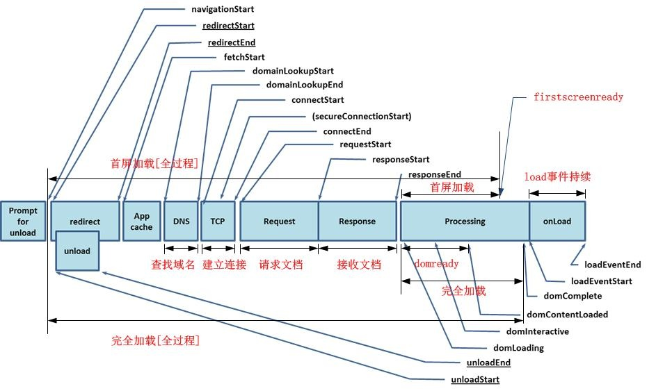 -->

performance 和 network、memory 要体现出跟官方文档不一样的地方，实战为主。

## 前言

什么因素会影响 Web 应用的性能，如何使用即时监测工具 ChromeDevTools 来分析呢？

影响 Web 应用性能的因素有很多，比如

- 网络链路
- 服务器资源
- 前端资源渲染
- 用户硬件
- ...

以上的维度不是划线而治，它们更多是犬牙交错的关系。例如在渲染过程中浏览器反应很慢，有可能是脚本写得太烂遭遇性能瓶颈，也有可能是显卡杀手游戏占用了过多计算机资源；又如在分析前端资源渲染时，往往要结合 performance 分析资源的获取时间，因为渲染页也是个动态的过程，<u>有些关键资源需要等待，有些则可以在渲染的同时加载。</u>

Chrome 的开发者工具各有自己的侧重点，如 Network 工具的瀑布图有着资源拉取顺序的详细信息，它的侧重点在于分析网络链路。而 Performance 工具的侧重点则在于前端渲染过程，它拥有帧率条形图、CPU 使用率面积图、资源瀑布图】主线程火焰图、事件总览等模块，它们和渲染息息相关，善用它们可以清晰地观察整个`渲染`阶段。

**目标读者**

- who：不知道如何使用 chrome 进行性能分析的前端工程师。
- when：当他读完本文后，能够使用 chromeDevTools 进行对 Web 应用的性能分析。

本文主要介绍常用的性能工具分析，更多的细节可以参考 chrome 官方文档。

本文使用的 chrome 版本为：85 版本

<!-- 写作目的：理清 network 和 performance 尽可能清楚的一切。 -->

<!-- 工具篇着重是 performance 和 network 其他的，先放下后续探索，明天先完成 performance 的-->
<!-- 把 network、performance、memory 三者最前 -->

**文章大纲**

- 分析面板介绍
- 分析步骤说明
- 性能优化高频面板
  - Lighthouse
  - Network
  - Performance
  - Memory
- 实时监控

<!-- Network 首屏细节？ -->

## 分析面板介绍

Chrome 开发者工具是一套内置于 Google Chrome 中的 Web 开发和调试工具，可用来对网站进行迭代、调试和分析。

### 打开 Chrome 开发者工具

首先打开 Chrome 开发者工具，有以下三种方式：

- 在 Chrome 菜单中选择 更多工具 > 开发者工具
- 在页面元素上右键点击，选择 “检查”
- 使用快捷键 Ctrl + Shift + I（window）或者 Cmd + Opt + I（Mac）


上图中对应的面板说明如下：

#### `设备模式「__」`

可以测试网站在不同分辨率下的显示情况，包括移动设备。

#### `Element`

DOM 检查允许用户动态检查网页的 DOM 结构，对嵌套进行展开折叠等操作。在网页中选中内容，在开发者工具就能 自动选中对应的 DOM 节点。在选中 DOM 节点的同时，用户能够编辑该节点的 CSS。

#### `Console`

在控制台功能中，用户可以查看网页中使用 console 命令输出的信息，这个应用调试和代码跟踪提供了极大的方便。同时，用户还可以直接在控制台中执行 JS 代码，在网页加载完毕后手动调用网页中定义的函数或者访问网页中的变量等。

#### `Sources`

源码查看，用户能够安装域名分组查看网页加载的所有资源内容，静态对代码进行检查。对于 JS 代码，还能在该功能中对代码设置断点，进行单步调试和跟踪，设置跟踪变量，查看调用函数调用栈，查看事件侦听等。
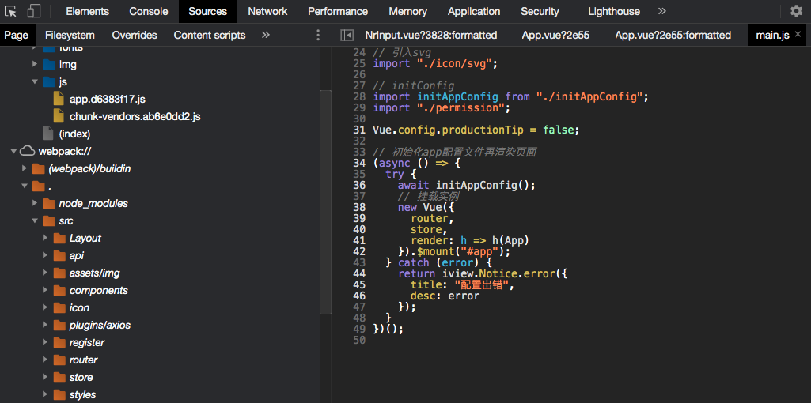

#### `Network`

网络瀑布图，网络瀑布图中为用户详细记录了网页所发出的每一个请求，并且默认按照发起的先后顺序进行排序。在网络瀑布图中，展示了每个请求所花费的时间和每个请求的头信息，为网页调试和性能调优提供强有力的支持。
在这里能看到资源的名称、状态、使用的协议（http1/http2/quic...）、资源类型、资源大小、资源时间线等情况。

#### `Performance`

页面各项性能指标的火焰图，这里能看到白屏时间、FPS、资源加载时间线。

#### `Memory`

可以记录某个时刻的页面内存等情况，一般用于分析内存泄漏。

#### `Application`


在资源管理功能中，按照资源类型对网页中的所有资源进行了分类管理，资源包括图片、JS、CSS、文档、WebSQL、IndexDB、LocalStorage、SessionStorage、Cookies、Cache 和 Service Worker 等。

#### `Security`

用于检测当前页面的安全性。

- 如果被请求的页面通过 HTTP 提供服务，那么这个主源就会被标记为不安全。
- 如果被请求的页面是通过 HTTPS 获取的，但这个页面接着通过 HTTP 继续从其他源检索内容，那么这个页面仍然被标记为不安全。

#### `Lighthouse`

来自 Google 的描述： Lighthouse 是一个开源的自动化工具，用于改进网络应用的质量。 您可以将其作为一个 Chrome 扩展程序运行，或从命令行运行。 您为 Lighthouse 提供一个您要审查的网址，它将针对此页面运行一连串的测试，然后生成一个有关页面性能的报告
会对页面的加载进行分析，然后给出提高页面性能的建议。

#### `JavaScript Profiler`

可以记录函数的耗时情况，方便找出耗时较多的函数。

#### `Layers`

展示一个页面中的分层情况，一个 web 页面由很多层叠加而成。

如前面所示，Chrome 的分析面板有很多，由于性能优化中常用的面板主要是 Network、Performance、Memory，接下来主要讲解这几个面板，至于其他的工具面板建议直接阅读 [Chrome 官方文档](https://developers.google.com/web/tools/chrome-devtools)。

## 分析步骤说明

下面是性能分析需要一些准备工作和分析步骤。

1. 进入隐身模式，这是为了避免浏览器的插件影响。
2. 在 network 面板进行禁用缓存：disable cache
3. 根据网站是 PC 或者移动，调整网络情况为：fast 3G/slow 3G 。
4. 输入任意的测试网站：这里有个例子，可以使用在线页面 [https://www.bilibili.com/](https://www.bilibili.com/)，也可以测试任何项目上的地址。
5. 然后从 Lighthouse 查看总览
6. 对于网络层面的性能问题，进一步从
   1. Network 面板分析
7. 对于渲染层面的性能问题，进一步从
   1. Performance 面板分析
   2. Memory 面板分析（内存泄漏）
   3. ...

一般情况都可以按照上面的流程分析优化，如果预先知道了要分析的问题所在，即可直接跳到对应的步骤，选择关联的面板进行具体的分析，比如内存泄漏问题，可以在内存面板查看比 Performance 更多的信息。

## Lighthouse

LightHouse（以前版本是 Audits），LightHouse 是 Google 开源的一个自动化测试工具，它通过一系列的规则来对网页进行评估分析，最终给出一份评估报告。


Lighthouse 主要从 性能（Performance）、无障碍使用（Accessibility）、Best Practices、SEO、Progressive Web App 五个方面给网页评估打分，在选择了设备、评估方面、网络情况等选项后，点击生成 report 。


### 整体性能指标情况

关于性能指标这块，下面是简单的解释：

- `First Contentful Paint`：首次内容绘制，标记的是浏览器渲染第一帧内容 **DOM** 的时间点，浏览器首次渲染任何文本，图像（包括背景图像），SVG 或者 `<canvas>` 等元素。
- `Speed Index`：速度指标是一个页面加载性能指标，向你展示明显填充页面内容的速度，此指标的分数越低越好。
- `Larget Contentful Paint`：表示`可视区“内容”最大的可见元素开始出现在屏幕上`的时间点。
- `Time to Interactive`：可互动时间，页面中的大多数网络资源完成加载并且 CPU 在很长一段时间都很空闲所需的时间。此时可以预期 CPU 非常空闲，可以及时的处理用户的交互操作。
- `Total Blocking Time`：
- `Cumulative Layout Shift`：衡量视觉稳定性，比如页面内容的意外移动。

可以点击蓝色切换按钮，查看详细的信息，也可以看看这篇文章 [解读 Web 性能体验和质量指标](./indicator.md)

### 性能指标优化建议

可以看到 Performance 方面建议，主要分为三类：可优化项提示、手动诊断项、通过的审查项。

本次例子如下：


#### 可优化项：

-  合适尺寸的图片。
- 排除渲染阻塞资源。
- 移除无用的 JavaScript 脚本。

这个时候可以借助 webpack 等打包工具进行分析处理。

#### 手动诊断项：

1. 最小化主线程工作
2. 减少 JavaScript 执行时间
3. 避免 DOM 太大
4. 通过有效的缓存策略缓存一些资源
5. 避免链接关键的请求
6. 保持低请求数量和小的传输大小。

这些项目表示 LightHouse 并不能替你决定当前是好是坏，但是把详情列出来，由你手动排查每个项目的情况。这个时候就需要 `network` 和 `performance` 等面板来进一步进行分析了。

#### 通过的审查项

可以看每个条目的 showMore，从优秀的网站学习技巧，然后迁移到自己的项目上来。

## Network（重点）

<!-- performance 和 network、memory 要体现出跟官方文档不一样的地方，实战为主。而不是文档的照搬，是否搬一部分还是怎么样呢？ -->

接下来我们看看你 Network 网络面板的具体细节，Network 用于了解请求和下载的资源文件并优化网页`加载`性能。


### 网络面板基础


#### 1. Controls（控件）

Controls（控件）：使用这些选项可以设置网络状态、禁用缓存等。


#### 2. Filters（过滤器）

Filters（过滤器）：使用这些选项可以控制在请求列表中显示哪些资源。

可以指定以下条件进行过滤：

- `domain`: 资源所在的域，即 url 中的域名部分。
- `has-response-header`：资源是否存在响应头，无论其值是什么。如 has-response-header: Access-Control-Allow-Origin。
- `is`：当前时间点在执行的请求。比如：running。
- `large-than`：显示大于指定值大小规格的资源。单位是字节（B）、K（KB）、M（MB）等。如 larger-than: 150k。这样可以快速定位比较大的资源文件。
- `method`: 使用何种 HTTP 请求方式。如 GET。
- `mime-type`：也写作 content-type，是资源类型的标识符。如 text/html。
- `scheme`：协议规定，如 HTTPS。
- `set-cookie-name`：服务器设置的 cookie 名称。
- `set-cookie-value`：服务器设置的 cookies 的值。
- `status-code`：HTTP 响应头的状态码。

#### 3. 其他设置

- `Use large request rows`：使用大请求行，Request Table 默认情况下一个资源只显示很小的一行。开启该选项后，可以显示两个文本字段：主要字段和次要字段，这个对于 time 和 size 两个列来说对性能优化分析很有帮助。
- `Show overview`：记录各个资源请求的时间线（Waiting TTFB 和 Content Download）
- `Capture screenshots`： 捕获截图，双击屏幕截图放大，可以切换每一张图片。
  - 

#### 4. Requests Table（请求列表）

此列表列出了检索的每个资源。默认情况下，此表按时间顺序排序，也就是最早的资源在顶部。单击资源名称可以获得更多信息。

默认情况下，请求列表（request table）显示以下列。


- `Name（名称）`：资源的名称。
- `Status（状态）`：HTTP 状态码
- `Type（类型）`：请求的资源 的 MIME 类型。
- `Initiator（发起人）`：发起请求的`对象`或`进程`。它可能有以下几种值：
  - `Parser`（解析器）：Chrome 的 HTML 解析器发起了请求。
  - `Redirect`（重定向）：HTTP 重定向启动了请求。
  - `Script`（脚本）：脚本启动了请求。
  - `Other`（其他）：一些其他进程或动作发起请求，例如用户点击链接跳转到页面，或在地址栏中输入网址。
- `Size`（尺寸）：响应头的大小（通常是几百字节）加上响应数据，由服务器提供。
  - 开启大的行可以查看没被解压之前的数据大小。
- `Time`（时间）：总持续时间，从请求的开始到接收响应中的最后一个字节。
- `Waterfall（瀑布图）`：`Timeline` 列显示所有网络请求的视觉。

在标题栏如（Name 上）右键，可以添加或删除信息列。比如可以多加一列 Response Header => Content-Encoding 选项来总览页面资源的 gzip 压缩情况。

##### 重新发起 xhr 请求

除了通过刷新页面、点击按钮等方式去触发重复的 `xhr` 请求外，还可以通过 `Replay XHR` 实现。


##### Size 和 Time 为什么有两行参数

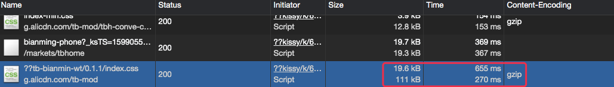

###### Size 列

- 第一行表示的是数据的传输时的大小，例如上图中的 19.6kB。
- 第二行表示的是数据实际的大小 111 kB。

在服务端采取 gzip 压缩算法将原有 `111kB` 压缩至 `19.6kB`，传输大小缩短 5.6 倍，大大提供了资源传输的效率。

> 注意：`gzip` 压缩只会压缩 `响应体` 内容，所以适用于返回数据量大的时候，如果数据量太小的话，有可能会导致数据传输时的大小比实际大小要大（加入了一些额外的响应头。）

###### 关于 Time 列

- 第一行表示从客户端发送请求到服务端返回所有数据所花费的总时间，对于上图的 655 ms。
- 第二行表示的是从客户端发送请求到服务器端返回第一个字节所表示的时间（TTFB），对于上图来说就是 270ms。

> 第一行的时间代表了所有项目：例如 `解析 dns`，`建立连接`，`等待服务器返回数据`，`传输数据`等。
> 第二行的时间是`总时间`-`数据传输` 的时间。

从上面的分析中我们看到 `从客户端请求到服务器处理结束准备返回数据`花了 270ms，但是在进行`传输数据`的时候花费了 `385ms`。

对于网速慢的用户来说，可能会耗费更长的时间，所以在写代码（接口）的时候，返回的数据要尽量精简。

##### 查看单个资源的详细信息

点击某个资源会展示出详细的网络加载信息：

- Header（标头）：与资源相关的 HTTP 头。
- Preview（预览）：预览 JSON，图片和文字资源。
- Response（响应）：HTTP 响应数据（如果有）。
- Timing（时序）：资源的请求生命周期的明细分类。

##### 查看 HTTP 相关信息

查看请求信息：


查看响应体：


##### 查看网络时序（Timing）

在生命周期显示在以下类别中花费的时间：

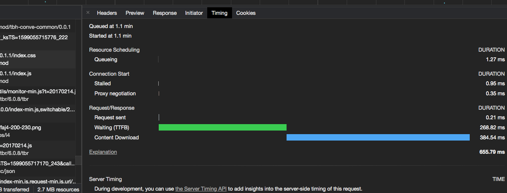

- `Queuing (排队)`

> 1. 浏览器在以下情况下对请求排队
> 2. 存在更高优先级的请求,请求被渲染引擎推迟，这经常发生在 images（图像）上,因为它被认为比关键资源（如脚本/样式）的优先级低。
> 3. 此源已打开六个 TCP 连接，达到限值，仅适用于 HTTP/1.0 和 HTTP/1.1。在等待一个即将被释放的不可用的 TCP socket 浏览器正在短暂分配磁盘缓存中的空间，生成磁盘缓存条目（通常非常快）

- `Stalled (停滞)` - 发送请求之前等待的时间。它可能因为进入队列的任意原因而被阻塞，这个时间包括代理协商的时间。请求可能会因 Queueing 中描述的任何原因而停止。
- `DNS lookup (DNS 查找)` - 浏览器正在解析请求 IP 地址，页面上的每个新域都需要完整的往返(roundtrip)才能进行 DNS 查找- - `Proxy Negotiation` - 浏览器正在与代理服务器协商请求
- `initial connection (初始连接)` - 建立连接所需的时间，包括 TCP 握手/重试和协商 SSL。
- `SSL handshake (SSL 握手)` - 完成 SSL 握手所用的时间 Request sent (请求发送) - 发出网络请求所花费的时间，通常是几分之一毫秒。
- `Waiting (等待绿色)` - 等待初始响应所花费的时间，也称为 Time To First Byte(接收到第一个字节所花费的时间)。这个时间除了等待服务器传递响应所花费的时间之外，还包括 1 次往返延迟时间及服务器准备响应所用的时间（服务器发送数据的延迟时间）
- `Content Download(内容下载-蓝色)` - 接收响应数据所花费的时间(从接收到第一个字节开始，到下载完最后一个字节结束)
- `ServiceWorker Preparation` - 浏览器正在启动 Service
- `WorkerRequest to ServiceWorker` - 正在将请求发送到
- `Service WorkerReceiving Push` - 浏览器正在通过 HTTP/2 服务器推送接收此响应的数据 Reading Push - 浏览器正在读取之前收到的本地数据。

也可以将鼠标悬停在资源的 Timeline（时间轴）图表上，查看此相同的信息。

<!-- 所有网络请求都被视为资源。当它们通过网络检索时，分为不同的生命周期。除了可视化面板外，我们也可以通过 Resoure Timing API 查看关于每个单独资源接收时间的详细信息。Timing API 这块可用于迷你监控平台

 -->

更多的 Network 面板操作细节，建议看 [Network Analysis Reference](https://developers.google.com/web/tools/chrome-devtools/network/reference#top_of_page)。

#### 5. Summary（概要）


- `requests`：告诉你请求的总数，
- `transferred`：查看请求的总大小。
- `resources`：资源
- `Finish`：所有 http 请求响应完成的时间。
- `DOMContentLoaded` 时间
- `Load` 时间

### 常见网络性能原因总结

#### 排队或停止阻塞

很多个请求排队或被阻塞。这表示单个客户端检索的资源太多。在 HTTP 1.0/1.1 连接协议中，Chrome 限制每个域名最多执行 6 个 TCP 连接。如果你一次请求十二个资源，前 6 个将开始，后 6 个开始排队。一旦其中一个请求完成，队列中的第一个请求项目将开始其请求过程。

要解决传统 HTTP 1 的此问题，你需要实现`分域`。即用多个子域名提供服务资源，将资源拆分到多个`子域`中，均匀分配。（或者使用 Websocket 协议）

上面说的修复 HTTP 1 连接数问题，不适合 HTTP 2 连接。如果你已部署 HTTP 2，不要对你的资源进行分域，因为它会影响 HTTP 2 的工作原理。在 HTTP 2 中，TCP 连接`多路复用`连接的。这消除了 HTTP 1 的 6 个连接限制，并且可以通过单个连接同时传输多个资源。

#### 接收第一个字节的时间很慢

`TTFB` 就是等待第一个响应字节的时间，建议在 `200ms` 以下，以下情况可能会导致高 TTFB:

客户端和服务器之间的网络条件差，要么，服务器端程序响应很慢。

为了解决高 TTFB，首先要去除尽可能多的网络连接。其次，提供服务端应用的响应速度，比如`数据库查询`、`缓存`、`web 服务器配置`等。

#### 加载缓慢

如果你看到 `Content Download`（内容下载）阶段花费了很多时间，提高服务响应速度、并行下载等优化措施帮助不大。主要的解决方案是<u>发送更少的字节</u>。（比如，下载一张高质量的大图，可能是几兆，这个时候你需要优化图片）、对资源进行压缩。

<!-- 这里可以联系到 webpack 工具的打包优化 -->

### 实战例子

<!-- 地图服务 -->

#### 清远首屏加载缓慢

下面为项目上解决问题思路的截图：


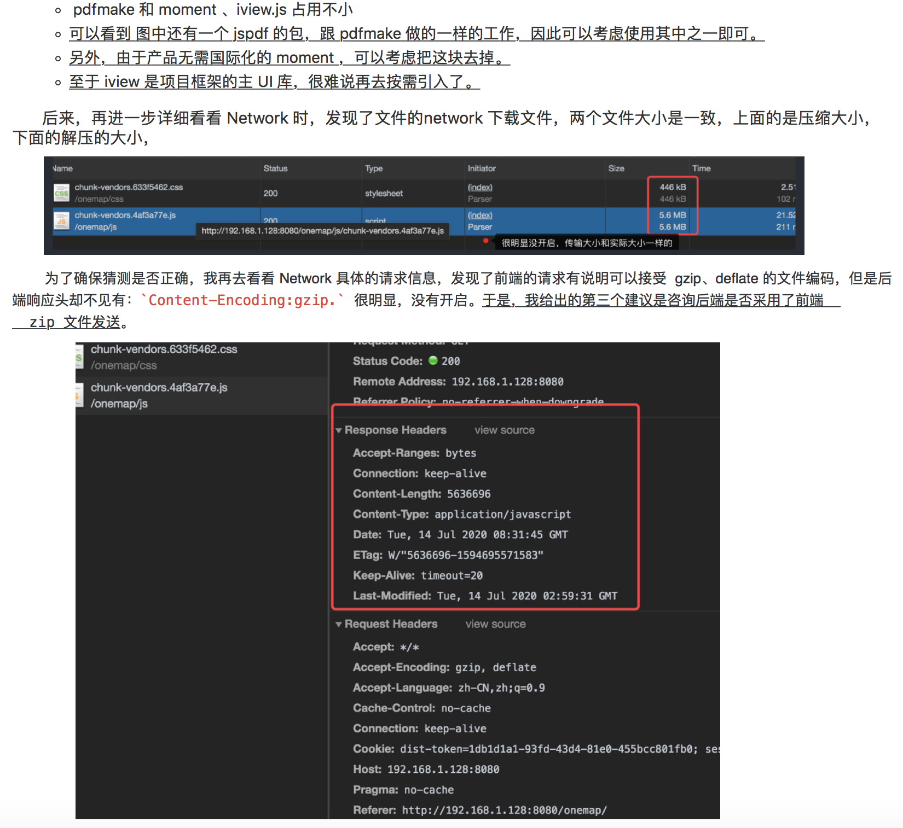
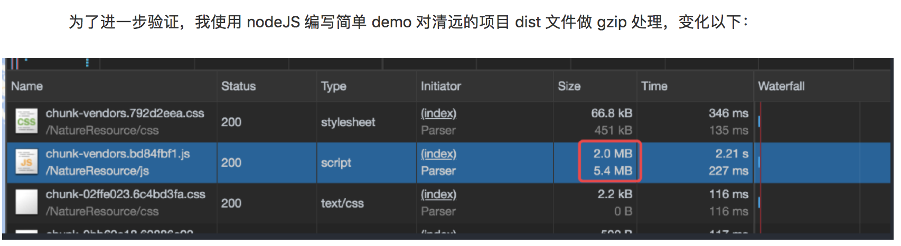

##### 阻塞问题分析


```html
<!DOCTYPE html>
<html lang="en">
  <head>
    <meta charset="UTF-8" />
    <meta name="viewport" content="width=device-width, initial-scale=1.0" />
    <title>阻塞渲染</title>
  </head>
  <body>
    <h1>Hello, Jecyu</h1>
    <h2 id="content"></h2>
    <!-- 1. 第三方库 -->
    <script src="/js/vue.min.js"></script>
    <script src="/js/iview.min.js"></script>
    <link rel="stylesheet" href="/css/iview.css" />
    <!-- 2. 渲染 js -->
    <script src="/js/main.js"></script>
    <!-- <script src="/js/vue.min.js"></script> -->
  </body>
</html>
```

浏览器解析到 script、link 标签时，会同时请求脚本和样式。但是这里它的 js 脚本不会马上执行，直到它前面的请求的资源都加载完毕空闲后，才会执行脚本。

这里可以使用 charles 拦截本地网络请求，进行模拟大脚本的加载问题，比如把 vue.min.js（注意把 localhost 改为 localhost.charlesproxy.com 才可以成功拦截。）

如果把 `vue.min.js` 放到 `main.js` 后，可以看到不影响 `main.js` 脚本的执行，从而可以进行正常的渲染。

知道这个细节后，我们可以得出：

- 把无关紧要的 js 不要放在负责渲染的 js 前面，比如首屏渲染。

<!-- 关于这部分描述：可以进一步看看《高性能 JavaScript 编程》有这部分的描述-->

<!-- 关于 prefetch\preload 的处理-->

<!-- ### 打印底图（网络阻塞、地图出错导致打印问题）

这块后面再补充，再把 performance 过了。

- 阻塞细节
- 阻塞问题 -->

<!-- 关于懒加载、动态加载、打包压缩等后续在网络篇进一步说 -->

## Performance（重点）

说完了 Network，我们再看看 Performance 工具。它的侧重点则在于前端渲染过程，进行时间轴录制来分析在`网页加载`或`用户互动`后发生的每个事件，它拥有帧率条形图、CPU 使用率面积图、资源瀑布图、主线程火焰图、事件总览等模块，它们和渲染息息相关，善用它们可以清晰地观察整个`渲染`阶段，以此参考来提升`运行时性能`。

那么如何使用 Performance 查看性能呢？


这是 Performance 的默认引导页面。

1. 第一句提示语表示的操作为立即开始记录当前发生的所有事件，点击停止按钮才会记录。
2. 第二句对应的操作则是重载页面并记录事件，工具会自动在页面加载完毕处于`可交互状态时`停止记录，两者最终都会生成报告（生成报告需要大量运算，会花费一些时间）。

### 开始记录

这里以一个简单的 HTML 文件以下，分析它从空白页面到渲染完毕的过程。

> 示例：[简单页面](example/monitor/chrome/performance/demo01)

我们可以通过第一种方式：

- 点击控制条左边的第一个圆圈，开始记录日志。
- 等待几分钟（正常操作页面）
- 点击 Stop 按钮，Devtools 停止录制，处理数据，然后显示性能报告。

但是对于分析首屏渲染来说，这种手动方式不太准确。我们通过第二种方式 reload 来收集渲染数据，将 beforeunload（所有资源均未被释放） -> unload（所有资源均未被释放，可视区域一片空白） -> Send Request（第一个资源请求）-> load 的过程都记录下来。

> Tip：与台式机和笔记本电脑相比移动设备的 CPU 功率要小得多。无论何时分析页面，都使用 CPU 限制模拟页面在移动设备上的表现。

在工具自动停止记录后，我们就得到了下图的报告。


接下来，开始进行面板功能的说明。

### 面板功能说明

总览如下：

- 进行时间轴录制来分析在网页加载或用户互动后发生的每个事件
- 在 `Overview` (概览)窗格中查看 FPS、CPU 和网络请求。
- 单击 `Flame Chart` （火焰）图表中的事件可查看其详细信息。
- 放大录制的一部分，让分析更方便。

#### 1. 控制面板，用来控制工具的特性。


- `Network` 与 `CPU`：分别限制网络和计算资源，模拟不同终端环境，可以更容易观察到性能瓶颈。
- 打开`Enable advance paint instrumention`则会详细记录某些渲染事件的细节。
- `Disable JavaScript samples` 选项开启会使工具忽略 JS 的调用栈，减少在手机运行时系统的开销，模拟手机运行时勾选。
- 打开 `Enable advanced paint instrumentation`：启用高级画图检测工具（缓慢）： 则会详细记录某些渲染事件的细节，带来显著的性能开销。

#### 2. 概览面板

简单页面的概览图：


复杂页面的概览图（为了 FPS 更加容易观察）

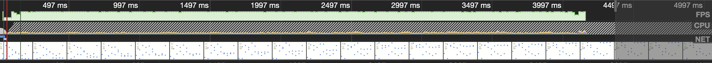

##### FPS（描述帧率）

描绘每秒钟渲染多少帧图像的指标，帧率越高则在观感上更流畅。绿色竖线越高，FPS 越高。FPS 图表上的红色块表示长时间帧，很可能会出现卡顿。

> FPS （frames per second）是用来分析动画的一个主要性能指标。能保持在 60 的 FPS 的话，那么用户体验就是不错的。
> 为什么是 60 fps 呢？我们的目标是保证页面要有高于每秒 60 fps 的刷新率，这和目前大多数显示器的刷新率相吻合（60Hz）。如果网页动画能够做到每秒 60 帧，就会跟显示器同步刷新，达到最佳的视觉效果。这意味着，一秒之内进行 60 次重新渲染，每次重新渲染的时间不能超过 16.66 毫秒。

##### NET（网络资源情况）

以瀑布图的形式呈现，图中可以观察到各资源的加载时间与顺序。每条横杠表示一种资源。横杠越长，检索资源所需的时间越长。每个横杠的浅色部分表示等待时间（从请求资源到第一个字节下载完成的时间）深色部分表示传输时间（下载第一个和最后一个字节之间的时间）。

- HTML：蓝色
- CSS：紫色
- JS：黄色
- 图片：绿色

对于网络性能的优化，直接使用 network 面板更直观。

##### CPU（使用率）

CPU 资源。**此面积图指示消耗 CPU 资源的事件类型。**在 CPU 图表中的各种颜色与 `Summary` 面板力的颜色是相互对应的，`Summary` 面板就在 `Performance` 面板的下方。CPU 图表中的各种颜色代表着在这个时间段内，CPU 在各种处理上所花费的时间。如果你看到了某个处理占用了大量的时间，那么这可能就是一个可以找到性能瓶颈的线索。


其中纵轴是 CPU 使用率，横轴是时间，不同的颜色代表不同的`事件类型`

| 颜色                                                                                   | 执行内容                     |
| -------------------------------------------------------------------------------------- | ---------------------------- |
| <span style="color: white; background: blue;">蓝色</span>，加载（Loading）事件         | 网络通信和 HTML 解析         |
| <span style="color: white; background: yellow;">黄色</span>：脚本运算（Scripting）事件 | JavaScript 执行              |
| <span style="color: white; background: purple;">紫色</span>：渲染（Rendering）事件     | 样式计算和布局，即重排       |
| <span style="color: white; background: green;">绿色</span>：绘制（Painting）事件       | 更改外观而不会影响布局，重绘 |
| <span style="color: white; background: gray;">灰色</span>：其他（Other）               | 其他事件花费的时间           |
| <span style="color: black; background: white;">白色</span>：其他（Other）              | 空闲事件                     |

举例来说，示意图的第一列：总 CPU 使用率为 18，加载事件（蓝色）和脚本运算事件（黄色）各占了一半（9）。随着时间增加，脚本运算事件的 CPU 使用率逐渐增加，而加载事件的使用率在 600ms 左右降为 0；另一方面渲染事件（紫色）的使用率先升后降，在 1100ms 左右降为 0。整张图可以清晰地体现哪个时间段什么事件占据 CPU 多少比例的使用率。

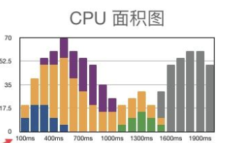

#### 3. 线程面板

线程面板，用以观察细节时间，在概览面板缩小观察范围可以看到线程图的细节。

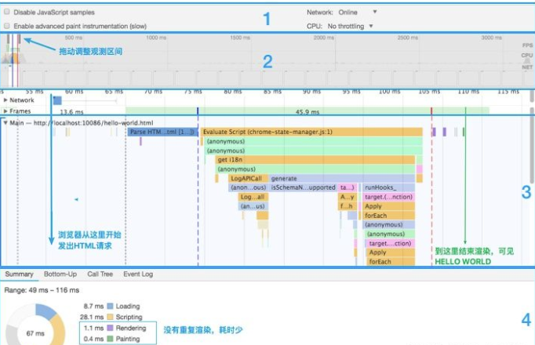

<!-- ##### 浏览器火焰图

浏览器的火焰图与标准火焰图有两点差异：它是倒置的（即调用栈最顶端的函数在最下方）；x 轴是时间轴，而不是抽样次数。y 轴是栈的调用层。

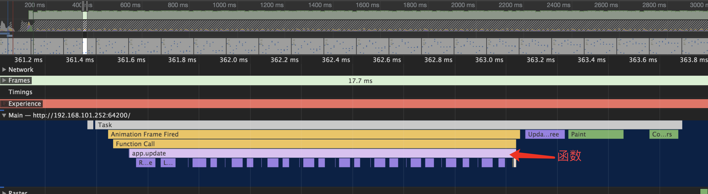 -->

<!-- 即这里随着程序时间的运行，对应事件的运行顺序是：Animation Frame Fired -> Function call -> Recalculate Style -> Layout 。

<u>事件的宽度代表执行的次数，如果一个事件或函数的宽度越宽，就表示它被执行的时间越长。</u> -->

<!-- 这里既有 Function call 和 Recalculate Style 分别由 js 引擎线程和 GUI 线程执行的，这两个线程互斥，只有一方在执行。

也就是说，在执行 Parse HTML 的时候，如果遇到 JavaScript 脚本，那么会暂停当前的 HTML 解析而去执行 JavaScript 脚本。 -->

<!-- 而 js 引擎执行完一轮`宏任务 + 微任务`后，主线成就会只执行 GUI 的渲染任务，这个得看主线程的调度，主线程就执行 GUI 的渲染任务。
- 宏任务：script（全局任务）, setTimeout, setInterval, setImmediate, I/O, UI rendering
– 微任务：process.nextTick, Promise, Object.observer, MutationObserver. -->

<!-- #### 浏览器是如何绘制每一帧的

这里每一帧都做了任务 task 包括执行 js，计算样式、布局、绘制等，之后在 composite layer 后，调动 gui 线程进行帧涂层的绘制。

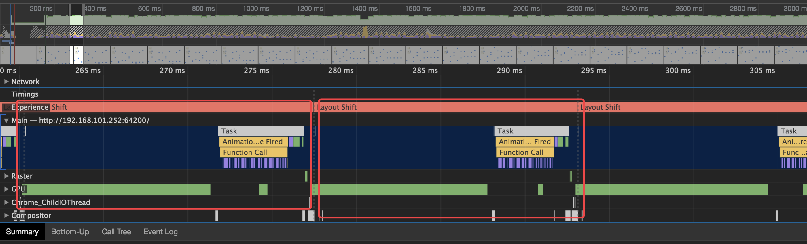 -->

##### 帧线程时序图（Frames）和网络瀑布图（Network）


可以从时间维度和空间维度分布查看绘制的页面，灰色虚线之间记录了绘制每一帧的事件间隔。


当记录一个网站加载过程中，在事件瀑布图会有三条虚线，红色线代表第一次开始绘制页面，蓝色线代表 DOM 已加载完成，绿色线表示页面加载完成（包括资源引用）。

##### Main 主线程

每个渲染进程（tab）都有一个主线程，并且主线程非常繁忙，既要处理 DOM，又要计算样式，还要处理布局，同时还需要处理 JavaScript 任务以及各种输入事件。

主线程图是用来分析渲染性能的主要图表。不同于「正常」火焰图，这里展示的火焰图是倒置的，即最上层是父函数，越往下则调用栈越浅，最底层的一小格（如果时间维度拉得不够长，看起来像是一小竖线）表示的是函数调用栈顶层。

X 轴代表着事件。每个长条代表着一个 event。长条越长就代表这个 event 花费的时间越长。

Y 轴代表了调用栈（call stack）。在栈里，上面的 event 调用了下面的 event。

Google 官方文档的例子：


如上图：click 事件触发了 `script_foot_closure.js` 第 53 行的函数调用。再看下面，Function Call 可以看到一个匿名函数被调用，然后调用 `Me()` 函数，然后调用 `Set()` 函数，依此类推。

它记录了触发的所有`事件`，这里记录的[事件](https://developers.google.com/web/tools/chrome-devtools/evaluate-performance/performance-reference#scripting_%E4%BA%8B%E4%BB%B6)来自于各个线程：JS 引擎线程解释执行 JS、GUI 线程（解析 HTML，CSS，构建 DOM 树和 RenderObject 树，布局和绘制）、http 请求线程、事件触发线程、定时触发器线程。

<!-- task 任务即是每一帧的执行任务：负责执行 Javascript, 解析 HTML/CSS，完成绘制，最后在 composite layer 合并合各个图层，将数据由 `CPU` 输出给 `GPU` 最终绘制在屏幕上。 -->

默认情况下火焰图会记录已执行 JS 程序调用栈的每层函数（精确到单个函数的粒度），非常详细。


而开启 [Disable JS Samples] 后，火焰图只会精确到`事件级别`（调用某个 JS 文件中的函数是一个事件），忽略该事件下所有的 JS 函数调用栈。


#### 4. 详情面板

Performance 工具中，所有的记录的最细粒度就是事件。这里的事件不是指 JS 中的事件，而是一个抽象概念，我们打开主线火焰图，随意点击一个方块，就可以在详情面板里看到该事件的详情，包括事件名、事件耗时 、发起者等信息。


一般要配合 `Flame Chart` 一起使用。

- `Summary` ：一个饼状图总览，汇总了各个事件类型所耗费的总时长。
- `Bottom-Up`：要查看直接花费最多时间的活动时使用。
- `Call Tree`：想查看导致最多工作的根活动时使用。
- `Event Log`：想要记录期间的活动顺序查看活动时使用。

| 事件                                            | 说明                                    |
| ----------------------------------------------- | --------------------------------------- |
| <span style="color: blue;">Parse HTML</span>    | Chrome 执行其 HTML 解析                 |
| <span style="color: orange;">Event </span>      | JavaScript 事件，（例如 「mousedown」） |
| <span style="color: purple;">Layout</span>      | 页面布局已被执行                        |
| <span style="color: purple;">Recalculate</span> | Chrome 重新计算了元素样式               |
| <span style="color: green;">Paint</span>        | 合成的图层被绘制到显示画面的一个区域    |
| <span style="color: green;">Composite</span>    | Chrome 的渲染引擎合成了图像层           |

这些事件其实对应着浏览器的渲染过程：


当渲染首屏时，浏览器分别解析 HTML 与 CSS 文件，生成文档对象模型（DOM）与样式表对象模型（CSSOM）；合并 DOM 与 CSSOM 成为渲染树（Render Tree）；计算样式（Style）；计算每个节点在屏幕中的精确位置与大小（Layout）；将渲染树按照上一步计算出的位置绘制到图层上（Paint）；渲染引擎合成所有图层最终使人眼可见（Composite Layers）。

如果改变页面布局，则是先通过 JS 更新 DOM 再经历计算样式到合成图像这个过程。如果仅仅是非几何变化（颜色、visibility、transform），则可以跳过布局步骤。

<!-- ##### 其他（待研究）

- Raster(光栅化)
  - Raster 线程，负责完成某个 layer 或者某些块(tile)的绘制。
- GPU
- Chrome_ChildIOThead
- Compisitor -->

<!-- #### 分析 JavaScript -->

### 常见性能原因分析及总结

#### 一些经验

<!-- 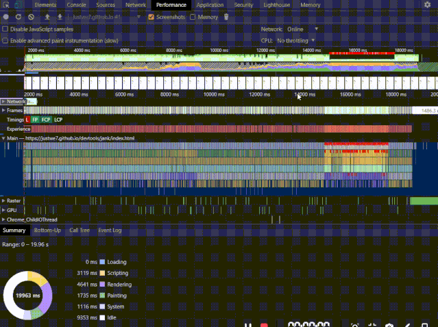 -->

这里有个图片无法查看，vuepress 加载问题。webp 图片格式。

1. 在性能报告中，有很多的数据。可以通过双击、拖动等动作来放大缩小报告范围，从各种时间段来观察分析报告。
2. 在事件长条的右上角处，如果出现了红色小三角，说明这个事件是存在问题的，需要特别注意。
3. 双击这个带有红色小三角的事件。在 Summary 面板会看到详细信息。注意 reveal 这个链接，双击它会让高亮触发这个事件的 event。如果点击了链接，就会跳转到对应的代码处。

#### 一些总结

#### 避免强制同步布局

首先 JavaScript 运行，然后计算样式，最后才进行布局。但是，也可以使用 JavaScript 强制浏览器提前执行布局。这被称为`强制同步布局`。

在 JavaScript，来自上一帧的所有旧布局值是已知的，并且可供你查询。因此，如果你要在帧的开头写出一个元素的高度，可能编写一些以下的代码：

```js
requestAnimationFrame(logBoxHeight);
function logBoxHeight() {
  // Gets the height of the box in pixels and logs it out.
  console.log(box.offsetHeight);
}
```

- 如果在请求此框的高度之前，已更改其样式，就会出现问题，浏览器需要重新计算样式。

```js
function logBoxHeight() {
  box.classList.add("super-big");
  // Gets the height of the box in pixels and logs it out.
  console.log(box.offsetHeight);
}
```

- 正确完成时

```js
function logBoxHeight() {
  // Gets the height of the box in pixels
  // and logs it out.
  console.log(box.offsetHeight);

  box.classList.add("super-big");
}
```

大部分情况下，并不需要应用样式然后查询值；使用上一帧的值就足够了。

### 实战例子

经过上面这些知识，我们现在来看看例子。

#### 一个简单动画例子

> 示例：[ /exmaples/monitor/chrome/performance/demo02](/exmaples/monitor/chrome/performance/demo02)

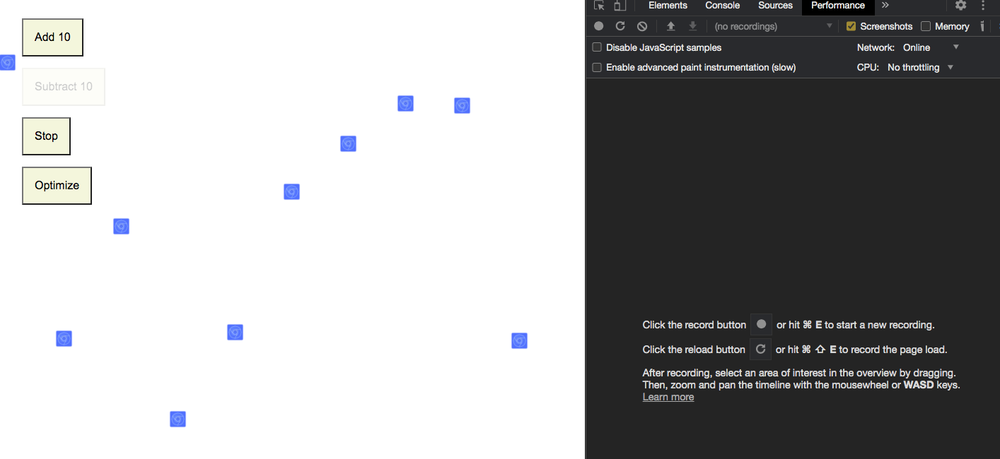

初始状态下，10 个方块会分别上下匀速运动，碰到浏览器边界后原路返回。「Add 10」是增加 10 个这样的方块，「Substract 10」是减少 10 个，「Stop/Start」暂停/开启所有小方块的运动，「Optimize/Unoptimize」优化/取消优化动画。

##### 浏览器是如何绘制每一帧的

在默认状态下，我们点击左上角的圆记录事件，几秒后我们可以点击 Performance 中的 Stop 产生分析数据。在概览面板中我们看到在渡过最初的几百毫秒后，CPU 面积图中各种事件占比按固定周期变化，我们点取其中一小段观察，在主线程图中可以看到一段段类似事件组。

这里每一帧任务 task 包括执行 js，计算样式、布局、绘制等，之后在 composite layer 后，调动 gui 线程进行帧涂层的绘制。


我们点开主线程火焰图的上一栏「Frames」，发现 Composite Layer 事件后不久的虚线出就是下一帧画面出现的节点。

##### 性能问题暴露

目前的动画看着没什么毛病，我们点击 30 次 「Add 10」按钮，增加方块数，可以看到动画出现了明显的卡顿，如果还不感觉卡顿，这时你可以在控制面板里降低 CPU 算力。然后，再次记录性能数据：


我们看到报告中有多处醒目的红色，包括帧率图上的大红杠、主线程图中的小角标。

再次按照之前的经验思路，查看主线程的细节，我们发现在 `app.update` 函数下发生的 `Recalculate Style` 和 `Layout` 事件都出现了警告，提示性能瓶颈的原因可能是强制重排。进入 js 文件查看详细代码，在左栏可以看到消耗了大量时间的代码行呈深黄色，那么这些代码就可能是问题所在。


##### 分析问题

通过暴露的问题，我们首先来回顾下重排与重绘。简而言之，重排（reflow）和重绘（repaint）都是改变页面样式的步骤。重排步骤包括 Recalculate Style、Layout、Update Layer Tree 等渲染类型时间，重绘步骤包括 Paint 和 Composite Layers 这些绘制类型事件。重排之后必然会造成重绘，而造成重绘的操作不一定会造成重排。

| 重新渲染方式    | 可能造成的原因                         |
| --------------- | -------------------------------------- |
| 重排（reflow）  | 添加、删除、更新 DOM                   |
|                 | 添加、删除、更新 DOM                   |
|                 | display:[block, flex, inline] <=> none |
|                 | 添加样式表，调整样式属性               |
|                 | 改变窗口大小、字号、滚动页面           |
| 重绘（repaint） | 重排                                   |
|                 | visibility: visible <=> hidden         |
|                 | 颜色改变                               |
|                 | 其他几何变化...                        |

更多事件看 https://csstriggers.com/。

由于计算布局需要大量时间，重排的开销远大于重绘，在达到相同效果的情况下，我们需要尽量避免重排。举个例子，如果 display:none 和 visibility: hidden；都能满足需求，那么后者更优。

##### 解决问题

再回头看一下我们的动画 Demo，在 Performance 的详情面板中，饼图显示动画的绘制过程中渲染（重排）占据的大部分的比重，结合代码我们发现原因：循环中多次在刚给 DOM 更新样式为位置后，立即通过 offsetTop 获取 DOM 位置。这样的操作会强制启动重排，因为浏览器并不清楚上一个循环内有没有改变位置，必须立即重新布局才能计算 DOM 位置。


你可能已经注意到了，我们还有一个「Optimize」按钮。

针对这个问题，我们的优化方案是将 `offsetTop` 替换成 `style.top`，后者虽然取的是上一帧动画的元素位置，但并不影响计算下一帧动画位置，省去了重排获取位置的过程，减少了不必要的重排。

我们对比下优化前后的报告图：

首先从饼图和 CPU 面积图看，Rendering 事件占比下滑，Painting 事件占比上升。而从帧率图和 frames 线程图中分别可以看到，帧率明显上升，一帧图像的绘制时间明显下降，意味着东湖流畅性大幅提高，优化目的已达到。再看细节，我们发现绘制一帧东湖的事件组中，app.update 函数里没有了 Recalculate style 和 Layout 事件，整个函数执行时间因此显著下降，证明我们的优化方案起了作用。


<!-- 分析下渲染过程？ -->

<!-- 项目上的例子，也可以放到综合篇（项目篇处理），项目上的优化更加具有说服力。 -->

<!-- 综合篇（综合性能优化） -->

<!-- #### 模型管理系统 拖拽功能 -->

<!-- #### 国土 iview 树性能监控 -->

#### 项目例子

可以自行找下国土 iview 树性能监控，3.0 的 iview 树进行测试，一些没做节流的拖拽功能如模型管理系统。

## Memory


Chrome：我是个心善的人，别着急，会分你们一点。

用户可通过以下方式察觉内存问题：

- **页面的性能随着时间的延长越来越差**。这可能是内存泄漏的症状。内存泄漏是指，页面中的错误导致页面随着时间的延长使用的内存越来越多。
- **页面的性能一直很糟糕**。这可能是内存膨胀的症状。内存膨胀是指，页面中的错误导致页面随着时间的延长使用的内存越来越多。（比如 Chrome 浏览器）
- **页面出现延迟或者经常暂停**。这可能是频繁垃圾回收的症状。垃圾回收是浏览器收回内存。浏览器决定何时进行垃圾回收。<u>回收期间，所有脚本执行都暂停。</u>因此，如果浏览器经常进行垃圾回收，脚本执行就会被频繁暂停。

可以使用途径分析内存问题：

- 使用 Chrome 任务管理器实时监视内存使用。
- 使用 Performance 记录可视化内存泄漏。
- 使用堆快照发现已分离 DOM 树的内存泄漏。（重点）
- 使用分配时间线确定 JS 堆内存泄漏。
- 按函数调查内存分配发现频繁的垃圾回收。

虽然在 Performance 中勾选了 `memory` 是可以看到占用内容的不同组成部分（ex：Heap、node...）在记录过程中的变化，根据变化的情况看到大致的垃圾回收的周期，以及有无明显的内存泄漏的情况。

```js
> performance.memory
MemoryInfo {
jsHeapSizeLimit: 793000000, usedJSHeapSize: 27600000, totalJSHeapSize: 42100000
}
```

<!-- 在 Memory 可以做更加详细的优化。 -->

### 内存分配

为了更好地使用 memory 面板分析内存，有必要先了解下 JS 垃圾回收机制，要了解内存垃圾回收机制，先看看内存是怎么被使用以及泄漏的。

#### JS 数据类型


前面的 7 种数据类型称为原始数据类型，把最后一个对象类型称为引用类型。使用变量存储这些数据类型值时，就需要申请系统内存，而变量的**执行上下文**用于确定什么时候释放内存。

<!-- 从 JavaScript 的执行过程中，主要有三种类型内存空间：
- 代码空间。
- 栈空间。
- 堆空间。 -->

任何变量（不管包含的是原始值还是引用值）都存在于某个执行上下文中（也称为**作用域**）。这个上下文（作用域）决定了变量的生命周期，以及它们可以访问代码的哪些部分。

#### 执行上下文与作用域


从上图可以看出，输入一段代码，会生成两部分内容：执行上下文（Execution context）和可执行代码。

> 注：词法环境维护了一个小型栈结构，栈底是函数最外层的变量，进入一个作用域后，就会把该作用域内部的变量压顶；当作用域执行完之后，该作用域的信心就会从栈顶弹出。通过 let、const 声明的变量会放到这里。

**执行上下文**是 JavaScript 执行一段代码时的运行环境，比如调用一个函数，就会进入这个函数的执行上下文，确定该函数在执行期间用到的诸如 this、变量、对象以及函数等，内存申请发生在执行上下文中。

执行上下文中存在一个变量环境的对象（**Viriable Environment**），该对象中保存了变量提升的内容，比如上面代码中的变量 myname 和函数 showName，都保存在该对象中。

可以简单把环境对象看成是如下结构：

```bash
VariableEnvironment:
     myname -> undefined,
     showName ->function : {console.log(myname)
```

通过下面这段代码来分析下是如何生成变量环境对象的：

```js
showName();
console.log(myname);
var myname = "极客时间";
function showName() {
  console.log("函数showName被执行");
}
```

- 第 1 行和第 2 行，由于这两行代码不是声明操作，所以 JavaScript 引擎不会做任何处理。
- 第 3 行，由于这行是经过 var 声明的，因此 JavaScript 引擎将会在环境对象中创建一个名为 myname 的属性，并使用 undefined 对其初始化。
- 第 4 行，JavaScript 引擎发现了一个通过 function 定义的函数，所以它将函数定义存储到堆（HEAP）中，并在环境对象中创建一个 showName 的属性，然后将该属性值指向堆中函数的位置。

**JavaScript 执行阶段**：

- 当执行到 showName 函数，JavaScript 引擎开始在全局执行上下文变量对象中查找该函数，对该函数的代码进行编译，并创建该函数的执行上下文和可执行代码，进行执行。
- 接下来打印“myname”信息，JavaScript 引擎继续在变量环境对象中查找该对象，由于变量环境存在 myname 变量，并且其值为 undefined，所以这时候就输出 undefined。
- 接下来执行第 3 行，把 “极客时间” 赋给 myname 变量，赋值后变量环境中的 myname 变量属性值改变为 “极客时间”，变量环境如下所示：

```bash
VariableEnvironment:
     myname -> "极客时间",
     showName ->function : {console.log(myname)
```

全局上下文是最外层的上下文。根据 ECMAScript 实现的宿主环境，表示全局上下文的对象可能不一样。在浏览器中，全局上下文就是我们常说的 `window` 对象的属性和方法。使用 `let` 和 `const` 的顶级声明不会定义在全局上下文中，但在作用域解析上效果是一样的。<u>上下文在其所有的代码都执行完毕后会被销毁，包括定义在它上面的所有变量和函数（全局上下文在应用程序退出前才会被销毁，比如关闭网页或退出浏览器）。</u>

每个函数都有自己的上下文。当代码执行流进入到函数时，函数的上下文会推到一个上下文栈上。在函数执行完之后，上下文栈会弹出函数上下文，将控制权还给之前的执行上下文。<u>也就是说在执行 JavaScript 中时，可能存在多个执行上下文，JavaScript 引擎是通过**栈**来管理这些上下文的。在执行上下文创建后，JavaScript 引擎会将执行上下文压入栈中，通常把这种用来管理执行上下文的栈称为执行上下文栈，又称调用栈。</u>要注意调用栈有大小，遇上死递归会不断把执行上下文压栈导致栈溢出（Stack Overflow）。

在使用 `var` 声明变量时，变量会被自动添加到最接近的上下文。在函数中，最接近的上下文就是函数的局部上下文。

```bash
- window
  - myname
  - showName
    - ...
```

- 执行上下文分为全局上下文、函数上下文和块级上下文。
- 在上下文中的代码在执行的时候，创建变量对象的一个**作用域链**，这个作用域链决定了各级上下文中的代码在访问变量和函数时的顺序。全局上下文只能访问全局上下文中的变量和函数，不能直接访问局部上下文中的任何数据。
- 函数或块的局部上下文不仅可以访问自己作用域内的变量，而且也可以访问任何包含上下文乃至全局上下文中的变量。

#### 作用域链和闭包

很多时候导致内存泄漏的问题很可能是闭包的使用不当导致的，为了更好地分析内存问题，有必要了解闭包。而要了解闭包，得先了解作用域链。

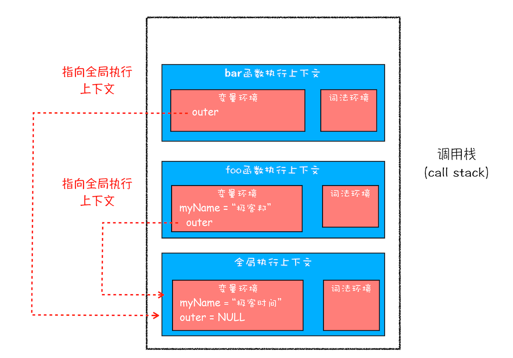


##### 闭包

```js
function foo() {
  var myName = " 极客时间 ";
  let test1 = 1;
  const test2 = 2;
  var innerBar = {
    getName: function() {
      console.log(test1);
      return myName;
    },
    setName: function(newName) {
      myName = newName;
    },
  };
  return innerBar;
}
var bar = foo();
bar.setName(" 极客邦 ");
bar.getName();
console.log(bar.getName());
```


从上图可以看出，foo 函数执行完成之后，其执行上下文从栈顶弹出了，但是由于返回的 setName 和 getName 方法中使用了 foo 函数内部的变量 myName 和 test1，所以这两个变量依然保存在内存中。<u>这像极了 setname 和 getName 方法背的一个专属背包，无论在哪里调用了 setName 和 getName 方法，它们都会背着这个 foo 函数的专属背包。</u>

之所以是专属背包，是因为除了 setName 和 getName 函数之外，其他任何地方都是无法访问该背包的，我们可以把这个背包称为 foo 函数的闭包。

好了，现在我们终于可以给闭包一个正式的定义了。在 JavaScript 中，根据词法作用域的规则，<u>内部函数总是可以访问其外部函数中声明的变量，当通过调用一个外部函数返回一个内部函数后，即使该外部函数已经执行结束了，但是内部函数引用外部函数的变量依然保存在内存中，我们就把这些变量的集合称为闭包。比如外部函数是 foo，那么`这些变量的集合`就称为 foo 函数的闭包。</u>

那么这些闭包是如何使用的呢？当执行到 bar.setName 方法中的 myName = "极客邦" 这句代码时，JavaScript 引擎会沿着“当前执行上下文 -> foo 函数包 -> 全局执行上下文” 的顺序来查找 myName 变量。

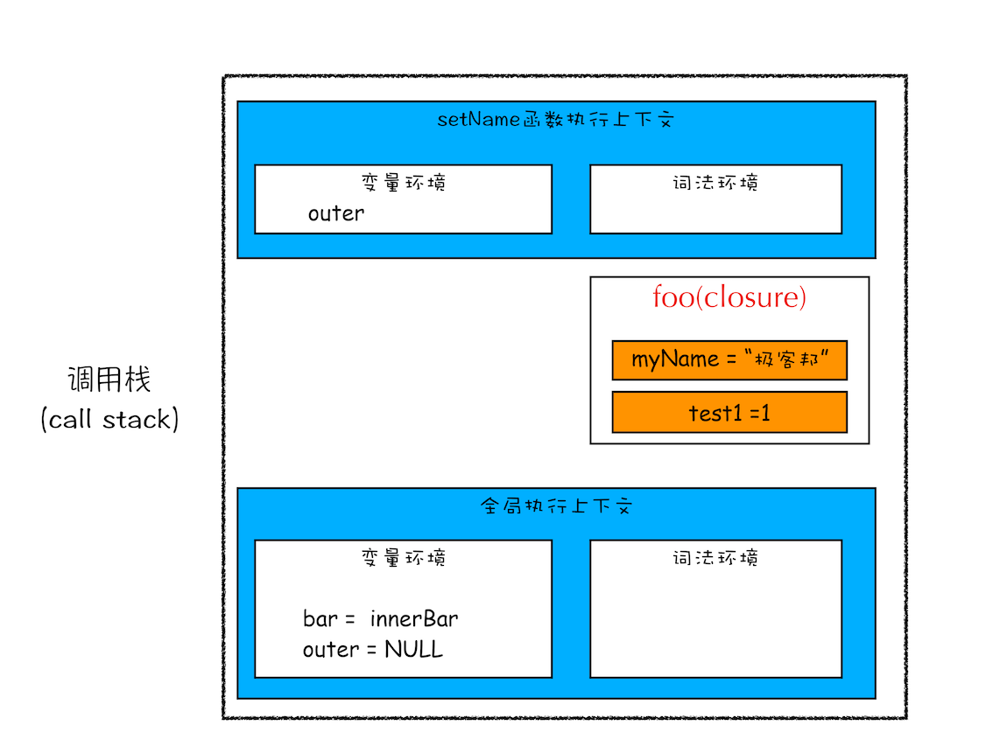


总的来说，产生闭包的核心有两步：第一步是需要预扫描内部函数；第二步是把内部函数引用的外部变量保存到堆中。

#### 垃圾回收策略

有些数据被使用之后，可能就不再需要了，我们把这种数据称为垃圾数据。如果这些垃圾数据一直保存在内存中，那么内存会越用越多，所以我们需要对这些垃圾数据进行回收，以释放有限的内存空间。

从前面得知，代码执行流每进入一个新上下文，都会创建一个作用域链，用于搜索变量和函数。而离开作用域的值会被自动标记为可回收，然后在垃圾回收期间被删除。

##### 调用栈中的数据是如何回收的

```js
function foo() {
  var a = 1;
  var b = { name: " 极客邦 " };
  function showName() {
    var c = " 极客时间 ";
    var d = { name: " 极客时间 " };
  }
  showName();
}
foo();
```


从图中可以看出，当 showName 函数执行结束之后，ESP 向下移动到 foo 函数的执行上下文中，上面 showName 的执行上下文虽然保存在栈内存中，但是已经是无效内容了。

##### 堆中的数据回收

虽然 showName 函数和 foo 函数的执行上下文都处于无效状态了，但是保存在堆中的两个对象依然占用着空间。


要回收堆中的垃圾数据，就需要用到 JavaScript 中的垃圾回收器。

在 V8 中会把堆分为新生代和老生代两个区域，新生代中存放的是生存时间短的对象，老生代中存放的生存时间久的对象。

新生区通常只支持 1 ～ 8M 的容量，而老生区支持的容量就大很多了。对于这两块区域，V8 分别使用两个不同的垃圾回收器，以便更高效地实施垃圾回收。（TODO 这块待考察更新，有资料显示是 1 个 G）

- 副垃圾回收器，主要负责新生代的垃圾回收。
- 主垃圾回收器，主要负责老生代的垃圾回收。

##### 垃圾回收器的工作流程（重点）

第一步是标记空间中活动对象和非活动对象。所谓活动对象就是还在使用的对象，非活动对象就是可以进行垃圾回收的对象。

第二步是回收非活动对象所占据的内存。其实就是在所有的标记完成之后，统一清理内存中所有被标记为可回收的对象。

第三步是做内存整理。

可以把内存看成一个图，图中有着一些基本类型（像是数字以及字符串等）和对象（关联数组）。如果像下面这样将图中的内容用一些相互连接的点来表示，可能有助于你对此的理解：


内存图从根开始，在浏览器中为 window。


如果 9、10 对象不可从根访问到达的话，就会被垃圾回收器回收。

对象可以通过两种方式来获取内存：

- 直接通过它本身。
- 通过包含对其它对象的引用，这样就会阻止垃圾回收器（简称 GC）自动回收这些对象。

##### 副垃圾回收器

新生代中用 Scavenge 算法来处理，把新生代空间对半划分为两个区域，一半是对象区域，一半是空闲区域。新加入的对象都会存放到对象区域，当对象区域快被写满时，就需要执行一次垃圾清理操作。

在垃圾回收过程中，首先要对对象区域中的垃圾做标记；标记完成之后，就进入垃圾清理阶段，副垃圾回收器会把这些存活的对象复制到空闲区域中，同时它还会把这些对象有序地排列起来，所以这个复制过程，也就相当于完成了内存整理操作，复制后空闲区域就没有内存碎片了。


完成复制后，对象区域与空闲区域进行角色翻转，也就是原来的对象区域变成空闲区域，原来的空闲区域变成了对象区域。这样就完成了垃圾对象的回收操作，同时这种角色翻转的操作还能让新生代中的这两块区域无限重复使用下去.
为了执行效率，一般新生区的空间会被设置得比较小,也正是因为新生区的空间不大，所以很容易被存活的对象装满整个区域。为了解决这个问题，JavaScript 引擎采用了对象晋升策略,也就是经过两次垃圾回收依然还存活的对象，会被移动到老生区中。

##### 主垃圾回收器

老生代中用**标记 - 清除（Mark-Sweep）**的算法来处理。首先是标记过程阶段，标记阶段就是从一组根元素开始，递归遍历这组根元素(遍历调用栈)，在这个遍历过程中，能到达的元素称为活动对象,没有到达的元素就可以判断为垃圾数据.然后在遍历过程中标记，标记完成后就进行清除过程。它和副垃圾回收器的垃圾清除过程完全不同，这个的清除过程是删除标记数据。

清除算法后，会产生大量不连续的内存碎片。而碎片过多会导致大对象无法分配到足够的连续内存，于是又产生了标记 - 整理（Mark-Compact）算法，这个标记过程仍然与标记 - 清除算法里的是一样的，但后续步骤不是直接对可回收对象进行清理，而是让所有存活的对象都向一端移动，然后直接清理掉端边界以外的内存，从而让存活对象占用连续的内存块。


##### 全停顿

由于 JavaScript 是运行在主线程之上的，一旦执行垃圾回收算法，都需要将正在执行的 JavaScript 脚本暂停下来，待垃圾回收完毕后再恢复脚本执行。我们把这种行为叫做全停顿。

在 V8 新生代的垃圾回收中，因其空间较小，且存活对象较少，所以全停顿的影响不大，但老生代就不一样了。如果执行垃圾回收的过程中，占用主线程时间过久，主线程是不能做其他事情的。比如页面正在执行一个 JavaScript 动画，因为垃圾回收器在工作，就会导致这个动画在垃圾回收过程中无法执行，这将会造成页面的卡顿现象。

为了降低老生代的垃圾回收而造成的卡顿，V8 将标记过程分为一个个的子标记过程，同时让垃圾回收标记和 JavaScript 应用逻辑交替进行，直到标记阶段完成，我们把这个算法称为增量标记（Incremental Marking）算法.
使用增量标记算法，可以把一个完整的垃圾回收任务拆分为很多小的任务，这些小的任务执行时间比较短，可以穿插在其他的 JavaScript 任务中间执行，这样当执行上述动画效果时，就不会让用户因为垃圾回收任务而感受到页面的卡顿了。

<!-- 垃圾回收器在工作，会导致这个动画在 200 毫秒内无法执行，就会导致页面的卡顿现象。 -->

<!-- JavaScript 是使用垃圾回收的语言。通过自动内存管理实现内存分配和闲置资源回收。基本思路是：确定哪个变量不会再使用，然后释放它占用的内存。这个过程是周期性的，即垃圾回收程序每隔一定时间（或者说在代码执行过程中某个预定的收集时间）就会自动运行。

我们以函数中局部变量的正常生命周期为例。函数中的局部变量会在函数执行时存在。此时，栈（或堆）内存会分配空间以保存相应的值。函数在内部使用了变量，然后退出。此时，就不再需要那个局部变量了，它占用的内存可以释放，供后面使用。对于不是这么明显的情况，垃圾回收程序必须跟踪记录哪个变量还会使用，以及哪个变量不会再使用，以便回收内存。

主要有两种标记策略：

- 标记清理
- 引用计数 -->

<!-- ##### 标记清理

##### 引用计数 -->

<!-- 内存的分配、回收、怎么用 chrome 查看 -->

<!-- 更多具体细节可以看看 [浏览器工作原理与实践-V8 工作原理](https://blog.poetries.top/browser-working-principle/guide/part3/lesson12.html#%E8%AE%A9%E4%BA%BA%E7%96%91%E6%83%91%E7%9A%84%E4%BB%A3%E7%A0%81) -->
<!--
不过要注意，解除对一个值的引用并不会自动导致相关内存被回收。解除引用的关键在于确保相关的值已经不在上下文里了，因此它在下次垃圾回收时会被回收。 -->

<!-- #### 性能

执行上下文执完毕后里面的东西就会被回收，但是如果一直被外部引用的话，这个执行上下文的东西就不会被自动回收。因此我们需要避免这种情况。

垃圾回收程序会周期性运行，如果内存中分配了很多变量，则可能造成性能损失，因此垃圾回收的时间调度很重要。

#### 内存管理

1. 通过 const 和 let 声明提升性能，在编译阶段，JavaScript 引擎并不会把如 if 块中通过 let 声明的变量存放到块之外的变量环境中。
   - 避免变量提升带来的问题，比如本应销毁的变量没有被销毁。
2. 隐藏类和删除操作
3. 内存泄漏
4. 静态分配与对象池

浏览器决定何时运行垃圾回收程序的一个标准就是对象更替的速度。如果有很多对象被初始化，然后一下子又都被超出了作用域，那么浏览器就会采用更激进的方式调度垃圾回收程序运作。 -->

<!-- 缓存
有时候为了方便数据的快捷复用，我们会使用缓存,但是缓存必须有一个大小上限才有用。高内存消耗将会导致缓存突破上限，因为缓存内容无法被回收。 -->
<!-- （1）监听在window/body等事件没有解绑

（2）绑在 EventBus 的事件没有解绑

（3）Vuex的 $store watch 了之后没有 unwatch

（4）模块形成的闭包内部变量使用完后没有置成 null

（5）使用第三方库创建，没有调用正确的销毁函数 -->

<!-- vue 的内存泄漏看时间安排 -->
<!-- 使用内存识别步骤，performance -> memory -->

<!-- 事件监听为什么会导致内存泄漏？ -->

### 内存泄漏识别方法

<!-- 内存的分配、回收，怎么进行识别呢？ -->

- 是有对象没有被销毁吗？
- 是对象销毁了但是由于其他对象依赖它，导致销毁失败吗？
- 是对象销毁了但是由于其他对象依赖它的子对象，导致销毁失败吗？

### 性能优化尝试

- 主动销毁对象及其子对象
- 主动取消监听 listener
- 本地搜索减少组件 DOM 渲染。

#### 应该问自己一些问题

通常情况下，当你认为你的程序出现内存泄露的时候，你需要问自己三个问题

- 是不是我的页面占用了太多的内存？ 「**内存时间轴视图**」 以及 「**Chrome 任务管理器**」 可以帮助你来确认是否占用了过多的内存。内存视图在监察过程中可以实时跟踪 DOM 节点数目、文件以及 JS 事件监听器。有一条重要法则需要记住：避免保留对已经不需要的 DOM 元素的引用，不必要的事件监听器请解除绑定，对于大量的数据，在存储时请注意不要存储用不到的数据。
- 我的页面是不是没有内存泄露的问题？「**对象分配跟踪器**」能够让你看到 JS 对象的实时分配过程，以此来降低内存泄露的可能。你也可以使用「**堆探查器**」来记录 JS 堆的状态，然后分析内存图并将其与堆状态进行比对，就可以迅速发现那些没有被垃圾回收器清理的对象。
- 我的页面应该多久强制进行一次垃圾回收？如果垃圾回收器总是处于垃圾回收状态，那么可能是你对象分配过于频繁了。「**内存时间轴视图**」可以在你感兴趣的地方停顿，方便你查看回收情况。

#### 使用 Chrome 任务管理器实时监视内存使用

- （More tools > Task manager）
- 右键点击任务管理器的表格标题并启用 JavaScript memory。
- 

- **Memory**（内存占用空间）：表示原生内存。DOM 节点存储在原生内存中。如果此值正在增大，则说明正在创建 DOM 节点。
- **JavaScript Memory**：表示 JS 堆，此列包含两个值。括号中为实时数字——可达对象正在使用的内存量。如果此数字在增大，要么是正在创建新对象，要么是现有对象正在增长。

#### 使用 Performance 记录可视化内存泄漏

通过 Performance 面板可以直观了解页面在一段时间内的内存使用情况。

> 示例：examples/chrome/memory/demo01-usage

1. 打开 Performance 面板。
2. 启动 **Memory** 复选框。
3. 做记录。

> tip💡：一种比较好的做法是使用强制垃圾回收开始和结束记录。在记录时点击 Collect garbage 按钮可以强制进行垃圾回收。


<!-- ```html
<!DOCTYPE html>
<html lang="en">
  <head>
    <meta charset="UTF-8" />
    <meta name="viewport" content="width=device-width, initial-scale=1.0" />
    <title>Memory</title>
  </head>
  <body>
    <button id="grow" style="width: 100px; height: 100px;">grow</button>
    <script>
      var x = [];
      function grow() {
        for (var i = 0; i < 10000; i++) {
          document.body.appendChild(document.createElement("div"));
        }
        x.push(new Array(1000000).join("x"));
      }
      document.getElementById("grow").addEventListener("click", grow, false);
    </script>
  </body>
</html>
``` -->

每次按代码中引用的按钮时，将向文档中正文附加 1 万个 `div` 节点，并将一个由 `100` 万个 `x` 字符组成的字符串推送到 `x` 数组。

<!-- 点击强制垃圾回收，做了哪些事情？所有的堆数据都被回收了，包括全局变量上的？ -->

#### 使用堆快照

什么叫 heap snapshot 呢？翻译一下就是堆快照，给当前内存堆拍一张照片。因为动态申请的内存都是在堆里面的，而局部变量是在内存栈里面，是由操作系统分配管理的是不会内存泄露了。所以关心堆的情况就好了。

最初快照是存在渲染内存中的，当你点击快照图标来查看它的时候，它将会被传输到 DevTools 中。当快照载入到 DevTools 中并被解析后，快照标题下面会出现一个数字，该数字表示所有可访问的 JavaScript 对象的总大小：

只有页面的 DOM 树或 JavaScript 代码不再引用 DOM 节点时，DOM 节点才会被作为垃圾进行回收。 如果某个节点已从 DOM 树移除，但某些 JavaScript 仍然引用它，我们称此节点为“已分离”，已分离的 DOM 节点是内存泄漏的常见原因。

调出调试面板，点击 Memory，然后选择 Heap Snapshot，然后点击进行录制。录制完成后，选中录制结果，在 Class filter 文本框中键入 `Detached`，搜索已分离的 DOM 树。

<!-- 一个综合例子跑动，先尝试用旧版的chrome 浏览器看看黄色和红色，之后再考虑新版本的如何调试。chrome 开发者浏览器 -->

> 示例：examples/chrome/memory/demo01-usage/
```html
<!DOCTYPE html>
<html lang="en">
  <head>
    <meta charset="UTF-8" />
    <meta name="viewport" content="width=device-width, initial-scale=1.0" />
    <title>Document</title>
  </head>
  <body>
    <button id="createBtn">增加节点</button>
    <script>
      var detachedNodes;

      function create() {
        var ul = document.createElement("ul");
        for (var i = 0; i < 1000; i++) {
          var li = document.createElement("li");
          ul.appendChild(li); // 这里并没有把 ul 添加到 body 中，属于已分离的 DOM 树
        }
        detachedTree = ul;
      }

      document.getElementById("createBtn").addEventListener("click", create);
    </script>
  </body>
</html>
```


上面可以看出，有个 HTMLUListElement(ul 节点)被 window.detachedNodes 引用。再结合代码，原来是没有加 var/let/const 声明，导致其成了全局变量，所以 DOM 无法释放。

##### 堆快照面板的详细介绍


- **Summary** - 可以显示按构造函数名称分组的对象。使用此视图可以根据按构造函数名称分组的类型深入了解对象（及其内存使用），适用于跟踪 DOM 泄漏。
- **Comparison** - 可以显示两个快照之间的不同。使用此视图可以比较两个（或多个）内存快照在某个操作前后的差异。检查已释放内存的变化和参考计数，可以确认是否存在内存泄漏及其原因。
- **Containment** - 此视图提供了一种对象结构视图来分析内存使用，由顶级对象作为入口。
- **Statistic** - 内存使用饼状的统计图。

##### 总结视图

> 示例：examples/chrome/memory/demo01-usage/4-summary-view

- **Constructor**：构造函数，节点下的对象都是由改构造函数创建而来。
  常见的顶层构造函数：
  **(global property)**：全局对象和普通对象的中间对象，和常规思路不同。比如在 Window 上定义了一个 Person 对象，那么他们之间的关系就是[global] => (global property) => Person。之所以使用中间对象，是出于性能的考虑。
  **(closure)**：使用函数闭包的对象。
  (**array, string, number, regexp)**：一系列对象类型，其属性指向 Array/String/Number/Regexp。
  H**TMLDivElement/HTMLAnchorElement/DocumentFragment**：元素的引用或者代码引用的指定文档对象。
- 对象可以通过两种方式占用内存：
  - 直接通过对象自身占用
  - 通过持有对其它对象的引用隐式占用，这种方式会阻止这些对象被垃圾回收器（简称 GC）自动处理
  - 在 DevTools 的堆内存快照分析面板会看到 Shallow Size 和 Retained Size 分别表示对象通过这两种方式占用的内存大小
- **Distance**：表示从 window 出发的最短保留路径上.
- **Objects Count**：对象个数及百分占比。
- **Shallow size**：对象自身占用内存的大小。
- **Retained size**：对象自身及依赖它的对象（从 GC root 无法再访问到的对象）被删掉后释放的内存大小。

点击展开构造函数，可以看到所有构造函数相关的对象实例，@后面的数字是该对象实例的唯一标识符。

##### 比较视图

> 5-heap-profiling-comparison

这个视图用于比较不同的快照，这样，你就可以通过比较它们的不同之处来找出出现内存泄露的对象。想要弄清楚一个特定的程序是否造成了泄露（比如，通常是相对的两个操作，就像是打开文档，然后关闭它，是不会留下内存垃圾的），你可以尝试下列步骤：

在执行操作前先生成一份快照。
执行操作（该操作涉及到你认为出现内存泄露的页面）。
执行一个相对的操作（做出相反的交互行为，并重复多次）。
生成第二份快照然后将视图切换到比较视图，将它与第一份快照对比。

其他列：
**New** - Comparison 特有 - 新增项
**Deleted** - Comparison 特有 - 删除项
**Delta** - Comparison 特有 - 增量
**Alloc. Size** - Comparison 特有 - 内存分配大小
**Freed Size** - Comparison 特有 - 释放大小
**Size Delta** - Comparison 特有 - 内存增量

<!-- 在不清楚具体是哪块代码出现内存泄漏的情况下，如何通过 memory 进行快速定位呢？ 通过 comparsion 比较两个视图-->

为了验证特定操作会不会引起内存泄露，对比快照的步骤如下：

1. 无任何操作，拍第一个堆快照。
2. 执行你觉得可能造成内存泄露的操作，再执行相反操作。
3. 拍第二个堆快照，切换到对照视图，并且指定与第一个堆快照对比。
4. 因为页面的内存泄露通常是和 DOM 相关的，也就是说这个方法主要是分析仍然存在引用的游离 DOM 节点，因此第 4 步通常是：搜索 detached（它就会显示所有已经分离了 DOM 树的 DOM 结点，重点关注 distance 值不为空的），按 distance 排序，把非空的节点展开父级（如果被正常回收，distance 应该为空），找到标黄的字样说明，那些就是存在没有释放的引用。
   <!-- 5. 对于普通的 JS 变量由于有垃圾回收所以一般不会有问题，除非使用闭包把变量困住了用完了又没有置空。 -->

比如：

- 弹一个框，然后把弹框关闭了。
- 单页面的点击跳转到另一个路由，然后再点击后退返回。
- 点击分页触发动态改 DOM。（先增加 DOM，然后删除 DOM）
  <!-- 剩下的就是看哪些对象实例的大小、变化等了。 -->

##### 包含视图

> 示例：6-heap-profiling-containment

包含视图本质上就像是你的应用程序对象结构的俯视图。它使你能够查看到`函数闭包`内部，甚至是观察到那些组成 JavaScript 对象的虚拟机内部对象，借助该视图，你可以了解到你的应用底层占用了多少内存。

<!-- memory 视图会保留记录视图，这样就可以在清理垃圾后进行对比。 -->

这个视图提供了多个接入点：

- DOMWindow objects - 这些是被认作“全局”对象的对象。
- GC roots - 虚拟机垃圾回收器实际实用的垃圾回收根节点。
- Native objects - 指的是“推送”到 JavaScript 虚拟机内以实现自动化的浏览器对象，比如，DOM 节点，CSS 规则。

包含视图显示了几个顶级条目，包括 DOMWindow 对象。通过展开 DOMWindow 对象，可以检查它的所有属性。如果页面包含了 iframe ，它也有自己的 DOMWindow 对象。

##### 发现 DOM 内存泄漏

> 10-dom-leaks-bigger-than-expected

<!-- > 示例：尝试这个例子有助于你理解 DOM 节点中哪里容易出现泄露以及如何找到它们。你也可以继续尝试后面这个例子 DOM 泄露比想象的要更多。 -->

该工具的一大特点就是它能够显示浏览器本地对象（DOM 结点，CSS 规则）以及 JavaScript 对象间的双向依赖关系。这有助于发现因为忘记分离 DOM 子树而导致的不可见的泄露。

DOM 泄露肯能比你想象中的要多。考虑下面这个例子 - 什么时候 #tree 会被回收？

```js
var select = document.querySelector;
var treeRef = select("#tree");
var leafRef = select("#leaf");
var body = select("body");
body.removeChild(treeRef); //#tree can't be GC yet due to treeRef
treeRef = null; //#tree can't be GC yet due to indirect
//reference from leafRef
leafRef = null; //#NOW can be #tree GC
```

`#leaf` 包含了对其父亲（父节点）的引用并递归到 `#tree`，所以只有当 leafRef 失效的时候 `#tree` 下的整棵树才能被回收。

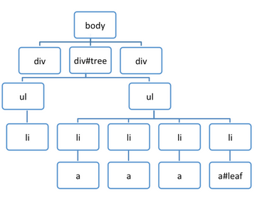

想要了解更多关于 DOM 泄露以及内存分析的基础内容，请参阅 Gonzalo Ruiz de Villa 编写的 [Finding and debugging memory leaks with the Chrome DevTools](http://slides.com/gruizdevilla/memory)，ppt 展示。重点内容。

<!-- 总结视图和包含视图更加容易找到`本地对象` - 在视图中有对应本地对象的入口节点： -->

<!--  -->

<!-- dom 节点包含在 JS heap 内存里吗？包括。

页面渲染内存包含那几个部分？我们应用关注哪些？内存泄漏一般是哪一部分？

【数字】 -->

> 示例：尝试这个示例（在新选项卡中打开）来体验分离的 DOM 树。

<!-- ##### 主导视图 -->

#### 基于时间线记录的对象分配追踪器

> 示例：3-watch-the-objects-allocations

<!-- #### 确定 JS 堆内存泄漏

查看特定时间段分配的内存。 -->

对象追踪器结合了堆分析器中快照的详细信息以及时间轴的增量更新以及追踪信息。跟这些工具相似，追踪对象堆的分配过程包括开始记录，执行一系列操作，以及停止记录并分析。

对象分析器在记录中周期性生成快照（大概每 50 毫秒就会生成一次），并且在记录最后停止时也会生成一份快照。堆分配配置文件显示了对象在哪里创建并且标识出了保留路径。

<!--  -->

顶栏的条形图表示对象什么时候在堆中被找到。每个条形图的高度对应最近分配的对象的大小，而其颜色则说明这些对象在最后的快照中是否还处于生存周期：蓝色表示在时间轴的最后该对象依旧存在，灰色则说明对象在时间轴内被分配，但是已经被垃圾回收器回收了。

点击堆中的某个特定对象会在堆快照的顶部显示其保留树。检查对象的保留路径会让你明白为什么对象没有被回收，并且你可以在代码中做出变动来一出不需要的引用。

#### 内存分析的问题

Q:我并没有看到对象的所有属性，我也没看到那些非字符串 的值，为什么？

不是所有的属性都储存在 JavaScript 堆中。其中有些是通过执行了本地代码的获取器来实现的。这样的属性不会在堆快照中被捕获，因为要避免调用获取器的消耗并且要避免程序声明的变化（当获取器不是“纯”方法的时候）。同样的，非字符串值，像是数字等为了缩小快照的大小也没有捕获。

Q:在 _@_ 字符后面的数字意味着什么 - 这是一个地址或者 ID 吗？ID 的值是不是唯一的？

这是对象 ID。显示对象的地址毫无意义，因为对象的地址在垃圾回收期间会发生偏移。这些对象 ID 是真正的 ID - 也就是说，他们在生存的多个快照都会存在，并且其值是唯一的。这就使得你可以精确地比较两个不同时期的堆状态。维护这些 ID 增加了垃圾回收周期的开销，但是这只在第一份堆快照生成后才初始化 - 如果堆配置文件没有使用到的话，就没有开销。

Q:“死亡”的（无法到达）对象是否会包含在快照中？

不会，只有可到达的对象才会在快照中出现。并且，生成一份快照的时候总是会先开始进行垃圾回收。

注意：在编写代码的时候，我们希望避免这种垃圾回收方式以减少在生成堆快照时，已使用的堆大小的变动。这个还在实现中，但是垃圾回收依旧会在快照之外执行。

<!-- Q:GC 根节点是由什么组成的？

许多东西：

- 内置的对象映射
- 符号表
- 虚拟机线程栈
- 编译缓存
- 处理范围
- 全局句柄 -->

##### Q:教程中说使用堆分析器以及时间轴内存视图来查找内存泄露。首先应该使用什么工具呢？（重点）

Performance 时间轴，使用该工具可以在你意识到页面开始变慢的时候检测出过高的内存使用量。速度变慢是典型的内存泄露症状，当然也有可能是由其他情况造成的 - 也许你的页面中有一些图片或者是网络存在瓶颈，所以要确认你是否修复了实际的问题。

要诊断内存是不是造成问题的原因，打开时间轴面板的内存视图。点击纪录按钮然后开始与程序交互，重复你觉得出现问题的操作。停止记录，显示出来的图片表示分配给应用程序的内存状态。如果图片显示消耗的内存总量一直在增长（继续没有下落）则说明很有可能出现了内存泄露。

一个正常的应用，其内存状态图应该是一个锯齿形的曲线图，因为内存分配后会被垃圾回收器回收。这一点是毋庸置疑的 

<!-- - 在 JavaScript 中的操作总会有所消耗，即使是一个空的 requestAnimationFrame 也会出现锯齿形的图案，这是无法避免的。只要确保没有尖锐的图形，就像是大量分配这样的情况就好，因为这意味着在另一侧会产生大量的垃圾。 -->

在内存视图中，还有 DOM 节点计数器，文档计数器以及事件监听计数器，这些在诊断中都是非常有用的。**DOM 节点使用原生内存，并且不会直接影响到 JavaScript 内存图表**。（HTMLDIVElement 包装对象即记录到堆内存）

##### Q：Shallow 以及 Retained Size 表示什么？它们之间有什么区别？

实际上，对象在内存中的停留是有两种方式的 - 通过一个其他处于生存期的对象直接保留在内存中（比如 window 和 document 对象）或者通过保留对本地渲染内存中某些部分的引用而隐式地保留在内存中（就像 DOM 对象）。后者会导致相关的对象无法被内存回收器自动回收，最终造成泄漏。而对象本身含有的内存大小则是 shallow size（一般来说数组和字符串有着比较大的 shallow size）。

如果某个对象阻止了其他对象被回收，那么不管这个对象有多大，它所占用的内存都将是巨大的。当一个对象被删除时可以回收的内存大小则被称为保留量。

##### Q：在构建器以及保留视图中有大量的数据。如果我发现存在泄漏的时候，应该从哪里开始找起？

一般来说从你的树中保留的第一个对象开始找起是个好办法，因为被保留的内容是按照距离排序的（也就是到 window 的距离）。

一般来说，保留的对象中，有着最短距离的通常是最有可能造成内存泄漏的。

##### Q:总结，比较，主导和包含视图都有哪些不同？

- 总结视图可以帮助你在基于构造器名称分组的状态下寻找对象（它们的内存使用状况）。这个视图对于追踪 DOM 泄漏非常有用。
- 比较视图通过显示对象是否被垃圾回收器清理了来帮助你追踪内存泄露。一般用于记录并比较某个操作前后的两个（或更多）内存快照。具体的做法就是，检查释放内存以及引用计数的增量来让你确认内存泄露是否存在并找出其原因。
- 包含视图提供了关于对象结构的一个良好的视角，让我们可以分析在全局命名空间（比如 window）下的对象引用情况，以此来找出是什么让它们保留下来了。这样就可以从比较低的层次来分析闭包并深入对象内部。
  <!-- - 主导视图帮助我们确认是否有意料外的对象引用依旧存在（它们应该是有序地包含着的）以及垃圾回收确实处于运行状态。 -->

##### Q:在堆分析器中不同的构建器入口对应什么功能？

- (global property) - 在全局对象（就像是 window）和其引用的对象之间的中间对象。如果一个对象是用名为 Person 的构造器创建的并且被一个全局对象持有，那么保留路径看起来就是这样的：[global] > (global property) > Person。这和对象直接引用其他对象的情况相反，但是我们引入中间对象是有着原因的。全局对象会周期性修改并且对于非全局对象访问的优化是个好方法，并且这个优化不会对全局对象生效
- (roots) - 保留树视图中的根节点入口是指含有对选中对象的引用的入口。这些也可以是引擎处于其自身目的而创建的。引擎缓存了引用对象，但是这些引用全部都是弱类型的，因此它们不会阻止其他对象被回收。
- (closure) - 通过函数闭包引用的一组对象的总数。
- (compiled code) - 简单点说，所有事情都和编译后的代码相关。脚本类似于一个函数但是要和 `<script>` 标签对应。SharedFunctionInfos（SFI）是在函数和编译后的代码之间的对象。函数通常会有上下文，而 SFI 则没有。
- HTMLDivElement,HTMLAnchorElement,DocumentFragment - 被你的代码引用的特定类型的元素或者文档对象的引用。

其他的很多对象在你看来就像是在你代码的生存期内产生的，这些对象可能包含了事件监听器以及特定对象，就像是下面这样：

### 内存泄漏原因及避免总结

> 参考 https://github.com/zhansingsong/js-leakage-patterns

#### 使用闭包要及时注意，有 DOM 元素的引用要及时清理。

> 示例：7-closure-memory

```js
function handle() {
  let element = document.querySelector("#app");
  element.onclick = function() {
    console.log(element.id);
  };
}
```

在函数 handle 中，给 HTML 元素 element 创建了一个点击事件的匿名函数，该函数内部引用了变量 element ，所以变量 element 的引用次数为 1，这样的话垃圾回收机制一直都不会清除该元素了，这就是一个内存泄露的情况。

所以我们可以这样做，来解决内存泄露的问题

```js
function handle() {
  let element = document.querySelector("#app");
  let id = element.id;

  element.onclick = function() {
    console.log(id);
  };

  element = null;
}
```

将元素 element 的 id 值保存在一个变量 id 内，然后在该元素的点击处理事件中引用变量 id ，并且在最后通过把变量 element 设置为 null ，以解除对 DOM 元素的引用，这样引用次数就变为 0，而不再是 1 了，垃圾回收机制就可以对其进行清除了。

#### 全局变量

除了常规设置了比较大的对象在全局变量中，还可能是意外导致意外的全局变量，如：

```js
function foo(arg) {
  bar = "this is a hidden global variable";
}
```

在函数中，没有使用 var/let/const 定义变量，这样实际上是定义在 `window` 上面，变成了 `window.bar`。再比如由于 `this` 导致的全局变量：

```js
function foo() {
  this.bar = "this is a hidden global variable";
}
foo();
```

全局变量只有在页面关闭销毁后才会被垃圾回收器回收，因为它被 window 对象引用。

```js
var myArray = null; // 在 script标签内的最外层，相当于全局变量
window.onload = function() {
  myArray = new Array(1000000);
};
```

此时点击 chrome 的强制垃圾回收，也是没发把 array 的内存回收的。

可以通过把 array 设为 null 即可释放。

##### 事件绑定未解绑

```js
// 一个图片懒惰加载引擎示例
class ImageLazyLoader {
  constructor($photoList) {
    // 发生内存泄漏的地方
    ` 
        $(window).on('scroll', () => {
            this.showImage($photoList);
        });
        `;
  }
  showImage($photoList) {
    $photoList.each((img) => {
      // 通过位置判断图片滑出来了就加载
      img.src = $(img).attr("data-src");
    });
  }
}

// 点击分页的时候就初始化一个图片懒惰加载的
$(".page").on("click", function() {
  new ImageLazyLoader($("img.photo"));
});
```

这里的事件绑定形成了一个闭包，`this/$photoList`这两个变量一直没有被释放，this 是指向 ImageLazyLoader 的实例，而`$photoList`是指向 DOM 结点，当清除掉上一页的数据的时候，相关 DOM 结点已经从 DOM 树分离出来了，但是仍然还有一个\$photoList 指向它们，导致这些 DOM 结点无法被垃圾回收一直在内存里面，就发生了内存泄露。由于 this 变量也被闭包困住了没有被释放，所以还有一个 ImageLazyLoader 的实例发生内存泄露。

解决方法比较简单，就是销毁实例的时候把绑定的事件 off 掉。

```js
class ImageLazyLoader {
  constructor($photoList) {
    this.scrollShow = () => {
      this.showImage($photoList);
    };
    $(window).on("scroll", this.scrollShow);
  }
  // 新增一个事件解绑
  clear() {
    $(window).off("scroll", this.scrollShow);
  }
  showImage($photoList) {
    $photoList.each((img) => {
      // 通过位置判断图片滑出来了就加载
      img.src = $(img).attr("data-src");
    });
    // 判断如果图片已全部显示，就把事件解绑了
    if (this.allShown) {
      this.clear();
    }
  }
}

// 点击分页的时候就初始化一个图片懒惰加载的
let lazyLoader = null;
$(".page").on("click", function() {
  lazyLoader && lazyLoader.clear();
  lazyLoader = new ImageLazyLoader($("img.photo"));
});
```

### 实战例子

#### 广州一体化项目

搜索功能：通过按钮点击然后去调服务进行查询，然后返回一堆很大很大量的数据，模拟精简版：

```js
<!DOCTYPE html>
<html lang="en">
  <head>
    <meta charset="UTF-8" />
    <meta name="viewport" content="width=device-width, initial-scale=1.0" />
    <title>Document</title>
  </head>
  <body>
    <button id="btn">search</button>
    <script>
      function SearchWidget() {
        this.data = []; // 其实这里清空没什么用......
        this.data = new Array(10000000); // Array()模拟获取的大数据
        // 加多一个清空数据的方法
        this.emptyData = function() {
          this.data = null; // 手动触发垃圾回收
        };
      }

      window.onload = function() {
        var btn = document.getElementById("btn");
        btn.addEventListener("click", () => {
          var searchWidget = new SearchWidget();
          // 这里用 console.log 模拟
          console.log(searchWidget); // 对 searchWidget 引用+1，在传递给console.log的对象是不能被垃圾回收 ♻️，因为在代码运行之后需要在开发工具能查看对象信息。所以最好不要在生产环境中console.log任何对象。
          //   searchWidget = null;
          //   searchWidget.emptyData();
        });
      };
    </script>
  </body>
</html>

```

#### Vue 页面的内存分析

1. 主要是在单页应用中，用户不会刷新浏览器，所以 js 应用需要自己清理组件来确保垃圾回收以预期的方式生效
2. 使用其他第三方可能会创建 DOM 的插件的时候，在清除 DOM 的时候一定要保证完全清除 dom 片段，不要造成残留。 3.频繁调用创建的代码，但是一直没有清除的话就会造成内存飙升，而且一直不会释放.一定要 destory 掉，比如 echarts 那个插件，切换到其他界面，不需要改组件的时候一定要 destory 掉。
3. vue 的自定义指令是一个比较容易引起内存泄漏的地方，原因就在于指令通常给元素绑定了事件，但是如果忘记了解绑，就会产生内存泄漏的问题
4. v-if 指令产生的内存泄露
5. 1）监听在 window/body 等事件没有解绑

（2）绑在 EventBus 的事件没有解绑

（3）Vuex 的\$store watch 了之后没有 unwatch

（4）模块形成的闭包内部变量使用完后没有置成 null

（5）使用第三方库创建，没有调用正确的销毁函数

<!-- Vue 路由组件切换时应该自动销毁所有的东西，为什么会存在内存泄漏呢？ -->

<!-- 如果存在如何处理呢？this.\$destroyed 有没有用？ -->

<!-- window 绑定事件，导致整个 vue 组件都不能释放。 -->

<!-- 测试：检测单页面应用的某个路由页面是否存在内存泄露。 -->

单页面的点击跳转到另一个路由，然后再点后退返回。

1. 来回跳转 HOME 页面，看看 Vue 组件是否被删除。
2. 然后输入 Detached 查看 Vue 组件 DOM 是否被删除
   通过 className 等信息可以知道它就是那个要检查的页面的 DOM 节点，在下面的 Object 的窗口里面依次展开它的父结点，可以看到它最外面的父结点是一个 VueComponent 实例

```html
<template>
  <div class="home">
    
    <HelloWorld msg="Welcome to Your Vue.js App" />
  </div>
</template>

<script>
  // @ is an alias to /src
  import HelloWorld from "@/components/HelloWorld.vue";

  export default {
    name: "Home",
    data() {
      return {
        items: new Array(1000000),
      };
    },
    components: {
      HelloWorld,
    },
    mounted() {
      window.addEventListener("resize", this.handleResize); // window 对象引用了 home 页面的方法
    },
    methods: {
      handleResize() {
        // 闭包
        return this.items; // 一直被保留在内存中，不释放
      },
    },
  };
</script>
```

Vue Router 从虚拟 DOM 中移除了元素，并替换为了新的元素。但是其子元素 dom 片段也并没有销毁。Vue 渲染步骤。

如果知道是闭包的的问题，可以直接查看这个闭包对象。

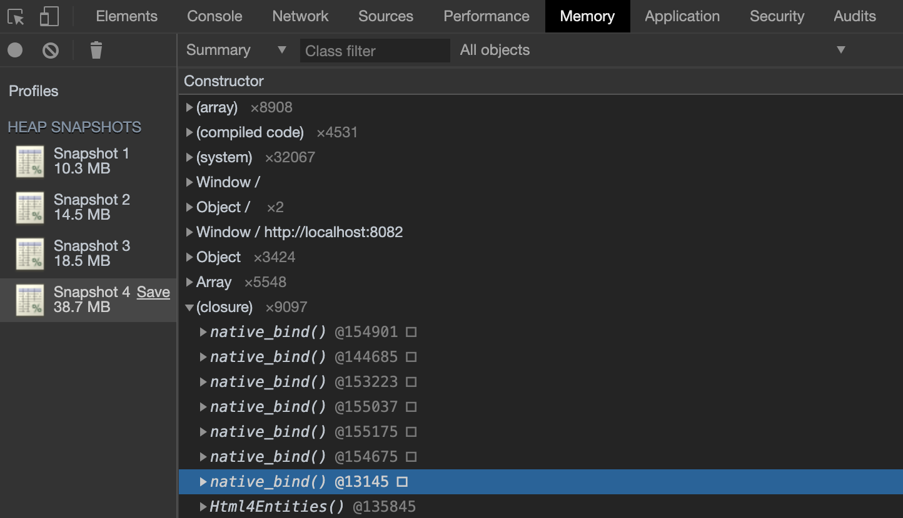

<!-- JS的内存问题往往出现在单页应用（SPA）中，一般认为场景特点是：

页面生命周期长（用户可能存留10分钟、半小时甚至2小时）

交互功能多（页面偏功能，而不是展示）

重JS应用（前端有复杂的数据状态、视图管理）

内存泄漏是一个累积的过程，只有页面生命周期略长的时候才算是个问题（所谓“刷新一下满血复活”）。频繁交互能够加快累积过程，偏展示的页面很难把这样的问题暴露出来。最后，JS逻辑相对复杂才有可能出现内存问题（“bug多是因为代码量大，我自己都hold不住”），如果只是简单的表单验证提交，还没什么机会影响内存 -->

<!-- 如何通过 memory 面板寻找到出现内存泄漏的代码，像 Performance 那样？

- v-if 指令产生的内存泄露
- Vue router
- vue-router 跳转到别的组件导致的内容泄漏

https://cn.vuejs.org/v2/cookbook/avoiding-memory-leaks.html
Vue 优化：常见会导致内存泄漏问题及优化 -->

<!--
关于 vue 的例子，后续作为补充。
官方 demo https://cn.vuejs.org/v2/cookbook/avoiding-memory-leaks.html

1. 监听在 window/body 等事件没有解绑
2. 绑在 EventBus 的事件没有解绑
3. 模块形成的闭包内部变量使用完后没有置成 null
4. 使用第三方库创建，没有调用正确的销毁函数 -->

   <!-- 如果你在用 Vue 开发应用，那么就要当心内存泄漏的问题。这个问题在单页应用 (SPA) 中尤为重要，因为在 SPA 的设计中，用户使用它时是不需要刷新浏览器的，所以 JavaScript 应用需要自行清理组件来确保垃圾回收以预期的方式生效。

内存泄漏在 Vue 应用中通常不是来自 Vue 自身的，更多地发生于把其它库集成到应用中的时候。

接下来的示例展示了一个由于在一个 Vue 组件中使用 Choices.js 库而没有将其及时清除导致的内存泄漏。等一下我们再交代如何移除这个 Choices.js 的足迹进而避免内存泄漏。

下面的示例中，我们加载了一个带有非常多选项的选择框，然后我们用到了一个显示/隐藏按钮，通过一个 v-if 指令从虚拟 DOM 中添加或移除它。这个示例的问题在于这个 v-if 指令会从 DOM 中移除父级元素，但是我们并没有清除由 Choices.js 新添加的 DOM 片段，从而导致了内存泄漏

- https://cn.vuejs.org/v2/cookbook/avoiding-memory-leaks.html -->

<!-- vue 官方的例子。 -->

<!-- [避免内存泄漏](https://cn.vuejs.org/v2/cookbook/avoiding-memory-leaks.html) -->
<!-- 例子演示 -->

<!-- 这里即使上一次的回调函数执行完了，它的申请的堆内存还是没有被回收的。

是不是因为 searchWidget 的引用呢，试试把 searchWidget 设置为 null，结果是没用的。

只有在 SearchWidget 构造函数里进行设置为 null 才起作用。 -->

<!-- 进一步看：[真实案例引发对"js 内存泄漏"的一些思考](https://shooterblog.site/blogs/%E7%9C%9F%E5%AE%9E%E6%A1%88%E4%BE%8B%E5%BC%95%E5%8F%91%E5%AF%B9%22js%E5%86%85%E5%AD%98%E6%B3%84%E6%BC%8F%22%E7%9A%84%E4%B8%80%E4%BA%9B%E6%80%9D%E8%80%83.html#%E5%89%8D%E8%A8%80) -->

<!-- 更加信息可以直接看 Chrome 文档[解决内存问题](https://developers.google.com/web/tools/chrome-devtools/memory-problems) -->

<!-- v-if 也是一个容易产生内存泄漏的地方。因为：

1、v-if 绑定到 false 的值，但是实际上 dom 元素在隐藏的时候没有被真实的释放掉

2、就是非常常见的比如我们通过 v-if 删除了父级元素，但是并没有移除父级元素里的 dom 片段。通常产生于使用第三方库的时候，比如下面的示例中，我们加载了一个带有非常多选项的选择框，然后我们用到了一个显示/隐藏按钮，通过一个 v-if 指令从虚拟 DOM 中添加或移除它。这个示例的问题在于这个 v-if 指令会从 DOM 中移除父级元素，但是我们并没有清除由 Choices.js 新添加的 DOM 片段，从而导致了内存泄漏。

分页功能/图片懒加载等都会导致 -->

## 扩展：实时监控

是否经常需要 JavaScript 或者 CSS 进行优化，但是不能找到一个简单的方式来衡量优化的效果？
当然，你可以使用时间轴来记录，但是在大多数情况下，时间轴只记录数据，并不是实时更新的，比如要拖拽滚动等情况下 CPU 使用率和 FPS 帧率。在这点还有其他的性能测量技巧，Chrome DevTools 添加了 “Performance Monitor（性能监控）” 选项卡，可以体现实时性能：

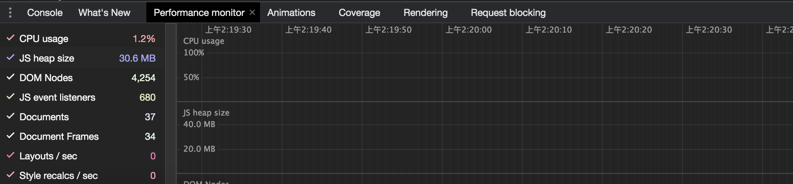

使用 Chrome 任务管理器实时监视内存使用。

更详细可以看：https://juejin.im/post/5a37b2f56fb9a0451e3fe73d

## 问题&解答

### 1. 骨架屏是不是懒加载？

不是懒加载，它只是占位符，跟普通的菊花图 loading 一样的作用，不过它比菊花图体验更好。

### 2. js 资源阻塞渲染执行的处理？

我们知道为避免渲染执行的脚本被前面加载的资源阻塞（比如 js、css 等），可以使用 defer 标签异步执行，但是如果这个渲染脚本使用到了这个资源，就必须前置加载。这个时候考虑的性能优化的地方就是尽量压缩加载资源的体积、提升服务器的响应速度了。

### 3. css 和 js 实现动画有什么区别（灵活性、性能方面）？

渲染中主要消耗时间的是 Layout/Reflow 和 Paint/Repaint 的过程，无论是 CSS 实现动画还是 JS 实现动画都会涉及到重排、重绘的操作的，但是 CSS 动画可以通过抽离动画元素成层通过 GPU 加速，满足以下条件会自动触发：

1. 使用 opacity、transform
2. webgl 上下文
3. ...

通过 js 与 css 实现相同的动画来考察 4 个方面：

- 代码复杂度
- 运行时性能
- 动画运行时控制
- 浏览器兼容性

#### 运行时性能

> **示例**：尝试这个例子[1000 个 div demo 测试](example/browser/animation/demo) 来比较 JS 实现动画与 CSS 的性能对比。

在 tab 页运行例子，并打开 FPS 性能监控工具查看，然后切换 toggle 分别查看 JS 与 CSS 实现动画对 FPS 的影响：


发现使用 CSS Animation 与 JavaScript 的实现 FPS 相差无几。但是我们总有种感觉，使用 CSS 实现动画的性能会更好。是不是真是这样呢？要如何做？

关键在于，<u>只要我们要设置动画的属性不会触发重排/重绘。</u>我们可以将这些采样（元素的移动）操作移出主线程，主要是元素使用一些不会触发重绘和重排的 CSS 属性，比如使用了 transform 属性的元素，让该元素单独成为一个层，这样只需要在 GPU 层渲染完成。

这时候渲染引擎会将该元素单独实现一帧，等这些变换发生时，渲染引擎会通过`合成线程`直接去处理变换，这些变换并没有涉及到主线程。

<!-- <u>The key is that as long as the properties we want to animate do not trigger reflow/repaint (read CSS triggers for more information), we can move those sampling operations out of the main thread.</u> The most common property is the CSS transform. **If an element is promoted as a layer, animating transform properties can be done in the GPU, meaning better performance/efficiency, especially on mobile.** Find out more details in OffMainThreadCompositing. -->

<!-- ##### 何为分层和合成

你可以把一张网页想象成是由很多个图片叠加在一起的，每个图片就对应一个图层，Chrome 合成器最终将这些图层合成了用于显示页面的图片。如果你熟悉 PhotoShop 的话，就能很好地理解这个过程了，PhotoShop 中一个项目是由很多图层构成的，每个图层都可以是一张单独图片，可以设置透明度、边框阴影，可以旋转或者设置图层的上下位置，将这些图层叠加在一起后，就能呈现出最终的图片了。

在这个过程中，将素材分解为多个图层的操作就称为分层，最后将这些图层合并到一起的操作就称为合成。所以，分层和合成通常是一起使用的。 -->

##### CSS 动画开启 GPU 加速

> **示例**：[example/browser/animation/demo02](example/browser/animation/demo02)

<!-- 使用 transform 与直接使用 top 的区别在哪里？ -->

<!-- 最首要的区别是元素位置：
使用 top left 定位是直接改变元素真实位置的，简单来说你 top: 5px 那就真的是离父容器上端 5px 或者偏离顶部定位 5px（这里我们不讨论 position 各种定位的破事）

但是你用 transform: translateY(-5px) 只是改变了视觉位置，元素本身位置还是在 0px，只是视觉上向上偏移了 5px。这一点对于 css 布局是非常重要的，因为大多数情况下你不希望一个元素在动画的时候（比如飞离 fade off）会导致父元素大小改变然后导致 siblings 元素位置变动从而导致集体 shaking，所以很多时候我们用 transform。

其次的区别是这两种定位本身的语法：

做效果的时候 transform 相对来说是比较方便的，因为 transform 的视角是元素本身，所以比较直观。比如你希望一个元素向左飞 50px 那就是 transform: translateX(-50px)，但是如果用 left 而你的父子元素都是 position: absolute，那可能你用 left 就要写成从 left: 100px 到 left: 30px，这就很不直观。

最后的区别是效率：
由于 transform 不改动 css 布局，因为渲染行为大多数情况下在元素本身，所以效率比 top left 要高 -->

1. 首先运行在 tab 页运行例子，点击 toogle。
2. 打开 MoreTools -> Rendering -> Paint flashing。
3. 查看正在进行动画的元素是否被独立一个层，是否需要重新绘制。


开启 GPU 加速与不开启的效果如下：

其中绿色表示需要重新绘制图层，蓝色表示布局计算。


浏览器的 GPU 加速功能是将需要进行动画的元素提升到一个独立的层（layer），这样就可以避免浏览器进行重新布局（Reflow）和绘制（Repaint）这块图层，将原先的浏览器使用 CPU 绘制位图来实现的动画效果转为让 GPU 使用图层合成（composite）来实现。这样不需要只需要在合成 GPU 实现的动画图层到原来的图上即可。

如果两张图层内部没有发生改变，浏览器就不再进行布局和绘制，直接使用 GPU 的缓存来绘制每个图层，</u>GPU 只负责将各个图层合成来实现动画，这就可以充分利用 GPU 的资源和优势，减轻 CPU 的负载，可以使动画更流畅。<u>通过改变两张图片之间的相对位置代替绘制一张图片的每一帧来实现动画</u>，虽然视觉效果相同，但省去了许多绘制的时间。


为了让浏览器将动画元素提升到一个独立的层，可以使用 transform 和 opacity 属性来实现动画，当设置了这两个属性之一时，浏览器会自动进行这一优化操作（透明度的变化可以通过 GPU 改变 a 通道来实现，不需要浏览器进行重绘）。对于上面的动画，<u>可以改变 transform 来代替改变 left 和 top 属性：</u>

如果动画并不需要对 transform 和 opacity 属性做出改变，可以使用其他的方法强制浏览器为这些元素创建单独的层，比如设置一个没有效果的样式：`transform：translateZ(0)`；

这不会对元素的实际样式做出改变。但这是一种 hack，规范的做法是使用 will-change 属性，设置它的值为需要做变换的属性，如 `will-change: left;`浏览器就会知道 left 这个属性会发生变化，因此会开启硬件加速优化性能。这是使用 will-change 属性的平移动画，同样也为小方块设置了单独的图层。避免过度绘制。

既然设置了 will-change 属性可以开启 GPU 加速，那么：\* { will-change: all;}复制代码看起来好像是一劳永逸的方法，但其实这反而会降低页面的性能，虽然硬件加速可以提高 GPU 的使用，但从 layers 中的信息可以看出，每个层都需要消耗一定的内存，过多的内存占用也会造成性能的下降；过多的层传输到 GPU 的过程也会消耗一定的时间，此外也造成合成阶段的时间占用较长，因此并不是独立的层越多越好。最好的做法是对那些可能动画的元素设置属性，并在动画结束后就移除这个属性。

<!-- ##### transitions vs requestAnimationFrame

The fact is that, in most cases, the performance of CSS-based animations is almost the same as JavaScripted animations — in Firefox at least. Some JavaScript-based animation libraries, like GSAP and Velocity.JS, even claim that they are able to achieve better performance than native CSS transitions/animations. **This can occur because CSS transitions/animations are simply resampling element styles in the main UI thread before each repaint event happens, which is almost the same as resampling element styles via a requestAnimationFrame() callback, also triggered before the next repaint.** If both animations are made in the main UI thread, there is no difference performance-wise.

原因：Transforms (scale, rotation, translation, and skew) and opacity are the primary beneficiaries. 让浏览器决定让在 GPU 独立成层，进行绘制处理。硬件加速。从 CPU 到 GPU。 -->

#### 动画运行时，对动画的控制程度上

> 示例：[Impossible with CSS: controls](https://codepen.io/GreenSock/pen/AwCKp)

功能覆盖面，JS 比 CSS3 大。

js 比较灵活，能控制动画暂停、取消、终止等，css 动画不能添加事件，只能设置固定节点进行什么样的动画。

- css 动画是黑盒的，你只按它的使用要求告诉他从哪个状态到哪个状态要产生动画。
- js 动画是白盒的，你需要去编写代码去描述状态-时间，比如代码“每隔 10 毫秒，某 dom 元素 left 加 1px，直到 1000 ms 停止”。
- 时间尺度上，@keyframes 的动画粒度粗，而 JS 的动画粒度可以很细。
- CSS3 动画里被支持的时间函数非常少，不够灵活。
- 以现有的接口，CSS3 动画无法做到支持两个以上的状态转化。
- 实现/重构难度不一，CSS3 比 JS 更简单，性能调优方向固定。
- css 部分动画功能无法实现（如滚动动画、视差滚动等）。

<!-- css 动画是否也可以结合 JS，实时赋予元素某个类名进行动画的暂停、取消、终止呢。待测试，肯定是不能暂停的了 -->

#### 代码复杂度

> 示例：简单动画移动一个简单的正方形
> 复杂动画：比如，分别使用 css 和 js 实现的轮播图动画

```css
@keyframes myAnimation {
  0% {
    opacity: 0;
    transform: translate(0, 0);
  }
  30% {
    opacity: 1;
    transform: translate(0, 0);
  }
  60% {
    transform: translate(100px, 0);
  }
  100% {
    transform: translate(100px, 100px);
  }
}
#box {
   animation: myAnimation 2.75s;
}
```

定义动画过程的 `@keyframes` 不支持递归定义，如果有多种类似的动画过程，需要调节多个参数来生成的话，将会有很大的冗余（比如 jQuery Mobile 的动画方案），而 JS 则天然可以以一套函数实现多个不同的动画过程，（匀速、平滑）。

```js
const animate = {
  // 暂时只有这几个动画函数算法
  // t: current time, b: begInnIng value, c: change In value, d: duration
  animateType: {
    // 匀速
    linear(t, b, c, d) {
      return (c * t) / d + b;
    },
    // 先慢后快
    easeInQuad(t, b, c, d) {
      return c * (t /= d) * t + b;
    },
    // 先快后慢
    easeOutQuad(t, b, c, d) {
      return -c * (t /= d) * (t - 2) + b;
    },
  },
  defaultOpts: {
    from: 0,
    to: 1000,
    during: 300,
    type: "easeInQuad",
    callback() {},
  },
  // 增加动画算法
  extend(type) {
    this.animateType = Object.assign({}, this.animateType, type);
  },
  /*
    * options 配置
      {
        from: 开始值,
        to: 目标值,
        during: 持续时间,
        type: 动画函数
        callback: 回调
      }
      return <Promise>
  */
  play(options) {
    return new Promise((resolve) => {
      const opts = Object.assign({}, this.defaultOpts, options);
      const { to, from, type, during, callback } = opts;
      // 计算总共的帧数
      // 1秒 = 60帧
      // 1帧 = 16.7ms
      // 根据毫秒数得出总共的帧数
      const durFps = Math.ceil(during / 16.7);
      // requestAnimationFrame的兼容处理
      if (!window.requestAnimationFrame) {
        window.requestAnimationFrame = (fn) => {
          setTimeout(fn, 16.7);
        };
      }
      // 动画运动实际上就是 0 ~ 动画总帧数 的过程
      let start = 0;
      // 运动
      const step = () => {
        // 当前的运动位置
        const value = this.animateType[type](start, from, to - from, durFps);
        callback(value);
        // 时间递增
        start++;
        // 如果还没有运动到位，继续
        if (start <= durFps) {
          window.requestAnimationFrame(step);
        } else {
          // 动画结束，在promise.then中执行相关操作
          resolve();
        }
      };
      // 开始执行动画
      step();
    });
  },
};

export default animate;
```

简单动画，css 代码实现会简单一些，js 复杂一些。复杂动画的话，css 代码就会变得冗长，js 实现起来更优。

<!-- 结果 + 原因说明 -->
<!-- 分类说明，比优缺点要好点 -->
<!-- velocity。 -->
<!-- vue 的动画是如何处理的？transition3 -->

#### 浏览器兼容性

css3 有浏览器兼容问题（ie9+），https://caniuse.com/css-animation。js 大多情况下没有。比如 transition 等。

对于帧速表现不好的低版本浏览器，CSS3 可以做到自然降级，而 JS 则需要撰写额外代码。

#### 总结

对于一些复杂控制的动画，使用 JavaScript 会比较靠谱。而在实现一些小的交互动效的时候，就多考虑 CSS。

- css 动画性能相对于优一些，css 动画通过 GUI 解析，js 动画需要经过 js 引擎代码解析，然后再进行 GUI 解析渲染。
- 浏览器会对 css3 的动画做一些优化（比如专门新建一个图层用来跑动动画）

### 4. 使用 requestAnimationFrame 实现 60 帧，那对于高性能电脑来说，如何获取当前浏览器的帧率？如何进行锁帧？

浏览器额定帧率为 每秒 60 帧，1 秒 = 1000 毫秒，1000 / 60 = 16.7 ms。（CPU）

浏览器丢帧现象：

假如开一个 10ms 的 setTimeout，也就是 30ms 绘制 3 次，但是浏览器本来是 16.7ms 绘制一次，在 30 秒内只能绘制两次。

那么就会造成丢帧的现象。（本来 30ms 要绘制 3 次，结果只绘制了 2 次，丢了一帧），继而导致动画断续显示（堵车的感觉），这就是过度绘制带来的问题。也是 setTimeout 的定时器值推荐最小使用 16.7ms 的原因。

requestAnimationFrame 会把每一帧中的所有 DOM 操作集中起来，在一次重绘或回流中就完成，并且重绘或回流的时间间隔紧紧跟随浏览器的刷新频率，一般来说，这个频率为每秒 60 帧。

虽然**浏览器额定帧率是 60 帧每秒**，但是如果 JS 执行脚本过长导致每一帧的时长大大超过了 16.7 ms，也会导致卡顿。

下面这段代码是只是为了保证**在特定时间段内，当前绘制动画跟浏览器的帧率保持一致**，避免过快与过慢。因为跟浏览器绘制频率不一致，会出现丢帧现象。

```js
function animate(callback) {
  // 配置
  const during = 3000; // 持续时间
  const durFps = Math.ceil(during / 16.7); // 帧数
  // 动画运动实际上就是 0 ~ 动画总帧数 的过程
  let start = 0; // 开始帧
  const speed = Math.ceil(target / durFps); // 速度

  // 动画函数
  const goTo = () => {
    start++; // 帧数递增
    currentDistance = speed * start;
    element.style.transform = // 当前的位置
      "translateX(" + Math.min(currentDistance, target) + "px)";

    if (start <= durFps) {
      // 如果还没到达位置
      raf = window.requestAnimationFrame(goTo);
    }
  };
  goTo();
}
```

大多数浏览器额定帧率是 60 FPS。而对于特殊情况下，对于性能较好或较差导致的低帧率或高帧率的电脑（可以通过 requestAnimationFrame 计算实时帧率）。

即使浏览器大于 60 FPS，也可以计算为 16.66ms 去调用，保证动画的执行时间是一致的，低于 60 的话可以以一个文档的数字来处理避免波动。

<!-- 另外也可以将 requestAnimationFrame 帧率降低： -->

```js

var fps = 15   // 1秒 15帧
var fpsInterval = 1000 / fps   // 每帧花的时间
var last = new Date().getTime() //上次执行的时刻

function animate() {

    requestAnimationFrame(animate);
    // 执行时的时间
    var now = new Date().getTime()
    var elapsed = now - last; // 计算当前时间差
    // 经过了足够的时间
    if (elapsed > fpsInterval) {
        last = now - (elapsed % fpsInterval); //校正当前时间

        // 循环的代码
        drawSomething()
    }

```

即在每次执行代码时，检查与上帧的时间差，如果大于指定的间隔，进行绘制，将更新上帧的时间。

以想要 15Hz 刷新率为例，即想要每 40ms 更新一次。而 rAF 的执行频率是 17ms 一次。那么实际的过程是这样的。

从 0ms 开始经过了 17ms , 检查发现不到 40ms，不绘制。

从 0ms 开始经过了 34ms , 检查发现不到 40ms，不绘制。

从 0ms 开始经过了 51ms ，检查发现过了 40ms，进行绘制。并把一次绘制时刻更新为 40ms.

从 0ms 开始经过了 68ms ,…以此类推。

所以，实际的绘制时刻是第 51ms, 85ms，135ms.

而理想的状态是期望它 在 40ms , 80ms ，120ms 绘制。

以上即是这种降低 requestAnimationFrame 的原理了。保证在每个 40ms 时间段内有一次执行，但相临的执行之间的时间间隔不为 40ms.

更多信息可以看：

- [前端动画/游戏开发 requestAnimationFrame 之 锁帧](https://zhuanlan.zhihu.com/p/34846325)
- [来自 requestAnimationFrame 的灵魂拷问](https://zhuanlan.zhihu.com/p/145793042)
- [限制 requestAnimation 渲染帧数](https://zhangchen915.com/index.php/archives/675/)
- [JS：指定 FPS 帧频，requestAnimationFrame 播放动画](https://www.cnblogs.com/kenkofox/p/3849067.html)

## 小结

真实项目下的性能问题愈加复杂，我们需要熟练运用 Chrome DevTools，把影响性能优化的因素铭记在心，并在实战中长期积累经验。

## 参考资料

- [Web 性能优化资源合集（持续更新）](../reference/README.md)
