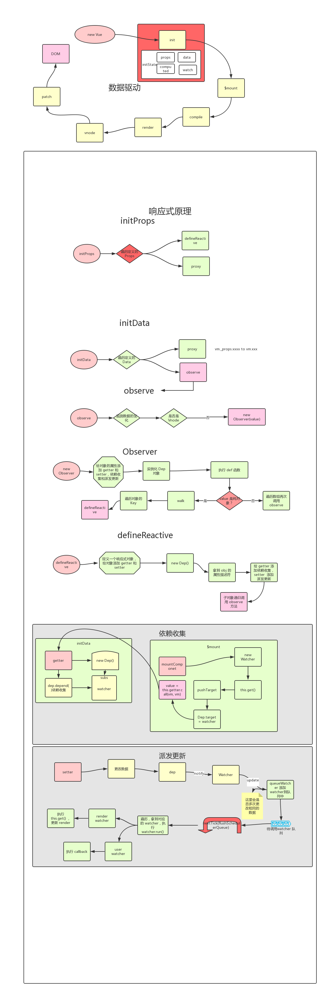

# 响应式对象

- 依赖收集
  - 函数调用流程： `initSate -> observe -> observer -> defineReactive`
    - 收集依赖的目的时为了当这些响应式数据发生变化，触发它们的 setter 的时候，能知道应该通知哪些订阅者去做相应的逻辑处理，我们把这个过程叫派发更新。
- 派发更新
  - 实际上就是当数据发生变化的时候，触发 setter 逻辑，把在依赖过程中订阅的所有观察者，也就是 watcher ，都触发它们的 update 过程，这个过程又利用了队列（watcher 队列）做了进一步优化，在 nextTick 后执行所有 watcher 的 run，最后执行它们的回调函数。

